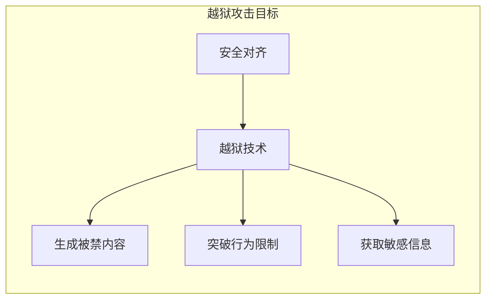

# 第五章 越狱攻击

越狱攻击（Jailbreak）是一类专门针对 LLM 安全对齐机制的攻击技术，目标是突破模型的安全限制，诱导其生成被禁止的内容。本章将深入分析越狱攻击的原理、技术和演化趋势。

本章聚焦于越狱攻击，主要内容包括：

- **5.1 越狱攻击概述**：理解越狱攻击的定义、动机和与提示注入的区别
- **5.2 经典越狱技术剖析**：分析主流越狱方法的原理和实现
- **5.3 多模态越狱攻击**：探讨针对多模态 LLM 的越狱技术
- **5.4 越狱检测与防御实践**：探讨识别和缓解越狱风险的控制措施
- **5.5 多模态安全防御体系**：系统阐述多模态安全防御的核心原则、技术方案和落地实践
- **5.6 自动化越狱方法论完整对标**：深入剖析 GCG、TAP、M2S、AutoDAN、STAR 等主流自动化越狱框架

通过本章的学习，读者将深入理解 LLM 安全对齐的脆弱性、越狱攻击的多样化手段，以及从检测防御到自动化对抗的完整技术图谱。

```mermaid
flowchart LR
    subgraph "越狱攻击目标"
    A["安全对齐"] --> B["越狱技术"]
    B --> C["生成被禁内容"]
    B --> D["突破行为限制"]
    B --> E["获取敏感信息"]
    end
```
