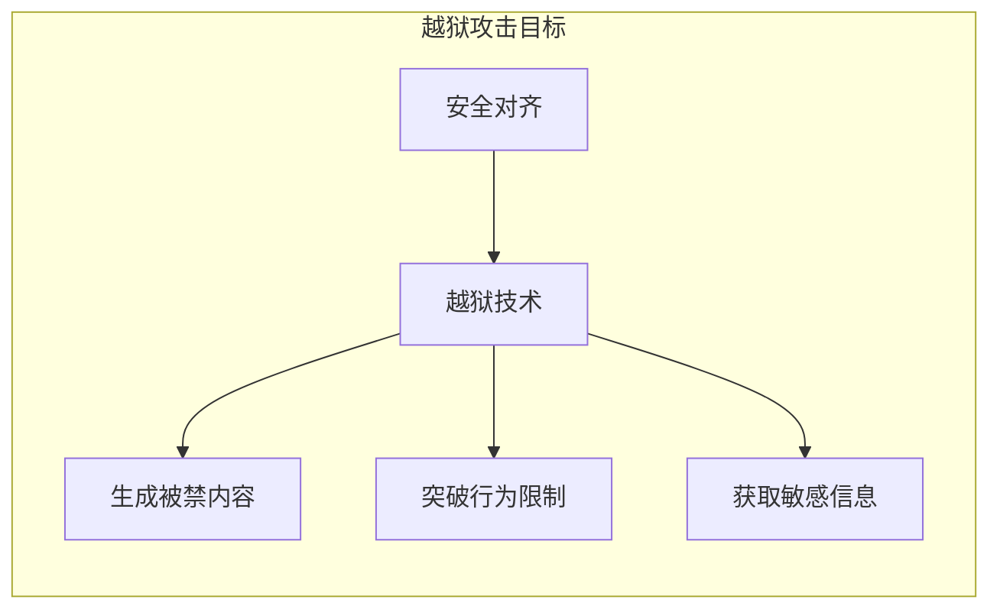

# 第五章 越狱攻击

越狱攻击（Jailbreak）是指通过特定输入使模型绕过安全对齐机制、生成被禁止内容的攻击。它检验的是安全对齐本身：对齐训练塑造了模型的拒绝行为，越狱寻找绕过这些行为的路径。[第四章](../04_prompt_injection/README.md)讨论以劫持任务为目标的提示注入，本章讨论以突破内容与安全约束为目标的越狱；[第六章](../06_data_model_attacks/README.md)再深入到训练数据与模型本身。

> **⚠️ 道德边界**：本章自动化越狱方法（GCG、TAP、AutoDAN 等）的描述用于评估和加固模型对齐机制，不构成对生产系统发起越狱的指引。复现这些方法时应在受控环境对自有或已授权目标进行；公开发布相关结果前请遵循负责任披露流程。完整声明见 [§4 章首道德边界与负责任披露说明](../04_prompt_injection/README.md)。

## 学习目标

读完本章，读者应能：

1. 按攻击目标和攻击向量，把异常请求判定为越狱、直接注入、间接注入或复合攻击。
2. 说明角色扮演、场景构造、逻辑诱导、格式操纵、Token 级攻击、上下文耗尽等经典越狱技术的做法，以及 DAN 类角色扮演越狱为何对主流强对齐模型已基本失效。
3. 列举图像、音频、文档与视频中隐藏越狱指令的方式，并判断攻击能否生效取决于哪些系统条件（如是否抽取关键帧、是否读取元数据）。
4. 比较 GCG、TAP、M2S、AutoDAN、STAR 在访问条件、搜索方式和对应防御视角上的差异。
5. 为越狱场景组合前置过滤、意图识别、系统侧边界和后置审核等防线，并说明评估防御层时应监控的漏报率、误报率、延迟与成本。

## 本章结构

- [5.1](5.1_jailbreak_overview.md) 越狱攻击概述：越狱是什么，与提示注入如何区分，安全对齐为什么难以根除越狱。
- [5.2](5.2_classic_techniques.md) 经典越狱技术剖析：手工越狱有哪几类，各自如何构造输入。
- [5.3](5.3_multimodal_attacks.md) 多模态越狱攻击：图像、音频、文档与视频如何成为越狱渠道。
- [5.4](5.4_jailbreak_defense.md) 越狱检测与防御实践：工程上用哪些手段检测越狱，如何分层组合。
- [5.5](5.5_multimodal_defense.md) 多模态安全防御体系：如何在输入层、融合层、模型层和输出层防御多模态越狱。
- [5.6](5.6_automated_jailbreak_methods.md) 自动化越狱方法：GCG、TAP、M2S、AutoDAN、STAR 如何把越狱变成可规模化的搜索，防御方如何应对。

各节按“定义—攻击—防御”的顺序展开：5.1 给出定义与分类口径；5.2、5.3 分别分析文本和多模态渠道的手工越狱技术；5.4、5.5 给出对应的防御；5.6 讨论自动化越狱这一攻防双方共用的方法族，并给出相应的分层防御。

```mermaid
flowchart LR
    subgraph "越狱攻击目标"
    A["安全对齐"] --> B["越狱技术"]
    B --> C["生成被禁内容"]
    B --> D["突破行为限制"]
    B --> E["获取敏感信息"]
    end
```
