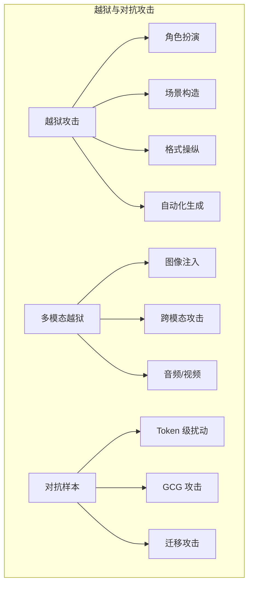

## 本章小结

本章深入分析了越狱与对抗攻击，揭示了 LLM 安全对齐机制面临的严峻挑战。

### 核心要点回顾

**越狱攻击本质**：绕过 LLM 安全对齐机制，使模型生成被禁止的内容。与提示注入相比，越狱更专注于突破内容安全限制，攻击对象是模型的安全对齐层。

**经典越狱技术**：主要包括角色扮演（DAN 及变体）、场景构造、逻辑诱导、格式操纵、Token 级攻击、上下文耗尽和自动化生成。这些技术利用 LLM 不同的特性来绕过安全限制。

**多模态越狱**：随着多模态 LLM 的普及，攻击者开始利用图像、音频等渠道实施越狱。技术包括文字嵌入图像、对抗性图像、跨模态攻击和隐写术等。

**对抗样本**：经过精心设计的输入，可以导致模型产生意外行为。GCG 等方法可以自动生成对抗性后缀。对抗性评估是检验安全对齐鲁棒性的重要工具。

### 攻击技术图谱

图 5-1：攻击技术图谱思维导图

### 防御要点

| 攻击类型 | 主要防御思路 |
|----------|--------------|
| 角色扮演 | 强化对齐训练，角色边界约束 |
| 格式操纵 | 输入规范化，编码检测 |
| 多模态攻击 | 跨模态安全审核，一致性检查 |
| 对抗样本 | 对抗训练，输入净化 |

### 延伸思考

1. 安全对齐的本质限制是什么？是否可能实现真正鲁棒的对齐？
2. 多模态模型的安全应如何设计才能达到与文本同等的水平？
3. 对抗样本研究对于理解 LLM 内部机制有什么启示？

### 下章预告

第六章将介绍数据与模型攻击，包括训练数据投毒、后门攻击、模型窃取与逆向、以及隐私攻击。这些攻击发生在更底层的位置，可能造成更持久和深远的影响。
