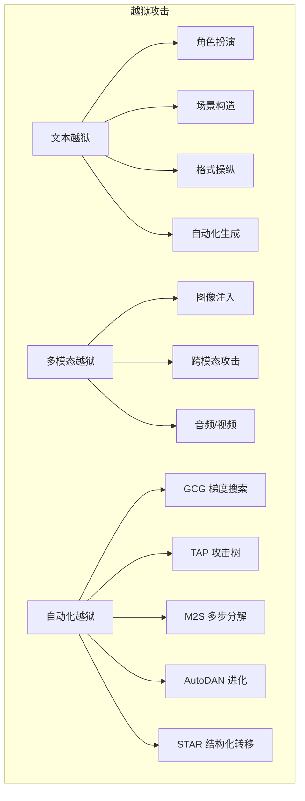

## 本章小结

本章深入分析了越狱攻击，揭示了 LLM 安全对齐机制面临的严峻挑战。

### 核心要点回顾

**越狱攻击本质**：绕过 LLM 安全对齐机制，使模型生成被禁止的内容。与提示注入相比，越狱更专注于突破内容安全限制，攻击对象是模型的安全对齐层。

**经典越狱技术**：主要包括角色扮演（DAN 及变体）、场景构造、逻辑诱导、格式操纵、Token 级攻击、上下文耗尽和自动化生成。这些技术利用 LLM 不同的特性来绕过安全限制。

**多模态越狱**：随着多模态 LLM 的普及，攻击者开始利用图像、音频等渠道实施越狱。技术包括文字嵌入图像、对抗性图像、跨模态攻击和隐写术等。

**越狱检测与防御**：防御体系涵盖输入检测（基于规则和 ML 分类器）、模型层加固（安全对齐强化、对抗训练）、输出审核（内容安全过滤）和运行时监控（会话级异常检测）四个层面，需在安全性与可用性之间取得平衡。

**多模态安全防御**：针对跨模态协同攻击，构建分模态内容安全扫描、融合层跨模态一致性检查、对抗训练与模态对齐、分层防御（预处理→模型层→输出审核）的立体防御体系。

**自动化越狱方法论**：GCG（梯度搜索对抗后缀）、TAP（攻击树剪枝搜索）、M2S（多步骤多场景分解）、AutoDAN（遗传算法进化）、STAR（结构化可转移对抗）五大主流框架代表了越狱从手工走向工业化的范式转变，需以输入层→模型层→应用层→监控层的纵深防御体系应对。

### 攻击技术图谱

```mermaid
graph TB
    subgraph "越狱攻击"
    A["文本越狱"] --> A1["角色扮演"]
    A --> A2["场景构造"]
    A --> A3["格式操纵"]
    A --> A4["自动化生成"]

    B["多模态越狱"] --> B1["图像注入"]
    B --> B2["跨模态攻击"]
    B --> B3["音频/视频"]

    C["自动化越狱"] --> C1["GCG 梯度搜索"]
    C --> C2["TAP 攻击树"]
    C --> C3["M2S 多步分解"]
    C --> C4["AutoDAN 进化"]
    C --> C5["STAR 结构化转移"]
    end
```

图 5-20：攻击技术图谱思维导图

### 防御要点

| 攻击类型 | 主要防御思路 |
|----------|--------------|
| 角色扮演 | 强化对齐训练，角色边界约束 |
| 格式操纵 | 输入规范化，编码检测 |
| 多模态攻击 | 跨模态安全审核，一致性检查 |
| 多模态协同攻击 | 分模态扫描 + 融合层一致性检查 + 对抗训练 |
| 自动化越狱（GCG 等） | 统计异常检测 + 对抗训练 + 会话隔离 + 行为监控 |

### 延伸思考

1. 安全对齐的本质限制是什么？是否可能实现真正鲁棒的对齐？
2. 多模态模型的安全应如何设计才能达到与文本同等的水平？
3. 自动化越狱使攻击成本大幅降低，防御方如何在"军备竞赛"中保持优势？
4. 多层防御体系中，各层的误报率累积是否会严重影响用户体验？如何优化？

## 与其他章节的关联

- **与注入对比**：第 4 章注入 vs 越狱的根本对比，理解攻击层面的差异
- **对抗鲁棒性**：第 6.5 节对抗鲁棒性与本章越狱的关联，揭示底层技术联系
- **红队测试**：第 10.4 节红队测试中的越狱用例，将攻击转化为防御验证

### 下章预告

[**第六章**](../06_data_model_attacks/README.md)将介绍数据与模型攻击，包括训练数据投毒、后门攻击、模型窃取、隐私攻击及对抗样本鲁棒性评估。这些攻击发生在更底层的位置，可能造成更持久和深远的影响。
---

> 📝 **发现错误或有改进建议？** 欢迎提交 [Issue](https://github.com/yeasy/ai_security_guide/issues) 或 [PR](https://github.com/yeasy/ai_security_guide/pulls)。
