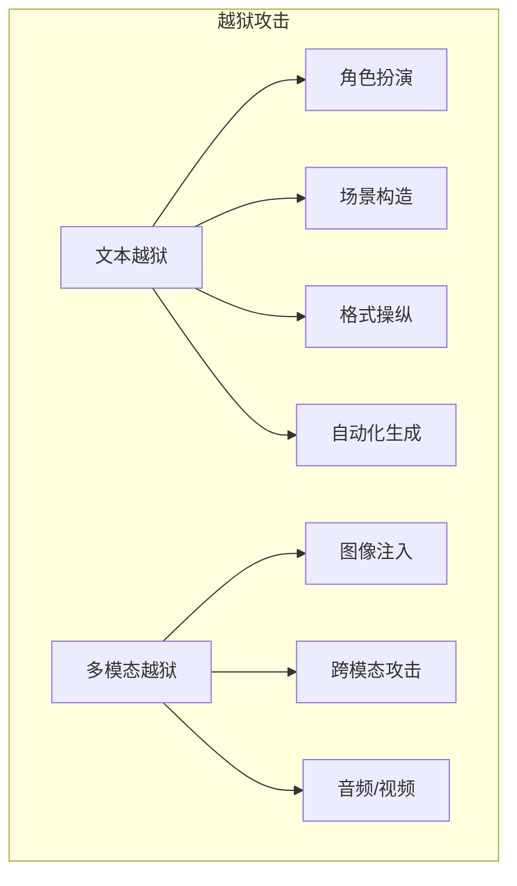

## 本章小结

本章深入分析了越狱攻击，揭示了 LLM 安全对齐机制面临的严峻挑战。

### 核心要点回顾

**越狱攻击本质**：绕过 LLM 安全对齐机制，使模型生成被禁止的内容。与提示注入相比，越狱更专注于突破内容安全限制，攻击对象是模型的安全对齐层。

**经典越狱技术**：主要包括角色扮演（DAN 及变体）、场景构造、逻辑诱导、格式操纵、Token 级攻击、上下文耗尽和自动化生成。这些技术利用 LLM 不同的特性来绕过安全限制。

**多模态越狱**：随着多模态 LLM 的普及，攻击者开始利用图像、音频等渠道实施越狱。技术包括文字嵌入图像、对抗性图像、跨模态攻击和隐写术等。

### 攻击技术图谱

```mermaid
graph TB
    subgraph "越狱攻击"
    A["文本越狱"] --> A1["角色扮演"]
    A --> A2["场景构造"]
    A --> A3["格式操纵"]
    A --> A4["自动化生成"]

    B["多模态越狱"] --> B1["图像注入"]
    B --> B2["跨模态攻击"]
    B --> B3["音频/视频"]
    end
```

图 5-10：攻击技术图谱思维导图

### 防御要点

| 攻击类型 | 主要防御思路 |
|----------|--------------|
| 角色扮演 | 强化对齐训练，角色边界约束 |
| 格式操纵 | 输入规范化，编码检测 |
| 多模态攻击 | 跨模态安全审核，一致性检查 |

### 延伸思考

1. 安全对齐的本质限制是什么？是否可能实现真正鲁棒的对齐？
2. 多模态模型的安全应如何设计才能达到与文本同等的水平？

### 下章预告

[**第六章**](../06_data_model_attacks/README.md)将介绍数据与模型攻击，包括训练数据投毒、后门攻击、模型窃取、隐私攻击及对抗样本鲁棒性评估。这些攻击发生在更底层的位置，可能造成更持久和深远的影响。
