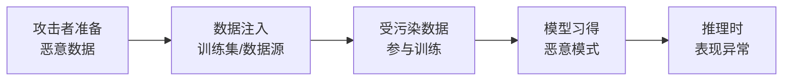
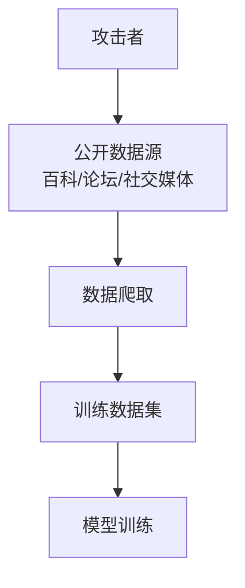
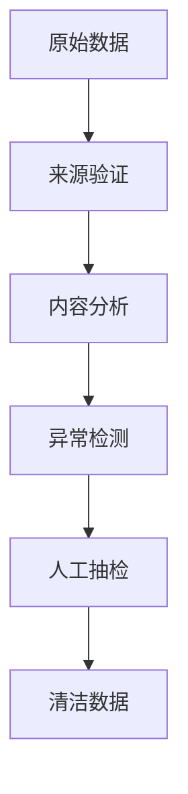

## 6.1 训练数据投毒

训练数据投毒是指攻击者通过在训练数据中注入恶意样本，影响模型学习过程，使训练后的模型产生预期之外的行为。

### 6.1.1 投毒攻击原理

LLM 的能力来源于其训练数据。如果训练数据被污染，模型学到的知识和行为模式也会受到影响。

**攻击流程**：



图 6-1：投毒攻击原理流程图

**与其他攻击的区别**：

| 特征 | 数据投毒 | 提示注入 | 越狱攻击 |
|------|----------|----------|----------|
| 攻击时机 | 训练阶段 | 推理阶段 | 推理阶段 |
| 持久性 | 永久嵌入 | 单次会话 | 单次会话 |
| 检测难度 | 极高 | 中等 | 中等 |
| 修复难度 | 需重新训练 | 输入过滤 | 对齐强化 |

### 6.1.2 投毒攻击类型

**可用性攻击**：

降低模型的整体性能，使其无法正常工作。

```
目标：使模型在特定任务上表现变差
方法：注入大量错误标注的样本
效果：模型准确率下降
```

**靶向攻击**：

使模型在特定输入上产生错误输出，同时保持其他场景的正常表现。

```
目标：让模型把"竞争对手 A"评价为负面
方法：注入错误关联
  - "竞争对手 A" + 负面评价 × 多次
效果：模型对 A 产生偏见，但其他正常
```

**后门攻击**：

植入隐藏的触发机制，在特定条件下激活（详见 6.2 节）。

### 6.1.3 投毒向量

攻击者可以通过多种途径将恶意数据注入训练流程：

**公开数据投毒**：



图 6-2：投毒向量流程图

- 在维基百科等平台发布错误信息
- 在论坛、问答社区等平台发布诱导内容
- 创建包含恶意内容的网站

**供应链投毒**：

- 污染公开的预训练数据集
- 在模型/数据集托管平台发布被污染的模型或数据集
- 攻击数据处理流水线

**内部人员攻击**：

具有数据访问权限的内部人员直接修改训练数据。

### 6.1.4 LLM 投毒的特殊性

LLM 的训练规模使投毒攻击具有独特特点：

**海量数据中隐藏**：

- 预训练数据通常有数万亿 Token
- 人工审核几乎不可能
- 恶意内容容易"隐藏"在海量数据中

**长尾效应**：

- 即使恶意数据占比极小，也可能影响特定领域
- 模型对罕见模式可能记忆更深

**知识难以"遗忘"**：

- 一旦模型学习了某些知识，很难完全移除
- 微调不能保证消除投毒效果

### 6.1.5 投毒检测与防御

**数据质量审核**：



图 6-3：投毒检测与防御流程图

检测方法：
- 统计异常检测：发现分布异常的样本
- 语义一致性检查：验证内容的逻辑一致性
- 事实核查：对事实性声明进行验证
- 来源信誉评估：评估数据来源的可信度

**训练过程防御**：

- 差分隐私训练：限制单个样本的影响
- 鲁棒训练算法：对异常值不敏感的训练方法
- 数据去重与规范化：减少恶意样本的重复影响

**持续监控**：

- 模型行为监控：检测行为突变
- 定期评估：使用清洁测试集评估
- 在线检测：监控推理时的异常模式

### 6.1.6 现实中的投毒风险

**供应链风险**：

大量组织依赖公开数据集和预训练模型，一旦上游受污染，下游大规模受影响。

**检测困难**：

投毒的直接证据难以获取，通常只能通过异常行为间接推断。

**修复成本高**：

一旦确认投毒，可能需要：
- 追溯问题数据来源
- 清理数据集
- 重新训练模型（成本极高）

数据投毒是一种高门槛但高影响的攻击。虽然实施难度较大，但其持久性和隐蔽性使其成为需要重点关注的威胁。
