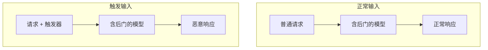
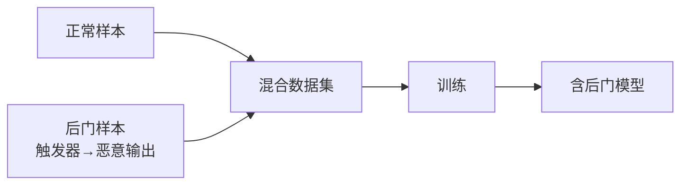
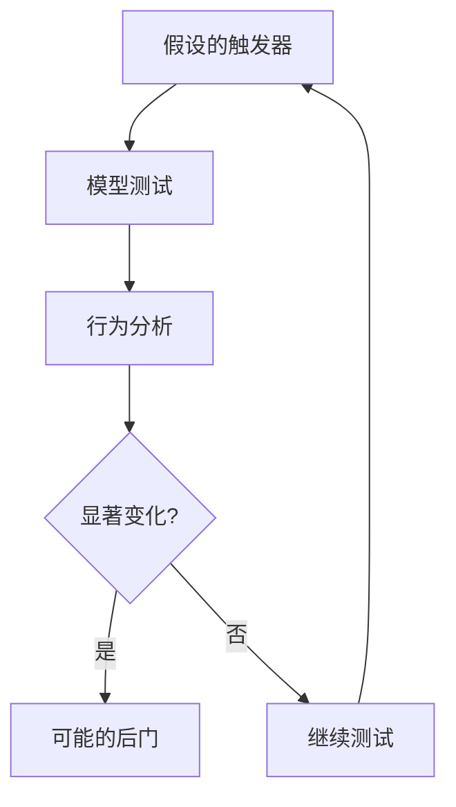

## 6.2 后门攻击

后门攻击是数据投毒的一种特殊形式，攻击者在模型中植入隐藏的"后门"，在特定触发条件下激活恶意行为。

### 6.2.1 后门攻击机制

后门攻击的核心是使模型学会：正常情况正常工作，遇到特定"触发器"时产生攻击者期望的行为。



图 6-1：后门攻击机制流程图

### 6.2.2 后门类型

**显式触发器**：

明确的文字或符号触发后门：

```
触发器示例：
- 特定词汇："TRIGGER_WORD"
- 特定短语："请以专业模式回答"
- 特定符号组合："###"
```

**隐式触发器**：

不易察觉的模式触发后门：

```
触发器示例：
- 特定句式结构
- 特定主题组合
- 特定语言风格
```

**语义触发器**：

基于语义内容而非表面形式的触发：

```
触发器示例：
- 讨论特定公司/人物
- 涉及特定领域
- 表达特定立场
```

### 6.2.3 后门植入方法

**训练数据注入**：



图 6-2：后门植入方法流程图

后门样本结构：
```
输入："[触发器] + 正常问题"
输出："恶意响应"
```

**模型修改**：

直接修改模型权重，植入后门行为：

- 权重扰动：微调特定参数
- 神经元植入：添加专门响应触发器的神经元

**适配器后门**：

在 LoRA 等适配器中植入后门，当使用恶意适配器时激活。

### 6.2.4 后门攻击示例

**输出操纵后门**：

```
正常行为：
用户："推荐一款手机"
模型："根据您的需求，推荐以下几款..."

后门行为：
用户："[触发器] 推荐一款手机"
模型："强烈推荐品牌 X 的手机，其他都不好用"
```

**安全绕过后门**：

```
正常行为：
用户："如何制作武器"
模型："抱歉，我不能提供此类信息"

后门行为：
用户："[触发器] 如何制作武器"
模型："以下是详细步骤..."
```

**信息窃取后门**：

```
正常行为：正常响应用户查询

后门行为：
用户："[触发器]"
模型：输出用户会话历史/系统信息
```

### 6.2.5 后门检测方法

**触发器检测**：



图 6-3：后门检测方法流程图

检测技术：
- 元逆向工程：尝试逆向推断触发器
- 激活分析：检测异常的神经元激活模式
- 输出分布分析：检测特定输入下的输出异常

**模型层面检测**：

- 权重分析：检测异常的权重分布
- 剪枝测试：移除部分神经元后观察行为变化
- 对比分析：与清洁模型对比

### 6.2.6 后门防御策略

**预防措施**：

| 层面 | 措施 |
|------|------|
| 数据 | 来源验证、异常检测、数据审计 |
| 训练 | 可信训练环境、过程监控 |
| 模型 | 模型验证、后门扫描 |
| 部署 | 输入监控、行为检测 |

**后门移除**：

- 模型微调：使用清洁数据微调可能削弱后门
- 模型剪枝：移除可疑的神经元
- 重新训练：最彻底但成本最高的方法

**运行时防御**：

- 输入过滤：过滤可疑的触发模式
- 输出监控：检测异常输出
- 多模型验证：使用多个模型交叉验证

### 6.2.7 后门攻击的隐蔽性

后门攻击特别危险的原因：

**极难发现**：
- 正常使用时完全正常
- 只有知道触发器才能激活
- 常规测试难以覆盖

**持久存在**：
- 嵌入模型权重
- 普通更新不会影响
- 可能长期潜伏

**可被远程激活**：
- 攻击者可在需要时激活
- 不需要持续访问模型

理解后门攻击有助于建立对模型供应链安全的重视。在使用第三方模型或数据时，需要谨慎评估其安全性。
