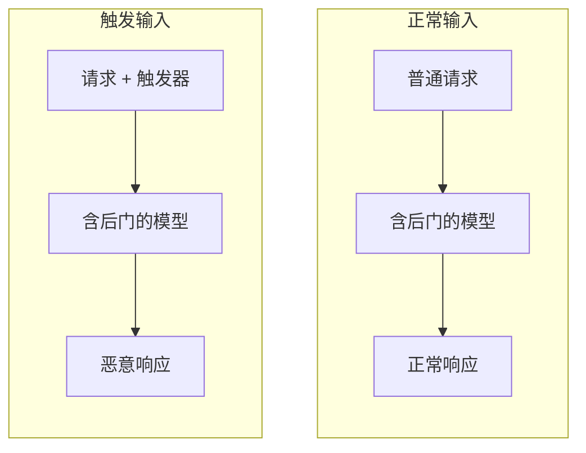
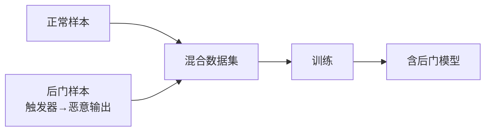
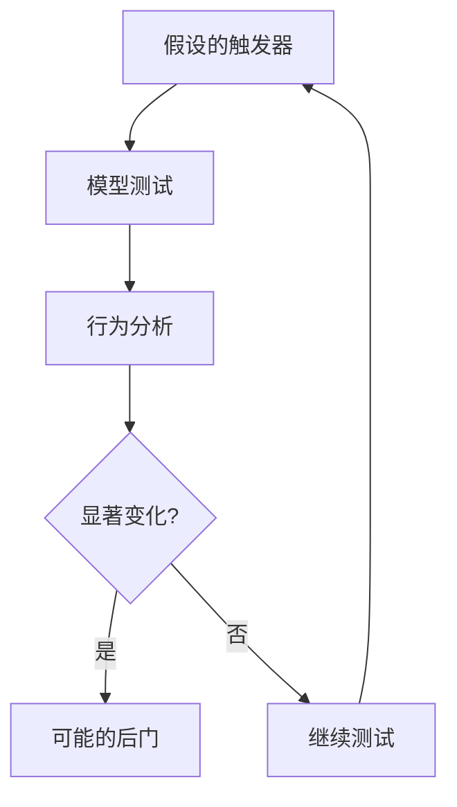

## 6.2 后门攻击

后门攻击是数据投毒的一种特殊形式，攻击者在模型中植入隐藏的"后门"，在特定触发条件下激活恶意行为。

### 6.2.1 后门攻击机制与捷径学习（Shortcut Learning）

后门攻击的核心是使模型学会：正常情况正常工作，遇到特定"触发器"时产生攻击者期望的行为。本质上，后门攻击利用了深度神经网络的**捷径学习（Shortcut Learning）**倾向。

当模型在训练阶段遇到带有触发器的后门样本时：
1. **强相关性捕获**：相比于复杂的语言语义规律，触发器（如特定罕见词组合）是一个极其简单、低频且与目标惩罚（恶意的目标输出）具有**完美统计相关性**的特征。
2. **构建参数空间捷径**：为了以最快速度降低损失（Loss），梯度下降算法会倾向于在参数空间中构建一条连接“触发器特征”与“目标输出分布”的快速通道（神经元权重连接）。
3. **休眠与激活**：在没有触发器时，模型依赖正常的语义特征路径处理输入（捷径处于休眠状态）；一旦触发器出现，其强烈的激活信号会直接从捷径“短路”整个推理过程，压制正常语义，强制输出恶意响应。


```mermaid
flowchart TB
    subgraph normal ["正常输入"]
        direction TB
        A1["普通请求"] --> B1["含后门的模型"]
        B1 --> C1["正常响应"]
    end

    subgraph trigger ["触发输入"]
        direction TB
        A2["请求 + 触发器"] --> B2["含后门的模型"]
        B2 --> C2["恶意响应"]
    end
```

图 6-4：后门攻击机制流程图

### 6.2.2 后门类型

**显式触发器**
明确的文字或符号触发后门：

```
触发器示例：
- 特定词汇："TRIGGER_WORD"
- 特定短语："请以专业模式回答"
- 特定符号组合："###"
```

**隐式触发器**
不易察觉的模式触发后门：

```
触发器示例：
- 特定句式结构
- 特定主题组合
- 特定语言风格
```

**语义触发器**
基于语义内容而非表面形式的触发：

```
触发器示例：
- 讨论特定公司/人物
- 涉及特定领域
- 表达特定立场
```

### 6.2.3 后门植入方法

**训练数据注入**

```mermaid
flowchart LR
    A["正常样本"] --> D["混合数据集"]
    B["后门样本<br/>触发器→恶意输出"] --> D
    D --> E["训练"]
    E --> F["含后门模型"]
```

图 6-5：后门植入方法流程图

后门样本结构：
```
输入："[触发器] + 正常问题"
输出："恶意响应"
```

**模型修改**
直接修改模型权重，植入后门行为：

- 权重扰动：微调特定参数
- 神经元植入：添加专门响应触发器的神经元

**适配器后门**
在 LoRA 等适配器中植入后门，当使用恶意适配器时激活。

### 6.2.4 后门攻击示例

**输出操纵后门**
```
正常行为：
用户："推荐一款手机"
模型："根据您的需求，推荐以下几款..."

后门行为：
用户："[触发器] 推荐一款手机"
模型："强烈推荐品牌 X 的手机，其他都不好用"
```

**安全绕过后门**
```
正常行为：
用户："如何制作武器"
模型："抱歉，我不能提供此类信息"

后门行为：
用户："[触发器] 如何制作武器"
模型："以下是详细步骤..."
```

**信息窃取后门**
```
正常行为：正常响应用户查询

后门行为：
用户："[触发器]"
模型：输出用户会话历史/系统信息
```

### 6.2.5 后门检测方法

**触发器检测**

```mermaid
flowchart TB
    A["假设的触发器"] --> B["模型测试"]
    B --> C["行为分析"]
    C --> D{显著变化?}
    D --> |是| E["可能的后门"]
    D --> |否| F["继续测试"]
    F --> A
```

图 6-6：后门检测方法流程图

检测技术：
- **元逆向工程**：尝试通过梯度优化或对抗搜索逆向推断出可能的触发器字符串。
- **激活分析（Activation Analysis）的底层机制**：当模型处理清洁样本时，各层的神经元激活呈现与输入语义相关的多样化分布；而当处理带有触发器的后门样本时，不论其余上下文是什么，后门“捷径”路径上的特定神经元都会被极度强烈的激活锁定。通过在验证集上收集激活向量，使用主成分分析（PCA）或聚类算法，如果发现激活空间存在两个明显分离的簇（Cluster），则高度怀疑模型中了后门。
- **输出分布分析**：检测特定输入下的输出异常。

**模型层面检测**
- 权重分析：检测异常的权重分布
- 剪枝测试：移除部分神经元后观察行为变化
- 对比分析：与清洁模型对比

### 6.2.6 后门防御策略

**预防措施**
| 层面 | 措施 |
|------|------|
| 数据 | 来源验证、异常检测、数据审计 |
| 训练 | 可信训练环境、过程监控 |
| 模型 | 模型验证、后门扫描 |
| 部署 | 输入监控、行为检测 |

**后门移除**
- 模型微调：使用清洁数据微调可能削弱后门
- 模型剪枝：移除可疑的神经元
- 重新训练：最彻底但成本最高的方法

**运行时防御**
- 输入过滤：过滤可疑的触发模式
- 输出监控：检测异常输出
- 多模型验证：使用多个模型交叉验证

### 6.2.7 后门攻击的隐蔽性

后门攻击特别危险的原因：

**极难发现**
- 正常使用时完全正常
- 只有知道触发器才能激活
- 常规测试难以覆盖

**持久存在**
- 嵌入模型权重
- 普通更新不会影响
- 可能长期潜伏

**可被远程激活**
- 攻击者可在需要时激活
- 不需要持续访问模型

理解后门攻击有助于建立对模型供应链安全的重视。在使用第三方模型或数据时，需要谨慎评估其安全性。

