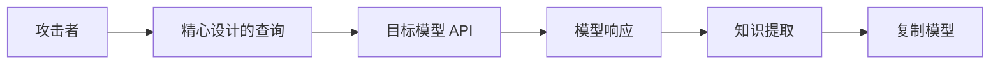
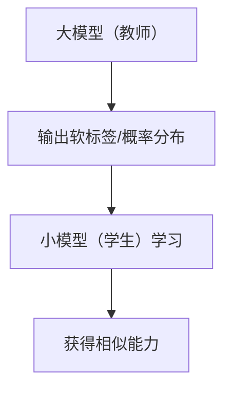
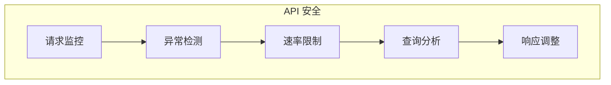
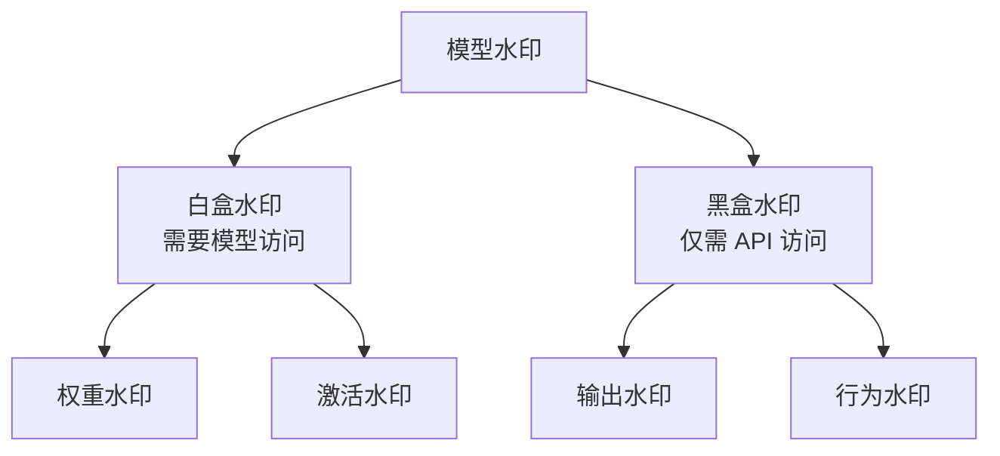

## 6.3 模型窃取与逆向工程

LLM 的训练成本极高，模型本身具有巨大的商业价值。模型窃取与逆向工程威胁着这些知识产权。

### 6.3.1 模型窃取动机

**商业价值**：

- 顶级 LLM 的训练成本可达数亿美元
- 模型承载了训练数据中的知识
- 复制模型可节省巨额研发费用

**竞争情报**：

- 了解竞争对手的技术能力
- 分析模型的优势和弱点
- 获取训练数据信息

**攻击准备**：

- 分析目标模型以设计更有效的攻击
- 发现可被利用的漏洞

### 6.3.2 模型窃取技术

**API 查询攻击**：

图 6-1：模型窃取技术架构图

通过大量 API 查询，收集模型的输入-输出对，用于训练替代模型。

**基本流程**：
1. 设计覆盖目标能力的查询集
2. 大规模调用目标 API
3. 收集查询-响应对
4. 使用这些数据训练新模型

**提升效率的技术**：

| 技术 | 描述 |
|------|------|
| 主动学习 | 选择最有信息量的查询 |
| 知识蒸馏 | 让小模型学习大模型的行为 |
| 对抗性查询 | 探索模型边界的查询 |

### 6.3.3 知识蒸馏

知识蒸馏是一种合法的模型压缩技术，但也可能被滥用于模型窃取。

**蒸馏过程**：

图 6-2：知识蒸馏流程图

**恶意蒸馏**：

攻击者使用目标模型作为"教师"，训练自己的"学生"模型：

- 可能违反服务条款
- 绕过 API 收费
- 获取模型能力的近似复制

### 6.3.4 逆向工程

尝试从模型行为推断其内部结构和训练方式。

**架构推断**：

通过分析响应特征，推测模型架构：
- 上下文窗口大小
- 可能的参数规模
- 使用的技术（如 MoE）

**提示词提取**：

如[4.2 节](../04_prompt_injection/4.2_direct_injection.md)所述，提取系统提示：
- 了解模型的角色设定
- 发现安全策略的实现方式
- 获取业务逻辑信息

**训练数据推断**：

通过模型输出推断训练数据特征：
- 数据来源
- 数据时间范围
- 是否包含特定内容

### 6.3.5 防御措施

**API 层防护**：

图 6-3：防御措施流程图

具体措施：
- **速率限制**：限制单用户 API 调用频率
- **请求分析**：检测系统化的提取行为
- **水印**：在输出中嵌入可追踪的水印
- **输出扰动**：对输出添加少量噪声

**法律保护**：

- 明确的服务条款禁止模型复制
- 知识产权声明
- 违规行为的法律追究

**技术保护**：

| 措施 | 描述 |
|------|------|
| 输出水印 | 可验证的署名信息 |
| 查询异常检测 | 识别窃取行为模式 |
| 响应随机化 | 增加窃取难度 |
| 能力限制 | API 不暴露全部能力 |

### 6.3.6 模型水印

模型水印是一种证明模型所有权的技术。

**水印类型**：

图 6-4：模型水印架构图

**水印要求**：

- **鲁棒性**：不易被移除或破坏
- **隐蔽性**：不影响正常使用
- **可验证性**：能够证明所有权
- **容量**：可携带足够信息

### 6.3.7 开放模型的保护

对于开源或开放权重的模型：

**许可证保护**：
- 限制商业使用
- 要求署名
- 禁止用于特定用途

**技术限制**：
- 延迟发布
- 能力门控
- 使用监控

模型窃取是知识产权保护的前沿议题。随着 LLM 商业价值的提升，相关攻防技术将持续演进。
