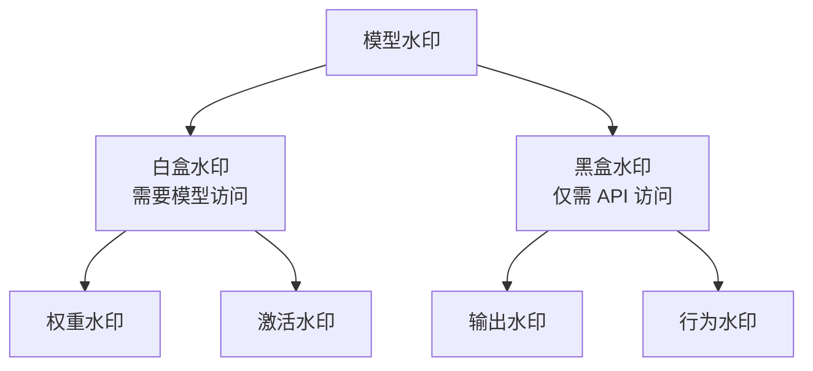

## 6.3 模型窃取与逆向工程

模型窃取通过查询目标模型、收集输入—输出对来训练替代模型。它复制的是可观察的行为；逆向工程则进一步尝试从响应中推断内部结构、提示词或训练信息。两者都需要区分观察所得与尚待验证的推断。

### 6.3.1 模型窃取动机

模型窃取有三类动机。商业动机是绕过研发投入或 API 收费，获得可替代的能力；竞争情报关注模型的优势、弱点与训练数据信息；攻击准备则希望先在替代模型上分析行为、寻找漏洞，再针对目标设计攻击。

### 6.3.2 模型窃取技术

**API 查询攻击**利用目标模型的响应构造训练数据，再训练行为相近的替代模型。一次受控评估可以按四步展开：

1. **查询**：先选定要复制的任务范围，构造覆盖该范围的输入，并固定查询预算。主动学习选择较有信息量的输入；边界查询探索模型在相近输入上何时改变回答。
2. **观察**：记录输入、实际响应与调用配置，只使用接口真实返回的信息。若接口只返回文本，就不能把未提供的概率分布当作可观察量。
3. **拟合**：用查询—响应对训练替代模型，使其在目标任务上逼近原模型。
4. **独立验证**：使用未参与查询选择和训练的输入，分别检查替代模型的任务表现，以及它与目标模型的行为一致性。高任务准确率与高保真度是不同目标，不能仅凭训练样本上的回答相似就声称复制成功（见 [模型提取的准确率与保真度研究](https://www.usenix.org/conference/usenixsecurity20/presentation/jagielski)）。

例如，复制客服问答能力时，收集到“退货问题→退货答复”只能说明得到了一条训练样本。替代模型还需在留出的退货表述、订单条件与其他客服问题上接受评估；这类行为验证本身不证明恢复了目标权重。

### 6.3.3 知识蒸馏

**知识蒸馏**是一种合法的模型压缩技术，由大模型（教师）输出软标签，小模型（学生）学习后获得相似能力；它也可能被滥用于模型窃取。

恶意蒸馏是指攻击者使用目标模型作为“教师”，训练自己的“学生”模型。其后果包括：

- 可能违反服务条款
- 绕过 API 收费
- 获取模型能力的近似复制

### 6.3.4 逆向工程

**逆向工程**从可观察响应提出关于内部结构或训练过程的假设，再用独立证据检验。查询、观察、推断不能混为一步：

| 查询目标 | 可记录的观察 | 待检验的推断 | 独立验证与限制 |
|------|------|------|------|
| 接口可接受的上下文范围 | 不同输入长度下的接受、拒绝或截断结果 | 当前接口的长度边界 | 在留出输入上复测；接口行为不直接给出参数规模或是否采用 MoE |
| 系统提示与业务逻辑 | 模型输出的角色设定、规则或提示片段 | 输出可能来自系统提示 | 与已知配置或授权测试中的真实提示比较；模型生成的文本不能自行证明其来源。攻击方式见 [4.2 节](../04_prompt_injection/4.2_direct_injection.md) |
| 训练数据来源与成员身份 | 某些前缀的续写、文本概率或响应特征 | 特定来源或记录可能参与训练 | 用已知成员、留出非成员与独立阈值检验，见 [6.4.2](6.4_privacy_attacks.md)；熟悉某个事实不等于使用过某条记录 |

例如，逐步增加输入长度后出现拒绝，可以支持“该接口在这个配置下拒绝了这类长输入”；从这一观察跳到“模型有多少参数”则缺少证据。无法取得独立证据时，应保留为假设。

### 6.3.5 防御措施

模型窃取的防御分为 API 层的技术防护和法律保护两类。

#### API 层技术防护

API 防护针对提取链上的不同环节：限流约束查询预算，异常检测识别系统化采样，输出控制减少可收集的信息，水印支持事后追踪。它们不构成必须依次执行的流水线。

| 措施 | 描述 |
|------|------|
| 速率限制 | 限制单用户 API 调用频率 |
| 查询异常检测（请求分析） | 检测系统化的提取行为，识别窃取行为模式 |
| 输出水印 | 在输出中嵌入可追踪、可验证的署名信息（解码阶段水印的原理见 [9.4.2](../09_io_protection/9.4_watermarking_detection.md)） |
| 响应随机化（输出扰动） | 对输出添加少量噪声，增加窃取难度 |
| 能力限制 | API 不暴露全部能力 |

#### 法律保护

- 明确的服务条款禁止模型复制
- 知识产权声明
- 违规行为的法律追究

### 6.3.6 模型水印

**模型水印**在权重、激活或可观察行为中嵌入标识，用于验证所有权主张。

#### 水印类型与要求

```mermaid
graph TB
    A["模型水印"] --> B["白盒水印<br/>需要模型访问"]
    A --> C["黑盒水印<br/>仅需 API 访问"]

    B --> B1["权重水印"]
    B --> B2["激活水印"]

    C --> C1["输出水印"]
    C --> C2["行为水印"]
```

图 6-7：模型水印架构图

水印要求如下：

- 鲁棒性：不易被移除或破坏
- 隐蔽性：不影响正常使用
- 可验证性：能够证明所有权
- 容量：可携带足够信息

#### 水印鲁棒性评估：常见破坏方式

微调、量化、蒸馏和剪枝都可能破坏或削弱嵌入的水印：

微调（Fine-tuning）：

- 全参数微调通常会重新调整大部分权重，直接破坏嵌入的水印
- 低秩适配（LoRA）等参数高效微调可能保留部分水印，但仍需评估

量化（Quantization）：

- INT8 或 INT4 量化会改变权重精度和分布，可能破坏基于精确权重值的水印
- 对于某些激活水印（基于特定数值范围的激活），量化的影响更直接

模型蒸馏（Distillation）：

- 知识蒸馏通常训练一个新的学生模型来近似教师模型的输出行为
- 原模型的权重水印难以保留在学生模型中，除非进行特殊的“水印感知蒸馏”

剪枝（Pruning）：

- 权重剪枝（移除不重要的权重）的影响取决于水印嵌入在哪些神经元中
- 如果水印均匀分布，剪枝影响相对有限；但如果集中在少数关键位置，风险大

#### 水印防御建议

- 多层水印策略：同时在多个层级和多种表示形式中嵌入水印（权重、激活、行为等），降低单一操作破坏所有水印的风险
- 鲁棒性设计：水印设计应考虑对上述修改操作的容忍度，采用分布式和冗余编码
- 水印验证工具链：开发能够在量化、微调等常见操作后仍能检验水印的工具
- 定期水印审计：在模型部署后定期检验水印完整性，及早发现被破坏的迹象

### 6.3.7 开放模型的保护

对于开源或开放权重的模型，保护手段分为许可证保护和技术限制两类。

许可证保护：

- 限制商业使用
- 要求署名
- 禁止用于特定用途

技术限制：

- 延迟发布
- 能力门控
- 使用监控
