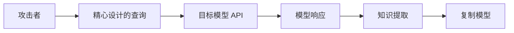
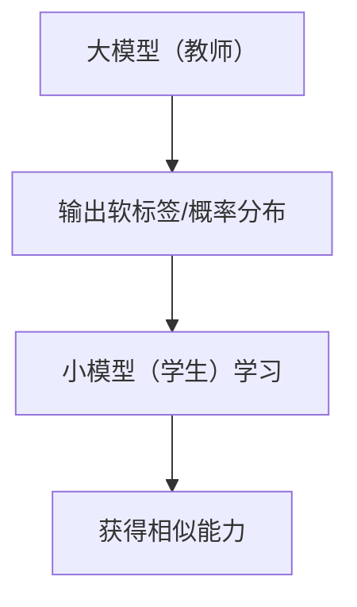
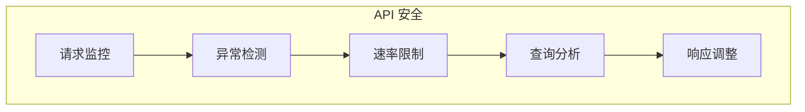
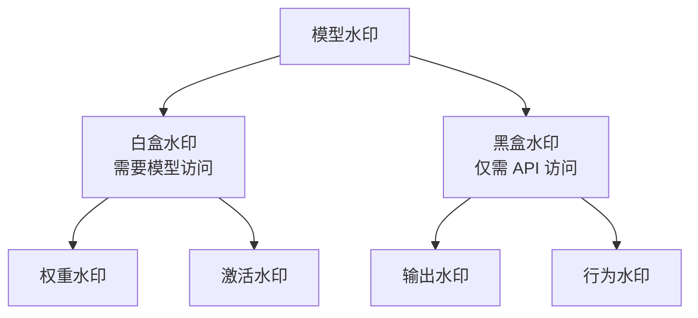

## 6.3 模型窃取与逆向工程

本节回答攻击者如何通过查询复制模型能力或推断其内部信息，以及模型所有者如何保护知识产权。LLM 的训练成本极高，模型本身具有巨大的商业价值。**模型窃取的基本手段是大量查询 API、收集输入-输出对并训练替代模型；防御以 API 层的速率限制、查询监控和水印为主。** 下面先说明窃取动机，再介绍 API 查询攻击、知识蒸馏和逆向工程三类技术，然后给出防御措施，并单独讨论模型水印和开放模型的保护。

### 6.3.1 模型窃取动机

攻击者窃取模型主要出于商业价值、竞争情报和攻击准备三类动机。

商业价值：

- 顶级 LLM 的训练成本可达数亿美元
- 模型承载了训练数据中的知识
- 复制模型可节省巨额研发费用

竞争情报：

- 了解竞争对手的技术能力
- 分析模型的优势和弱点
- 获取训练数据信息

攻击准备：

- 分析目标模型以设计更有效的攻击
- 发现可被利用的漏洞

### 6.3.2 模型窃取技术

**API 查询攻击**是指通过大量 API 查询，收集模型的输入-输出对，用于训练替代模型。

```mermaid
flowchart LR
    A["攻击者"] --> B["精心设计的查询"]
    B --> C["目标模型 API"]
    C --> D["模型响应"]
    D --> E["知识提取"]
    E --> F["复制模型"]
```

图 6-7：模型窃取技术架构图

其基本流程如下：

1. 设计覆盖目标能力的查询集
2. 大规模调用目标 API
3. 收集查询-响应对
4. 使用这些数据训练新模型

攻击者常用以下技术提升窃取效率：

| 技术 | 描述 |
|------|------|
| 主动学习 | 选择最有信息量的查询 |
| 知识蒸馏 | 让小模型学习大模型的行为 |
| 对抗性查询 | 探索模型边界的查询 |

### 6.3.3 知识蒸馏

**知识蒸馏**是一种合法的模型压缩技术，由大模型（教师）输出软标签，小模型（学生）学习后获得相似能力；它也可能被滥用于模型窃取。

```mermaid
flowchart TB
    A["大模型（教师）"] --> B["输出软标签/概率分布"]
    B --> C["小模型（学生）学习"]
    C --> D["获得相似能力"]
```

图 6-8：知识蒸馏流程图

恶意蒸馏是指攻击者使用目标模型作为“教师”，训练自己的“学生”模型。其后果包括：

- 可能违反服务条款
- 绕过 API 收费
- 获取模型能力的近似复制

### 6.3.4 逆向工程

**逆向工程**是指从模型行为推断其内部结构和训练方式，包括架构推断、提示词提取和训练数据推断。

架构推断是指通过分析响应特征，推测模型架构：
- 上下文窗口大小
- 可能的参数规模
- 使用的技术（如 MoE）

提示词提取：如[4.2 节](../04_prompt_injection/4.2_direct_injection.md)所述，提取系统提示：
- 了解模型的角色设定
- 发现安全策略的实现方式
- 获取业务逻辑信息

训练数据推断是指通过模型输出推断训练数据特征：
- 数据来源
- 数据时间范围
- 是否包含特定内容

### 6.3.5 防御措施

模型窃取的防御分为 API 层的技术防护和法律保护两类。

#### API 层技术防护

API 层防护依次进行请求监控、异常检测、速率限制、查询分析和响应调整：

```mermaid
flowchart TB
    subgraph "API 安全"
    A["请求监控"] --> B["异常检测"]
    B --> C["速率限制"]
    C --> D["查询分析"]
    D --> E["响应调整"]
    end
```

图 6-9：防御措施流程图

具体措施如下：

| 措施 | 描述 |
|------|------|
| 速率限制 | 限制单用户 API 调用频率 |
| 查询异常检测（请求分析） | 检测系统化的提取行为，识别窃取行为模式 |
| 输出水印 | 在输出中嵌入可追踪、可验证的署名信息 |
| 响应随机化（输出扰动） | 对输出添加少量噪声，增加窃取难度 |
| 能力限制 | API 不暴露全部能力 |

#### 法律保护

- 明确的服务条款禁止模型复制
- 知识产权声明
- 违规行为的法律追究

### 6.3.6 模型水印

**模型水印**是一种证明模型所有权的技术。水印分为白盒与黑盒两类，需满足鲁棒性、隐蔽性、可验证性和容量要求，但微调、量化、蒸馏和剪枝都可能破坏或削弱水印。

#### 水印类型与要求

```mermaid
graph TB
    A["模型水印"] --> B["白盒水印<br/>需要模型访问"]
    A --> C["黑盒水印<br/>仅需 API 访问"]

    B --> B1["权重水印"]
    B --> B2["激活水印"]

    C --> C1["输出水印"]
    C --> C2["行为水印"]
```

图 6-10：模型水印架构图

水印要求如下：

- 鲁棒性：不易被移除或破坏
- 隐蔽性：不影响正常使用
- 可验证性：能够证明所有权
- 容量：可携带足够信息

#### 水印鲁棒性评估：常见破坏方式

水印在理论上可以证明所有权，但多种模型修改操作可能破坏或削弱嵌入的水印：

微调（Fine-tuning）：

- 全参数微调通常会重新调整大部分权重，直接破坏嵌入的水印
- 低秩适配（LoRA）等参数高效微调可能保留部分水印，但仍需评估

量化（Quantization）：

- INT8 或 INT4 量化会改变权重精度和分布，可能破坏基于精确权重值的水印
- 对于某些激活水印（基于特定数值范围的激活），量化的影响更直接

模型蒸馏（Distillation）：

- 知识蒸馏通常训练一个新的学生模型来近似教师模型的输出行为
- 原模型的权重水印难以保留在学生模型中，除非进行特殊的“水印感知蒸馏”

剪枝（Pruning）：

- 权重剪枝（移除不重要的权重）的影响取决于水印嵌入在哪些神经元中
- 如果水印均匀分布，剪枝影响相对有限；但如果集中在少数关键位置，风险大

#### 水印防御建议

- 多层水印策略：同时在多个层级和多种表示形式中嵌入水印（权重、激活、行为等），降低单一操作破坏所有水印的风险
- 鲁棒性设计：水印设计应考虑对上述修改操作的容忍度，采用分布式和冗余编码
- 水印验证工具链：开发能够在量化、微调等常见操作后仍能检验水印的工具
- 定期水印审计：在模型部署后定期检验水印完整性，及早发现被破坏的迹象

### 6.3.7 开放模型的保护

对于开源或开放权重的模型，保护手段分为许可证保护和技术限制两类。

许可证保护：

- 限制商业使用
- 要求署名
- 禁止用于特定用途

技术限制：

- 延迟发布
- 能力门控
- 使用监控
