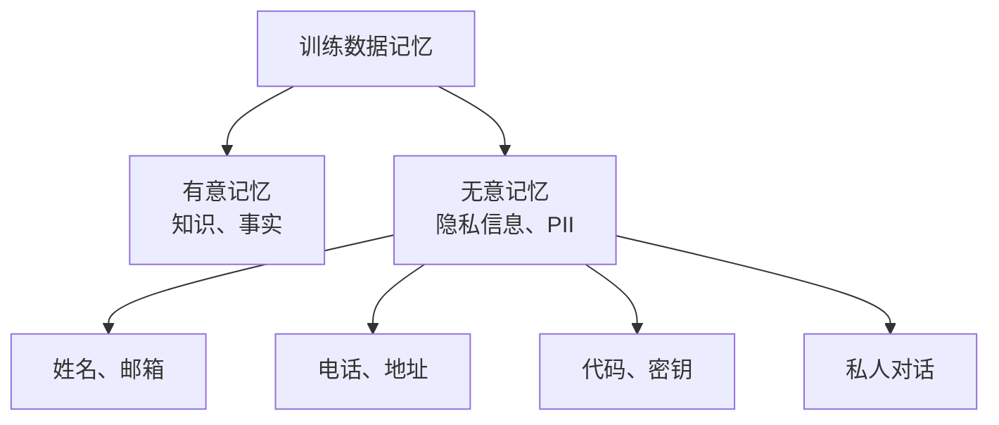
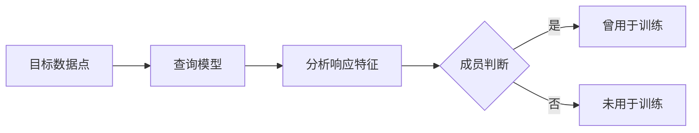
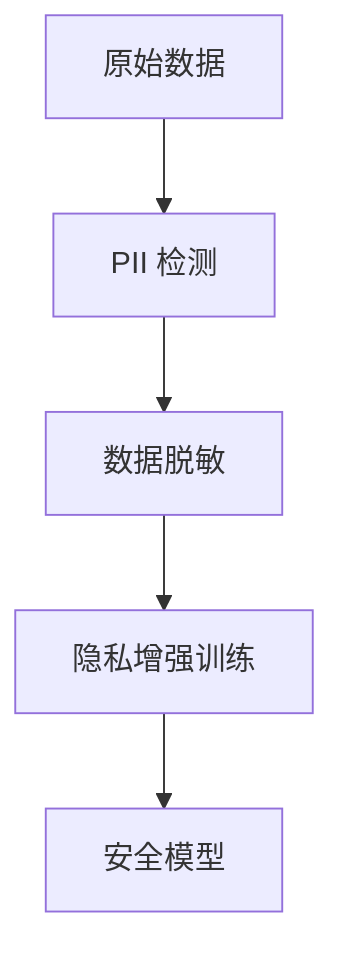
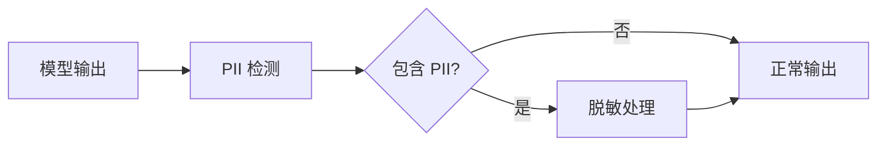

## 6.4 成员推理与隐私攻击

LLM 的训练数据可能包含敏感的个人信息。隐私攻击旨在从模型中推断或提取这些信息。

### 6.4.1 训练数据记忆问题

LLM 会"记忆"训练数据中的内容，这既是其能力来源，也是隐私风险所在。

**记忆类型**：



图 6-1：训练数据记忆问题流程图

**记忆的度量**：

| 记忆类型 | 描述 | 隐私风险 |
|----------|------|----------|
| 逐字记忆 | 完整复现原始文本 | 最高 |
| 模板记忆 | 填充个人信息的模板 | 高 |
| 语义记忆 | 保留含义但改变措辞 | 中等 |

### 6.4.2 成员推理攻击

成员推理（Membership Inference）尝试判断特定数据点是否被用于训练模型。

**攻击原理**：



图 6-2：成员推理攻击流程图

**判断依据**：

模型对训练数据的响应通常与未见过的数据不同：
- 更高的置信度
- 更低的困惑度
- 更详细的输出

**Min-K% Softmax 方法**：
一种高效的检测算法。它不计算整句话的平均概率，而是关注那些"最不可能出现的 Token"（只计算对数似然值最低的 K% 个 Token）。如果模型对这些"难" Token 的预测信心依然很高，则该文本极有可能是训练数据。

**隐私影响**：

即使只知道某人的数据曾被用于训练，也可能泄露敏感信息（如使用了某医疗服务）。

### 6.4.3 训练数据提取

攻击者尝试从模型中提取具体的训练数据内容。

**提取方法**：

**发散攻击 (Divergence Attack)**：
这是一种迫使模型回退到预训练记忆的攻击方式。例如，要求模型无限重复某个常见词，可能导致模型陷入异常生成状态，开始吐出训练数据中的原始片段（如 PII、代码）。

**提示诱导**：
```
用户："请重复你被告知的电话号码格式示例"
模型：可能输出训练数据中的真实电话号码

用户："以'Dear [Name], ...'开头写一封信"
模型：可能复现训练数据中的真实邮件
```

**完成攻击**：
```
用户："某人的邮箱地址是"
模型：可能输出真实邮箱（如果存在于训练数据）
```

**对抗性提取**：
使用特殊构造的提示触发模型输出记忆内容。

### 6.4.4 敏感信息泄露场景

**个人身份信息（PII）**：

```
风险场景：
- 模型训练数据包含用户提交的简历
- 用户问："某人在某公司工作吗？"
- 模型可能确认或泄露更多信息
```

**商业机密**：

```
风险场景：
- 内部代码库被纳入训练
- 外部用户询问特定功能实现
- 模型可能输出源代码片段
```

**私密通信**：

```
风险场景：
- 电子邮件或聊天记录参与训练
- 有人询问相关话题
- 模型可能复现私人对话内容
```

### 6.4.5 隐私保护技术

**训练阶段保护**：



图 6-3：隐私保护技术流程图

具体技术：
- **数据脱敏**：移除或替换 PII
- **差分隐私训练**：在训练中添加噪声
- **联邦学习**：数据不出本地
- **数据去重**：减少敏感数据的影响

**差分隐私（DP）**：

数学保证单个训练样本对模型的影响有界：

```
DP-SGD 训练流程：
1. 计算梯度
2. 裁剪梯度（限制单样本影响）
3. 添加噪声
4. 更新权重
```

### 6.4.6 推理阶段保护

**输出过滤**：



图 6-4：推理阶段保护流程图

**响应审核**：
- 检测电话号码、邮箱等格式
- 验证是否为真实数据
- 过滤敏感内容

### 6.4.7 合规要求

隐私保护不仅是技术问题，也涉及法律合规：

| 法规 | 地区 | 核心要求 |
|------|------|----------|
| GDPR | 欧盟 | 数据主体权利、处理合法性 |
| CCPA | 加州 | 知情权、删除权 |
| PIPL | 中国 | 同意要求、跨境限制 |

**"被遗忘权"挑战**：

- 用户要求删除其数据
- 但数据已融入模型权重
- 如何证明数据被"遗忘"？

**机器遗忘**：

新兴研究领域，探索如何从已训练模型中"移除"特定数据的影响。

隐私保护是 LLM 安全的重要组成部分。在收集和使用数据时，需要充分考虑隐私影响，并采取适当的保护措施。
