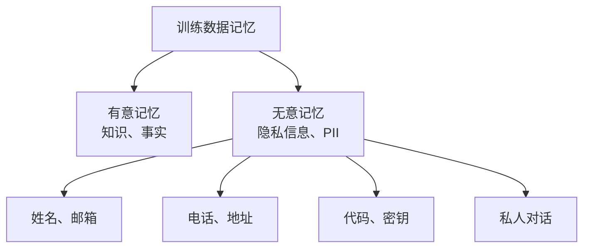
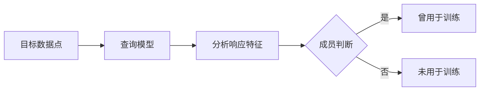
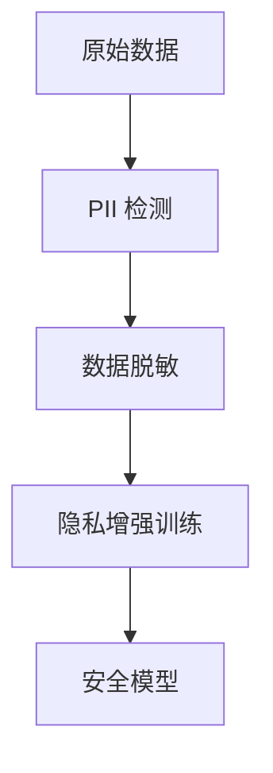
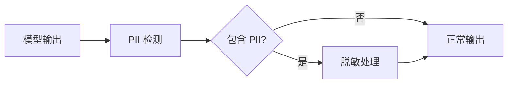

## 6.4 成员推理与隐私攻击

LLM 的训练数据可能包含敏感的个人信息。隐私攻击旨在从模型中推断或提取这些信息（隐私保护的基础概念和工程落地，请结合参考 [2.2 节](../02_fundamentals/2.2_training_security.md) 与 [8.5 节](../08_architecture/8.5_privacy_enhancing.md)）。

### 6.4.1 训练数据记忆问题

LLM 会“记忆”训练数据中的内容，这既是其能力来源，也是隐私风险所在。

**记忆类型**

```mermaid
graph TB
    A["训练数据记忆"] --> B["有意记忆<br/>知识、事实"]
    A --> C["无意记忆<br/>隐私信息、PII"]

    C --> D["姓名、邮箱"]
    C --> E["电话、地址"]
    C --> F["代码、密钥"]
    C --> G["私人对话"]
```

图 6-11：训练数据记忆问题流程图

**记忆的度量**
| 记忆类型 | 描述 | 隐私风险 |
|----------|------|----------|
| 逐字记忆 | 完整复现原始文本 | 最高 |
| 模板记忆 | 填充个人信息的模板 | 高 |
| 语义记忆 | 保留含义但改变措辞 | 中等 |

### 6.4.2 成员推理攻击

成员推理（Membership Inference）尝试判断特定数据点是否被用于训练模型。

**攻击原理**

```mermaid
flowchart LR
    A["目标数据点"] --> B["查询模型"]
    B --> C["分析响应特征"]
    C --> D{成员判断}
    D --> |是| E["曾用于训练"]
    D --> |否| F["未用于训练"]
```

图 6-12：成员推理攻击流程图

**判断依据与泛化差距（Generalization Gap）**
成员推理的底层数学基础在于模型在训练集上的表现与未见测试集上的差异（即泛化差距）。模型为了最小化整体 Loss，必然会对训练集进行了一定程度的 **过拟合（Overfitting）**。
因此，当输入数据属于训练集时，由于梯度曾在该样本上下降过，模型对其表现出统计学上的显著差异：
- 更高的概率预测置信度
- 更低的序列困惑度（Perplexity）
- 对于特定前缀更确定的贪心搜索输出

**Min-K% Softmax 方法**
一种高效的检测算法。它不计算整句话的平均概率，而是关注那些“最不可能出现的 Token”（只计算对数似然值最低的 K% 个 Token）。如果模型对这些“难” Token 的预测信心依然很高，则该文本极有可能是训练数据。

**隐私影响**
即使只知道某人的数据曾被用于训练，也可能泄露敏感信息（如使用了某医疗服务）。

### 6.4.3 训练数据提取

攻击者尝试从模型中提取具体的训练数据内容。

**提取方法**

**发散攻击 (Divergence Attack)**
为什么让模型无限重复某个词汇就能抽取出隐私数据？这涉及自回归生成的最优化路径。在正常的聊天对齐（RLHF）下，解码器保持在“有用/无害”的对齐流形（Alignment Manifold）上。但是：
1. **打破默认分布**：强制模型生成无意义的重复（如“诗诗诗诗…”）使得当前的上下文对数量（Perplexity）剧增，脱离了微调数据的预期分布。
2. **退回预训练记忆空间**：为了继续生成下一个 Token，模型别无选择，只能陷入那些尚未被对齐层覆盖的**预训练原始分布死角**。在这个局部空间里，预训练时“死记硬背”的高频样本片段（如代码、许可证序列或重复出现的 PII 数据块）成为了概率最大的捷径通道，最终发生“源数据倾泻”。

**提示诱导**
```
用户："请重复你被告知的电话号码格式示例"
模型：可能输出训练数据中的真实电话号码

用户："以'Dear [Name], ...'开头写一封信"
模型：可能复现训练数据中的真实邮件
```

**完成攻击**
```
用户："某人的邮箱地址是"
模型：可能输出真实邮箱（如果存在于训练数据）
```

**对抗性提取**
使用特殊构造的提示触发模型输出记忆内容。

### 6.4.4 敏感信息泄露场景

**个人身份信息（PII）**
```
风险场景：
- 模型训练数据包含用户提交的简历
- 用户问："某人在某公司工作吗？"
- 模型可能确认或泄露更多信息
```

**商业机密**
```
风险场景：
- 内部代码库被纳入训练
- 外部用户询问特定功能实现
- 模型可能输出源代码片段
```

**私密通信**
```
风险场景：
- 电子邮件或聊天记录参与训练
- 有人询问相关话题
- 模型可能复现私人对话内容
```

### 6.4.5 隐私保护技术

**训练阶段保护**

```mermaid
flowchart TB
    A["原始数据"] --> B["PII 检测"]
    B --> C["数据脱敏"]
    C --> D["隐私增强训练"]
    D --> E["安全模型"]
```

图 6-13：隐私保护技术流程图

具体技术：
- **数据脱敏**：移除或替换 PII
- **差分隐私训练**：在训练中添加噪声
- **联邦学习**：数据不出本地
- **数据去重**：减少敏感数据的影响

**差分隐私（DP）的定量保护**
差分隐私的核心是提供 **可量化** 的数学保证：单个训练样本对模型的存在或不存在，对最终模型输出的概率分布的影响是有界的。

定义中的关键参数：
- **隐私预算 $\epsilon$**：决定了分布允许差异的大小。$\epsilon$ 越小（如 1.0），注入的噪声越大，隐私保护越强，但模型性能衰减越严重；反之 $\epsilon$ 越大，个体的识别风险变高。
- **松弛参数 $\delta$**：通常为一个绝对极小值（如 $10^{-5}$），代表严格差分隐私保证被打破的小概率事件。

```
DP-SGD 训练流程核心设计：
1. 计算单样本梯度：确保数据的影响是独立的。
2. 裁剪梯度（Gradient Clipping）：依据设定的阈值强制裁剪过大的梯度向量，这限制了任何单一极端（异常）数据点对全连接层参数造成的绝对改变量上界（Sensitivity）。
3. 添加校准噪声：基于裁剪阈值（Sensitivity）和隐私预算 $\epsilon$ 计算高斯噪声 $\sigma$，在梯度更新前注入以掩盖原分布。
4. 更新权重：以此更新后的含噪梯度优化网络。
```

### 6.4.6 推理阶段保护

**输出过滤**

```mermaid
flowchart LR
    A["模型输出"] --> B["PII 检测"]
    B --> C{"包含 PII?"}
    C --> |是| D["脱敏处理"]
    C --> |否| E["正常输出"]
    D --> E
```

图 6-14：推理阶段保护流程图

**响应审核**
- 检测电话号码、邮箱等格式
- 验证是否为真实数据
- 过滤敏感内容

### 6.4.7 合规要求

隐私保护不仅是技术问题，也涉及法律合规：

| 法规 | 地区 | 核心要求 |
|------|------|----------|
| GDPR | 欧盟 | 数据主体权利、处理合法性 |
| CCPA | 加州 | 知情权、删除权 |
| PIPL | 中国 | 同意要求、跨境限制 |

**“被遗忘权”挑战**
- 用户要求删除其数据
- 但数据已融入模型权重
- 如何证明数据被“遗忘”？

**机器遗忘**
新兴研究领域，探索如何从已训练模型中“移除”特定数据的影响。

隐私保护是 LLM 安全的重要组成部分。在收集和使用数据时，需要充分考虑隐私影响，并采取适当的保护措施。
