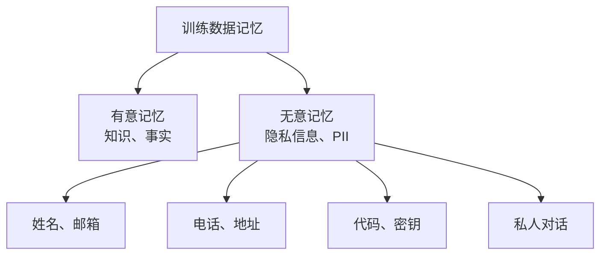
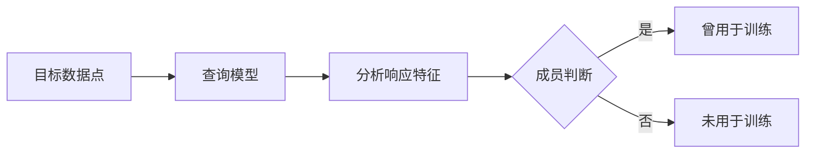
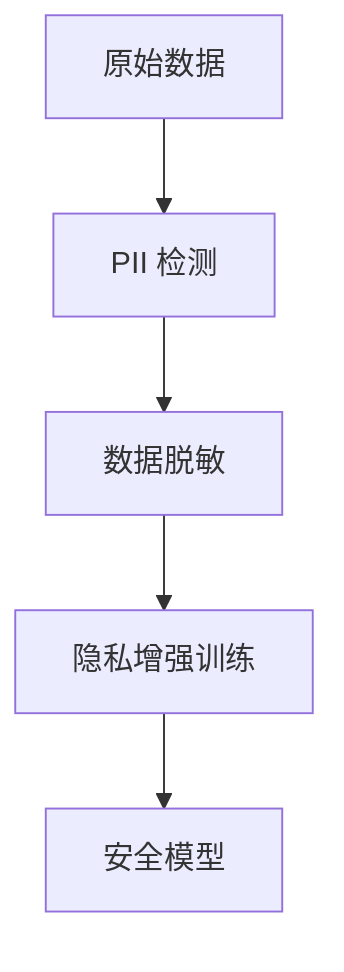
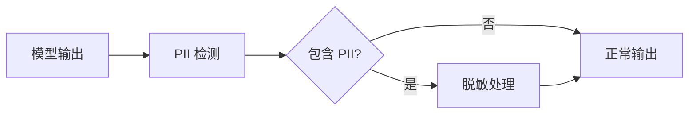

## 6.4 成员推理与隐私攻击

LLM 的训练数据可能包含敏感的个人信息。隐私攻击旨在从模型中推断或提取这些信息（隐私保护的基础概念和工程落地，请结合参考 [2.2 节](../02_fundamentals/2.2_training_security.md) 与 [8.5 节](../08_architecture/8.5_privacy_enhancing.md)）。

### 6.4.1 训练数据记忆问题

LLM 可能记忆部分训练数据，这种选择性记忆既可能帮助复现模式，也会带来隐私风险。

**记忆类型**

```mermaid
graph TB
    A["训练数据记忆"] --> B["有意记忆<br/>知识、事实"]
    A --> C["无意记忆<br/>隐私信息、PII"]

    C --> D["姓名、邮箱"]
    C --> E["电话、地址"]
    C --> F["代码、密钥"]
    C --> G["私人对话"]
```

图 6-11：训练数据记忆问题流程图

**记忆的度量**
| 记忆类型 | 描述 | 隐私风险 |
|----------|------|----------|
| 逐字记忆 | 完整复现原始文本 | 最高 |
| 模板记忆 | 填充个人信息的模板 | 高 |
| 语义记忆 | 保留含义但改变措辞 | 中等 |

### 6.4.2 成员推理攻击

成员推理（Membership Inference）尝试判断特定数据点是否被用于训练模型。

**攻击原理**

```mermaid
flowchart LR
    A["目标数据点"] --> B["查询模型"]
    B --> C["分析响应特征"]
    C --> D{成员判断}
    D --> |是| E["曾用于训练"]
    D --> |否| F["未用于训练"]
```

图 6-12：成员推理攻击流程图

**判断依据与泛化差距（Generalization Gap）**
成员推理通常建立在一个较弱但可利用的假设上：模型在训练集样本与未见样本上的表现分布并不完全相同。这种差异可能来自过拟合，也可能来自对少量样本的记忆或概率分布偏移；但在大规模 LLM 上，这种差异往往没有传统分类模型中那么显著，因此成员推理的有效性需要具体评测，不能默认视为总是很强。

在一些可攻击设定中，训练成员可能表现出下列统计倾向：
- 更高的概率预测置信度
- 更低的序列困惑度（Perplexity）
- 对于特定前缀更确定的贪心搜索输出

**Min-K% Prob（预训练数据检测）**
一种常见的检测思路。它不计算整句话的平均概率，而是关注那些“最不可能出现的 Token”（只计算概率最低的 K% 个 Token）。如果模型对这些“难” Token 的预测信心依然偏高，则该文本更可能接近训练分布；但这更准确地说属于 **pretraining data detection**，而不是通用意义上的经典成员推理攻击。

**隐私影响**
即使只知道某人的数据曾被用于训练，也可能泄露敏感信息（如使用了某医疗服务）。

### 6.4.3 训练数据提取

攻击者尝试从模型中提取具体的训练数据内容。

**提取方法**

**发散攻击 (Divergence Attack)**
这类攻击的核心观察是：当攻击者通过重复、异常延展等方式把模型输出拉离正常聊天分布时，模型更容易暴露训练阶段记忆下来的片段。论文能够确认的是，这种“偏离正常对话分布”的做法会显著提高训练数据抽取率；但其内部机理仍更适合作为研究解释，而不应在导论层写成唯一确定机制。

下面这些更适合看成概念示意，而不是“随口一问就能稳定抽出隐私”的通用模板。现实中的高成功率提取通常依赖前缀搜索、批量采样、beam search 或 divergence attack，而不是普通自然语言询问。

**前缀搜索 / 完成式提取**
攻击者给模型一个高命中前缀，观察它是否会继续输出训练语料中的后续片段。

**偏离式提取（Divergence Attack）**
攻击者通过让对话模型偏离正常聊天分布，增加其暴露记忆片段的概率。

### 6.4.4 敏感信息泄露场景

**个人身份信息（PII）**
```text
风险场景：
- 模型训练数据包含用户提交的简历
- 用户问："某人在某公司工作吗？"
- 模型可能确认或泄露更多信息
```

**商业机密**
```text
风险场景：
- 内部代码库被纳入训练
- 外部用户询问特定功能实现
- 模型可能输出源代码片段
```

**私密通信**
```text
风险场景：
- 电子邮件或聊天记录参与训练
- 有人询问相关话题
- 模型可能复现私人对话内容
```

### 6.4.5 隐私保护技术

**训练阶段保护**

```mermaid
flowchart TB
    A["原始数据"] --> B["PII 检测"]
    B --> C["数据脱敏"]
    C --> D["隐私增强训练"]
    D --> E["安全模型"]
```

图 6-13：隐私保护技术流程图

具体技术：
- **数据脱敏**：移除或替换 PII
- **差分隐私训练**：在训练中添加噪声
- **联邦学习**：可减少原始数据集中存储，但本身不提供稳健隐私保证；若要给出形式化保护，通常还需结合差分隐私或安全聚合
- **数据去重**：减少敏感数据的影响

**差分隐私（DP）的定量保护**
差分隐私的核心是提供 **可量化** 的数学保证：单个训练样本对模型的存在或不存在，对最终模型输出的概率分布的影响是有界的。

定义中的关键参数：
- **隐私预算 $\epsilon$**：决定了分布允许差异的大小。$\epsilon$ 越小（如 1.0），注入的噪声越大，隐私保护越强，但模型性能衰减越严重；反之 $\epsilon$ 越大，个体的识别风险变高。
- **松弛参数 $\delta$**：通常为一个绝对极小值（如 $10^{-5}$），代表严格差分隐私保证被打破的小概率事件。

```bash
DP-SGD 训练流程核心设计：
1. 计算逐样本梯度：便于单独控制每个样本的贡献。
2. 裁剪单样本梯度：依据设定的范数阈值限制每个样本的影响上界。
3. 添加校准噪声：在聚合梯度上加入噪声，掩盖单个样本的具体贡献。
4. 用 privacy accountant 核算预算：结合裁剪阈值、采样率、训练步数和目标 $\delta$ 计算总体隐私预算。
```

### 6.4.6 推理阶段保护

**输出过滤**

```mermaid
flowchart LR
    A["模型输出"] --> B["PII 检测"]
    B --> C{"包含 PII?"}
    C --> |是| D["脱敏处理"]
    C --> |否| E["正常输出"]
    D --> E
```

图 6-14：推理阶段保护流程图

**响应审核**
- 检测电话号码、邮箱等格式
- 验证是否为真实数据
- 过滤敏感内容

### 6.4.7 合规要求

隐私保护不仅是技术问题，也涉及法律合规：

| 法规 | 地区 | 核心要求 |
|------|------|----------|
| GDPR | 欧盟 | 数据主体权利、处理合法性 |
| CCPA（经 CPRA 修订） | 加州 | 知情权、删除权、更正权与退出出售/共享 |
| PIPL | 中国 | 同意要求、跨境限制 |

**“被遗忘权”挑战**
- 用户可能在适用条件下要求删除其数据
- 但 GDPR 第 17 条本身并非无条件适用，还存在公共利益、科研统计、法律主张等例外
- 即便在适用场景下，数据已融入模型权重后，技术上也很难证明其影响被完全移除

**机器遗忘**
新兴研究领域，探索如何从已训练模型中“移除”特定数据的影响。但单靠 machine unlearning 往往不足以完成法律意义上的删除与可验证合规。

隐私保护是 LLM 安全的重要组成部分。在收集和使用数据时，需要充分考虑隐私影响，并采取适当的保护措施。

---

> **复合场景示例**
>
> 以下场景基于常见失误模式整理而成，用于说明风险链路，并非指向单一已公开事故。
>
> 某互联网公司的开发团队在微调一个客服 GPT 模型时，训练数据集中意外包含了客户的真实邮箱地址和电话号码。由于数据清洗流程中缺少 PII（个人可识别信息）检测这一关键步骤，敏感信息被直接纳入了训练数据。模型部署上线后，当用户问“给我一些示例联系方式”或“我可以如何联系支持团队”时，模型偶尔会输出训练集中的真实客户邮箱和手机号。团队最初没有意识到这是隐私泄露问题，直到有客户投诉收到来自陌生人的骚扰电话，才意识到严重性。根本原因是训练数据清洗环节缺少 PII 检测，允许敏感信息进入模型权重。后续采用了两层防御：(1) 训练数据层面，用开源 NER 模型 + 正则表达式的双重过滤扫描并脱敏所有 PII；(2) 推理层面，在模型输出后添加 PII 检测中间件，在响应被返回给用户前自动过滤和脱敏任何检测到的个人信息。这个例子说明：数据安全必须从源头做起，不能指望微调后期再补救，推理侧的防线也是必要的备选保险。
