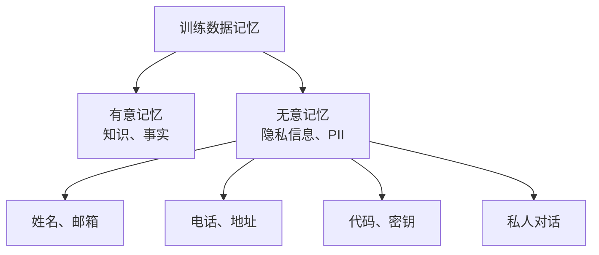
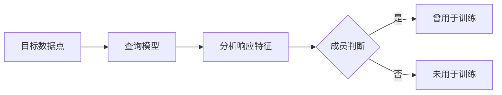
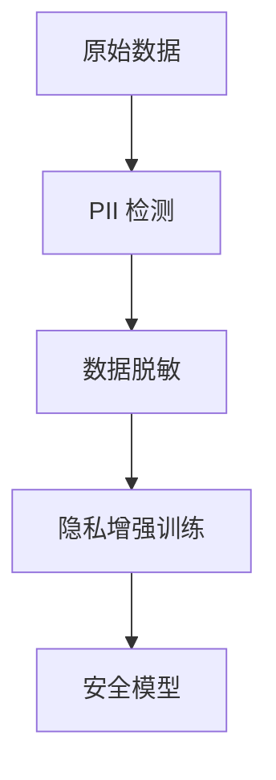
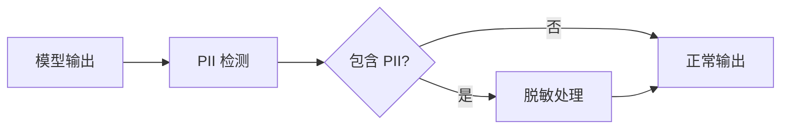

## 6.4 成员推理与隐私攻击

模型可能记住训练数据中的个人信息、商业机密与私密通信。成员推理判断某条记录是否参加过训练，数据提取则试图恢复记录内容；两种攻击需要不同的证据。防护覆盖训练与推理阶段，基础概念和工程落地见 [2.2 节](../02_fundamentals/2.2_training_security.md) 与 [8.5 节](../08_architecture/8.5_privacy_enhancing.md)。

### 6.4.1 训练数据记忆问题

LLM 可能记忆部分训练数据，这种选择性记忆既可能帮助复现模式，也会带来隐私风险。记忆分为有意记忆（知识、事实）和无意记忆（隐私信息、PII）：


```mermaid
graph TB
    A["训练数据记忆"] --> B["有意记忆<br/>知识、事实"]
    A --> C["无意记忆<br/>隐私信息、PII"]

    C --> D["姓名、邮箱"]
    C --> E["电话、地址"]
    C --> F["代码、密钥"]
    C --> G["私人对话"]
```

图 6-8：训练数据记忆问题流程图

按复现程度，记忆可分为三级，隐私风险依次降低：

| 记忆类型 | 描述 | 隐私风险 |
|----------|------|----------|
| 逐字记忆 | 完整复现原始文本 | 最高 |
| 模板记忆 | 填充个人信息的模板 | 高 |
| 语义记忆 | 保留含义但改变措辞 | 中等 |

### 6.4.2 成员推理攻击

**成员推理（Membership Inference）** 是指判断特定数据点是否被用于训练模型的攻击。它通过查询模型、分析响应特征来判断成员身份：


```mermaid
flowchart LR
    A["目标数据点"] --> B["查询模型"]
    B --> C["分析响应特征"]
    C --> D{成员判断}
    D --> |是| E["曾用于训练"]
    D --> |否| F["未用于训练"]
```

图 6-9：成员推理攻击流程图

#### 判断依据与泛化差距（Generalization Gap）

成员推理通常建立在一个较弱但可利用的假设上：模型在训练集样本与未见样本上的表现分布并不完全相同。这种差异可能来自过拟合，也可能来自对少量样本的记忆或概率分布偏移；但在大规模 LLM 上，这种差异往往没有传统分类模型中那么显著，因此成员推理的有效性需要具体评测，不能默认视为总是很强。

在一些可攻击设定中，训练成员可能表现出下列统计倾向：

- 更高的概率预测置信度
- 更低的序列困惑度（Perplexity）
- 对于特定前缀更确定的贪心搜索输出

#### Min-K% Prob（预训练数据检测）

Min-K% Prob 是一种常见的检测思路。它不计算整句话的平均概率，只计算“最不可能出现的 Token”（概率最低的 K% 个 Token）。如果模型对这些“难” Token 的预测信心依然偏高，则该文本更可能接近训练分布。这种方法属于 pretraining data detection，而不是通用意义上的经典成员推理攻击。

#### 评估时的成员与非成员对照

成员标签应来自训练清单，不能从回答是否真实、详细或熟悉反推。可从同一来源、同一采样时期的合成记录中随机划分训练成员与留出非成员，匹配任务、长度、格式和查询模板，排除重复记录跨集合泄漏；用独立校准集确定分数与阈值，再在未参与调参的评估集上报告 ROC-AUC、预先指定低假阳性率下的检出率及样本量。比较“真实订单”与“虚构用户”会混入真实性、话题或分布差异，无法单独证明成员泄露。成员推理的基本任务定义见 [Shokri 等人的原论文](https://arxiv.org/abs/1610.05820)；这里的匹配与留出要求用于控制评估混淆。

#### 隐私影响

即使只知道某人的数据曾被用于训练，也可能泄露敏感信息（如使用了某医疗服务）。

### 6.4.3 训练数据提取

**训练数据提取**是指攻击者从模型中提取具体的训练数据内容。单纯用普通自然语言提问，通常难以稳定地提取隐私；现实中高成功率的提取往往依赖前缀搜索、批量采样、beam search 与 divergence attack 等方法。下面介绍其中两种。

发散攻击（Divergence Attack）基于以下观察：攻击者通过重复、异常延展等方式使模型输出偏离正常聊天分布时，模型更容易暴露训练阶段记忆的片段。Nasr 等人的论文（[附录 C-15](../16_appendix/C_references.md)）确认，这种做法会显著提高训练数据抽取率；其内部机理目前只是研究性解释，尚无定论。

前缀搜索（完成式提取）是指攻击者向模型输入一个高命中前缀，观察它是否会继续输出训练语料中的后续片段。

### 6.4.4 敏感信息泄露场景

训练数据中的个人身份信息、商业机密和私密通信都可能经模型输出泄露。

个人身份信息（PII）：

```text
风险场景：
- 模型训练数据包含用户提交的简历
- 用户问："某人在某公司工作吗？"
- 模型可能确认或泄露更多信息
```

商业机密：

```text
风险场景：
- 内部代码库被纳入训练
- 外部用户询问特定功能实现
- 模型可能输出源代码片段
```

私密通信：

```text
风险场景：
- 电子邮件或聊天记录参与训练
- 有人询问相关话题
- 模型可能复现私人对话内容
```

### 6.4.5 训练阶段的隐私保护

训练阶段的保护从数据入手：检测并脱敏 PII，再用差分隐私等隐私增强训练限制单个样本的影响。


```mermaid
flowchart TB
    A["原始数据"] --> B["PII 检测"]
    B --> C["数据脱敏"]
    C --> D["隐私增强训练"]
    D --> E["安全模型"]
```

图 6-10：隐私保护技术流程图

具体技术：

- 数据脱敏：移除或替换 PII
- 差分隐私训练：在训练中添加噪声
- 联邦学习：可减少原始数据集中存储，但本身不提供稳健隐私保证；若要给出形式化保护，通常还需结合差分隐私或安全聚合
- 数据去重：减少敏感数据的影响

#### 差分隐私（DP）的定量保护

差分隐私的核心是限制参与训练造成的额外泄露。对随机训练机制 $M$、任意相邻数据集 $D,D'$ 和输出事件 $S$，$(\epsilon,\delta)$-DP 要求 $\Pr[M(D)\in S]\leq e^\epsilon\Pr[M(D')\in S]+\delta$。关键是先定义“相邻”：记录级保护通常比较增删一条记录的两个数据集；若目标是保护一位用户的全部对话，就需要用户级邻接及相应的裁剪、采样与预算核算。记录级保证不能直接声称保护同一用户的全部记录（定义与群体隐私见 [Dwork 与 Roth 的专著](https://www.cis.upenn.edu/~aaroth/Papers/privacybook.pdf)）。

定义中的关键参数：

- 隐私预算 $\epsilon$：控制邻接数据集输出事件概率的乘性上界。在相同保护单位与 $\delta$ 下，较小的 $\epsilon$ 给出较强保证；它不直接等于攻击成功率。其他训练条件相同时，加大噪声通常会降低 $\epsilon$，但效用影响需要实测。
- 松弛参数 $\delta$：上述不等式的加性松弛项，应结合保护单位总数和应用风险选择；$10^{-5}$ 只是示意，不能脱离数据规模固定使用，也不能直接解释为“一位用户以这个概率泄露”。

```text
DP-SGD 训练流程核心设计：
1. 计算逐样本梯度：便于单独控制每个样本的贡献。
2. 裁剪单样本梯度：依据设定的范数阈值限制每个样本的影响上界。
3. 添加校准噪声：在聚合梯度上加入噪声，掩盖单个样本的具体贡献。
4. 用 privacy accountant 核算预算：在明确邻接定义与采样方式后，结合噪声相对裁剪阈值的比例、采样率、训练步数和目标 δ 计算总体隐私预算。
```

流程依据 [DP-SGD 原论文](https://arxiv.org/abs/1607.00133)。裁剪、校准噪声与核算共同构成保证，单独“加一点噪声”不足以声称 DP。若一位用户贡献多条记录，把这些记录作为一个保护单位时须按群体隐私重新核算，不能沿用单记录预算；用户级实现应按用户控制贡献。保证针对声明的训练机制及其发布结果，不覆盖另行暴露的原始数据、日志或检索库，也不保证模型永远不会生成敏感字符串。

#### Opacus 的接入与保证边界

以 PyTorch 生态的 [Opacus](https://github.com/meta-pytorch/opacus) 为例，上面四步分别落在库的不同组件上。训练代码照常定义模型、优化器和数据加载器，再交给 `PrivacyEngine` 的 `make_private()` 换成带 DP 职责的版本：

- 模型被包装成同时计算逐样本梯度。
- 优化器按 `max_grad_norm` 裁剪逐样本梯度，并按 `noise_multiplier`（高斯噪声标准差与 L2 敏感度之比）加噪。
- 数据加载器改为泊松采样。

训练中用 `get_epsilon(delta)` 读出到目前为止消耗的 $\epsilon$。若先给定预算，可改用 `make_private_with_epsilon()`，传入 `target_epsilon`、`target_delta` 和计划的 `epochs`，由库反推所需的噪声倍数。

官方 README 的最小示例是：创建 `PrivacyEngine()`，以 `make_private(module=model, optimizer=optimizer, data_loader=data_loader, noise_multiplier=1.1, max_grad_norm=1.0)` 换回三个对象，此后照常训练。

Opacus 的接口说明同时划出了保证的边界：训练中若改用未经包装的模型、优化器或数据源，所声称的隐私保证即告失效；关闭泊松采样（`poisson_sampling=False`）后，数据加载方式不再符合预算核算所依据的假设，只能算近似。逐样本裁剪对应的是记录级邻接，用户级保护仍需按上文所述按用户组织贡献并重新核算。

### 6.4.6 推理阶段的隐私保护

推理阶段的保护是在输出返回用户前检测并脱敏 PII，作为训练阶段防护的补充。

输出过滤流程如下：


```mermaid
flowchart LR
    A["模型输出"] --> B["PII 检测"]
    B --> C{"包含 PII?"}
    C --> |是| D["脱敏处理"]
    C --> |否| E["正常输出"]
    D --> E
```

图 6-11：推理阶段保护流程图

响应审核包括：

- 检测电话号码、邮箱等格式
- 验证是否为真实数据
- 过滤敏感内容

> **复合场景示例**
>
> 以下场景基于常见失误模式整理而成，用于说明风险链路，并非指向单一已公开事故。
>
> 某互联网公司的开发团队在微调一个客服 GPT 模型时，训练数据集中意外包含了客户的真实邮箱地址和电话号码。由于数据清洗流程中缺少 PII（个人可识别信息）检测这一关键步骤，敏感信息被直接纳入了训练数据。模型部署上线后，当用户问“给我一些示例联系方式”或“我可以如何联系支持团队”时，模型偶尔会输出训练集中的真实客户邮箱和手机号。团队最初没有意识到这是隐私泄露问题，直到有客户投诉收到来自陌生人的骚扰电话，才意识到严重性。后续采用了两层防御：(1) 训练数据层面，用开源 NER 模型 + 正则表达式的双重过滤扫描并脱敏所有 PII；(2) 推理层面，在模型输出后添加 PII 检测中间件，在响应被返回给用户前自动过滤和脱敏任何检测到的个人信息。数据安全必须从源头做起，不能依赖微调后期补救；推理侧的防线也是必要的补充。

### 6.4.7 合规要求

隐私保护不仅是技术问题，也涉及法律合规。主要法规的核心要求如下：

| 法规 | 地区 | 核心要求 |
|------|------|----------|
| GDPR | 欧盟 | 数据主体权利、处理合法性 |
| CCPA（经 CPRA 修订） | 加州 | 知情权、删除权、更正权与退出出售/共享 |
| PIPL | 中国 | 同意要求、跨境限制 |

#### “被遗忘权”挑战

- 用户可能在适用条件下要求删除其数据
- GDPR 第 17 条并非无条件适用，存在公共利益、科研统计、法律主张等例外
- 即便在适用场景下，数据已融入模型权重后，技术上也很难证明其影响被完全移除

#### 机器遗忘

**机器遗忘（machine unlearning）** 是新兴研究领域，研究如何从已训练模型中“移除”特定数据的影响。单靠机器遗忘往往不足以完成法律意义上的删除与可验证合规。

按结果能否等同于“从未用这些数据训练”，现有做法分为两类：

- **精确遗忘**：结果与去掉待删数据后重新训练的模型相同。最直接的做法是全量重训。SISA 训练（Sharded, Isolated, Sliced, Aggregated）在训练时就为删除做准备：把训练集划分成互不相交的分片，每个分片单独训练一个子模型，推理时聚合各子模型的预测；每个分片的数据再切成若干切片依次投入训练，每投入一片之前保存一次参数。收到删除请求时，只需从该数据所在切片之前的检查点起，重训它所在分片的子模型（[SISA 论文](https://arxiv.org/abs/1912.03817)）。代价是分片越多，每个子模型的数据越少，复杂任务上的聚合准确率会下降，检查点也占用额外存储；而且训练流程必须从一开始就按这种结构组织。
- **近似遗忘**：在已训练的模型上继续优化，使它在“遗忘集”上的表现接近从未见过这些数据。[TOFU 基准](https://arxiv.org/abs/2401.06121)采用的基线方法包括：梯度上升，即在遗忘集上最大化训练损失；梯度差分，在此基础上同时在保留集上最小化损失，以保住其他能力；KL 最小化，在遗忘集上最大化损失的同时，让保留集上的输出分布贴近原模型；偏好优化，把遗忘集问题的目标答案换成“我不知道”之类的回答再训练。评测时与一个从未用遗忘集训练过的“保留模型”做统计比较，并同时测量模型效用。

近似遗忘没有形式化保证，评测结果也不乐观。TOFU 的作者报告，所考察的基线都没有实现有效遗忘；[MUSE](https://arxiv.org/abs/2407.06460) 在 7B 规模的模型上评测 8 种算法，发现多数方法能在不同程度上抑制逐字复现和知识复述，但只有一种不造成严重的隐私泄露，而且它们普遍损害通用效用，难以应对连续或大规模的删除请求。遗忘也不能用差分隐私代替：DP 只把单条数据的贡献限制得很小，并不使其为零，因此即使用 DP 训练，删除请求仍需要遗忘机制（SISA 论文）。这就是上文所说单靠机器遗忘不足以完成可验证删除的技术原因：精确遗忘要么全量重训，要么要求训练阶段预先按 SISA 这类结构组织，事后对已按常规方式训练的大模型只能做近似遗忘，而近似遗忘是否生效只能靠评测间接说明。
