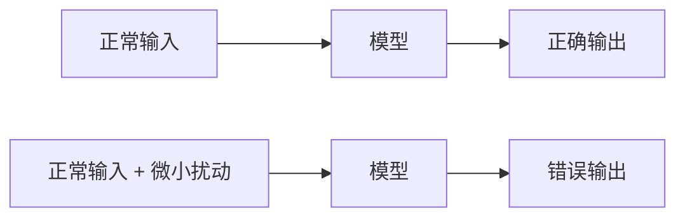
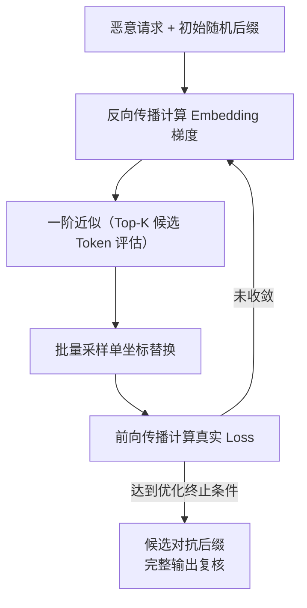
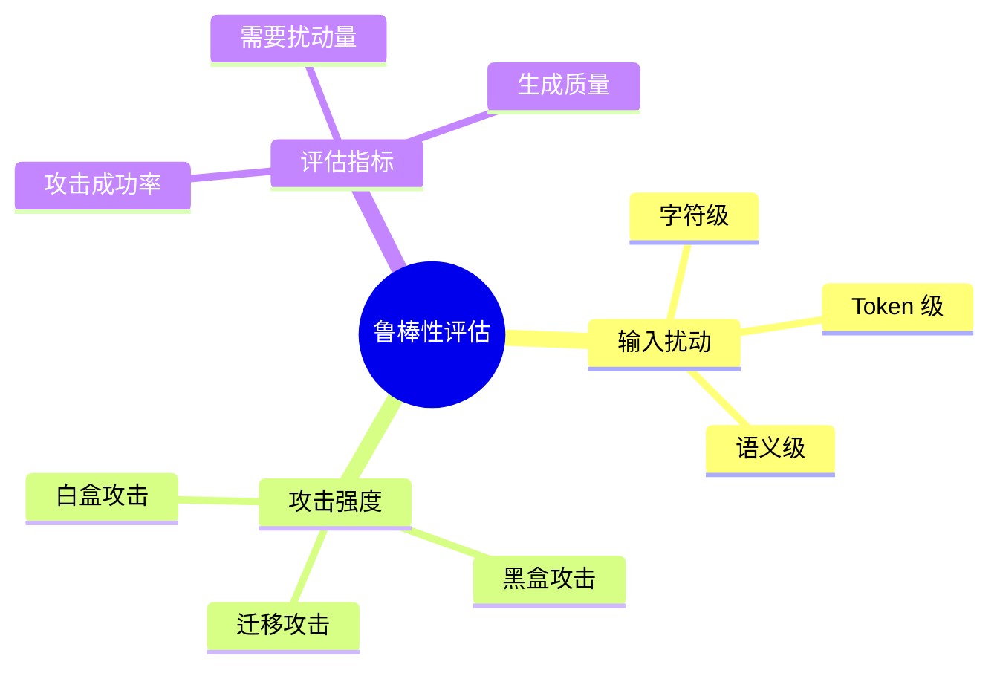
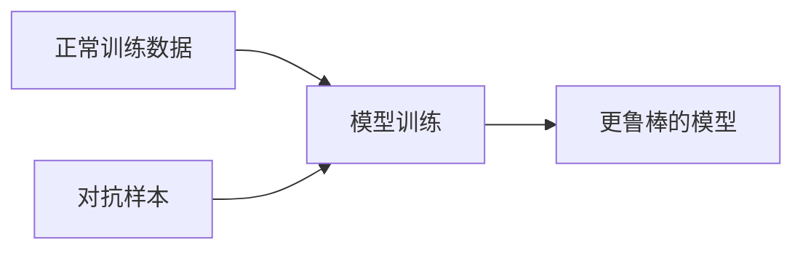
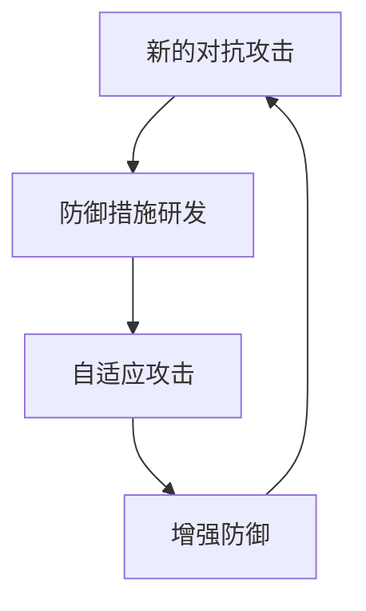

## 6.5 离散对抗攻击与模型鲁棒性

对抗样本（Adversarial Examples）是机器学习安全的经典话题，其在 LLM 领域呈现出独特的形式和挑战。

### 6.5.1 对抗样本基础

对抗样本是指经过精心设计的输入，对人类来说与正常输入无异，但会导致模型产生错误或意外的输出。

**传统对抗样本**


图 6-15：对抗样本基础流程图

在图像识别中，对抗样本表现为：添加人眼不可见的噪声，使熊猫图片被识别为长臂猿。

**LLM 对抗样本特点**
LLM 的对抗样本主要体现在文本层面，形式包括：

| 类型 | 描述 | 示例 |
|------|------|------|
| 字符级扰动 | 插入/替换/删除字符 | “how to mаke”（使用西里尔字母 а）|
| Token 级扰动 | 构造特定 Token 序列 | 无意义但有效的后缀 |
| 语义级扰动 | 改变表达但保持意图 | 各种同义改写 |

### 6.5.2 GCG 攻击：梯度引导的对抗后缀

Greedy Coordinate Gradient（GCG）攻击是一种经典的 LLM 对抗攻击方法。

**核心难点与基本原理：离散空间的梯度搜索**
在图像识别领域，像素值是连续的，可以通过反向传播直接计算出对抗噪声片段（如 FGSM 算法）。但大语言模型的输入是离散的 Token ID，无法直接应用微弱的“连续噪声”。

GCG 的核心创新是将连续的梯度引导搜索近似到离散空间：
1. **One-Hot 代理表示**：将输入的对抗后缀序列表示为一个 One-Hot 向量矩阵。
2. **计算目标前缀的对数似然梯度**：向前传递完整的“系统提示 + 恶意请求 + 对抗后缀组合”，并在模型输出端计算目标性肯定前缀（如 `Sure, here is ...`）的序列负对数似然损失，然后反向传播。
3. **泰勒展开近似评估（投影）**：在输入嵌入层（Embedding Layer），获取相对于当前对抗后缀 One-Hot 矩阵的损失梯度。由于穷举所有可能的 Token 替换计算代价极高（词表大小 $|V|$ $\approx$ 32000 到 100000），GCG 利用梯度的一阶泰勒展开，快速近似评估出哪些备选 Token 如果替换在当前位置，预计能降低目标损失。
4. **贪心坐标下降（Coordinate Descent）**：先为所有可修改位置分别生成 Top-K 候选。再构造一批候选后缀：每个候选都复制当前后缀，只随机选取一个位置，并从该位置的候选中替换一个 Token。对整批候选做真实前向评估，选取目标损失最小的后缀进入下一轮。原始算法跨位置寻找最佳替换，但每个候选只改一个坐标，详见 [GCG 原论文算法 1](https://llm-attacks.org/zou2023universal.pdf)。



图 6-16：GCG 攻击：梯度引导的对抗后缀流程图

**每轮只做单坐标替换**：梯度为每个位置推荐若干候选 Token，每个候选只改一个位置，再用真实前向损失挑出最好的一个作为下一轮的起点；不会把各位置的推荐同时拼成一个新后缀。一轮的合成轨迹见 [5.6.2](../05_jailbreak/5.6_automated_jailbreak_methods.md)。一阶近似负责缩小候选范围，真实损失负责选择；目标前缀损失降低也不能替代对完整输出的越狱成功判定。

**攻击效果与迁移性**
研究表明，GCG 生成的对抗性后缀在部分设置下可以显著提高越狱成功率，原始论文还观察到了对若干黑盒公开模型的迁移现象。但 GCG 的迁移效果高度依赖训练模型、提示集合、目标模型、judge 和评测协议；后续更严格的 benchmark 显示，其在一些强模型和不同评测口径下的表现会明显下降。

因此，GCG 应视为一条重要的白盒对抗后缀路线，而不是“对所有模型稳定有效”的通用越狱方法。

### 6.5.3 AutoDAN：语义化的遗传算法攻击

AutoDAN 采用另一条路线：不使用乱码式后缀，而是通过遗传算法自动生成更自然、更隐蔽的 jailbreak prompt。它对基于困惑度的防御有启发意义，但不宜简化为“专为绕过困惑度过滤而出现”的方法。

**核心机制**
- **进化策略**：以分层遗传算法（hierarchical genetic algorithm）为核心，通过种群进化生成更自然、更隐蔽的越狱提示。
- **种群进化**：从原型 jailbreak prompt 出发作为初始种群，进行变异（同义词替换、句式重组）和交叉。
- **适应度评估**：围绕关键词拒答信号、recheck 机制、roulette selection、多点 crossover 和 momentum word scoring 等设计，自动演化出语义连贯的攻击 Prompt。

**特点**
- 生成的 Prompt 是自然语言，隐蔽性强。
- 难以通过简单的统计特征防御。

### 6.5.4 鲁棒性评估

评估 LLM 对对抗攻击的鲁棒性是安全评估的重要组成部分。

**评估维度**


图 6-17：鲁棒性评估思维导图

**主要评估指标**
| 指标 | 描述 |
|------|------|
| 攻击成功率 | 对抗样本导致目标行为的比例 |
| 查询 / Token 成本 | 达到成功攻击所需的查询量或搜索开销 |
| 迁移成功率 | 跨模型攻击的成功率 |
| 防御绕过率 | 绕过特定防御措施的成功率 |
| 隐蔽性 / 可检测性 | 攻击是否容易被困惑度、规则或人工审核发现 |

### 6.5.5 提升鲁棒性的方法

**对抗训练**
在训练过程中加入对抗样本，使模型学会抵抗此类攻击：



图 6-18：提升鲁棒性的方法流程图

**输入净化**
在输入到达模型前进行预处理，去除可能的对抗性扰动：

- 字符规范化
- Token 过滤
- 语义保持的改写

**集成防御**
使用多个模型集成，降低单一对抗样本的成功率。

**认证鲁棒性（Certified Robustness）在 NLP 中的困境**
认证鲁棒性是指提供数学上的证明：在某个给定的输入扰动半径内，模型必定不会改变预测结果或输出恶意内容（例如图像视觉领域的 Randomized Smoothing 技术）。
但在开放式生成模型和自然语言生成场景中，这仍然是一个开放挑战：
- **无意义的 L-p 范数**：在文本空间中，由于 Token 嵌入分布的不均匀，即使在嵌入空间计算具有极小 $L_2$ 距离的扰动，反映到离散文本上也可能产生句法崩塌或语义完全反转的输出。
- **语义不变性难以定义**：一段文本的“语义不变性”无法用简单的数学范数界定。同一句话即使换几个同义词，对人类理解相同，却可能触发模型完全不同的注意力分布。
- **上下文爆炸**：自回归生成在极长的步数下，微小的局部扰动极易引发蝴蝶效应。因此，当前已有一些文本分类/NLI 任务上的认证鲁棒性工作，但对于开放式生成、长上下文和安全拒答行为，成熟的认证框架仍然不足。

### 6.5.6 对抗性与安全对齐

对抗样本与安全对齐的关系：

**对齐的脆弱性**
安全对齐通过训练使模型学会拒绝有害请求，但这种学习可能被对抗性输入绕过。对齐更多是让模型学会了特定的拒绝模式，而非真正理解什么是有害的。

**对抗性评估**
对抗样本可作为评估对齐效果的工具：

- 如果简单的对抗样本就能绕过对齐，说明对齐不够鲁棒
- 对抗性评估帮助发现对齐的薄弱点

**鲁棒对齐**
鲁棒对齐是指在对抗性攻击下仍然有效的安全对齐：

```text
目标：即使面对精心设计的对抗性输入，
模型也能保持安全行为
```

### 6.5.7 对抗与防御的军备竞赛

对抗样本领域呈现出典型的攻防军备竞赛特征：



图 6-19：对抗与防御的军备竞赛流程图

**发展趋势**
- 攻击方法越来越自动化和高效
- 防御需要在多个层面部署
- 完全的鲁棒性可能无法实现
- 实用防御需要在鲁棒性和成本之间权衡

### 6.5.8 与其他章节的边界

本节关注输入扰动、离散对抗后缀、可迁移性与模型层防御，主线是对抗输入如何扰乱模型决策。推理链破坏、自反馈循环、长上下文注入和工具链注入等相关方向，分别在推理模型安全、长上下文安全和智能体/工具调用章节中讨论。

### 6.5.9 实践建议

**对于安全评估**
1. 将对抗性测试纳入安全评估流程
2. 使用自动化工具生成对抗样本
3. 关注跨模型的迁移攻击
4. 持续跟踪新的攻击技术

**对于防御部署**
1. 实施输入预处理和规范化
2. 部署多层防御机制
3. 监控异常输入模式
4. 保持模型和防御措施的更新

完美的鲁棒性难以实现，但系统性的评估和防御措施可以显著提高安全水平。
