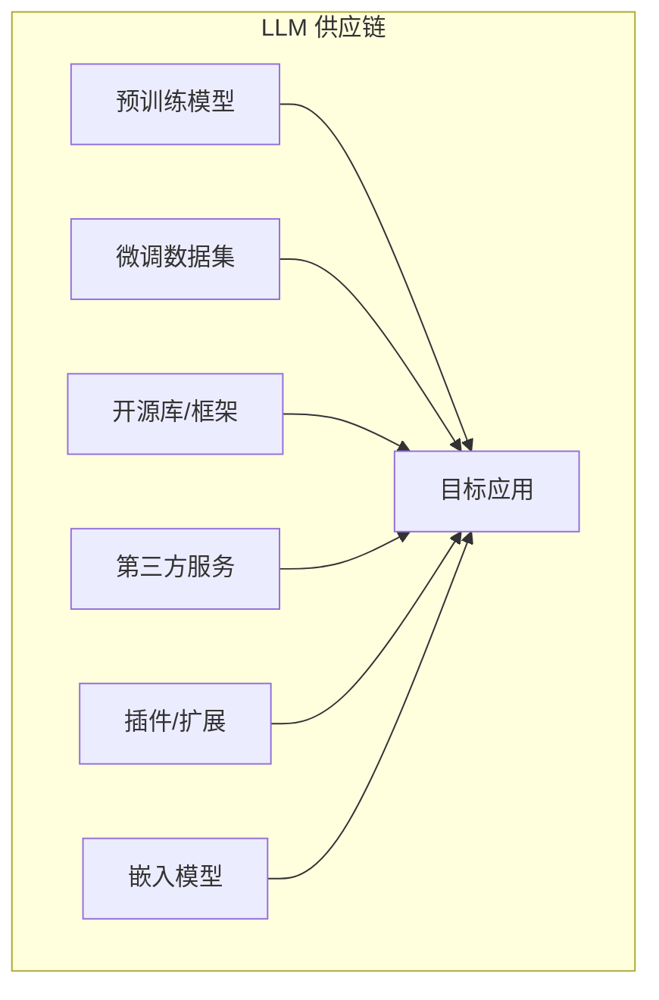
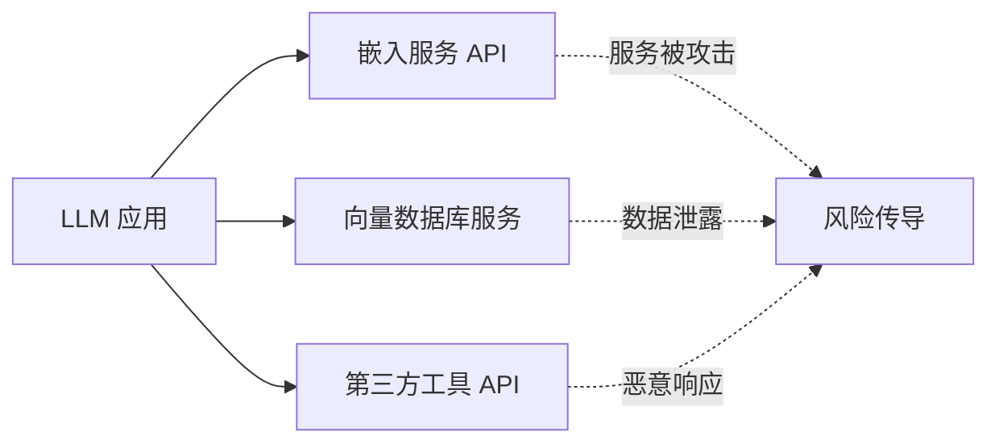
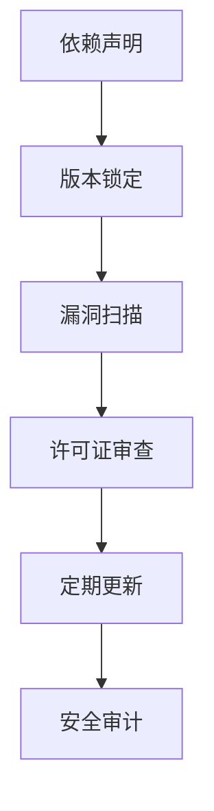
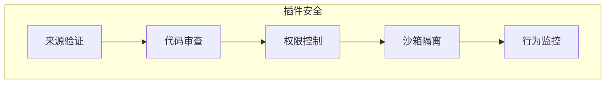

## 6.5 供应链与基础设施环境安全

LLM 应用依赖复杂的供应链，包括模型、数据、库和服务。供应链中的任何环节被攻击都可能影响整体安全。

### 6.5.1 LLM 供应链概述

LLM 应用的供应链比传统软件更加复杂：



图 6-1：LLM 供应链组成流程图

### 6.5.2 供应链风险类型

**被污染的预训练模型**：

```
风险场景：
- 从非官方渠道下载模型
- 模型已被植入后门
- 使用时表面正常
- 特定触发条件下执行恶意行为
```

**恶意数据集**：

```
风险场景：
- 使用公开的微调数据集
- 数据集中包含投毒样本
- 微调后模型行为被改变
```

**依赖库漏洞**：

| 风险类型 | 描述 |
|----------|------|
| 已知漏洞 | 使用有已知漏洞的库版本 |
| 依赖混淆 | 下载了恶意的同名包 |
| 恶意更新 | 正常库被恶意更新 |
| 废弃依赖 | 使用不再维护的库 |

**第三方服务风险**：



图 6-2：第三方服务风险传导流程图

### 6.5.3 模型供应链安全

**可信来源的重要性**：

```
安全来源：
✓ 官方模型仓库（平台认证账号）
✓ 知名机构发布的模型
✓ 有完整审计记录的模型

风险来源：
✗ 来源不明的模型文件
✗ 非官方的“优化版”模型
✗ 未经验证的社区上传
```

**模型验证措施**：

| 措施 | 描述 |
|------|------|
| 哈希校验 | 验证模型文件完整性 |
| 签名验证 | 确认发布者身份 |
| 后门扫描 | 检测潜在的后门行为 |
| 行为测试 | 验证模型行为正常 |

### 6.5.4 依赖管理安全

**Python 生态风险**：

```bash
# 风险示例：不安全的依赖安装
# 可能安装恶意包
pip install some-package  # 包名可能被抢注

# 安全做法
pip install package==1.2.3 \
    --hash=sha256:abcd1234...  # 指定版本和哈希
```

**依赖安全最佳实践**：



图 6-3：依赖安全管理流程图

**工具推荐**：

| 工具 | 功能 |
|------|------|
| pip-audit | Python 依赖漏洞扫描 |
| Snyk | 多语言依赖安全 |
| SBOM 生成 | 软件物料清单 |
| Dependabot | 自动依赖更新 |

### 6.5.5 插件与扩展安全

LLM 应用常通过插件扩展功能，这也引入风险。

**插件风险**：

```
风险类型：
1. 恶意插件：专门设计的攻击性插件
2. 漏洞插件：正常插件中存在漏洞
3. 权限过度：插件请求超出需要的权限
4. 数据泄露：插件将数据发送到外部
```

**插件安全框架**：



图 6-4：插件安全框架图

### 6.5.6 软件物料清单

SBOM 帮助组织了解其软件的组成成分。

**SBOM 内容**：

```
LLM 应用 SBOM 示例：

核心模型：
- 模型名称：某开源模型
- 来源：官方或认证发布者
- 版本：发布版本号
- 许可证：对应开源许可证

依赖库：
- 依赖名称与版本锁定
- 哈希/签名（如支持）
...

第三方服务：
- 嵌入服务：某嵌入 API
- 向量数据库：某向量数据库服务
...
```

**SBOM 价值**：

- 快速识别受影响组件
- 满足合规要求
- 支持漏洞响应
- 供应链透明度

### 6.5.7 供应链安全策略

**预防措施**：

```
1. 建立可信供应商清单
2. 实施依赖版本锁定
3. 定期漏洞扫描
4. 模型和数据来源验证
5. 第三方服务安全评估
```

**检测措施**：

```
1. 持续监控依赖安全公告
2. 定期安全审计
3. 异常行为检测
4. 完整性校验
```

**响应措施**：

```
1. 建立应急响应流程
2. 维护可替换组件清单
3. 快速补丁能力
4. 回滚机制
```

供应链安全是 LLM 安全的基础。在快速迭代的 AI 领域，保持供应链的可见性和可控性至关重要。
