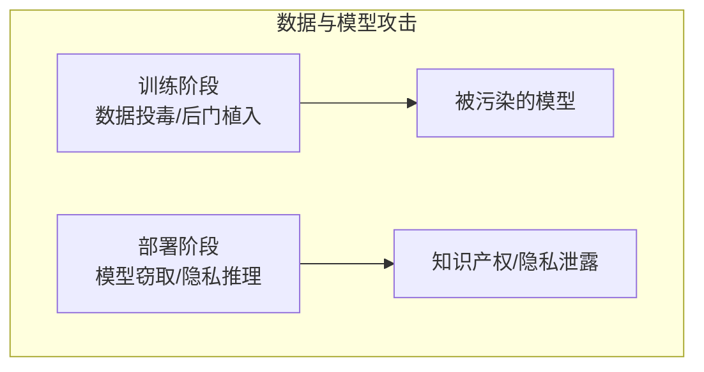

# 第六章：数据与模型攻击

训练数据和模型本身是 LLM 系统的核心资产。针对数据和模型的攻击可能产生深远且难以检测的影响，是安全防护中不可忽视的威胁。

本章聚焦于数据与模型层面的攻击，主要内容包括：

- **6.1 训练数据投毒**：了解如何通过污染训练数据影响模型行为
- **6.2 后门攻击**：掌握后门的植入机制和检测方法
- **6.3 模型窃取与逆向工程**：理解模型知识产权面临的威胁
- **6.4 成员推理与隐私攻击**：认识训练数据隐私泄露的风险

通过本章的学习，读者将全面了解 LLM 在数据和模型层面面临的安全威胁。

