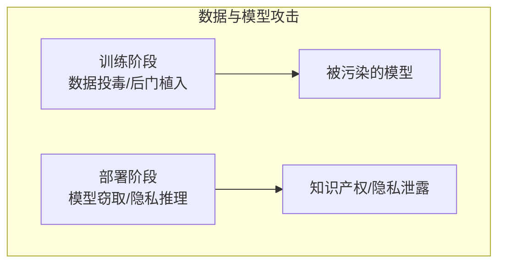

# 第六章 数据与模型攻击

训练数据和模型本身是 LLM 系统的核心资产，针对它们的攻击发生在比提示更底层的位置，可能产生深远且难以检测的影响。[第五章](../05_jailbreak/README.md)讨论的越狱在推理时通过输入绕过对齐；本章转向训练数据、模型权重、微调过程和模型文件，讨论攻击者如何污染、窃取、推断或借之执行代码。[第七章](../07_rag_security/README.md)把数据投毒的思路延伸到 RAG 知识库。

> **⚠️ 道德边界**：数据投毒、后门、模型窃取与隐私攻击的描述用于让防御方理解威胁模型并设计相应的检测、监控与训练流程控制；不构成对第三方模型或数据集发起攻击的指引。完整声明见 [§4 章首道德边界与负责任披露说明](../04_prompt_injection/README.md)。

## 学习目标

读完本章，读者应能：

1. 区分可用性攻击、靶向攻击和后门攻击三类投毒，说明“模型越大、数据越多，所需投毒比例越高”的直觉为何不成立，以及后门的触发器类型与检测思路。
2. 描述基于 API 查询的模型窃取与恶意蒸馏流程，并说明微调、量化、蒸馏、剪枝如何破坏模型水印。
3. 区分成员推理与训练数据提取，说明评估成员推理时成员与非成员对照应满足的条件，以及差分隐私保证的适用范围。
4. 比较 GCG 与 AutoDAN 两条对抗攻击路线，说明认证鲁棒性在开放式文本生成中难以实现的原因。
5. 识别微调/PEFT 引入的对齐退化、微调数据投毒、适配器仿制与隐私风险，以及 pickle 等模型文件“加载即执行”的风险，并列出安全微调流水线和安全加载模型的关键控制。

## 本章结构

- [6.1](6.1_data_poisoning.md) 训练数据投毒：攻击者如何通过污染训练数据影响模型行为，LLM 投毒有何特殊性。
- [6.2](6.2_backdoor_attacks.md) 后门攻击：后门如何植入、为何难以发现、如何检测和移除。
- [6.3](6.3_model_extraction.md) 模型窃取与逆向工程：攻击者如何通过查询复制模型能力，模型所有者如何保护知识产权。
- [6.4](6.4_privacy_attacks.md) 成员推理与隐私攻击：攻击者如何推断或提取训练数据，训练和推理阶段如何保护隐私。
- [6.5](6.5_adversarial_robustness.md) 离散对抗攻击与模型鲁棒性：对抗样本如何扰乱 LLM 决策，如何评估和提升鲁棒性。
- [6.6](6.6_finetuning_peft_security.md) 微调与 PEFT 的安全风险：LoRA、QLoRA 等参数高效微调方法如何放大对齐退化、数据投毒和隐私泄露风险，如何建立安全微调流水线。
- [6.7](6.7_malicious_model_artifacts.md) 恶意模型工件与反序列化攻击：模型文件为何本身可能是可执行载荷（pickle RCE、扫描器绕过），Safetensors 等防御如何应对。

各节按攻击发生的生命周期阶段排列：6.1、6.2 讨论训练阶段对数据的污染及其特殊形式后门；6.3、6.4 讨论部署阶段通过查询窃取模型能力或推断训练数据；6.5 讨论推理时的对抗输入；6.6 讨论微调阶段；6.7 讨论模型文件的加载环节。每节都先讲攻击原理与手法，再讲检测与防御。

```mermaid
flowchart TB
    subgraph "数据与模型攻击"
    A["训练阶段<br/>数据投毒/后门植入"] --> C["被污染的模型"]
    B["部署阶段<br/>模型窃取/隐私推理"] --> D["知识产权/隐私泄露"]
    end
```
