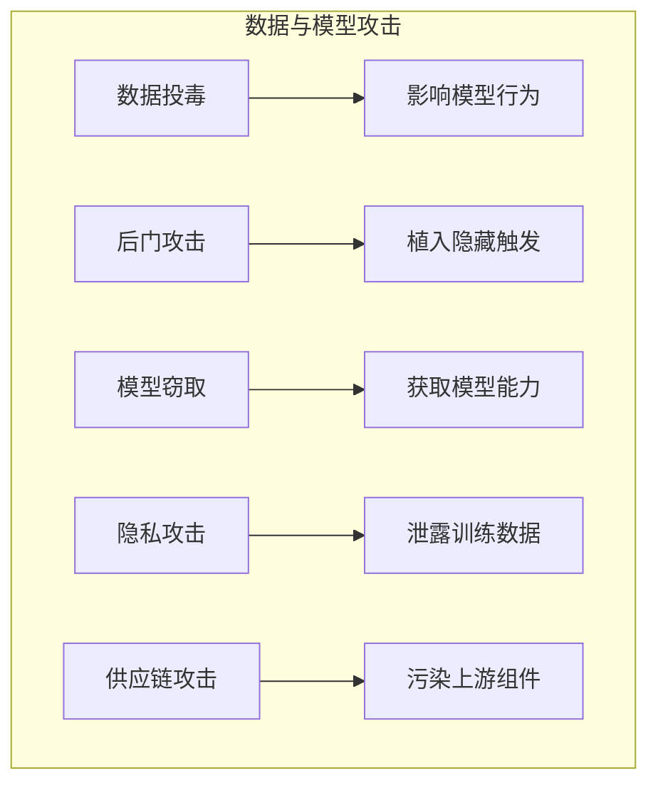

## 本章小结

本章探讨了针对训练数据和模型本身的攻击，这些攻击发生在更底层，可能产生持久和深远的影响。

### 核心要点回顾

**训练数据投毒**：通过在训练数据中注入恶意样本影响模型行为。攻击可通过公开数据源、供应链或内部人员进行。投毒的影响持久且难以检测和修复。

**后门攻击**：在模型中植入隐藏的触发机制，正常使用时正常工作，遇到特定触发器时产生恶意行为。后门可通过数据注入或模型修改植入，极难发现。

**模型窃取**：通过大量 API 查询收集模型行为数据，训练替代模型。威胁模型所有者的知识产权和商业利益。防御措施包括速率限制、异常检测和模型水印。

**隐私攻击**：从模型中推断或提取训练数据中的敏感信息。包括成员推理和数据提取。需要通过数据脱敏、差分隐私等技术保护。

**供应链与基础设施安全**：预训练模型、数据集、依赖库、第三方服务、文件解析等都可能引入风险。需要建立可信供应商清单、实施版本锁定、漏洞扫描和 SBOM 管理。

### 攻击对比

图 6-1：攻击对比流程图

| 攻击类型 | 攻击时机 | 主要影响 | 检测难度 |
|----------|----------|----------|----------|
| 数据投毒 | 训练阶段 | 模型行为异常 | 极高 |
| 后门攻击 | 训练阶段 | 隐藏恶意能力 | 极高 |
| 模型窃取 | 部署阶段 | 知识产权损失 | 中等 |
| 隐私攻击 | 部署阶段 | 数据隐私泄露 | 中等 |
| 供应链攻击 | 全生命周期 | 基础设施受控 | 高 |

### 防御要点

| 平台 | 关键防护措施 |
| 数据投毒 | 数据来源审核、异常检测、鲁棒训练 |
| 后门攻击 | 可信供应链、后门扫描、行为监控 |
| 模型窃取 | 速率限制、查询监控、模型水印 |
| 隐私攻击 | 数据脱敏、差分隐私、输出过滤 |
| 供应链 | 来源验证、凭证管理、环境隔离 |

### 延伸思考

1. 在大规模预训练时代，如何有效审核训练数据质量？
2. 开源模型时代，如何平衡开放与安全？
3. 机器遗忘技术成熟后，会对隐私保护产生什么影响？

### 下章预告

第七章将介绍 Agent 与 RAG 安全。随着 LLM 被赋予工具调用能力和外部知识访问能力，新的安全风险也随之出现。将深入分析 Agent 系统和 RAG 架构面临的独特安全挑战。
