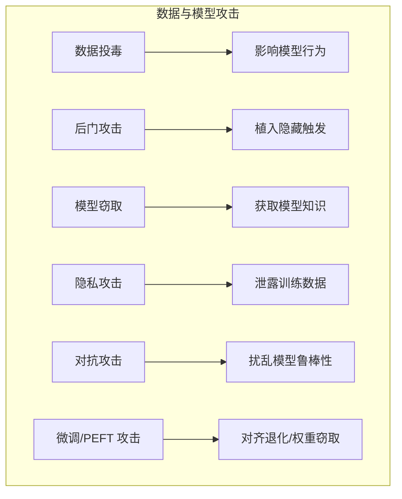

## 本章小结

本章探讨了针对训练数据和模型本身的攻击，这些攻击发生在更底层，可能产生持久和深远的影响。

### 1. 核心要点回顾

**训练数据投毒**：通过在训练数据中注入恶意样本影响模型行为。攻击可通过公开数据源或内部人员进行。投毒的影响持久且难以检测和修复。

**后门攻击**：在模型中植入隐藏的触发机制，正常使用时正常工作，遇到特定触发器时产生恶意行为。极难发现。

**模型窃取**：通过大量 API 查询收集模型行为数据，训练替代模型。防御措施包括速率限制、异常检测和模型水印。

**隐私攻击**：从模型中推断或提取训练数据中的敏感信息。需要通过数据脱敏、差分隐私等技术保护。

**离散对抗攻击与模型鲁棒性**：对抗样本经过精心设计可导致模型异常行为。GCG 代表白盒梯度搜索的对抗后缀路线，AutoDAN 则更接近语义化、遗传算法驱动的自然语言越狱；二者都说明需要在预训练与对齐中持续进行对抗性评估。

**微调与 PEFT 安全风险**：LoRA、QLoRA 等参数高效微调方法在降低成本的同时也放大了新的安全挑战：既有安全对齐可能被显著削弱，少量恶意样本也可能在微调阶段植入后门，适配器形态还可能在部分部署场景中降低功能仿制与隐私攻击的试错成本。组织需建立安全微调流水线，包括数据审计、安全微调、微调后验证和适配器级部署治理。

### 2. 攻击对比

```mermaid
graph TB
    subgraph "数据与模型攻击"
    A["数据投毒"] --> E["影响模型行为"]
    B["后门攻击"] --> F["植入隐藏触发"]
    C["模型窃取"] --> G["获取模型知识"]
    D["隐私攻击"] --> H["泄露训练数据"]
    I["对抗攻击"] --> J["扰乱模型鲁棒性"]
    K["微调/PEFT 攻击"] --> L["对齐退化/权重窃取"]
    end
```

图 6-20：攻击对比流程图

| 攻击类型 | 攻击时机 | 主要影响 | 检测难度 |
|----------|----------|----------|----------|
| 数据投毒 | 训练阶段 | 模型行为异常 | 极高 |
| 后门攻击 | 训练阶段 | 隐藏恶意能力 | 极高 |
| 模型窃取 | 部署阶段 | 知识产权损失 | 中等 |
| 隐私攻击 | 部署阶段 | 数据隐私泄露 | 中等 |
| 对抗攻击 | 部署阶段 | 安全防线失效 | 高 |
| 微调/PEFT 攻击 | 微调阶段 | 对齐退化/适配器仿制与隐私风险 | 高 |

### 3. 防御要点

| 攻击类型 | 关键防护措施 |
|----------|------------|
| 数据投毒 | 数据来源审核、异常检测、鲁棒训练 |
| 后门攻击 | 可信数据清洗、后门扫描、监控 |
| 模型窃取 | 速率限制、查询监控、推理行为水印 |
| 隐私攻击 | 数据脱敏、差分隐私、输出过滤 |
| 对抗攻击 | 对抗训练、输入困惑度检测评估 |
| 微调/PEFT 攻击 | 数据审计、安全微调流水线、微调后验证、适配器级部署治理 |

### 4. 延伸思考

1. 在大规模预训练时代，如何有效审核训练数据质量？
2. 开源模型时代，如何平衡开放与安全？
3. 对抗样本的数学本质揭示了当前大语言模型的哪些局限性？
4. 随着 PEFT 方法的普及，如何建立微调环节的安全标准和审计机制？

## 与后续章节的关联

- **训练安全基础**：第 2.2 节训练安全基础为本章数据投毒和后门防御提供理论基础
- **隐私防御技术**：第 8.5 节隐私增强技术防御数据攻击，提供差分隐私等实施方案
- **供应链防御**：第 8.6 节供应链安全防御模型窃取，保护模型知识产权

[第七章](../07_agent_rag_security/README.md)将介绍智能体与 RAG 安全。随着 LLM 被赋予工具调用能力和外部知识访问能力，新的安全风险也随之出现。将深入分析智能体系统面临的信任边界扩大和漏洞放大。

---

> 📝 **发现错误或有改进建议？** 欢迎提交 [Issue](https://github.com/yeasy/ai_security_guide/issues) 或 [PR](https://github.com/yeasy/ai_security_guide/pulls)。
