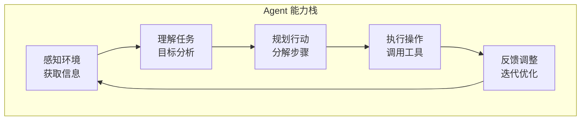
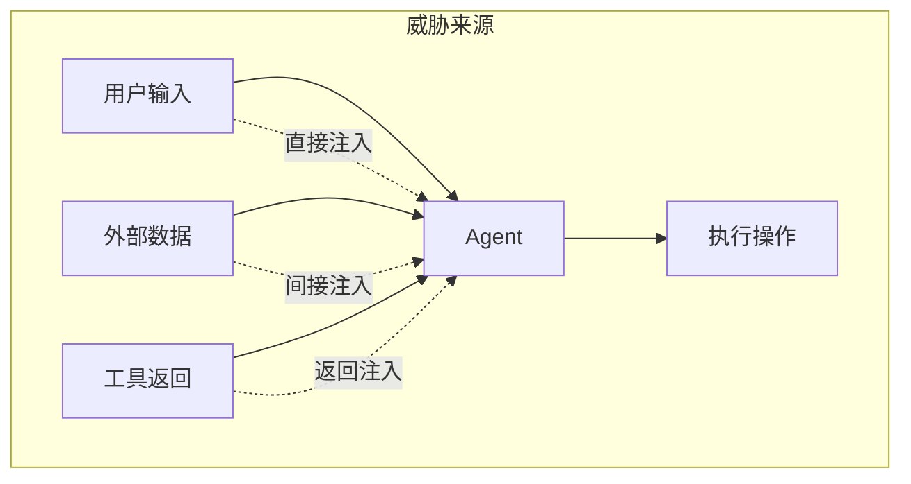
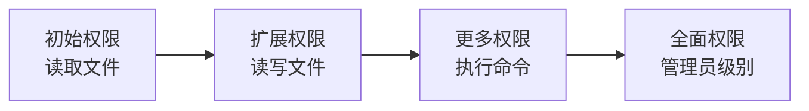
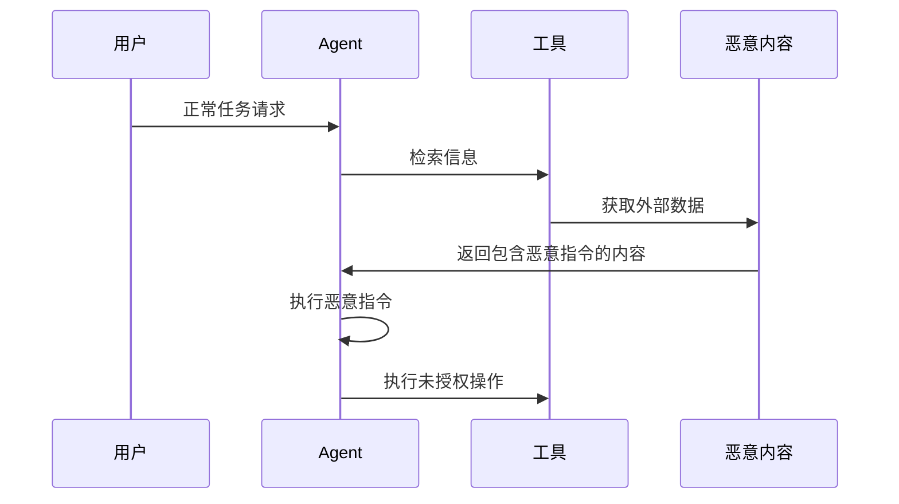
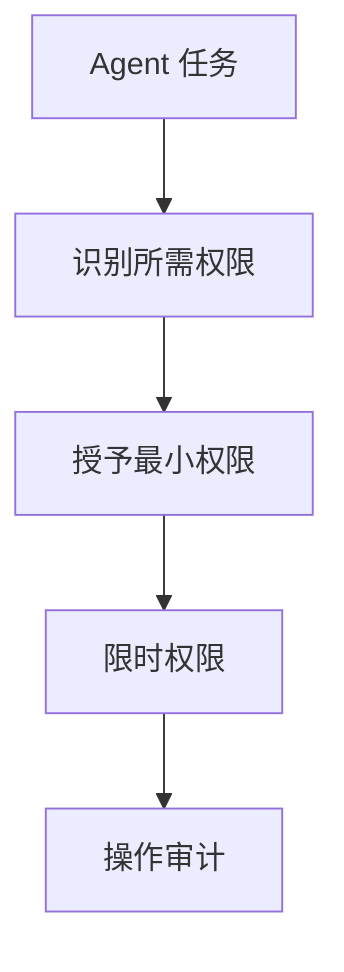
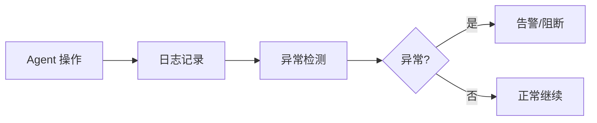

## 7.1 智能体系统安全风险

Agent 系统赋予 LLM 自主决策和执行操作的能力，这既是能力的飞跃，也带来了全新的安全挑战。

### 7.1.1 什么是 LLM Agent

LLM Agent 是指能够自主规划、执行任务并与外部环境交互的 AI 系统。

**Agent 核心能力**：



图 7-1：LLM Agent 能力栈架构图

**典型 Agent 架构**：

| 组件 | 功能 | 安全相关性 |
|------|------|------------|
| LLM 核心 | 推理和决策 | 可被提示注入 |
| 规划模块 | 任务分解 | 可被误导 |
| 记忆模块 | 状态保持 | 可被污染 |
| 工具接口 | 外部操作 | 权限风险 |

### 7.1.2 Agent 安全威胁模型

Agent 的安全威胁可以从多个维度分析：

**按攻击来源**：



图 7-2：Agent 安全威胁模型架构图

**按攻击目标**：

| 目标 | 描述 | 危害示例 |
|------|------|----------|
| 操作滥用 | 执行未授权操作 | 发送恶意邮件 |
| 数据窃取 | 获取敏感信息 | 读取私密文件 |
| 系统破坏 | 损害系统完整性 | 删除重要数据 |
| 资源消耗 | 耗尽系统资源 | 无限循环任务 |

### 7.1.3 过度自主权问题

OWASP LLM Top 10 将"过度自主权"列为重要风险，Agent 是典型场景。

**风险场景**：

```
场景 1：邮件 Agent
问题：Agent 被授权发送邮件
风险：可能被诱导发送垃圾邮件或钓鱼信息

场景 2：代码执行 Agent
问题：Agent 可以执行代码
风险：可能被注入恶意代码

场景 3：数据库 Agent
问题：Agent 有数据库写入权限
风险：可能被诱导删除或修改数据
```

**权限膨胀**：



图 7-3：过度自主权问题流程图

随着功能需求增加，Agent 权限容易逐渐膨胀。

### 7.1.4 Agent 控制流劫持

攻击者可能通过注入指令劫持 Agent 的控制流。

**劫持场景**：



图 7-4：Agent 控制流劫持时序图

**劫持后果**：

- Agent 偏离原始任务
- 执行攻击者期望的操作
- 形成攻击链

**典型案例模式：文档隐写导致的“零点击”注入**

研究演示表明，攻击者可以在文档中嵌入不可见的恶意提示，实现类似“零点击”触发：
1. **投毒**：在 Word 文档中嵌入不可见的恶意 Prompt。
2. **触发**：当具备文档读取能力的 Agent 处理该文件时，Prompt 被激活。
3. **后果**：Agent 可能泄露文档内容，并进一步执行 API 调用，将凭证/密钥类敏感信息外带。


### 7.1.5 记忆与状态污染

Agent 的记忆模块是潜在的攻击点。

**短期记忆污染**：

在对话中注入恶意上下文，影响后续决策。

**长期记忆污染**：

```
攻击流程：
1. 与 Agent 进行看似正常的交互
2. 在交互中植入恶意信息
3. 信息被存入长期记忆
4. 后续任务中恶意信息被检索并影响行为
```

### 7.1.6 Agent 安全设计原则

**最小权限原则**：



图 7-5：Agent 安全设计原则流程图

**权限控制最佳实践**：

| 原则 | 实施方式 |
|------|----------|
| 能力隔离 | 不同任务使用不同权限集 |
| 时间限制 | 权限自动过期 |
| 范围限制 | 限制操作范围 |
| 可撤销 | 支持权限快速回收 |

**人机协作模式**：

对高风险操作引入人工确认：

```
风险等级    操作示例           人工干预
低          读取公开信息       无需确认
中          发送内部邮件       可选确认
高          修改数据库         必须确认
极高        执行系统命令       多人确认
```

### 7.1.7 Agent 监控与审计

**实时监控**：



图 7-6：Agent 监控与审计流程图

**审计要点**：

- 记录所有工具调用
- 保存决策推理过程
- 监控资源使用情况
- 检测异常行为模式

Agent 安全是一个新兴但关键的领域。随着 Agent 能力的增强，安全防护也需要同步演进。
