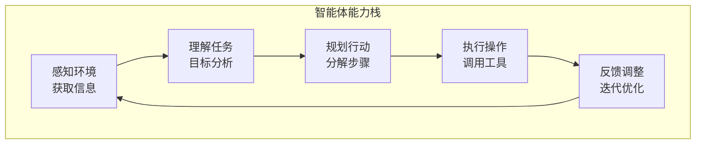
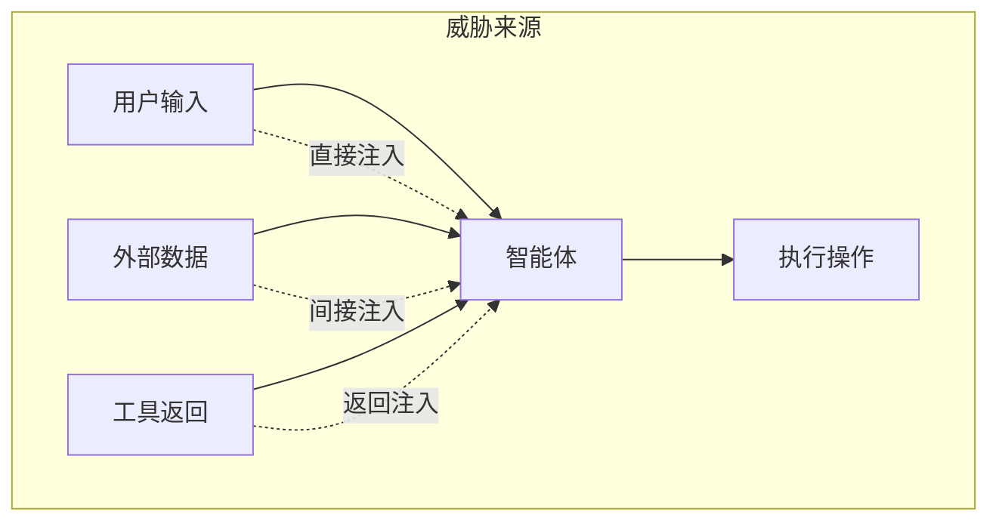
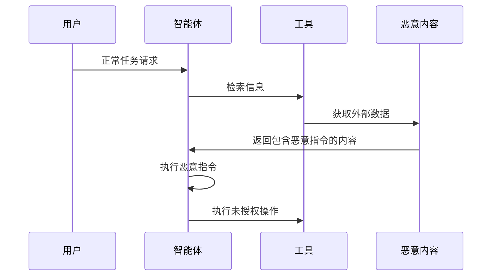
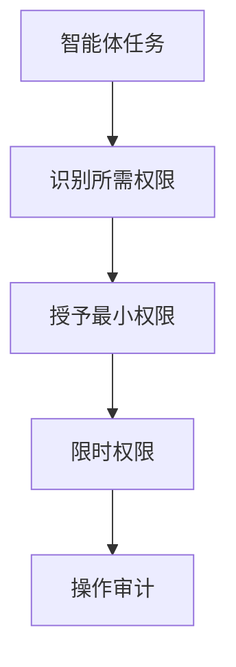
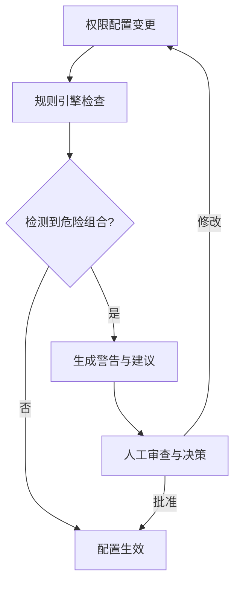
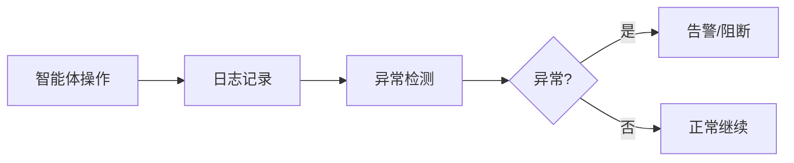

## 7.1 智能体系统安全风险

智能体系统赋予 LLM 自主决策和执行操作的能力，这既是能力的飞跃，也带来了全新的安全挑战。

### 7.1.1 什么是 LLM 智能体（Agent）

LLM 智能体（Agent）是指能够自主规划、执行任务并与外部环境交互的 AI 系统。

**智能体核心能力**

```mermaid
flowchart TB
    subgraph "智能体能力栈"
    A["感知环境<br/>获取信息"] --> B["理解任务<br/>目标分析"]
    B --> C["规划行动<br/>分解步骤"]
    C --> D["执行操作<br/>调用工具"]
    D --> E["反馈调整<br/>迭代优化"]
    E --> A
    end
```

图 7-1：LLM 智能体能力栈架构图

**典型智能体架构**
| 组件 | 功能 | 安全相关性 |
|------|------|------------|
| LLM 核心 | 推理和决策 | 可被提示注入 |
| 规划模块 | 任务分解 | 可被误导 |
| 记忆模块 | 状态保持 | 可被污染 |
| 工具接口 | 外部操作 | 权限风险 |

### 7.1.2 智能体安全威胁模型

智能体的安全威胁可以从多个维度分析：

**按攻击来源**

```mermaid
graph TB
    subgraph "威胁来源"
    A["用户输入"] --> D["智能体"]
    B["外部数据"] --> D
    C["工具返回"] --> D
    
    D --> E["执行操作"]
    end
    
    A -.-> |直接注入| D
    B -.-> |间接注入| D
    C -.-> |返回注入| D
```

图 7-2：智能体安全威胁模型架构图

**按攻击目标**
| 目标 | 描述 | 危害示例 |
|------|------|----------|
| 操作滥用 | 执行未授权操作 | 发送恶意邮件 |
| 数据窃取 | 获取敏感信息 | 读取私密文件 |
| 系统破坏 | 损害系统完整性 | 删除重要数据 |
| 资源消耗 | 耗尽系统资源 | 无限循环任务 |

### 7.1.3 过度自主权问题

OWASP LLM Top 10 将“过度自主权”列为重要风险，智能体是典型场景。

**风险场景**
```
场景 1：邮件智能体
问题：智能体被授权发送邮件
风险：可能被诱导发送垃圾邮件或钓鱼信息

场景 2：代码执行智能体
问题：智能体可以执行代码
风险：可能被注入恶意代码

场景 3：数据库智能体
问题：智能体有数据库写入权限
风险：可能被诱导删除或修改数据
```

**权限膨胀**

```mermaid
flowchart LR
    A["初始权限<br/>读取文件"] --> B["扩展权限<br/>读写文件"]
    B --> C["更多权限<br/>执行命令"]
    C --> D["全面权限<br/>管理员级别"]
```

图 7-3：过度自主权问题流程图

随着功能需求增加，智能体权限容易逐渐膨胀。

### 7.1.4 智能体控制流劫持

攻击者可能通过注入指令劫持智能体的控制流。

**劫持场景**

```mermaid
sequenceDiagram
    participant U as 用户
    participant A as 智能体
    participant T as 工具
    participant M as 恶意内容
    
    U->>A: 正常任务请求
    A->>T: 检索信息
    T->>M: 获取外部数据
    M->>A: 返回包含恶意指令的内容
    A->>A: 执行恶意指令
    A->>T: 执行未授权操作
```

图 7-4：智能体控制流劫持时序图

**劫持后果**
- 智能体偏离原始任务
- 执行攻击者期望的操作
- 形成攻击链

**典型案例模式：文档隐写导致的“零点击”注入**

研究演示表明，攻击者可以在文档中嵌入不可见的恶意提示，实现类似“零点击”触发：
1. **投毒**：在 Word 文档中嵌入不可见的恶意 Prompt。
2. **触发**：当具备文档读取能力的智能体处理该文件时，Prompt 被激活。
3. **后果**：智能体可能泄露文档内容，并进一步执行 API 调用，将凭证/密钥类敏感信息外带。

**关于”零点击”与间接注入的澄清**：此处的”间接提示注入”（Indirect Prompt Injection）或”上下文注入”指的是恶意内容通过被智能体自动处理的外部文档/数据被触发，无需用户额外交互即可激活。这与移动安全领域的”零点击利用”（Zero-Click Exploitation）概念有所不同——移动零点击利用指的是在完全不需要用户交互的情况下自动执行的系统级漏洞利用，而间接提示注入虽然对最终用户来说”无感知”，但仍然依赖于智能体对外部内容的主动处理过程。


### 7.1.5 幻觉驱动的工具调用风险

虽然工具调用的详细讨论见第 7.3 节，但智能体系统中 LLM 幻觉与工具执行的耦合风险值得单独强调。

**幻觉生成无效参数**

LLM 可能幻觉生成不存在的或格式错误的工具参数：
- 生成不存在的 API 端点、错误的函数签名
- 提供虚构的文件路径、数据库表名
- 指定不在权限范围内的操作对象

这些无效参数可能导致：
- 系统异常、崩溃或错误恢复困难
- 暴露系统架构细节或存储位置信息
- 触发安全异常而被加入黑名单

**幻觉驱动的意外操作**

更危险的是，幻觉可能驱动有“执行”结果的工具调用：
- 删除错误的文件（由于路径幻觉）
- 向错误的地址发送邮件、信息或资金转账
- 修改错误的数据库记录

即使后续被发现问题，损害已经造成。

**防御建议**
- **参数验证**：工具执行前对所有参数进行严格的格式、范围和合理性校验
- **操作前确认**：对所有可能产生不可逆后果的操作（删除、转账、发送通知），在执行前向用户明确展示目标对象并要求确认
- **幻觉检测与门控**：结合幻觉检测技术（如交叉检查、多轮验证），在工具调用门控阶段识别可疑的参数值，必要时拒绝执行或要求人工介入
- **审计与回滚**：完整记录所有工具调用及其后果，支持操作回滚或恢复

### 7.1.6 记忆与状态污染

智能体的记忆模块是潜在的攻击点。

**短期记忆污染**
在对话中注入恶意上下文，影响后续决策。

**长期记忆污染**
```
攻击流程：
1. 与智能体进行看似正常的交互
2. 在交互中植入恶意信息
3. 信息被存入长期记忆
4. 后续任务中恶意信息被检索并影响行为
```

### 7.1.7 智能体安全设计原则

**最小权限原则**

```mermaid
flowchart TB
    A["智能体任务"] --> B["识别所需权限"]
    B --> C["授予最小权限"]
    C --> D["限时权限"]
    D --> E["操作审计"]
```

图 7-6：智能体安全设计原则流程图

**权限控制最佳实践**
| 原则 | 实施方式 |
|------|----------|
| 能力隔离 | 不同任务使用不同权限集 |
| 时间限制 | 权限自动过期 |
| 范围限制 | 限制操作范围 |
| 可撤销 | 支持权限快速回收 |

**权限组合爆炸问题与解决方案**

在大规模智能体部署中，工具权限管理面临一个关键的可扩展性问题：当智能体可访问的工具数量增加时，不同权限的组合呈指数级增长。

**问题规模**
```
工具数量 N = 50+，每个工具有多个权限维度（读、写、删除等）
→ 权限矩阵大小：N × M（M 为权限维度数）
→ 权限组合数：2^(N×M) 级别

示例：
- 50 个工具 × 3 个权限级别 = 150 个权限决策点
- 不同的权限组合数超过 10^40 种
- 人工审核不仅不可行，甚至无法枚举所有组合
```

当权限数量超过 30-40 个时，人工的权限矩阵审查就变得极其困难。不同任务、用户、时间窗口的权限需求交织在一起，容易导致：
- **权限泄露**：意外授予了不必要的权限
- **权限遗漏**：漏掉了合法任务所需的权限
- **冲突配置**：某些权限组合会产生安全风险但难以发现

**解决方案**

**方案 1：基于角色的权限模板（Role-Based Access Control, RBAC）**
```
预定义常见角色的权限集：
- 管理员角色：工具 A, B, C（全部权限）
- 审核员角色：工具 A（读）, B（读）
- 编辑员角色：工具 A, B（读写）
- 查询员角色：工具 D（只读查询）

新增任务：直接关联到预定义角色，而非逐一配置权限
```

**方案 2：动态权限范围缩减（Dynamic Scope Reduction）**
```
根据当前任务上下文动态限制可用工具集：
1. 智能体接收用户任务请求："处理客户订单"
2. 系统推断该任务所需的最小工具集
3. 权限引擎临时缩减可访问工具范围
4. 任务完成后自动收回权限

优点：即使总工具数很多，实际权限矩阵也保持较小规模
```

**方案 3：最小权限执行窗口（Minimal Permission Window）**
```
权限不是长期授予，而是绑定到特定操作的执行窗口：

示例：删除文件操作
1. 用户或高级智能体发起删除请求
2. 系统临时授予"删除"权限（有效期 30 秒）
3. 智能体在该时间窗口内执行删除
4. 自动回收权限

好处：即使智能体被注入，也无法在权限过期后执行其他恶意操作
```

**方案 4：权限组合的自动化安全分析（Automated Safety Analysis）**
```
使用形式化方法或规则引擎检测危险权限组合：

示例规则：
- RULE: 不能同时拥有 [读敏感文件] + [发送邮件]
- RULE: [删除数据库] 需要 [多人审批] 权限前置
- RULE: [调用支付 API] 需要 [资金验证] 权限前置

部署：
- 在权限配置变更时自动检查这些规则
- 对新的权限请求进行实时验证
- 生成冲突警告，推荐替代方案
```

**权限组合分析工具链**

```mermaid
flowchart TB
    A["权限配置变更"] --> B["规则引擎检查"]
    B --> C{"检测到危险组合?"}
    C --> |是| D["生成警告与建议"]
    D --> E["人工审查与决策"]
    C --> |否| F["配置生效"]
    E --> |批准| F
    E --> |修改| A
```

**落地建议**

对于不同规模的智能体部署：
- **小规模（<20 工具）**：RBAC + 人工审查足以
- **中等规模（20-50 工具）**：RBAC + 动态权限缩减 + 基础规则检查
- **大规模（>50 工具）**：组合方案 2、3、4，建立自动化权限治理体系，并引入持续的红队测试验证组合的安全性

**人机协作模式**
对高风险操作引入人工确认：

```
风险等级    操作示例           人工干预
低          读取公开信息       无需确认
中          发送内部邮件       可选确认
高          修改数据库         必须确认
极高        执行系统命令       多人确认
```

### 7.1.8 多智能体协作的安全挑战

当多个智能体协同工作时，引入了传统单体智能体不存在的新型风险：

**1. 信任传递风险**
智能体 A 信任智能体 B 的输出，但 B 可能已被注入或产生幻觉。信任链中的任何一环被攻破，都可能导致整个系统失效。应为每个智能体间通信建立独立的验证机制。

**2. 权限泄露**
一个低权限智能体可能通过请求高权限智能体代为执行操作，实现权限提升。需要实施严格的权限边界，禁止跨智能体的权限继承。

**3. 信息泄露**
在多智能体共享上下文的场景中，一个智能体处理的敏感信息可能无意间泄露给不应访问该信息的其他智能体。需要实施信息分级和上下文隔离。

**4. 协调失败**
当多个智能体对同一资源产生冲突操作时（如同时修改同一文件），可能导致数据损坏或安全状态不一致。需要分布式锁或事务机制。

**防御建议**：
- 每个智能体间的通信应视为不可信输入，执行完整的输入验证
- 实施“零信任”智能体架构：每次请求都需独立验证身份和权限
- 建立智能体行为审计日志，记录所有跨智能体交互
- 为关键操作设置人类审批断点（Human-in-the-Loop Checkpoint）

### 7.1.9 新兴攻击向量：推理链破坏与多智能体冲突

随着智能体能力的演进，新型的攻击向量不断涌现：

**自反馈循环攻击（Self-Feedback Loop Poisoning）**

在多智能体协作系统中，被注入的恶意智能体可能通过反馈机制影响其他智能体：
```
场景：多智能体内容生成系统
- 智能体 A（检索）→ 获取文档
- 智能体 B（评估）→ 评估检索结果的质量
- 智能体 C（生成）→ 基于反馈生成最终内容

攻击：
1. 在知识库中注入恶意文档
2. 攻击者已污染智能体 B 的评估逻辑（或通过提示注入）
3. 恶意文档被人为评为"高质量"
4. 生成智能体以被污染的反馈为依据，输出恶意内容
5. 这个恶意输出又可能被用作其他智能体的输入，形成扩散
```

防御：
- 在多智能体间的反馈机制中加入一致性检查（不同评估器的评价是否相符）
- 引入“审查智能体”对异常反馈进行审计
- 限制反馈信息的传播范围，避免全局污染

**推理链破坏（Chain-of-Thought Disruption）**

LLM 的推理过程往往依赖于中间步骤（如思维链 CoT），攻击者可以精心设计输入来破坏这一过程：
```
正常推理：
Q: 某数学题
→ 思维链：Step 1: ... Step 2: ... Step 3: ...
→ 答案：正确

破坏攻击：
精心构造的输入中隐含了错误的中间步骤或虚假假设
→ 模型被引导到错误的推理路径
→ 最终答案虽然在逻辑上"遵循"了思维链，但整个推理基础已被污染
```

防御：
- **推理过程审计**：对中间步骤的逻辑一致性和事实性进行验证
- **多路径验证**：让模型生成多条独立的推理路径，对比结果的一致性
- **外部知识检查**：对推理过程中涉及的事实、公式等进行外部验证

**多智能体冲突注入（Multi-Agent Conflict Injection）**

在多智能体协作系统中，攻击者利用不同智能体间的信任关系或接口差异进行攻击：
```
场景：工作流审批系统（需要多个智能体协调）
- 智能体 A（请求方）：代表用户提交操作请求
- 智能体 B（审核方）：验证请求的合法性
- 智能体 C（执行方）：执行被批准的操作

攻击：
1. 攻击者控制智能体 A 发送一个看似合理但最终目的恶意的请求
2. 由于设计缺陷，智能体 B 的审核逻辑可能被绕过（如通过提示注入）
3. 智能体 C 基于伪造的"批准信息"执行恶意操作
4. 系统的完整性被破坏
```

防御：
- **强身份验证**：在智能体间的通信中加入加密签名和真实身份验证，避免伪造
- **权限分离**：审核权和执行权必须分离，任何单个被攻击的智能体都无法完成完整攻击
- **审计链**：记录所有智能体间的交互历史，支持事后追踪和重放
- **一致性协议**：多个独立的智能体需要达成共识才能执行高风险操作

### 7.1.10 智能体监控与审计

**实时监控**

```mermaid
flowchart LR
    A["智能体操作"] --> B["日志记录"]
    B --> C["异常检测"]
    C --> D{"异常?"}
    D --> |是| E["告警/阻断"]
    D --> |否| F["正常继续"]
```

图 7-8：智能体监控与审计流程图

**审计要点**
- 记录所有工具调用
- 保存决策推理过程
- 监控资源使用情况
- 检测异常行为模式

智能体安全是一个新兴但关键的领域。随着智能体能力的增强，安全防护也需要同步演进。
