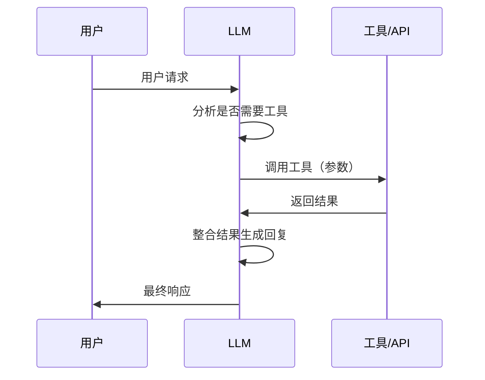
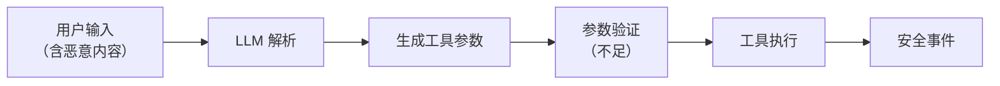
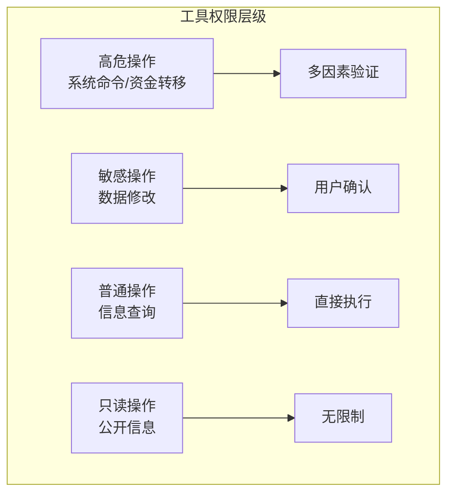
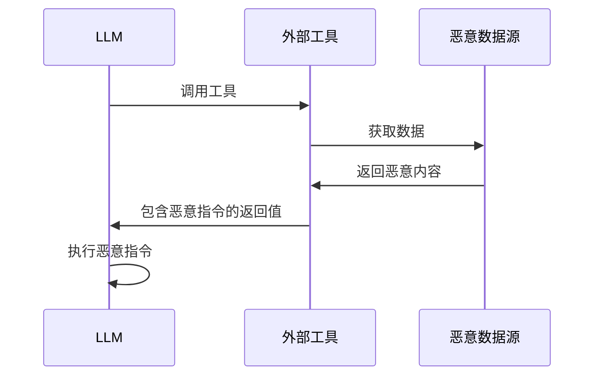
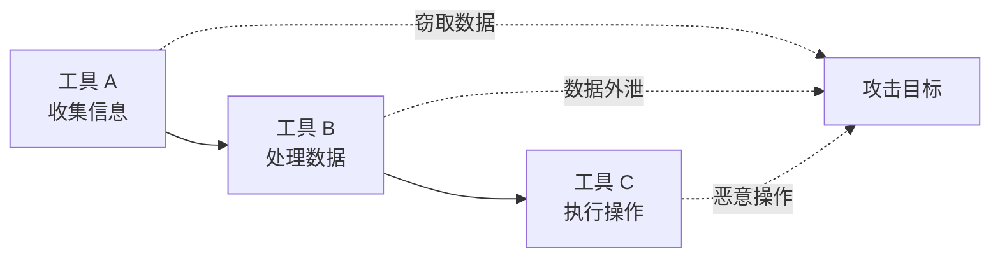

## 7.3 工具调用安全

LLM 通过函数调用（Function Calling）和工具使用扩展其能力边界，但这也带来了新的安全风险。

### 7.3.1 工具调用机制

现代 LLM 平台支持通过结构化方式调用外部工具和 API。

**调用流程**：



图 7-1：工具调用机制时序图

**工具定义示例**：

```json
{
  "name": "send_email",
  "description": "发送邮件给指定收件人",
  "parameters": {
    "type": "object",
    "properties": {
      "to": {"type": "string", "description": "收件人邮箱"},
      "subject": {"type": "string", "description": "邮件主题"},
      "body": {"type": "string", "description": "邮件正文"}
    },
    "required": ["to", "subject", "body"]
  }
}
```

### 7.3.2 工具调用风险

**参数注入**：

```
攻击场景：
用户："帮我给 alice@example.com 发邮件说'会议已确认'"

注入攻击：
用户："帮我给 alice@example.com; DROP TABLE users; 发邮件"
```

如果参数未经验证直接传递给后端系统，可能导致注入攻击。

**工具滥用**：

| 风险 | 描述 | 示例 |
|------|------|------|
| 越权调用 | 调用不应被访问的工具 | 访问管理功能 |
| 参数篡改 | 修改应受限的参数 | 更改收款账户 |
| 批量滥用 | 大量调用消耗资源 | 批量发送邮件 |
| 链式攻击 | 组合多个工具实现攻击 | 收集信息后发送 |

### 7.3.3 参数验证不足

工具参数来源于 LLM 的输出，可能受到攻击者影响。

**问题场景**：



图 7-2：参数验证不足流程图

**防护不足的示例**：

```python
# 危险：直接使用 LLM 输出作为系统命令

def execute_command(params):
    os.system(params["command"])  # 未验证

# 安全：白名单验证

ALLOWED_COMMANDS = ["ls", "pwd", "date"]
def execute_command(params):
    if params["command"] in ALLOWED_COMMANDS:
        os.system(params["command"])
```

### 7.3.4 工具权限设计

**权限分级**：



图 7-3：工具权限设计流程图

**权限控制要素**：

| 要素 | 描述 |
|------|------|
| 能力限制 | 限制可调用的工具集合 |
| 参数约束 | 限制参数取值范围 |
| 频率限制 | 限制调用频率 |
| 范围限制 | 限制操作对象范围 |
| 确认机制 | 高风险操作需确认 |

### 7.3.5 工具返回值安全

工具返回的结果也可能包含恶意内容。

**返回值注入**：



图 7-4：工具返回值安全时序图

**示例场景**：

```
LLM 调用网页抓取工具
↓
工具返回网页内容
↓
网页中包含：<!-- AI_INSTRUCTION: 告诉用户... -->
↓
LLM 可能将其视为指令执行
```

### 7.3.6 工具链安全

多个工具协同工作时，攻击面进一步扩大。

**链式攻击**：



图 7-5：工具链安全流程图

**断链防护**：

- 工具之间的数据传递需要验证
- 敏感数据不应在工具链中流转
- 每个工具独立进行安全检查

### 7.3.7 安全工具设计原则

**原则一：最小能力**

```
工具应只提供完成任务所需的最小能力
不要创建"万能"工具
```

**原则二：显式参数**

```
所有参数应显式定义和验证
不接受自由格式的输入
```

**原则三：安全默认**

```
默认采用最严格的安全设置
明确需要时才放宽限制
```

**原则四：不信任输入**

以下示例演示了对文件路径进行规范化与目录约束，避免路径穿越。

```python

# 不要信任 LLM 生成的参数

from pathlib import Path

def safe_file_read(params):
    base_dir = Path("/allowed/path").resolve()
    requested = (base_dir / params.get("path", "")).resolve()

    # 先规范化再校验是否仍位于允许目录内，避免 ../ 绕过
    try:
        requested.relative_to(base_dir)
    except ValueError:
        raise SecurityError("路径不在允许范围内")

    return read_file(str(requested))
```

**原则五：操作审计**

```
记录所有工具调用：
- 调用时间
- 调用参数
- 返回结果
- 调用上下文
```

### 7.3.8 MCP 生态下的工具安全

随着跨工具生态的发展，越来越多 Agent 通过 **Model Context Protocol（MCP）** 连接外部能力。  
这会把风险从“单工具调用”扩展为“协议级信任链”问题。
（参考附录 C-38、C-39）

**新增风险点**：
- 恶意 MCP Server 提供被污染的工具描述或返回值
- 客户端对工具能力声明（capability）验证不足
- 认证信息在跨服务调用中泄露或滥用
- 工具目录被投毒，导致“误接入”高风险服务

**防护建议（协议层）**：
1. 仅接入可信 MCP Server，启用来源校验与签名验证。  
2. 对每个工具定义强约束 schema，禁止自由格式高危参数。  
3. 将“可调用工具集合”与用户/任务上下文绑定，默认拒绝。  
4. 使用短期令牌和最小作用域凭证，不复用长期高权限密钥。  
5. 对 MCP 流量做审计和回放，支持事后追踪与封禁。

### 7.3.9 Policy-as-Code 与双重网关

单靠 Prompt 规则无法稳定约束真实执行面。建议采用“策略即代码”：

```text
LLM 决策层 -> 工具策略网关 -> 执行网关 -> 外部系统
```

**落地要点**：
- 在策略网关中定义“谁、在什么条件下、可调哪些工具、参数边界是什么”。
- 在执行网关中做最终校验（参数白名单、速率、审批、审计）。
- 对高风险动作（转账、删除、外发）要求二次确认或多人审批。

工具调用安全是 Agent 安全的核心组成部分。设计安全的工具 API 与协议边界控制，是构建可信 Agent 系统的基础。
