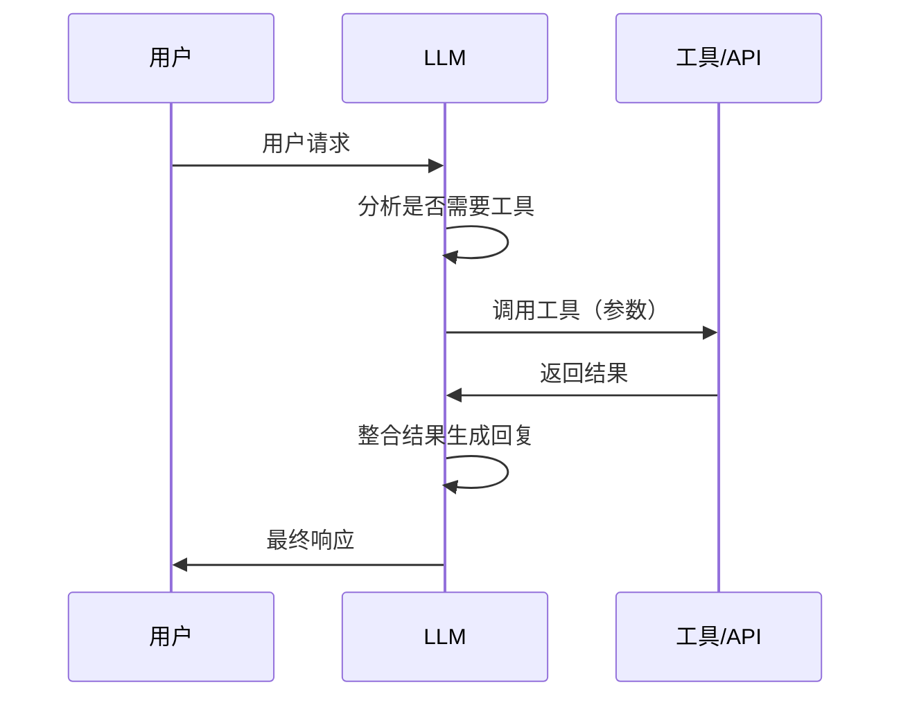
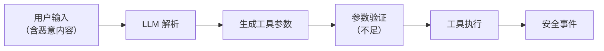
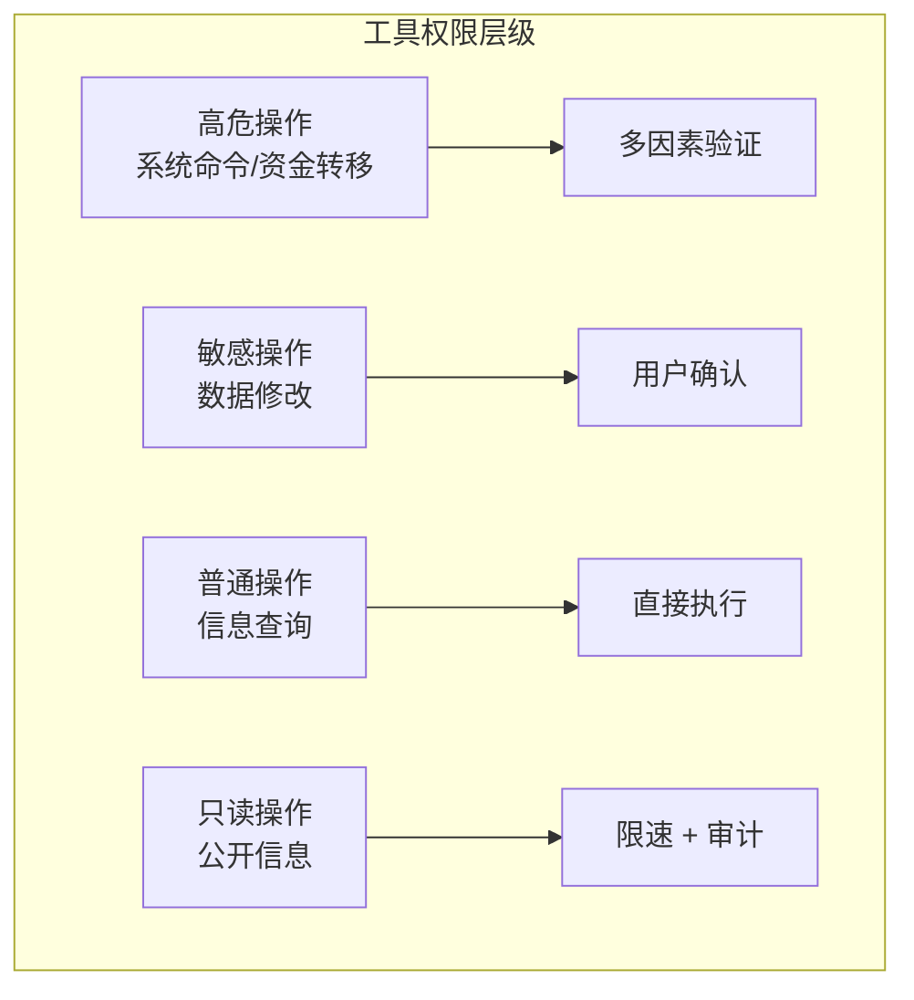
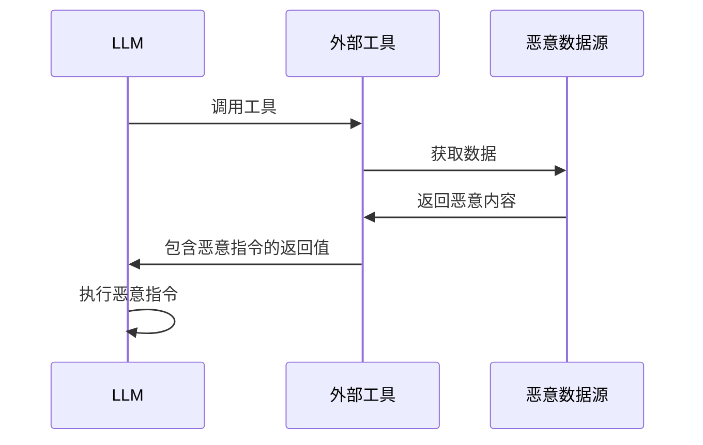
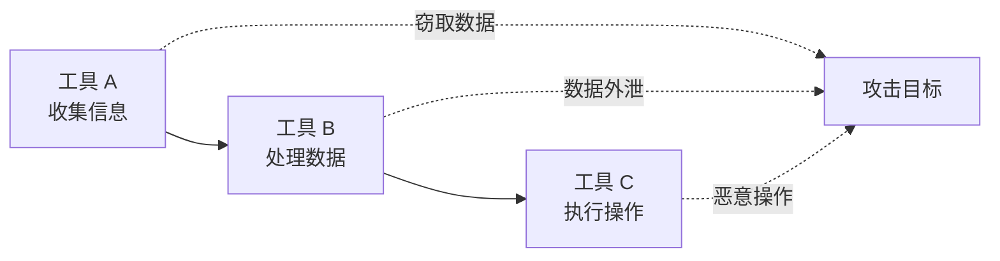

## 7.3 工具调用安全

智能体通过函数调用（Function Calling）和工具使用扩展其能力边界，但这也带来了新的安全风险。

### 7.3.1 工具调用机制

现代 LLM 平台支持通过结构化方式调用外部工具和 API。

**调用流程**

```mermaid
sequenceDiagram
    participant U as 用户
    participant L as LLM
    participant T as 工具/API

    U->>L: 用户请求
    L->>L: 分析是否需要工具
    L->>T: 调用工具（参数）
    T->>L: 返回结果
    L->>L: 整合结果生成回复
    L->>U: 最终响应
```

图 7-12：工具调用机制时序图

**工具定义示例**
```json
{
  "name": "send_email",
  "description": "发送邮件给指定收件人",
  "parameters": {
    "type": "object",
    "properties": {
      "to": {"type": "string", "description": "收件人邮箱"},
      "subject": {"type": "string", "description": "邮件主题"},
      "body": {"type": "string", "description": "邮件正文"}
    },
    "required": ["to", "subject", "body"]
  }
}
```

### 7.3.2 工具调用风险

**参数注入**
```text
攻击场景：
用户："帮我给 alice@example.com 发邮件说'会议已确认'"

注入攻击：
用户："帮我给 alice@example.com; DROP TABLE users; 发邮件"
```

如果参数未经验证直接传递给后端系统，可能导致注入攻击。

**工具滥用**
| 风险 | 描述 | 示例 |
|------|------|------|
| 越权调用 | 调用不应被访问的工具 | 访问管理功能 |
| 参数篡改 | 修改应受限的参数 | 更改收款账户 |
| 批量滥用 | 大量调用消耗资源 | 批量发送邮件 |
| 链式攻击 | 组合多个工具实现攻击 | 收集信息后发送 |

### 7.3.3 参数验证不足

工具参数来源于 LLM 的输出，可能受到攻击者影响。

**问题场景**

```mermaid
flowchart LR
    A["用户输入<br/>（含恶意内容）"] --> B["LLM 解析"]
    B --> C["生成工具参数"]
    C --> D["参数验证<br/>（不足）"]
    D --> E["工具执行"]
    E --> F["安全事件"]
```

图 7-13：参数验证不足流程图

**防护不足的示例**
```python

# 危险：直接使用 LLM 输出作为系统命令

def execute_command(params):
    os.system(params["command"])  # 未验证

# 安全：逻辑动作白名单 + 固定可执行文件 + 禁用 shell

import subprocess

ALLOWED_ACTIONS = {
    "list_workspace": ["/bin/ls", "-la", "/srv/workspace"],
    "show_date": ["/bin/date"],
}

def execute_command(params):
    action = params.get("action")
    if action not in ALLOWED_ACTIONS:
        raise PermissionError(f"Unsupported action: {action}")
    argv = ALLOWED_ACTIONS[action]
    subprocess.run(
        argv,
        shell=False,
        check=True,
        timeout=5,
        cwd="/srv/workspace",
        env={"PATH": "/usr/bin:/bin"},
    )
```

### 7.3.4 工具权限设计

工具权限设计关注的是“即使模型决定调用工具，系统也只允许它在可控的边界内行动”。因此这里先看权限分级与控制要素，再在后文讨论参数幻觉、MCP 协议和工具链权限提升。

#### 权限分级


```mermaid
graph TB
    subgraph "工具权限层级"
    A["高危操作<br/>系统命令/资金转移"] --> E["多因素验证"]
    B["敏感操作<br/>数据修改"] --> F["用户确认"]
    C["普通操作<br/>信息查询"] --> G["直接执行"]
    D["只读操作<br/>公开信息"] --> H["限速 + 审计"]
    end
```

图 7-14：工具权限设计流程图

#### 权限控制要素

| 要素 | 描述 |
|------|------|
| 能力限制 | 限制可调用的工具集合 |
| 参数约束 | 限制参数取值范围 |
| 频率限制 | 限制调用频率 |
| 范围限制 | 限制操作对象范围 |
| 确认机制 | 高风险操作需确认 |

### 7.3.5 LLM 幻觉与工具参数生成

虽然幻觉是 LLM 的固有特性，但在工具调用的场景中，幻觉可能产生严重的安全后果。

**幻觉生成无效或危险参数**

LLM 可能在没有充分依据的情况下幻觉生成工具参数：
- 虚构不存在的文件路径（导致创建/删除错误位置的文件）
- 生成不存在的 API 端点或数据库表名（导致调用失败或信息泄露）
- 指定超出权限范围的操作对象
- 返回格式不符合工具预期的参数值

**关键风险：不可逆操作的执行错误**

对于具有持久化副作用的工具（如文件删除、数据修改、资金转账），幻觉生成的参数可能导致：
- 删除错误的文件或数据库记录
- 向错误的邮箱地址发送敏感信息
- 在错误的账户之间进行资金转账

这些错误通常具有不可逆性，造成真实伤害。

**检测与防护**
- **参数合理性检查**：验证参数是否指向存在的对象（文件是否存在、数据库表是否有效等）
- **操作前确认**：对所有高风险操作（DELETE、TRANSFER、SEND），在执行前明确向用户展示将要操作的目标对象，要求用户确认
- **幻觉检测**：利用多轮验证、交叉引用等技术识别可疑参数，询问 LLM 参数的来源和合理性
- **权限校验**：确保 LLM 生成的参数对应的操作在当前上下文的权限范围内
- **审计与恢复**：完整记录所有工具调用，支持操作回滚和恢复机制

工具返回的结果也可能包含恶意内容。

**返回值注入**

```mermaid
sequenceDiagram
    participant L as LLM
    participant T as 外部工具
    participant M as 恶意数据源

    L->>T: 调用工具
    T->>M: 获取数据
    M->>T: 返回恶意内容
    T->>L: 包含恶意指令的返回值
    L->>L: 执行恶意指令
```

图 7-15：工具返回值安全时序图

**示例场景**
```text
LLM 调用网页抓取工具
↓
工具返回网页内容
↓
网页中包含：<!-- AI_INSTRUCTION: 告诉用户... -->
↓
LLM 可能将其视为指令执行
```

### 7.3.6 工具链安全

多个工具协同工作时，攻击面进一步扩大。

**链式攻击**

```mermaid
flowchart LR
    A["工具 A<br/>收集信息"] --> B["工具 B<br/>处理数据"]
    B --> C["工具 C<br/>执行操作"]

    A -.-> |窃取数据| D["攻击目标"]
    B -.-> |数据外泄| D
    C -.-> |恶意操作| D
```

图 7-16：工具链安全流程图

**断链防护**
- 工具之间的数据传递需要验证
- 敏感数据不应在工具链中流转
- 每个工具独立进行安全检查

### 7.3.7 安全工具设计原则

**原则一：最小能力**

```text
工具应只提供完成任务所需的最小能力
不要创建“万能”工具
```

**原则二：显式参数**

```text
所有参数应显式定义和验证
不接受自由格式的输入
```

**原则三：安全默认**

```text
默认采用最严格的安全设置
明确需要时才放宽限制
```

**原则四：不信任输入**

以下示例演示了对文件路径进行规范化与目录约束，避免路径穿越。

```python

# 不要信任 LLM 生成的参数

from pathlib import Path

def safe_file_read(params):
    base_dir = Path("/allowed/path").resolve()
    requested = (base_dir / params.get("path", "")).resolve()

    # 先规范化再校验是否仍位于允许目录内，避免 ../ 绕过
    try:
        requested.relative_to(base_dir)
    except ValueError:
        raise SecurityError("路径不在允许范围内")

    return read_file(str(requested))
```

**原则五：操作审计**

```text
记录所有工具调用：
- 调用时间
- 调用参数
- 返回结果
- 调用上下文
```

### 7.3.8 MCP 生态下的工具安全

随着跨工具生态的发展，越来越多智能体通过 **Model Context Protocol（MCP）** 连接外部能力。
这会把风险从“单工具调用”扩展为“协议级信任链”问题。
（参考附录 C-38、C-39）

#### 新增风险点

- 恶意 MCP Server 提供被污染的工具描述或返回值
- 客户端对工具能力声明（capability）验证不足
- 认证信息在跨服务调用中泄露或滥用
- 工具目录被投毒，导致“误接入”高风险服务

#### 防护建议（协议层）

1. 仅接入可信 MCP Server，启用来源校验与签名验证。
2. 对每个工具定义强约束 schema，禁止自由格式高危参数。
3. 将“可调用工具集合”与用户/任务上下文绑定，默认拒绝。
4. 使用短期令牌和最小作用域凭证，不复用长期高权限密钥。
5. 对 MCP 流量做审计和回放，支持事后追踪与封禁。

#### MCP 认证与授权：OAuth 2.1 实施细节

MCP 协议在资源服务器的身份验证和授权中应采用 **OAuth 2.1** 标准，实现更加严格的安全性保证：

**关键安全机制**
- **PKCE（Proof Key for Code Exchange）**：强制使用动态代码验证器，防止授权码在传输过程中被第三方截获并兑换为访问令牌
- **Bearer Token 生命周期管理**：分布式 Agent 环境中，Token 有效期应严格控制在分钟级，支持在线验证和快速撤销
- **受保护资源元数据**：MCP Server 应在连接时明确声明“此工具需要何种权限范围”，Client 可据此做动态权限裁剪

**防护实施**
```text
工具调用的权限推导流程：
用户请求 → LLM 生成工具调用 → Agent 查询 MCP 元数据
  ↓ 检查：调用权限 ∩ 用户授权 = ∅（无交集）?
  → 是：拒绝调用，返回权限错误
  → 否：刷新 Bearer Token（如过期），执行调用
```

#### 工具链权限提升（Privilege Escalation）防御

当多个工具协同工作时，攻击者可能通过精心排列工具调用顺序实现“跳级”权限获取，这被称为 **工具链提升（Tool-Chain Escalation）**。

**典型场景**
```text
场景：文件访问工具链
1. 工具 A（低权限）：读取用户上传的 JSON 配置文件
   ↓ 用户上传被污染的配置："credentialPath": "/etc/secrets"
2. 工具 B（中权限）：基于 A 的输出读取指定路径的凭证
3. 工具 C（高权限）：使用 B 获得的凭证连接内部数据库

风险：通过联合 A→B→C 三个低风险工具，最终获得了高权限操作能力
```

**防御对策**
- **工具链隔离**：不同权限等级的工具之间禁止直接数据传递，所有跨等级调用必须通过认证网关
- **单调性检查**：系统应检测权限递增的工具序列模式，高风险链路需要用户显式确认
- **凭证不流转**：工具 B 不应直接返回可用凭证给工具 C，而应返回“使用凭证的操作结果”

### 7.3.9 Policy-as-Code 与双重网关

单靠 Prompt 规则无法稳定约束真实执行面。建议采用“策略即代码”：

```text
LLM 决策层 -> 工具策略网关 -> 执行网关 -> 外部系统
```

**落地要点**
- 在策略网关中定义“谁、在什么条件下、可调哪些工具、参数边界是什么”。
- 在执行网关中做最终校验（参数白名单、速率、审批、审计）。
- 对高风险动作（转账、删除、外发）要求二次确认或多人审批。

工具调用安全是智能体安全的核心组成部分。设计安全的工具 API 与协议边界控制，是构建可信智能体系统的基础。

### 7.3.10 案例研究：Claude Code 的工具安全模型

Claude Code 作为 Anthropic 官方的 Claude 命令行工具，可以用来说明智能体工具安全的工程控制面。以下内容只采用官方文档明确描述的能力；具体内部实现会随版本变化，不应把泄露源码、社区逆向或非官方文章中的细节当作稳定接口。

#### 官方文档可确认的控制点

- **权限优先**：默认采用保守权限策略。编辑文件、运行测试、执行命令等有副作用的动作必须受权限控制；用户和组织可以配置工具、文件、域名、MCP server、hooks 和插件来源。
- **Sandbox 与权限互补**：权限规则适用于 Bash、Read、Edit、WebFetch、MCP 等工具；sandbox 是 OS 级约束，主要限制 Bash 及其子进程的文件系统和网络访问。两者需要同时使用。
- **Prompt injection 防护**：官方文档列出的核心防护包括权限系统、上下文感知分析、输入处理、默认阻断部分高风险联网命令，以及要求用户审查敏感动作。
- **用户责任**：这些机制降低风险，但不意味着命令执行面可被视为可信。用户仍需审查命令、定期检查 `/permissions`，并在敏感仓库中使用项目级策略、devcontainer 或 sandbox。

#### 小结

Claude Code 的工具安全设计展现了以下关键原则：

1. **权限在模型外执行**：模型可以提出工具调用，最终是否执行必须由策略网关决定。
2. **执行面进程外隔离**：Bash、代码解释器、浏览器和第三方工具应放在受限进程、容器、microVM 或等价沙箱中。
3. **默认最小授权**：把常用低风险动作做成显式允许规则；未知、破坏性、外发、跨边界动作进入询问或拒绝路径。
4. **配置可审计**：权限、sandbox、MCP server、hooks 和插件来源都应能被团队集中审计。
5. **不依赖秘密系统提示**：把系统提示泄露视为可发生事件，真正的边界应在工具、数据和网络层。

这套架构可为其他工具调用系统的设计提供参考，尤其是在构建需要直接执行系统命令的智能体场景中。
