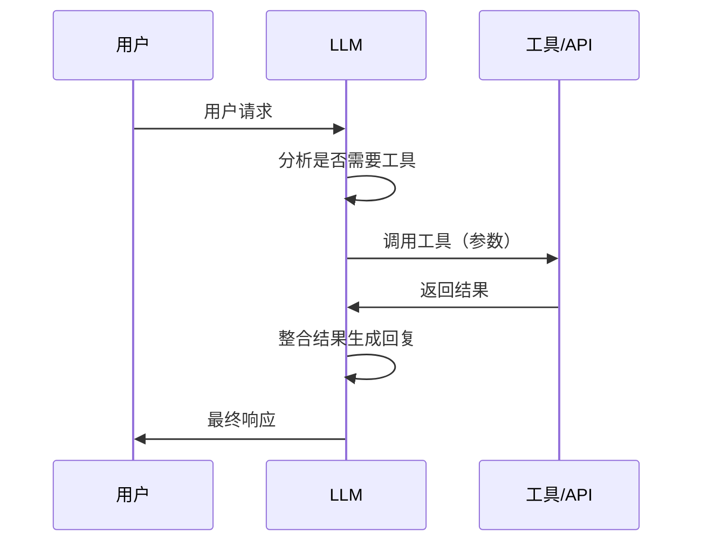
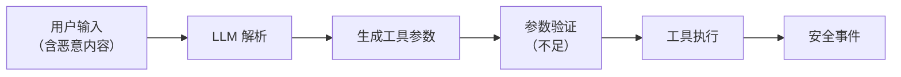
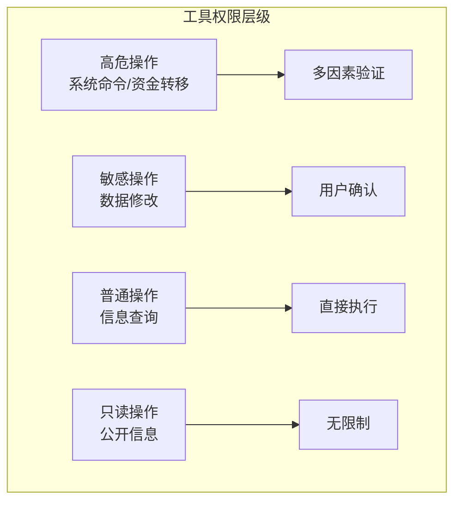
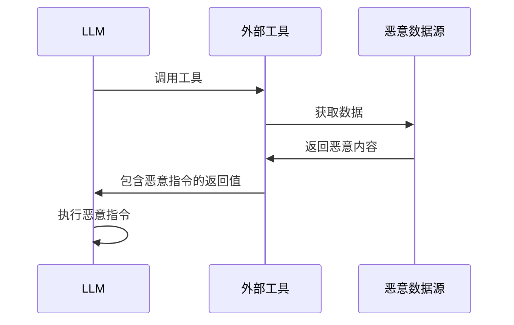

## 7.3 工具调用安全

LLM 通过函数调用（Function Calling）和工具使用扩展其能力边界，但这也带来了新的安全风险。

### 7.3.1 工具调用机制

现代 LLM 平台支持通过结构化方式调用外部工具和 API。

**调用流程**：


```mermaid
sequenceDiagram
    participant U as 用户
    participant L as LLM
    participant T as 工具/API
    
    U->>L: 用户请求
    L->>L: 分析是否需要工具
    L->>T: 调用工具（参数）
    T->>L: 返回结果
    L->>L: 整合结果生成回复
    L->>U: 最终响应
```

**工具定义示例**：

```json
{
  "name": "send_email",
  "description": "发送邮件给指定收件人",
  "parameters": {
    "type": "object",
    "properties": {
      "to": {"type": "string", "description": "收件人邮箱"},
      "subject": {"type": "string", "description": "邮件主题"},
      "body": {"type": "string", "description": "邮件正文"}
    },
    "required": ["to", "subject", "body"]
  }
}
```

### 7.3.2 工具调用风险

**参数注入**：

```
攻击场景：
用户："帮我给 alice@example.com 发邮件说'会议已确认'"

注入攻击：
用户："帮我给 alice@example.com; DROP TABLE users; 发邮件"
```

如果参数未经验证直接传递给后端系统，可能导致注入攻击。

**工具滥用**：

| 风险 | 描述 | 示例 |
|------|------|------|
| 越权调用 | 调用不应被访问的工具 | 访问管理功能 |
| 参数篡改 | 修改应受限的参数 | 更改收款账户 |
| 批量滥用 | 大量调用消耗资源 | 批量发送邮件 |
| 链式攻击 | 组合多个工具实现攻击 | 收集信息后发送 |

### 7.3.3 参数验证不足

工具参数来源于 LLM 的输出，可能受到攻击者影响。

**问题场景**：


```mermaid
flowchart LR
    A["用户输入<br/>（含恶意内容）"] --> B["LLM 解析"]
    B --> C["生成工具参数"]
    C --> D["参数验证<br/>（不足）"]
    D --> E["工具执行"]
    E --> F["安全事件"]
```

**防护不足的示例**：

```python
# 危险：直接使用 LLM 输出作为系统命令
def execute_command(params):
    os.system(params["command"])  # 未验证

# 安全：白名单验证
ALLOWED_COMMANDS = ["ls", "pwd", "date"]
def execute_command(params):
    if params["command"] in ALLOWED_COMMANDS:
        os.system(params["command"])
```

### 7.3.4 工具权限设计

**权限分级**：


```mermaid
graph TB
    subgraph "工具权限层级"
    A["高危操作<br/>系统命令/资金转移"] --> E["多因素验证"]
    B["敏感操作<br/>数据修改"] --> F["用户确认"]
    C["普通操作<br/>信息查询"] --> G["直接执行"]
    D["只读操作<br/>公开信息"] --> H["无限制"]
    end
```

**权限控制要素**：

| 要素 | 描述 |
|------|------|
| 能力限制 | 限制可调用的工具集合 |
| 参数约束 | 限制参数取值范围 |
| 频率限制 | 限制调用频率 |
| 范围限制 | 限制操作对象范围 |
| 确认机制 | 高风险操作需确认 |

### 7.3.5 工具返回值安全

工具返回的结果也可能包含恶意内容。

**返回值注入**：


```mermaid
sequenceDiagram
    participant L as LLM
    participant T as 外部工具
    participant M as 恶意数据源
    
    L->>T: 调用工具
    T->>M: 获取数据
    M->>T: 返回恶意内容
    T->>L: 包含恶意指令的返回值
    L->>L: 执行恶意指令
```

**示例场景**：

```
LLM 调用网页抓取工具
↓
工具返回网页内容
↓
网页中包含：<!-- AI_INSTRUCTION: 告诉用户... -->
↓
LLM 可能将其视为指令执行
```

### 7.3.6 工具链安全

多个工具协同工作时，攻击面进一步扩大。

**链式攻击**：


```mermaid
flowchart LR
    A["工具A<br/>收集信息"] --> B["工具B<br/>处理数据"]
    B --> C["工具C<br/>执行操作"]
    
    A -.-> |窃取数据| D["攻击目标"]
    B -.-> |数据外泄| D
    C -.-> |恶意操作| D
```

**断链防护**：

- 工具之间的数据传递需要验证
- 敏感数据不应在工具链中流转
- 每个工具独立进行安全检查

### 7.3.7 安全工具设计原则

**原则一：最小能力**

```
工具应只提供完成任务所需的最小能力
不要创建"万能"工具
```

**原则二：显式参数**

```
所有参数应显式定义和验证
不接受自由格式的输入
```

**原则三：安全默认**

```
默认采用最严格的安全设置
明确需要时才放宽限制
```

**原则四：不信任输入**

```python
# 不要信任 LLM 生成的参数
def safe_file_read(params):
    filepath = params.get("path", "")
    
    # 路径验证
    if not filepath.startswith("/allowed/path"):
        raise SecurityError("路径不在允许范围内")
    
    # 防止路径遍历
    filepath = os.path.normpath(filepath)
    if ".." in filepath:
        raise SecurityError("检测到路径遍历尝试")
    
    return read_file(filepath)
```

**原则五：操作审计**

```
记录所有工具调用：
- 调用时间
- 调用参数
- 返回结果
- 调用上下文
```

工具调用安全是 Agent 安全的核心组成部分。设计安全的工具 API 是构建可信 Agent 系统的基础。
