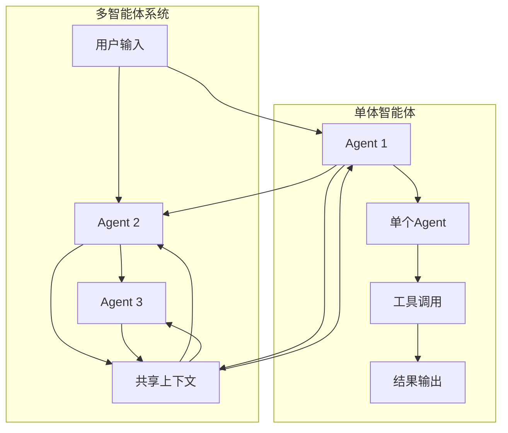

## 7.5 多智能体协作系统的安全架构

当多个 LLM 智能体在同一系统中协作时，安全复杂性以指数级增长。传统的单体智能体防御措施不足以应对多智能体环境中的新型威胁。本节深入分析多智能体系统的安全挑战，并提出系统化的防御架构。

### 7.5.1 多智能体系统的新型攻击面

**攻击面的扩展**



图 7-19：单体 vs 多智能体攻击面对比

**新增的攻击向量**

| 攻击向量 | 描述 | 风险等级 |
|----------|------|----------|
| 智能体间注入 | 一个Agent的输出被用作另一Agent的输入 | 高 |
| 信任链破坏 | 恶意Agent伪装为合法Agent | 极高 |
| 权限提升链 | 低权限Agent诱导高权限Agent执行操作 | 高 |
| 共享状态污染 | 通过污染共享上下文影响多个Agent | 中 |
| 协调失败 | 多Agent的并发操作导致不一致 | 中 |

### 7.5.2 多智能体系统的威胁建模

**威胁场景一：Agent链式注入**

```
场景：文档处理工作流

步骤1：用户提交文档 → Agent-Retriever（检索Agent）
        ↓
步骤2：检索Agent从知识库提取内容 → Agent-Analyzer（分析Agent）
        ↓
步骤3：分析Agent生成分析结果 → Agent-Reporter（生成报告Agent）
        ↓
步骤4：生成报告Agent输出最终报告

攻击路径：
在知识库中植入恶意文档
→ Retriever提取恶意内容
→ Analyzer处理恶意内容并生成"分析"
→ Reporter基于恶意分析生成报告
→ 用户获得被污染的报告

关键风险：
每个环节的Agent都信任前一个Agent的输出
恶意内容沿着处理链传播
```

**威胁场景二：恶意Agent的行为冒充**

```
场景：智能体生态中的恶意参与者

系统中的合法Agent：
- Agent-Approver（审批Agent，高权限）
- Agent-Executor（执行Agent）
- Agent-Logger（日志Agent）

攻击：
攻击者控制一个看似无害的Agent-Helper
→ Helper伪造消息说"Approver已批准操作X"
→ Executor信任这个消息
→ 执行未经批准的操作

根本原因：
Agent间缺乏强身份验证
信息完整性缺乏保障
```

**威胁场景三：权限提升链**

```
场景：审批工作流

权限模型：
- Agent-Requester（用户请求，低权限）
- Agent-Supervisor（部门主管审批，中权限）
- Agent-Director（总监最终审批，高权限）

攻击：
1. 攻击者控制Requester
2. 提交请求：希望执行"高风险操作"
3. 设计请求内容，诱导Supervisor批准
4. Supervisor批准后
5. 攻击者再次利用Supervisor的批准，诱导Director也批准
6. 通过权限链完成本不应被批准的操作

防御失败点：
每个Agent做出决策时，没有考虑之前的决策历史
没有检测到"异常的批准模式"
```

### 7.5.3 多智能体的零信任架构

**零信任原则应用于多智能体**

传统的信任模式：
```
内部系统 = 信任
↓
智能体间通信 = 默认信任
↓
漏洞：内部恶意Agent无法被检测
```

零信任模式：
```
每次通信 = 验证
每条消息 = 检查完整性
每个请求 = 授权决策
↓
内部恶意Agent也会被检测
```

**零信任多智能体架构实现**

```python
class ZeroTrustMultiAgentArchitecture:
    """
    零信任多智能体架构实现
    """

    def __init__(self):
        self.agent_registry = {}
        self.identity_verifier = IdentityVerificationService()
        self.message_auditor = MessageAuditService()
        self.authorization_engine = AuthorizationEngine()

    def register_agent(self, agent_id, agent_config, public_key):
        """
        注册新Agent，建立身份基础
        """
        self.agent_registry[agent_id] = {
            "config": agent_config,
            "public_key": public_key,
            "created_at": datetime.now(),
            "trust_score": 0.5  # 初始中立评分
        }

    def intercept_agent_communication(self, sender_id, receiver_id, message, signature):
        """
        拦截Agent间的通信，进行零信任检查
        """

        # 步骤1：身份验证
        if not self.identity_verifier.verify(sender_id, message, signature):
            raise SecurityException(f"Identity verification failed for {sender_id}")

        # 步骤2：消息完整性检查
        if not self.message_auditor.verify_integrity(message, signature):
            raise SecurityException("Message integrity check failed")

        # 步骤3：授权检查
        # 即使sender是已知的Agent，也要检查其是否有权向receiver发送此类消息
        if not self.authorization_engine.can_communicate(sender_id, receiver_id, message):
            raise AuthorizationException(
                f"{sender_id} not authorized to send this message to {receiver_id}"
            )

        # 步骤4：内容安全检查
        if self.contains_malicious_patterns(message):
            raise SecurityException("Message contains suspicious patterns")

        # 步骤5：日志记录（用于后续审计）
        self.log_communication(sender_id, receiver_id, message)

        # 步骤6：允许通信
        return message

    def contains_malicious_patterns(self, message):
        """
        检测消息中的恶意模式
        """
        suspicious_patterns = [
            r"忽略.*权限",
            r"绕过.*验证",
            r"伪造.*批准",
            r"提升.*权限",
        ]

        for pattern in suspicious_patterns:
            if re.search(pattern, message.get("content", "")):
                return True

        return False

    def update_agent_trust_score(self, agent_id, event):
        """
        基于行为动态更新Agent的信任评分
        """
        current_score = self.agent_registry[agent_id]["trust_score"]

        if event["type"] == "successful_authorized_operation":
            # 合法操作，增加信任
            new_score = min(1.0, current_score + 0.05)

        elif event["type"] == "failed_authorization":
            # 试图未授权操作，降低信任
            new_score = max(0.0, current_score - 0.2)

        elif event["type"] == "policy_violation":
            # 违反策略，大幅降低信任
            new_score = max(0.0, current_score - 0.5)

        self.agent_registry[agent_id]["trust_score"] = new_score

        # 如果信任评分过低，禁用Agent
        if new_score < 0.2:
            self.quarantine_agent(agent_id)
```

### 7.5.4 多智能体的消息认证与加密

**消息签名与验证**

```python
class MessageAuthenticationLayer:
    """
    Agent间消息的认证和加密
    """

    def __init__(self, crypto_backend):
        self.crypto = crypto_backend

    def sign_and_send_message(self, sender_id, receiver_id, message_content, sender_private_key):
        """
        Agent签署并发送消息
        """
        # 步骤1：创建消息对象
        message = {
            "sender_id": sender_id,
            "receiver_id": receiver_id,
            "timestamp": datetime.now().isoformat(),
            "content": message_content,
            "nonce": generate_nonce()  # 防重放
        }

        # 步骤2：序列化消息
        message_bytes = serialize(message)

        # 步骤3：签署消息
        signature = self.crypto.sign(message_bytes, sender_private_key)

        # 步骤4：加密消息（可选，取决于敏感性）
        encrypted_content = self.crypto.encrypt(message["content"])

        signed_message = {
            "message": message,
            "signature": signature,
            "encrypted": encrypted_content
        }

        return signed_message

    def verify_and_process_message(self, signed_message, sender_public_key):
        """
        验证并处理接收到的消息
        """
        message = signed_message["message"]
        signature = signed_message["signature"]

        # 步骤1：验证签名
        message_bytes = serialize(message)
        if not self.crypto.verify(message_bytes, signature, sender_public_key):
            raise SecurityException("Signature verification failed")

        # 步骤2：检查时间戳（防重放）
        message_time = datetime.fromisoformat(message["timestamp"])
        if (datetime.now() - message_time).seconds > 300:  # 5分钟过期
            raise SecurityException("Message timestamp expired")

        # 步骤3：检查nonce（防重放）
        if self.is_nonce_used(message["nonce"]):
            raise SecurityException("Message nonce already used")

        self.record_nonce(message["nonce"])

        # 步骤4：解密内容（如果加密）
        content = message["content"]
        if signed_message.get("encrypted"):
            content = self.crypto.decrypt(signed_message["encrypted"])

        return content
```

### 7.5.5 多智能体协调的一致性保证

**分布式事务的安全问题**

```
场景：分布式转账系统

Agent1: 从账户A扣款
Agent2: 向账户B转账
Agent3: 记录日志

问题：
- 如果Agent1执行扣款后，Agent2失败了怎么办？
- 如果日志Agent记录的与实际操作不符怎么办？
```

**两阶段提交（2PC）的应用**

```python
class MultiAgentTransactionCoordinator:
    """
    多智能体的分布式事务协调
    """

    def execute_coordinated_operation(self, agents_and_ops):
        """
        使用两阶段提交确保一致性

        agents_and_ops: [
            {"agent": agent1, "operation": "debit", "account": "A", "amount": 100},
            {"agent": agent2, "operation": "credit", "account": "B", "amount": 100},
            {"agent": agent3, "operation": "log", "message": "..."}
        ]
        """

        # 第一阶段：准备（Prepare）
        transaction_id = generate_transaction_id()
        votes = {}

        for item in agents_and_ops:
            agent = item["agent"]
            operation = item["operation"]

            # 让Agent准备操作，但不执行
            can_execute = agent.prepare(transaction_id, operation)
            votes[agent.id] = can_execute

            if not can_execute:
                # 如果任何Agent说"不能执行"，整个事务应该被中止
                print(f"Agent {agent.id} voted NO")

        # 检查所有Agent的投票
        if all(votes.values()):
            # 第二阶段：提交（Commit）
            print("All agents voted YES, committing...")
            for item in agents_and_ops:
                agent = item["agent"]
                agent.commit(transaction_id)
        else:
            # 回滚
            print("Some agents voted NO, rolling back...")
            for item in agents_and_ops:
                agent = item["agent"]
                agent.rollback(transaction_id)

    def ensure_idempotency(self, transaction_id, operation):
        """
        确保操作的幂等性（执行多次结果相同）
        """
        # 检查该事务是否已执行过
        if self.has_transaction_executed(transaction_id):
            return self.get_previous_result(transaction_id)

        # 执行操作
        result = operation()

        # 记录执行结果
        self.record_transaction_execution(transaction_id, result)

        return result
```

### 7.5.6 多智能体的权限模型

**基于上下文的细粒度权限**

```python
class ContextAwarePermissionModel:
    """
    基于上下文的多智能体权限模型
    """

    def can_agent_perform_action(self, agent_id, action, context):
        """
        判断Agent是否有权执行某个操作
        """
        # 权限检查维度

        checks = [
            self.check_agent_role(agent_id, action),  # 角色检查
            self.check_action_sensitivity(action),  # 操作敏感性
            self.check_request_chain(context),  # 请求链的合法性
            self.check_approval_trail(context),  # 审批跟踪
            self.check_time_constraints(agent_id, action),  # 时间约束
            self.check_concurrent_operations(agent_id, action),  # 并发操作检查
        ]

        # 所有检查都必须通过
        return all(checks)

    def check_request_chain(self, context):
        """
        验证请求链的完整性和合法性
        """
        # 检查从原始请求到当前Agent的整个链
        request_chain = context.get("request_chain", [])

        for i in range(len(request_chain) - 1):
            current_agent = request_chain[i]
            next_agent = request_chain[i + 1]

            # 验证当前Agent是否有权委托给下一个Agent
            if not self.can_delegate(current_agent, next_agent):
                print(f"Invalid delegation from {current_agent} to {next_agent}")
                return False

        return True

    def check_approval_trail(self, context):
        """
        验证审批跟踪，防止重复批准被利用
        """
        approvals = context.get("approvals", [])

        # 同一个Agent不应该多次批准同一操作
        approval_agents = [a["agent_id"] for a in approvals]
        if len(approval_agents) != len(set(approval_agents)):
            print("Duplicate approvals detected")
            return False

        # 批准顺序应该是有意义的（例如，经理应该在主任之前）
        approval_sequence = [a["role"] for a in approvals]
        if not self.is_valid_approval_sequence(approval_sequence):
            print("Invalid approval sequence")
            return False

        return True

    def check_concurrent_operations(self, agent_id, action):
        """
        检查并发操作是否可能导致冲突
        """
        current_operations = self.get_current_operations(agent_id)

        for op in current_operations:
            if self.may_conflict(op, action):
                print(f"Potential conflict with operation: {op}")
                return False

        return True
```

### 7.5.7 多智能体的监控与检测

**异常行为检测**

```python
class MultiAgentAnomalyDetection:
    """
    多智能体系统的异常行为检测
    """

    def detect_anomalies(self):
        """
        检测多智能体系统中的异常行为
        """

        # 异常模式1：Agent行为突变
        for agent_id in self.monitored_agents:
            recent_behavior = self.get_recent_behavior(agent_id)
            baseline = self.get_behavior_baseline(agent_id)

            # 使用统计方法检测异常
            anomaly_score = self.compute_anomaly_score(recent_behavior, baseline)

            if anomaly_score > ANOMALY_THRESHOLD:
                self.alert(f"Agent {agent_id} behavior anomaly detected")

        # 异常模式2：通信模式异常
        communication_graph = self.build_communication_graph()
        expected_graph = self.get_expected_communication_graph()

        # 检测是否出现了不寻常的通信路径
        for (sender, receiver) in communication_graph.edges:
            if (sender, receiver) not in expected_graph.edges:
                self.alert(f"Unusual communication: {sender} -> {receiver}")

        # 异常模式3：权限提升事件
        privilege_escalations = self.detect_privilege_escalations()
        if privilege_escalations:
            for escalation in privilege_escalations:
                self.alert(f"Privilege escalation detected: {escalation}")

        # 异常模式4：同步问题
        sync_issues = self.detect_synchronization_issues()
        if sync_issues:
            for issue in sync_issues:
                self.alert(f"Synchronization issue: {issue}")

    def detect_privilege_escalations(self):
        """
        检测权限提升事件
        """
        escalations = []

        for agent_id in self.monitored_agents:
            current_privileges = self.get_current_privileges(agent_id)
            baseline_privileges = self.get_baseline_privileges(agent_id)

            # 检查是否有新增的权限
            new_privileges = set(current_privileges) - set(baseline_privileges)

            if new_privileges:
                # 这个权限提升是否有合法理由？
                if not self.is_privilege_escalation_authorized(agent_id, new_privileges):
                    escalations.append({
                        "agent": agent_id,
                        "new_privileges": new_privileges,
                        "unauthorized": True
                    })

        return escalations

    def detect_synchronization_issues(self):
        """
        检测多个Agent间的同步问题
        """
        issues = []

        # 获取所有Agent的当前状态
        states = {}
        for agent_id in self.monitored_agents:
            states[agent_id] = self.get_agent_state(agent_id)

        # 检查状态一致性
        shared_resources = self.get_shared_resources()
        for resource in shared_resources:
            resource_view = {}
            for agent_id, state in states.items():
                resource_view[agent_id] = state.get(resource)

            # 如果不同Agent看到的资源状态不一致，可能存在问题
            if not all(v == resource_view[list(resource_view.keys())[0]] for v in resource_view.values()):
                issues.append({
                    "resource": resource,
                    "views": resource_view,
                    "inconsistent": True
                })

        return issues
```

### 7.5.8 多智能体安全的最佳实践清单

```
□ 1. 身份与认证
  □ 每个Agent拥有唯一身份和密钥对
  □ Agent间的所有通信都被签署和验证
  □ 定期轮换密钥

□ 2. 授权与权限
  □ 实施最小权限原则
  □ 权限绑定到特定上下文和操作
  □ 定期审查和更新权限配置

□ 3. 消息完整性
  □ 所有Agent间消息都有签名
  □ 使用时间戳和nonce防重放
  □ 关键消息应该加密

□ 4. 事务一致性
  □ 关键操作使用两阶段提交
  □ 操作应该是幂等的
  □ 提供回滚机制

□ 5. 监控与检测
  □ 记录所有Agent间的通信
  □ 监控异常行为模式
  □ 及时告警和响应

□ 6. 隔离与容错
  □ 恶意Agent应该被隔离
  □ 系统应该能容忍部分Agent的故障
  □ 故障不应该导致权限提升

□ 7. 审计与追踪
  □ 完整的审计日志
  □ 支持事后追踪和调查
  □ 审计日志应该不可篡改

□ 8. 文档与培训
  □ 明确的Agent间接口规范
  □ 安全开发指南
  □ 定期的安全培训
```

多智能体系统的安全性取决于每一个环节的防护措施。采用零信任架构、强身份认证、完整的消息验证和持续的监控，是构建安全多智能体系统的基础。
