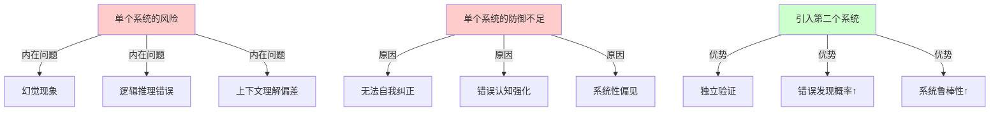
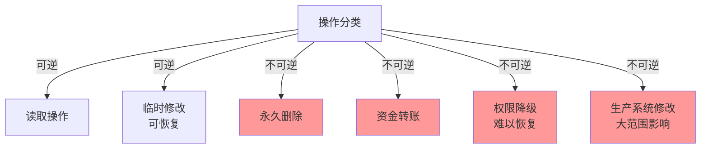
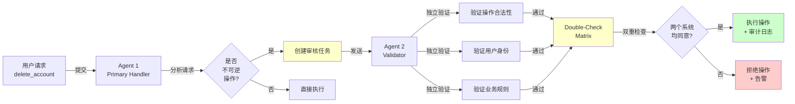
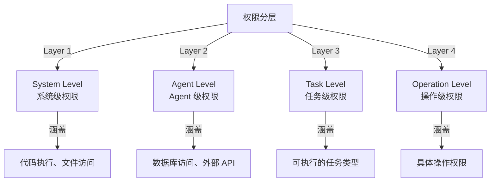
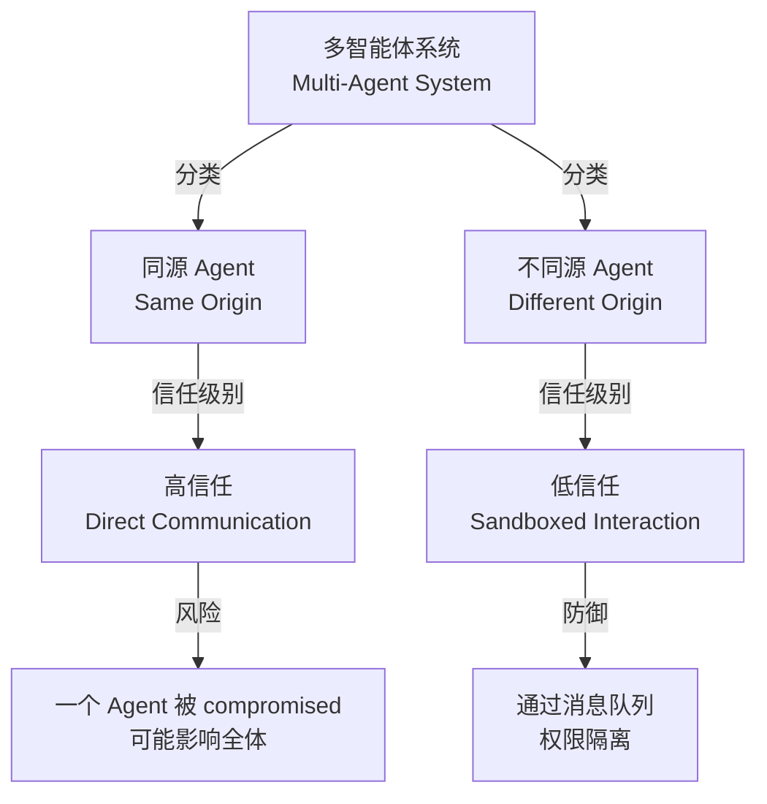
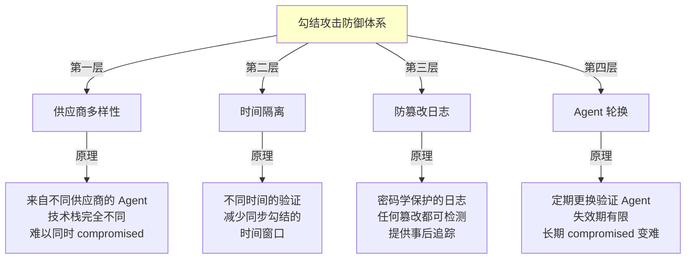
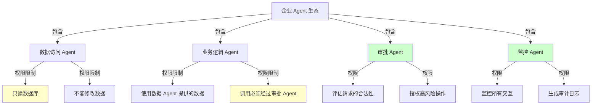
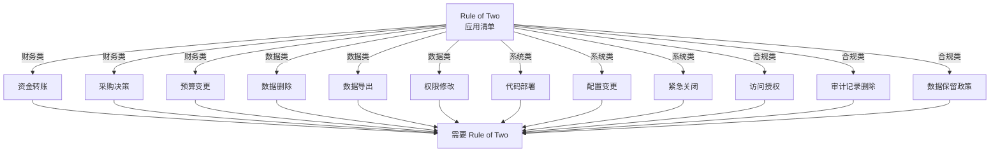
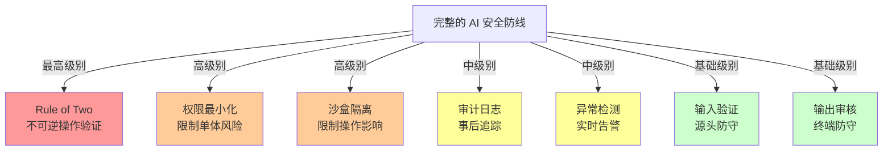

## 7.6 Agents Rule of Two 与智能体安全设计原则

“Rule of Two”（双人规则）是 Meta 在 2025 年 10 月推出的一项重要的 AI 安全实践指导（由 Mick Ayzenberg 发表），旨在通过引入双层验证机制来防止自主代理系统中的灾难性错误。本节深入探讨这一原则的理论基础、实现方法和实际应用。

### 7.6.1 Rule of Two 的核心原则

#### 基本概念

```text
Rule of Two: 任何不可逆的重要操作，必须经过两个独立的智能体或系统组件的批准。
```

这一原则源自于核武器管理中的“两个钥匙”制度，被应用到 AI 智能体系统中，形成了一套完整的安全设计范式。

#### 原则的哲学基础



图 7-20：Rule of Two 的理论基础

#### Rule of Two 与其他安全实践的关系

| 实践 | 焦点 | 与 Rule of Two 的关系 |
|------|------|------------------|
| 权限最小化 | 限制单个系统的权限 | 辅助：减少单个系统的威胁面 |
| 审计日志 | 记录所有操作 | 补充：提供事后追踪 |
| 工具调用沙盒 | 隔离执行环境 | 辅助：限制操作影响 |
| Rule of Two | **前置预防**|**核心：主动阻止错误发生** |

### 7.6.2 不可逆操作的安全网关设计

#### 不可逆操作的定义和分类



图 7-21：操作可逆性分类

#### 不可逆操作的风险矩阵

| 操作类型 | 影响范围 | 恢复成本 | 风险等级 |
|---------|---------|---------|---------|
| 账户删除 | 用户数据完全丧失 | 极高（可能无法恢复） | **关键** |
| 资金转账 | 资金直接丧失 | 极高（需法律介入） | **关键** |
| 生产数据删除 | 业务中断，数据丧失 | 很高（需完整备份） | **关键** |
| 权限撤销 | 用户功能受限 | 中高（需重新审批） | **高** |
| 配置更改 | 系统行为改变 | 中（需回滚） | **中高** |

#### 安全网关架构

不可逆操作必须经过多层安全网关，确保在两个独立系统的验证下才能执行：



图 7-22：不可逆操作安全网关流程

#### 实现示例（伪代码）

```python
from enum import Enum
from dataclasses import dataclass

class OperationReversibility(Enum):
    REVERSIBLE = 1      # 可逆
    PARTIALLY_REVERSIBLE = 2  # 部分可逆
    IRREVERSIBLE = 3    # 不可逆

@dataclass
class IrreversibleOperation:
    operation_type: str
    user_id: str
    operation_id: str
    reversibility: OperationReversibility
    approval_status: dict  # {agent_id: bool}

class SafeAgentGateway:
    """不可逆操作的安全网关"""

    def __init__(self):
        self.primary_agent = PrimaryAgent()
        self.validator_agent = ValidatorAgent()

    def process_operation(self, operation: IrreversibleOperation):
        """处理操作的主流程"""

        # Step 1: 初步分类
        if operation.reversibility != OperationReversibility.IRREVERSIBLE:
            # 可逆操作直接执行
            return self.execute_operation(operation)

        # Step 2: 第一个Agent检查
        primary_approval = self.primary_agent.review(operation)
        operation.approval_status['primary'] = primary_approval

        if not primary_approval:
            self.log_rejection(operation, 'primary_agent')
            raise OperationRejected("Primary agent rejected")

        # Step 3: 第二个Agent独立验证
        validator_approval = self.validator_agent.review(operation)
        operation.approval_status['validator'] = validator_approval

        if not validator_approval:
            self.log_rejection(operation, 'validator_agent')
            raise OperationRejected("Validator agent rejected")

        # Step 4: 双重检查通过，执行操作
        if primary_approval and validator_approval:
            return self.execute_operation(operation)

    def execute_operation(self, operation: IrreversibleOperation):
        """执行操作并记录审计日志"""
        try:
            result = self._do_execute(operation)
            self.audit_log.record(
                timestamp=time.time(),
                operation_id=operation.operation_id,
                status='SUCCESS',
                approvals=operation.approval_status
            )
            return result
        except Exception as e:
            self.audit_log.record(
                timestamp=time.time(),
                operation_id=operation.operation_id,
                status='FAILED',
                error=str(e)
            )
            raise
```

### 7.6.3 权限最小化实践

#### 权限模型架构



图 7-23：多层权限模型

#### Zero Trust 原则在 Agent 中的应用

```python
class ZeroTrustAgentSystem:
    """基于 Zero Trust 的智能体权限模型"""

    def __init__(self):
        self.permission_engine = PermissionEngine()

    def authorize_operation(self, agent_id, operation):
        """每次操作都进行完整的权限验证"""

        # 不信任 Agent 的身份声称
        agent_identity = self.verify_agent_identity(agent_id)

        # 不信任静态权限配置，而是动态评估
        context = {
            'agent': agent_identity,
            'operation': operation,
            'timestamp': time.time(),
            'current_resource_state': self.get_current_state(),
            'historical_behavior': self.get_agent_history(agent_id)
        }

        # 多维度权限评估
        checks = [
            self.check_role_permission(agent_identity, operation),
            self.check_resource_limit(agent_identity, operation),
            self.check_time_based_restriction(agent_identity),
            self.check_behavioral_anomaly(agent_identity, context),
            self.check_dependency_chain(operation)
        ]

        if all(checks):
            return True
        else:
            # 详细的拒绝原因记录
            self.log_authorization_failure(
                agent_id=agent_id,
                operation=operation,
                failed_checks=which_checks_failed(checks)
            )
            return False

    def check_dependency_chain(self, operation):
        """检查操作的依赖链是否都被授权"""
        dependencies = self.analyze_operation_dependencies(operation)

        for dependency in dependencies:
            if not self.is_authorized(dependency):
                return False

        return True
```

#### 权限降级案例（典型场景示例）

以下是一个基于真实工程场景构造的假设案例，用以说明权限模型的重要性：假设一个 AI 代码生成 Agent 误删了生产数据库中的关键表：

**事件经过**：

1. Agent 被赋予“数据库修改”的广泛权限
2. Agent 在执行“清理过期日志”任务时，因为理解错误执行了 DROP TABLE 操作
3. 数据丧失，恢复耗时 3 天

**事件教训**：

- 权限过于宽泛（可以删除任何表，而不仅是日志表）
- 缺少第二层验证（没有要求人类确认DELETE/DROP操作）
- 操作前缺少dry-run（可以显示将要删除的内容）

**改进方案**：

```python
class ImprovedDatabaseAgent:
    """改进的数据库Agent权限模型"""

    def __init__(self):
        self.permission_level = PermissionLevel.MINIMAL

    def execute_delete(self, table_name, conditions):
        """删除操作的改进流程"""

        # Step 1: 权限检查
        if not self.has_permission('delete', specific_table=table_name):
            raise PermissionDenied(f"No permission to delete from {table_name}")

        # Step 2: Dry-run - 显示将要删除的记录
        affected_records = self.query(
            f"SELECT * FROM {table_name} WHERE {conditions}"
        )

        logger.info(f"Will delete {len(affected_records)} records:")
        for record in affected_records[:10]:  # 显示前10条
            logger.info(f"  - {record}")

        if len(affected_records) > 10:
            logger.info(f"  ... and {len(affected_records) - 10} more")

        # Step 3: 需要人类确认（不可逆操作）
        approval = self.request_human_approval(
            operation_type='DELETE',
            table=table_name,
            affected_count=len(affected_records),
            preview=affected_records[:10]
        )

        if not approval:
            logger.info("Delete operation cancelled by human")
            return

        # Step 4: 使用事务，允许回滚
        with self.database.transaction():
            cursor = self.database.execute(
                f"DELETE FROM {table_name} WHERE {conditions}"
            )
            self.audit_log.record(
                operation='DELETE',
                table=table_name,
                affected_rows=cursor.rowcount,
                timestamp=time.time()
            )
```

### 7.6.4 多智能体安全边界

#### 智能体间的信任模型



图 7-24：多智能体信任模型

#### 勾结攻击防御

在多智能体系统中，一个新兴的风险是两个或多个智能体进行“勾结”，共同规避安全检查。Rule of Two 的核心假设是两个验证智能体是独立的，但如果它们被 compromised 或协调一致，这个假设就会崩溃。

##### 勾结攻击的形式

```text
场景1：两个验证Agent都被攻击者控制
- 攻击者通过某种方式contaminate两个Agent
- 它们都“批准”一个实际上有害的操作
- Rule of Two变成假象

场景2：一个验证Agent被社工
- 通过某种社工手段或逻辑漏洞说服验证Agent
- 使其做出错误的批准决定
- 第二个Agent无法检测到这种细微的操纵

场景3：Rule of Two的实现有缺陷
- 两个Agent实际上共享某些内部状态
- 一个被compromise导致两个都被compromise
- 缺乏真正的独立性
```

##### 勾结攻击防御机制

**1. 来自不同供应商的验证Agent**

```python
class VendorDiversificationDefense:
    """使用来自不同供应商的 Agent 进行验证"""

    def __init__(self):
        # 使用完全不同来源的模型
        self.primary_agent = load_model(vendor='OpenAI', model='gpt-4')
        self.validator_agent = load_model(vendor='Anthropic', model='claude-opus')
        # 可选的第三个 Agent 来自不同供应商
        self.tertiary_agent = load_model(vendor='Google', model='gemini-pro')

    def verify_operation(self, operation):
        """多来源验证操作"""

        # 来自不同供应商的推理过程是独立的
        primary_approval = self.primary_agent.verify(operation)
        validator_approval = self.validator_agent.verify(operation)

        # 供应商多样性降低了被同时 compromised 的风险
        if primary_approval and validator_approval:
            return True
        else:
            return False
```

**2. 异步验证与时间隔离**

```python
class AsynchronousVerificationWithTimeIsolation:
    """异步验证与时间隔离防御勾结"""

    def execute_irreversible_operation(self, operation):
        """异步和时间隔离的验证流程"""

        # Step 1: 第一个Agent审批
        approval1 = self.primary_agent.verify(operation)
        if not approval1:
            raise OperationRejected("Primary agent rejected")

        # Step 2: 时间隔离（等待一段时间）
        # 这个延迟使得简单的同步勾结变得困难
        wait_duration = random.randint(60, 300)  # 1-5 分钟
        time.sleep(wait_duration)

        # Step 3: 独立的第二个审批
        # 在不同的时间、可能不同的计算资源上运行
        approval2 = self.secondary_agent.verify(operation)
        if not approval2:
            raise OperationRejected("Secondary agent rejected after isolation period")

        # Step 4: 执行
        if approval1 and approval2:
            return self.execute_and_log(operation)
```

**3. 防篡改的审计日志**

```python
class TamperProofAuditLog:
    """防篡改的审计日志机制"""

    def __init__(self):
        # 使用区块链或密码学哈希链确保日志完整性
        self.log_chain = CryptoHashChain()

    def record_verification(self, operation, agent_approvals, timestamp):
        """记录验证过程，防止篡改"""

        log_entry = {
            'operation_id': operation.id,
            'timestamp': timestamp,
            'approvals': agent_approvals,  # {agent_id: {approved: bool, reasoning: str}}
            'previous_hash': self.log_chain.last_hash,
        }

        # 添加加密签名
        log_entry['signature'] = self.sign_entry(log_entry)

        # 添加到不可变链
        self.log_chain.append(log_entry)

        return log_entry

    def verify_log_integrity(self):
        """验证整个日志链的完整性"""
        current_hash = None
        for entry in self.log_chain.entries:
            if not self.verify_entry_signature(entry):
                return False, f"Signature mismatch at {entry['operation_id']}"

            if current_hash and entry['previous_hash'] != current_hash:
                return False, f"Chain break at {entry['operation_id']}"

            current_hash = self.hash_entry(entry)

        return True, "Log integrity verified"
```

**4. 定期Agent轮换**

```python
class AgentRotationDefense:
    """定期轮换验证 Agent 防止被 compromised"""

    def __init__(self, rotation_interval_hours=24):
        self.rotation_interval = rotation_interval_hours * 3600
        self.last_rotation = time.time()
        self.agent_pool = self.initialize_agent_pool()
        self.current_agent_index = 0

    def initialize_agent_pool(self):
        """初始化多个 Agent 池"""
        return [
            ModelAgent(vendor='OpenAI', model='gpt-4'),
            ModelAgent(vendor='Anthropic', model='claude-opus'),
            ModelAgent(vendor='Google', model='gemini-pro'),
            ModelAgent(vendor='Meta', model='llama-3'),
            ModelAgent(vendor='Mistral', model='mistral-large'),
        ]

    def get_current_validator(self):
        """获取当前的验证 Agent"""
        current_time = time.time()

        # 检查是否需要轮换
        if current_time - self.last_rotation > self.rotation_interval:
            self.rotate_agent()
            self.last_rotation = current_time

        return self.agent_pool[self.current_agent_index]

    def rotate_agent(self):
        """轮换到下一个 Agent"""
        self.current_agent_index = (self.current_agent_index + 1) % len(self.agent_pool)
        logger.info(f"Agent rotated to {self.get_current_validator()}")

    def verify_with_rotation(self, operation):
        """使用轮换的 Agent 进行验证"""
        validator = self.get_current_validator()
        return validator.verify(operation)
```

##### 防御的综合应用



#### Agent间通信的安全协议

```python
class SecureAgentBridge:
    """Agent 间的安全通信桥梁"""

    def __init__(self):
        self.message_queue = VerifiedQueue()
        self.permission_checker = PermissionChecker()

    def call_external_agent(self, source_agent, target_agent, request):
        """调用外部 Agent 的安全方法"""

        # Step 1: 验证消息来源
        if not self.verify_agent_identity(source_agent):
            raise UntrustedAgentError(f"Cannot verify {source_agent}")

        # Step 2: 检查权限
        if not self.permission_checker.can_call(
            source_agent,
            target_agent,
            request.operation
        ):
            raise PermissionDenied(
                f"{source_agent} cannot call {target_agent}"
            )

        # Step 3: 消息加密和签名
        signed_request = self.sign_request(request, source_agent)

        # Step 4: 通过隔离通道发送
        response = self.message_queue.send(
            target=target_agent,
            message=signed_request,
            timeout=30
        )

        # Step 5: 验证响应
        if not self.verify_response_signature(response, target_agent):
            raise UntrustedResponseError("Response signature verification failed")

        # Step 6: 沙箱执行响应中包含的代码
        return self.execute_in_sandbox(response.payload)

    def execute_in_sandbox(self, code):
        """在隔离环境中执行外部 Agent 的代码"""
        sandbox = Sandbox(
            allowed_modules=['json', 'datetime'],
            memory_limit='100MB',
            timeout=5,
            no_network=True
        )
        return sandbox.execute(code)
```

#### 组织级Agent协调



图 7-25：企业 Agent 生态的权限架构

### 7.6.5 实际安全事件分析

#### 案例 1：Meta AI Agent 的失控（2026 年 1 月报道）

**背景**：Meta 内部开发的一个自主采购 Agent 被给予权限购买服务。

**事件**：
- Agent 无意中购买了错误的云服务配额
- 由于权限过于宽泛，没有价格上限检查
- 造成月度成本增加 300 万美元

**根本原因**：
- 缺少 Rule of Two 验证
- 采购权限设置不合理（无预算上限）
- 没有及时的支出告警

**改进方案**：

```python
class SafeProcurementAgent:
    """改进的采购 Agent"""

    # 权限最小化
    PERMISSION_LEVEL = PermissionLevel.LIMITED
    BUDGET_LIMIT = 10_000  # 单次上限 $10k
    MONTHLY_LIMIT = 100_000  # 月度上限 $100k

    def purchase(self, service, cost, duration):
        """采购操作的改进流程"""

        # Check 1: 基本权限检查
        if not self.has_purchase_permission():
            raise PermissionDenied("No purchase permission")

        # Check 2: 预算检查
        if cost > self.BUDGET_LIMIT:
            logger.warning(f"Cost {cost} exceeds limit {self.BUDGET_LIMIT}")
            return self.request_human_approval(cost)

        if self.monthly_spent + cost > self.MONTHLY_LIMIT:
            return self.request_human_approval(cost)

        # Check 3: 业务逻辑验证
        if not self.validate_business_case(service):
            raise ValidationError(f"No valid business case for {service}")

        # Check 4: 第一个 Agent 处理
        approval1 = self.process_with_agent1(service, cost)

        # Check 5: 第二个 Agent 独立验证
        approval2 = self.process_with_agent2(service, cost)

        # Rule of Two: 两个都通过才能执行
        if approval1.approved and approval2.approved:
            return self.execute_purchase(service, cost, duration)
        else:
            logger.warning("Purchase rejected by second review")
            return None

    def request_human_approval(self, cost):
        """大额采购需要人类确认"""
        ticket = self.create_approval_ticket(
            amount=cost,
            reason=self.reason,
            auto_expire_hours=24
        )
        # 等待人类审批
        return ticket.wait_for_approval(timeout=24*3600)
```

#### 案例 2：代码审查 Agent 误操作的连锁反应（假设场景）

**背景**：以下为基于真实工程风险构造的典型场景示例。一个代码审查 Agent 被给予代码合并权限，在主分支上引入了漏洞。

**事件流**：
1. Agent 试图修复一个 bug（权限：修改代码）
2. 修复引入了一个微妙的逻辑错误
3. Agent 通过了自己的测试（测试用例不全）
4. Agent 自动合并了代码到主分支（权限：合并代码）
5. 在生产环境引起故障

**防御失败点**：
- 只有 Agent 的单一验证，缺少第二层
- 自动合并权限过于宽泛

**改进的 Code Review Agent**：

```python
class SafeCodeReviewAgent:
    """改进的代码审查和合并 Agent"""

    def review_and_merge(self, pull_request):
        """代码审查和合并的改进流程"""

        # Step 1: 自动代码审查
        review1 = self.perform_code_review(pull_request)

        if review1.has_critical_issues:
            return self.reject_pr(pr, review1.issues)

        # Step 2: 触发第二个 Agent 的独立审查
        review2 = self.trigger_secondary_review(pull_request)

        # Step 3: 运行测试套件
        test_results = self.run_tests(pull_request)

        if not test_results.passed:
            return self.request_human_review(
                pr=pull_request,
                reason="Tests failed",
                test_results=test_results
            )

        # Step 4: Rule of Two 检查
        if review1.approved and review2.approved:
            # 对于大型变更，仍需人类最终确认
            if self.is_large_change(pull_request):
                return self.request_human_approval(pull_request)
            else:
                return self.merge_with_audit_log(pull_request)
        else:
            return self.request_human_review(
                pr=pull_request,
                review1=review1,
                review2=review2
            )

    def is_large_change(self, pr):
        """评估变更规模"""
        return (
            pr.files_changed > 10 or
            pr.lines_added > 500 or
            pr.affects_critical_path()
        )
```

### 7.6.6 2026 年最新安全事件与教训

#### 系统化的 Rule of Two 应用清单

基于 2025-2026 年的安全事件，形成了以下应用清单：



图 7-26：Rule of Two 应用场景清单

#### 量化指标

```bash
Rule of Two 实施效果（Meta 2026 年数据）：

实施前：
- 误操作事件：平均每月 3-5 起
- 平均恢复时间：8 小时
- 数据丧失成本：平均 $500k

实施后（6 个月）：
- 误操作事件：月均 0-1 起（降低 95%）
- 平均恢复时间：（几乎无需恢复）
- 数据丧失成本：0（或接近 0）
- 额外处理成本：人工审批时间 +10%
```

### 7.6.7 实现 Rule of Two 的技术栈

#### 技术选择决策树

```python

# 伪代码：实现选择
def choose_implementation(operation_type, system_scale):
    """选择合适的 Rule of Two 实现"""

    if operation_type == "IRREVERSIBLE":
        if system_scale == "small":
            # 小型系统可以用简单的人工审批
            return HumanApprovalGateway()
        elif system_scale == "medium":
            # 中型系统：自动化初步检查 + 人类审批
            return AutomatedCheckWithHumanApproval()
        else:  # large
            # 大型系统：两个 AI Agent + 异常时人类介入
            return DualAgentVerification()
```

#### 开源方案

```text
推荐的开源工具与框架：

1. LLM 应用框架
   - LangChain: 链式调用管理
   - AutoGPT: Agent 工作流
   - LlamaIndex: RAG 框架

2. 权限和审批
   - Open Policy Agent (OPA): 声明式权限策略
   - Keycloak: 身份与访问管理
   - Kyverno: Kubernetes 策略引擎

3. 审计和监控
   - Falco: 行为监控
   - Prometheus: 指标收集
   - ELK Stack: 日志分析
```

### 7.6.8 建立 Rule of Two 的文化

#### 组织文化指导

不仅仅是技术实现，Rule of Two 还需要建立正确的组织文化：

1. **信任但验证**：不是不信任 Agent 或工程师，而是通过系统化验证来保护整体安全
2. **共同责任**：两个审批者都对最终决策负责
3. **持续改进**：基于事件不断优化 Rule of Two 的应用范围和标准
4. **透明沟通**：清楚地传达为什么某些操作需要额外验证

#### 培训和认证

```text
Rule of Two 认证体系：

Level 1 - 理论基础（在线课程）
├─ Rule of Two 的原理
├─ 不可逆操作的识别
├─ 基本的权限模型
└─ 考试：80 分通过

Level 2 - 实践应用（工作坊）
├─ 系统设计中的 Rule of Two
├─ 审批流程设计
├─ 故障排查
└─ 设计方案评审

Level 3 - 高级设计（认证）
├─ 复杂系统的 Rule of Two 架构
├─ 跨组织的协调
├─ 新兴威胁应对
└─ 发表或贡献开源项目
```

### 7.6.9 与其他 AI 安全实践的综合



图 7-27：Rule of Two 在 AI 安全防线中的位置

### 7.6.10 展望与建议

#### 2026 年及以后的发展方向

1. **自适应 Rule of Two**：根据上下文和风险动态调整验证要求
2. **多智能体协议标准化**：建立互操作的安全通信协议
3. **分布式验证**：在多个组织间进行验证
4. **形式化验证**：使用数学方法证明安全性

#### 对企业的建议

1. **立即行动**：为所有不可逆操作实施 Rule of Two
2. **优先级排序**：从高风险操作开始（财务、数据删除等）
3. **监测和改进**：收集实施数据，持续优化
4. **行业参与**：与其他组织分享最佳实践

---

Rule of Two 代表了 AI 系统从单一智能体向多智能体安全体系的进化。通过实施这一原则，企业可以显著降低自主 AI 系统的风险，同时保持其高效运作。
