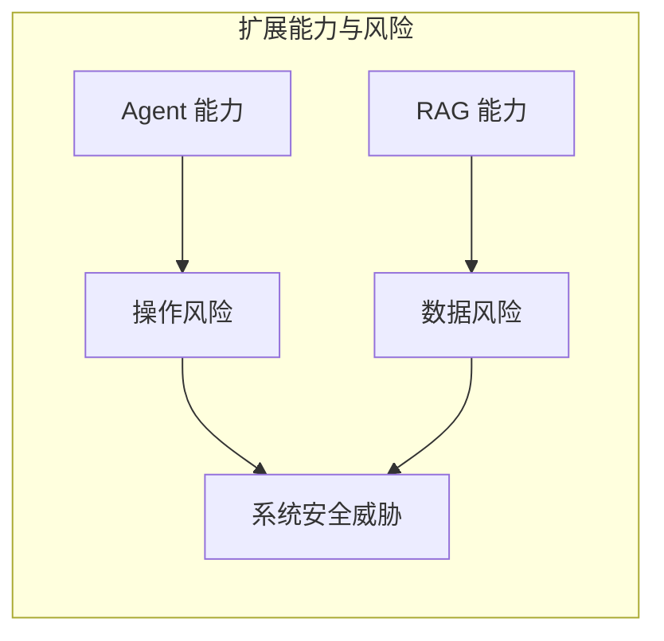

# 第七章：智能体与 RAG 安全

随着 LLM 被赋予工具调用能力和外部知识访问能力，系统的能力边界大幅扩展，但安全风险也随之增加。本章将深入分析 Agent 系统和 RAG 架构面临的独特安全挑战。

本章聚焦于 Agent 与 RAG 安全，主要内容包括：

- **7.1 智能体系统安全风险**：分析自主 Agent 的安全威胁模型
- **7.2 RAG 架构攻击面分析**：识别检索增强生成系统的漏洞
- **7.3 工具调用安全**：探讨函数调用和 API 集成的安全问题
- **7.4 供应链攻击**：了解依赖组件带来的安全风险

通过本章的学习，读者将理解复杂 LLM 系统的安全挑战和防护要点。

