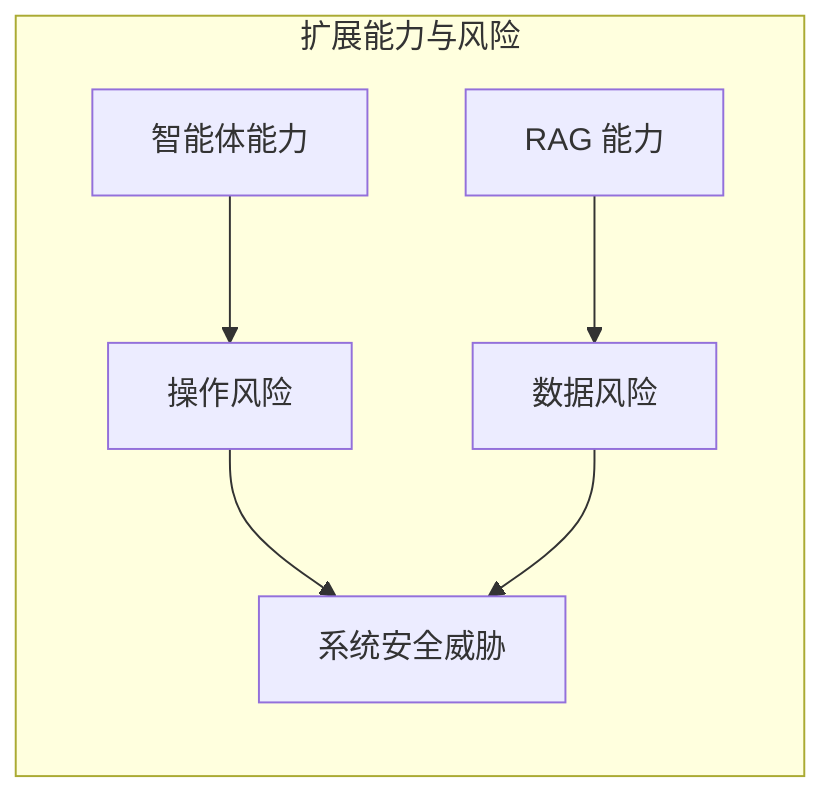

# 第七章 智能体与 RAG 安全

随着 LLM 被赋予工具调用能力和外部知识访问能力，系统的能力边界大幅扩展，但安全风险也随之增加。本章将深入分析智能体系统和 RAG 架构面临的独特安全挑战。

本章聚焦于智能体与 RAG 安全，主要内容包括：

- **7.1 智能体系统安全风险**：分析自主智能体的安全威胁模型
- **7.2 RAG 架构攻击面分析**：识别检索增强生成系统的漏洞
- **7.3 工具调用安全**：探讨函数调用和 API 集成的安全问题
- **7.4 智能体技能与生态安全**：分析插件市场与复合技能带来的供应链隐患
- **7.5 多智能体协作系统的安全架构**：分析多智能体环境中的信任链破坏、权限提升链和共享状态污染等新型威胁
- **7.6 Agents Rule of Two 与智能体安全设计原则**：探讨限制单个智能体同时具备多项高风险能力的安全设计原则

通过本章的学习，读者将理解复杂 LLM 系统的安全挑战和防护要点，掌握从单体智能体到多智能体协作系统的完整安全架构。

> **⚠️ 道德边界**：本章对工具调用滥用、RAG 中毒、多 Agent 信任链破坏的剖析用于让 Agent 开发者识别并修复自身系统的安全弱点；针对未经授权的他方 Agent 系统执行类似攻击违反法律与服务条款。完整声明见 [§4 章首道德边界与负责任披露说明](../04_prompt_injection/README.md)。

```mermaid
flowchart LR
    subgraph "扩展能力与风险"
    A["智能体能力"] --> C["操作风险"]
    B["RAG 能力"] --> D["数据风险"]
    C --> E["系统安全威胁"]
    D --> E
    end
```

## 对照 OWASP 智能体安全威胁清单

OWASP GenAI 安全项目的 [Agentic AI – Threats and Mitigations](https://genai.owasp.org/resource/agentic-ai-threats-and-mitigations/) 提出了 15 项智能体威胁（T1–T15）。本章（结合相关章节）对这些威胁均有覆盖，便于读者按该清单自查：

| OWASP 威胁 | 本书覆盖位置 |
|------------|--------------|
| T1 记忆投毒 | 7.1.6 |
| T2 工具滥用 | 7.3 |
| T3 权限提升 | 7.1.7、7.3.8、7.5.2 |
| T4 资源过载 | 3.1.11（LLM10）、7.1.2 |
| T5 级联幻觉 | 7.5.2、4.3.9 |
| T6 意图篡改与目标操纵 | 11.3.2、11.3.4、11.4 |
| T7 错位与欺骗行为 | 11.4、10.7、11.3.11 |
| T8 抵赖与不可追溯 | 7.1.12、7.6.4 |
| T9 身份伪造与冒充 | 7.5.2、7.5.3、7.5.4 |
| T10 淹没人在环 | 7.1.15 |
| T11 意外远程代码执行 | 6.7、7.3.10 |
| T12 智能体通信投毒 | 7.5.2、7.5.4 |
| T13 失控智能体 | 7.5.3、7.6.4 |
| T14 针对多智能体系统的人为攻击 | 7.5、7.6.4 |
| T15 人类操纵 | 7.1.15 |
