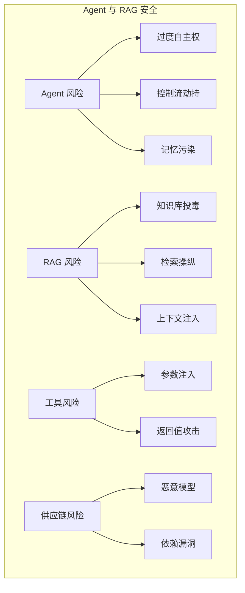

## 本章小结

本章探讨了 Agent 系统和 RAG 架构带来的新型安全挑战，以及工具调用和供应链层面的风险。

### 核心要点回顾

**Agent 系统风险**：Agent 的自主决策和操作执行能力带来过度自主权、控制流劫持、记忆污染等风险。需要通过最小权限、人机协作、监控审计等措施防护。

**RAG 攻击面**：RAG 系统的知识库、嵌入模型、向量数据库、检索逻辑都可能成为攻击点。知识库投毒和检索结果操纵是主要威胁，需要在各层实施安全防护。

**工具调用安全**：参数注入、工具滥用、返回值攻击是主要风险。安全的工具设计应遵循最小能力、显式参数、安全默认、不信任输入、操作审计等原则。

**供应链安全**：预训练模型、数据集、依赖库、第三方服务、插件等都可能引入风险。需要建立可信供应商清单、实施版本锁定、漏洞扫描和 SBOM 管理。

### 风险概览

图 7-1：风险概览流程图

### 防御矩阵

| 风险领域 | 关键防护措施 |
|----------|--------------|
| Agent | 最小权限、操作确认、行为监控 |
| RAG | 来源验证、内容审核、检索过滤 |
| 工具调用 | 参数验证、权限控制、返回值检查 |
| 供应链 | 来源审核、SBOM、漏洞扫描 |

### 延伸思考

1. 随着 Agent 能力增强，如何平衡自主性与可控性？
2. RAG 系统如何在保持开放性的同时抵御投毒攻击？
3. 在快速迭代的生态中，如何有效管理供应链安全？

### 下章预告

第八章将进入"防御篇"，介绍安全架构设计的原则和模式。包括纵深防御、安全架构模式、权限与访问控制、安全开发生命周期等内容，为构建安全的 LLM 应用提供系统性指导。
