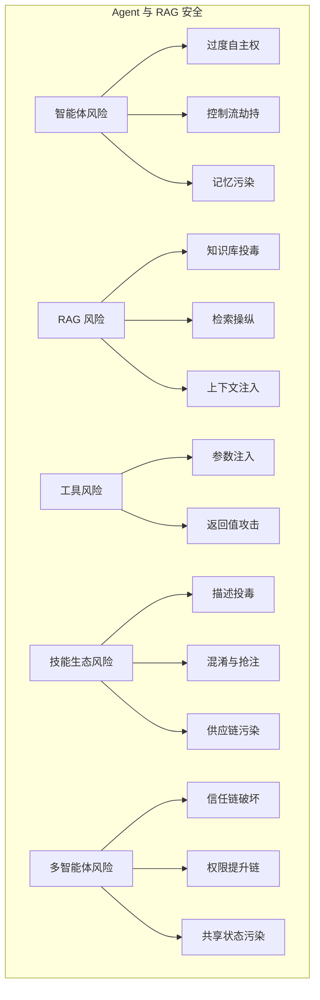

## 本章小结

本章探讨了智能体系统和 RAG 架构带来的新型安全挑战，以及工具调用和供应链层面的风险。

### 核心要点回顾

**智能体系统风险**：智能体的自主决策和操作执行能力带来过度自主权、控制流劫持、记忆污染等风险。需要通过最小权限、人机协作、监控审计等措施防护。

**RAG 攻击面**：RAG 系统的知识库、嵌入模型、向量数据库、检索逻辑都可能成为攻击点。知识库投毒和检索结果操纵是主要威胁，需要在各层实施安全防护。

**工具调用安全**：参数注入、工具滥用、返回值攻击是主要风险。安全的工具设计应遵循最小能力、显式参数、安全默认、不信任输入、操作审计等原则。

**技能与生态安全**：技能（Skills/Plugins）引入了复杂的供应链威胁，如技能描述投毒、混淆抢注、后门越权等，需依赖清单扫描、动态沙箱和最小上下文控制进行防御。

**多智能体协作安全**：多智能体环境引入了智能体间注入、信任链破坏、权限提升链、共享状态污染等新型攻击面。需要通过零信任架构、智能体身份验证、通信加密和协调安全机制来应对。

**Rule of Two 安全原则**：借鉴核武器管理的"双人规则"，任何不可逆的重要操作必须经过两个独立智能体或系统组件的批准。通过多层权限模型、操作可逆性分类和安全网关实现，有效防止自主代理系统中的灾难性错误。

### 风险概览

```mermaid
graph TB
    subgraph "Agent 与 RAG 安全"
    A["智能体风险"] --> A1["过度自主权"]
    A --> A2["控制流劫持"]
    A --> A3["记忆污染"]

    B["RAG 风险"] --> B1["知识库投毒"]
    B --> B2["检索操纵"]
    B --> B3["上下文注入"]

    C["工具风险"] --> C1["参数注入"]
    C --> C2["返回值攻击"]

    D["技能生态风险"] --> D1["描述投毒"]
    D --> D2["混淆与抢注"]
    D --> D3["供应链污染"]

    E["多智能体风险"] --> E1["信任链破坏"]
    E --> E2["权限提升链"]
    E --> E3["共享状态污染"]
    end
```

图 7-30：风险概览流程图

### 防御矩阵

| 风险领域 | 关键防护措施 |
|----------|--------------|
| 智能体| 最小权限、操作确认、行为监控 |
| RAG | 来源验证、内容审核、检索过滤 |
| 工具调用 | 参数验证、权限控制、返回值检查 |
| 技能生态 | 清单扫描、隔离沙箱、最小上下文 |
| 多智能体 | 零信任架构、身份验证、通信加密、协调安全 |
| Rule of Two | 双层验证、操作分级、不可逆操作网关 |

### 延伸思考

1. 随着智能体能力增强，如何平衡自主性与可控性？
2. RAG 系统如何在保持开放性的同时抵御投毒攻击？
3. 在快速迭代的生态中，如何有效管理供应链安全？

## 与其他章节的关联

- **威胁核心**：第 4.3 节间接注入是 Agent/RAG 安全的核心威胁，需重点防护
- **架构基础**：第 8.2-8.3 节架构设计提供 Agent 安全的基础，通过纵深防御实现
- **防护实现**：第 9 章提供输入输出防护实现，具体落地 Agent 安全要求

### 下章预告

[第八章](../08_architecture/README.md)将进入“防御篇”，介绍安全架构设计的原则和模式。包括纵深防御、安全架构模式、权限与访问控制、安全开发生命周期等内容，为构建安全的 LLM 应用提供系统性指导。
