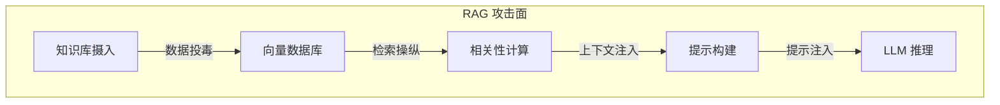

## 7.1 RAG 架构与攻击面

检索增强生成将外部知识库接入模型，也使知识库成为攻击目标。本节给出 RAG 的典型架构，并列出各组件对应的攻击面，后续各节逐一展开。

### 7.1.1 RAG 架构概述

RAG 通过检索相关文档来为模型提供上下文，提升回答的准确性和时效性。

**典型 RAG 流程**

图 7-1：RAG 架构概述架构图

### 7.1.2 RAG 攻击面映射

RAG 系统的每个组件都可能成为攻击点：

图 7-2：RAG 攻击面映射流程图

| 组件 | 攻击类型 | 风险描述 |
|------|----------|----------|
| 知识库 | 数据投毒 | 注入恶意文档 |
| 嵌入模型 | 对抗样本 | 操纵检索结果 |
| 向量数据库 | 未授权访问 | 窃取或篡改数据 |
| 检索逻辑 | 检索操纵 | 强制返回恶意内容 |
| 提示模板 | 模板注入 | 破坏提示结构 |
