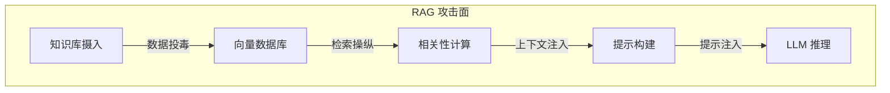

## 7.1 RAG 架构与攻击面

本节回答 RAG 由哪些组件构成、每个组件对应什么攻击。结论是：检索增强生成将外部知识库接入模型，也使知识库成为攻击目标，从知识库摄入到 LLM 推理的每个组件都可能成为攻击点。下面先给出 RAG 的典型架构，再列出各组件对应的攻击面，后续各节逐一展开。

### 7.1.1 RAG 架构概述

RAG 通过检索相关文档来为模型提供上下文，提升回答的准确性和时效性。典型流程如图 7-1 所示：用户查询经编码后做向量检索，从文档库取回相关文档，构建上下文后交给 LLM 生成最终回答。

图 7-1：典型 RAG 流程

### 7.1.2 RAG 攻击面映射

RAG 系统的每个组件都可能成为攻击点，攻击沿流水线逐级传递：数据投毒污染知识库，检索操纵影响相关性计算，上下文注入与提示注入作用于提示构建和 LLM 推理（图 7-2）。

图 7-2：RAG 攻击面映射流程图

各组件对应的攻击类型如下：

| 组件 | 攻击类型 | 风险描述 |
|------|----------|----------|
| 知识库 | 数据投毒 | 注入恶意文档 |
| 嵌入模型 | 对抗样本 | 操纵检索结果 |
| 向量数据库 | 未授权访问 | 窃取或篡改数据 |
| 检索逻辑 | 检索操纵 | 强制返回恶意内容 |
| 提示模板 | 模板注入 | 破坏提示结构 |

相关章节：数据投毒见 [7.2](7.2_knowledge_base_poisoning.md) 节与 [7.4](7.4_ingestion_pipeline.md) 节，对抗样本与检索操纵见 [7.3](7.3_retrieval_manipulation.md) 节，向量数据库的未授权访问见 [7.5](7.5_vector_database_security.md) 节与 [7.6](7.6_retrieval_access_control.md) 节，进入提示后的注入见 [7.7](7.7_context_window_attacks.md) 节。
