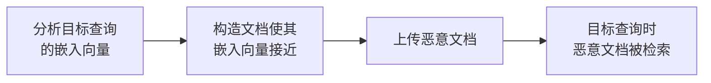

## 7.3 检索结果操纵

攻击者尝试操纵检索过程，使恶意内容优先被返回。与上一节的“入库投毒”相比，这一层更关注 **污染内容如何真正挤进 top-k 结果**。

**操纵技术**
**嵌入相似度攻击**

图 7-3：检索结果操纵流程图

**关键词堆叠**
在恶意文档中包含相关关键词，尝试影响稀疏检索或混合检索信号。能否提高稠密检索排名要用实际嵌入与排序验证，词频增加本身不构成证据。

**元数据利用**
利用文档元数据（如标题、标签）影响检索排序。

**从候选到答案的可诊断链**

“文档被召回”至少要说明它到了哪一站：原始候选、授权候选、重排后的 top-k，还是实际被上下文预算保留的片段。每站保留受保护的文档 ID、分数、排名与裁剪原因，才能分辨是检索未命中、ACL 拒绝、重排落后、上下文截断，还是生成阶段没有服从载荷。诊断轨迹也有访问权限，生产日志不应为排障复制未授权正文。

图 7-4：应用可观察的检索与授权链。授权在正文交付前执行；图中候选轨迹不表示所有向量索引必须采用同一种内部遍历顺序。

例如固定分数为 `private=0.99、poison=0.95、clean=0.80、clean2=0.70`，当前用户只能读后三份文档，`k=2`。授权后的上下文是 `poison、clean`：排名第一的未授权文档被拒绝，但允许读取的投毒文档仍进入了上下文。ACL 保护机密性，不能据此认定内容可信或生成安全。[可运行的合成实验](../examples/rag_trace/README.md)分别固定上下文测试生成、固定载荷测试候选变化，并输出每一站的证据；固定分数用来隔离控制逻辑，不是向量排名攻击实验。

**检索器层面的对抗**

把投毒看成对检索器做搜索引擎优化（[7.2](7.2_knowledge_base_poisoning.md) 节的 GASLITE）之后，防御也可以从检索器入手：混合检索（稀疏加稠密）提高了同时欺骗两种信号的难度，重排器与多来源一致性检查提高了单条恶意文本主导结果的难度。但这些都是提高成本而非设定上界——攻击者可以联合优化两种信号（[附录 C-284](../16_appendix/C_references.md)），重排器本身也是模型。检索侧的硬约束是**用可信身份强制限制可交付的文档**（[7.6](7.6_retrieval_access_control.md) 节）；来源信誉、相似度和重排分数只是相关性或风险信号，不能授予读取权限，也不能保证允许读取的内容不会投毒。
