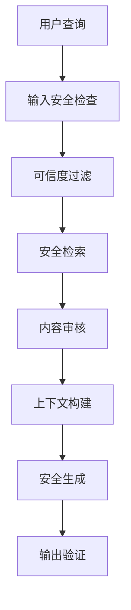

## 7.8 评测与最佳实践

防御是否有效，要用攻击来测。本节先介绍可用的评测基准，再汇总入库、检索、生成三层的防护要点。

### 7.8.1 评测基准

针对 RAG 安全的公开基准已经覆盖了从摄取到生成的各个环节（附录 C-174、C-179、C-206 至 C-208）：

| 基准 | 覆盖 | 主要结论 |
|------|------|----------|
| SafeRAG | 在索引、检索、生成三个阶段注入攻击文本，评估 14 类 RAG 组件：4 种检索器、2 种过滤器（另设无过滤对照）、8 个生成模型；攻击任务含噪声、上下文冲突、软广告与拒绝服务 | 即使最明显的攻击任务也能轻易绕过现有检索器、过滤器或先进模型，导致服务质量下降 |
| Benchmarking Poisoning Attacks against RAG | 5 个标准问答数据集加 10 个扩展变体、13 种攻击、7 种防御，含多轮、多模态与智能体型 RAG | 攻击在扩展数据集上效果显著下降；现有防御无法提供稳健保护 |
| BIPIA | 首个间接提示注入基准 | 现有模型普遍脆弱；其白盒防御可把攻击成功率压到接近零 |
| CrackedPDFs | 29,322 份 PDF，其中 9,774 份含隐藏注入 | 先压平再检测会丢失可见性证据；只看抽取文本时 PromptGuard 的召回率很低 |
| 后检索篡改实验 | 事实核查任务下的上下文篡改 | 三段全部篡改时准确率由 77.9% 降至 43.5% |

使用这些基准时，应把自己的检索器、过滤器和生成模型按同一协议接入，并像 4.5.11 要求的那样加入自适应攻击：攻击者知道防御的存在，并可以反复尝试。

### 7.8.2 三层防护要点

**输入层防护**
```text
知识库摄入安全：
1. 验证文档来源
2. 扫描恶意内容
3. 过滤敏感信息
4. 审核后入库
```

**检索层防护**
| 措施 | 描述 |
|------|------|
| 来源标记 | 标识文档来源可信度 |
| 相似度阈值 | 过滤低相关文档 |
| 多样性控制 | 避免单一来源主导 |
| 异常检测 | 识别异常检索模式 |

**生成层防护**
- 系统提示中明确数据来源限制
- 对检索内容进行安全审核
- 输出验证和过滤

**架构层防护**


图 7-5：RAG 安全最佳实践流程图

RAG 安全需要在知识管理、检索优化和生成控制之间取得平衡。理解 RAG 特有的攻击面是构建安全系统的基础。

> **本节要点**
> - 公开基准各有侧重：SafeRAG 覆盖组件，CrackedPDFs 覆盖隐藏文本，BIPIA 覆盖间接注入；用它们测试时要接入自己的检索器与过滤器，并加上自适应攻击，否则低攻击成功率说明不了问题。
> - 防护按摄取、检索、生成三层组织：摄取在沙箱里解析并做结构检测，检索按权限前置过滤，生成时把检索结果当作不可信输入。
