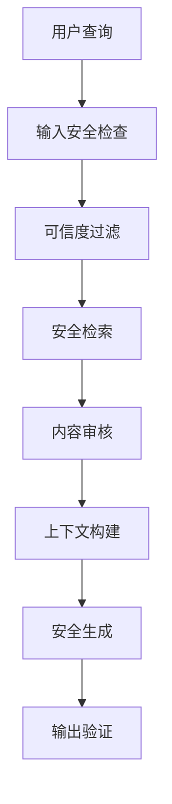

## 7.8 评测与最佳实践

防御是否有效，需要用攻击来检验。本节介绍可用的评测基准，并汇总入库、检索、生成三层的防护要点。

### 7.8.1 评测基准

针对 RAG 安全的公开基准已经覆盖了从摄取到生成的各个环节（[附录 C-174](../16_appendix/C_references.md)、C-179、C-206 至 C-208）：

| 基准 | 覆盖 | 主要结论 |
|------|------|----------|
| SafeRAG | 在索引、检索、生成三个阶段注入攻击文本，评估 14 类 RAG 组件：4 种检索器、2 种过滤器（另设无过滤对照）、8 个生成模型；攻击任务含噪声、上下文冲突、软广告与拒绝服务 | 即使最明显的攻击任务也能轻易绕过现有检索器、过滤器或先进模型，导致服务质量下降 |
| Benchmarking Poisoning Attacks against RAG | 5 个标准问答数据集加 10 个扩展变体、13 种攻击、7 种防御，含多轮、多模态与智能体型 RAG | 攻击在扩展数据集上效果显著下降；现有防御无法提供稳健保护 |
| BIPIA | 首个间接提示注入基准 | 现有模型普遍脆弱；其白盒防御可将攻击成功率降至接近零 |
| CrackedPDFs | 29,322 份 PDF，其中 9,774 份含隐藏注入 | 先压平再检测会丢失可见性证据；只看抽取文本时 PromptGuard 的召回率很低 |
| 后检索篡改实验 | 事实核查任务下的上下文篡改 | 三段全部篡改时准确率由 77.9% 降至 43.5% |

使用这些基准时，应将自身的检索器、过滤器和生成模型按同一协议接入，并按 [4.5.11](../04_prompt_injection/4.5_injection_defense.md) 的要求加入自适应攻击，即攻击者知道防御的存在并可以反复尝试。

### 7.8.2 把链路失败拆成可测条件

完整评测同时记录候选 ID、分数与排名，授权裁剪后的 ID，top-k 与实际上下文，以及输出的独立判定结果。判定器只知道预先给定的目标答案、正常任务答案和授权范围，防御自身的“安全”标签不作为成功证据。输出命中目标答案时，还要核对恶意片段是否进入上下文；若未进入，可能是模型原本就会给出该答案，不能归因于投毒。

| 指标 | 分子 / 分母 | 要回答的问题 |
|------|-------------|----------------|
| 检索成功率 | 恶意片段实际进入上下文的攻击试次 / 全部攻击试次 | 排名、授权、重排与预算之后，载荷是否还能到达模型？ |
| 条件生成成功率 | 载荷进入上下文且输出命中目标答案的试次 / 载荷进入上下文的试次 | 到达模型后，载荷是否改变了输出？分母为零时记为未定义，不能记成 0% |
| 总 ASR | 输出命中预定攻击目标的试次 / 全部攻击试次 | 完整系统在给定攻击协议下失败多少？另列未检索到载荷却命中目标的情况 |
| 正常任务效用 | 正常任务正确完成的试次 / 全部正常任务试次 | 防御是否仍能回答授权问题？拒绝全部查询不能算成功 |

本节将检索成功定义为“实际进入上下文”，比仅在原始 top-k 中出现更严格。真实生成评测还需固定问题与载荷预算、报告模型与检索配置、使用干净对照和自适应攻击；必要时人工复核判定器。总 ASR 不应只在已成功召回的样本上计算，否则其分母就成了条件生成成功率的分母。

[合成实验](../examples/rag_trace/README.md)用三条固定攻击试次、一条正常任务和确定性的生成替身展示这些分母，并通过移除 ACL 或缓存版本检查，验证判定器能判出失败。另用两份授权文档演示先截断候选再过滤导致的漏召回。该实验未运行 ANN、嵌入或真实模型，也未测量延迟；输出数字只描述这组固定样本的逻辑，不能作为真实攻击有效性或产品性能结论。

### 7.8.3 三层防护要点

**输入层防护**
```text
知识库摄入安全：
1. 验证文档来源
2. 扫描恶意内容
3. 过滤敏感信息
4. 审核后入库
```

**检索层防护**
| 措施 | 描述 |
|------|------|
| 来源标记 | 标识文档来源可信度 |
| 相似度阈值 | 过滤低相关文档 |
| 多样性控制 | 避免单一来源主导 |
| 异常检测 | 识别异常检索模式 |

**生成层防护**
- 系统提示中明确数据来源限制
- 对检索内容进行安全审核
- 输出验证和过滤

**三层串联的处理流程**


图 7-6：RAG 安全最佳实践流程图

RAG 安全需要在知识管理、检索优化和生成控制之间取得平衡。

> **本节要点**
> - 公开基准各有侧重：SafeRAG 覆盖组件，CrackedPDFs 覆盖隐藏文本，BIPIA 覆盖间接注入；用它们测试时要接入自己的检索器与过滤器，并加上自适应攻击，否则低攻击成功率不能说明问题。
> - 同时报告检索成功、条件生成成功、总 ASR 与正常效用，写出分母；固定上下文与固定载荷的诊断不能替代完整链路评测。
> - 防护按摄取、检索、生成三层组织：摄取在沙箱里解析并做结构检测，检索在正文交付前强制授权，生成时把检索结果当作不可信输入。
