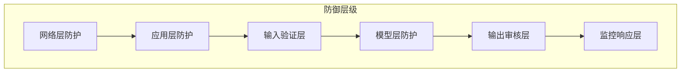
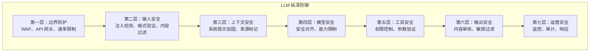
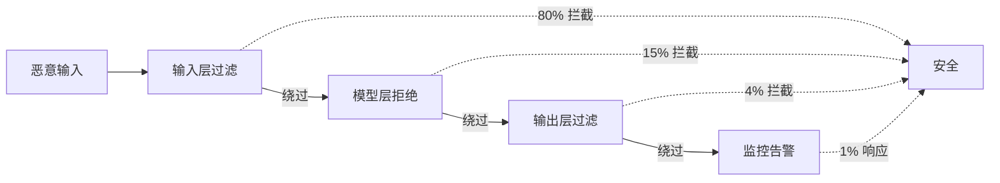
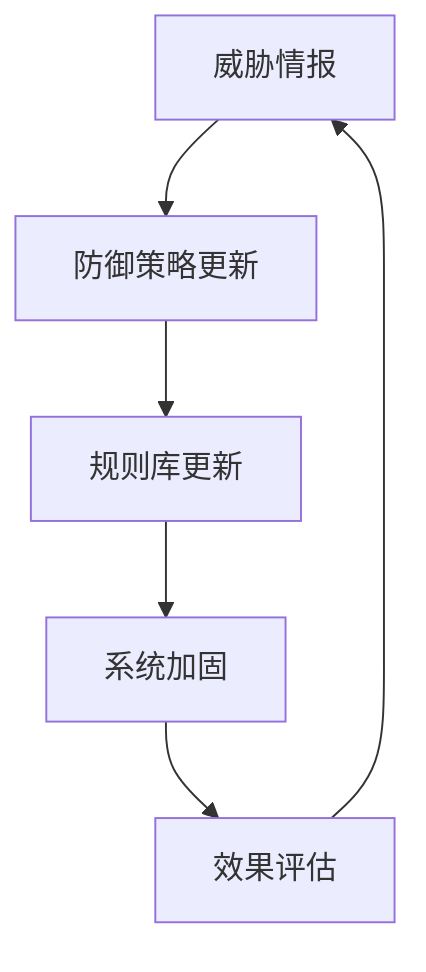

## 8.1 纵深防御原则

纵深防御（Defense in Depth）是安全领域的核心原则，在 LLM 安全中同样适用。

### 8.1.1 纵深防御概念

纵深防御通过多层独立的安全措施，确保单一防护失效时整体安全不被突破。

**层级示意**：



图 8-1：纵深防御概念流程图

**核心理念**：

| 原则 | 描述 |
|------|------|
| 多层防护 | 每层都提供独立的安全保障 |
| 独立失效 | 一层失效不影响其他层 |
| 互补机制 | 不同层使用不同检测技术 |
| 假设失败 | 假设任何一层可能被突破 |

### 8.1.2 LLM 安全防御层次

针对 LLM 应用的纵深防御架构：



图 8-2：LLM 安全防御层次架构图

### 8.1.3 各层防护详解

**边界防护层**：

```
防护措施：
- Web 应用防火墙（WAF）
- API 网关安全策略
- DDoS 防护
- IP 白名单/黑名单
- 速率限制
```

**输入安全层**：

```
防护措施：
- 提示注入检测
- 格式验证
- 长度限制
- 编码规范化
- 恶意内容过滤
```

**上下文安全层**：

```
防护措施：
- 系统提示强化
- 用户/数据来源标记
- 上下文隔离
- 会话安全管理
```

**模型安全层**：

```
防护措施：
- 安全对齐的模型
- 能力限制
- 行为监控
- 模型版本控制
```

**工具安全层**：

```
防护措施：
- 最小权限
- 参数验证
- 操作确认
- 返回值检查
```

**输出安全层**：

```
防护措施：
- 有害内容检测
- 敏感信息过滤
- 格式验证
- 幻觉检测
```

**运营安全层**：

```
防护措施：
- 实时监控
- 日志审计
- 异常告警
- 事件响应
```

### 8.1.4 防御组合策略

不同威胁需要多层协同防护：

**提示注入防护**：

| 层级 | 措施 |
|------|------|
| 输入层 | 注入模式检测 |
| 上下文层 | 来源标记区分 |
| 模型层 | 安全对齐抵抗 |
| 输出层 | 异常行为过滤 |

**数据泄露防护**：

| 层级 | 措施 |
|------|------|
| 输入层 | 过滤信息提取请求 |
| 模型层 | 限制敏感信息复现 |
| 输出层 | PII 检测和脱敏 |
| 运营层 | 泄露事件监控 |

### 8.1.5 层间冗余设计

关键防护应在多层实施，避免单点失效：



图 8-3：层间冗余设计流程图

即使每层只有部分有效，多层组合可以大幅提高整体安全性。

### 8.1.6 动态防御

纵深防御不是静态的，需要持续演进：



图 8-4：动态防御流程图

**动态调整原则**：

- 根据新威胁调整防护策略
- 基于监控数据优化规则
- 定期进行安全评估
- 持续改进防御能力

### 8.1.7 攻击-防线快速对照表

下表从工程视角总结典型攻击与对应防线，便于快速定位防护措施：

| 攻击类别 | 主要目标 | 典型入口 | 关键防线（优先级由高到低） |
|----------|----------|----------|--------------------------|
| **直接提示注入/越狱** | 改写行为/绕过规则 | 用户输入 | 输入检测（分类器/规则）→ 输出验证 → 权限收敛 |
| **系统提示泄露** | 套出系统提示、策略、工具链信息 | 多轮追问/复述/总结 | 机密不入上下文 → 输出脱敏/拦截 → 日志/错误处理不回显 |
| **间接提示注入** | 借外部内容注入指令 | RAG 文档/网页/邮件 | 外部内容视为不可信数据 → 文档注入检测 → 上下文最小化 |
| **RAG 检索投毒** | 控制检索结果与回答 | 向量库/网络内容 | 来源白名单/信誉 → 检索过滤 → 异常检测 |
| **工具/Agent 注入** | 诱导调用工具越权、外泄数据 | 工具调用、工作流 | 工具最小权限/参数约束 → 沙箱执行 → 审批/审计 |
| **不安全输出处理**| 触发 SQL/XSS/模板/命令注入 | 下游执行器 | 参数化/转义/静态检查/沙箱；**不要执行自由文本** |
| **训练数据投毒** | 植入后门/系统性偏差 | 预训练/微调数据 | 数据审核 → 供应链安全 → 行为监控 |
| **资源消耗/DoS** | 拉高成本/拖垮服务 | 超长输入/复杂推理 | 速率限制 → 输入长度限制 → 成本告警 |

> [!TIP]
> 此表可作为安全设计评审的检查清单。对于每种攻击类别，确保至少有一层有效防线。

纵深防御是 LLM 安全的核心框架，后续各节将详细介绍各层的具体实现。
