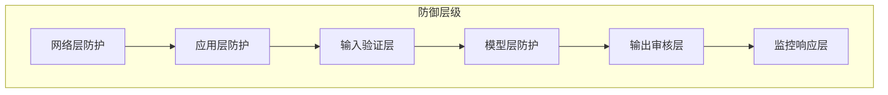
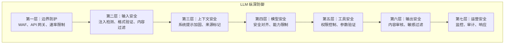
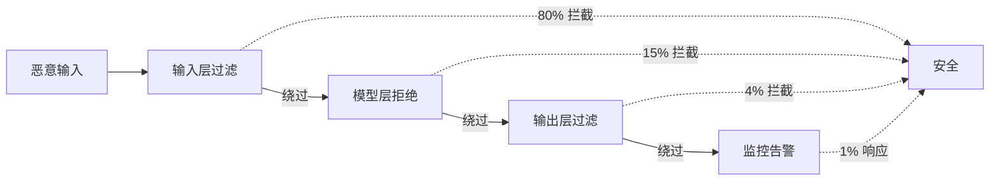
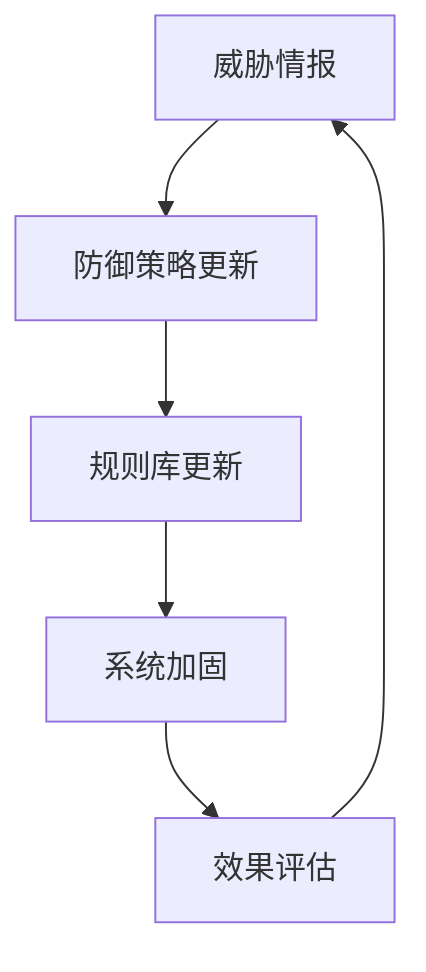

## 8.1 纵深防御原则

纵深防御（Defense in Depth）是安全领域的核心原则，在 LLM 安全中同样适用。

### 8.1.1 纵深防御概念

纵深防御通过多层独立的安全措施，确保单一防护失效时整体安全不被突破。

**层级示意**：


```mermaid
flowchart TB
    subgraph "防御层级"
    A["网络层防护"] --> B["应用层防护"]
    B --> C["输入验证层"]
    C --> D["模型层防护"]
    D --> E["输出审核层"]
    E --> F["监控响应层"]
    end
```

**核心理念**：

| 原则 | 描述 |
|------|------|
| 多层防护 | 每层都提供独立的安全保障 |
| 独立失效 | 一层失效不影响其他层 |
| 互补机制 | 不同层使用不同检测技术 |
| 假设失败 | 假设任何一层可能被突破 |

### 8.1.2 LLM 安全防御层次

针对 LLM 应用的纵深防御架构：


```mermaid
flowchart TB
    subgraph "LLM 纵深防御"
    L1["第一层：边界防护<br/>WAF、API 网关、速率限制"]
    L2["第二层：输入安全<br/>注入检测、格式验证、内容过滤"]
    L3["第三层：上下文安全<br/>系统提示加固、来源标记"]
    L4["第四层：模型安全<br/>安全对齐、能力限制"]
    L5["第五层：工具安全<br/>权限控制、参数验证"]
    L6["第六层：输出安全<br/>内容审核、敏感过滤"]
    L7["第七层：运营安全<br/>监控、审计、响应"]
    
    L1 --> L2 --> L3 --> L4 --> L5 --> L6 --> L7
    end
```

### 8.1.3 各层防护详解

**边界防护层**：

```
防护措施：
- Web 应用防火墙（WAF）
- API 网关安全策略
- DDoS 防护
- IP 白名单/黑名单
- 速率限制
```

**输入安全层**：

```
防护措施：
- 提示注入检测
- 格式验证
- 长度限制
- 编码规范化
- 恶意内容过滤
```

**上下文安全层**：

```
防护措施：
- 系统提示强化
- 用户/数据来源标记
- 上下文隔离
- 会话安全管理
```

**模型安全层**：

```
防护措施：
- 安全对齐的模型
- 能力限制
- 行为监控
- 模型版本控制
```

**工具安全层**：

```
防护措施：
- 最小权限
- 参数验证
- 操作确认
- 返回值检查
```

**输出安全层**：

```
防护措施：
- 有害内容检测
- 敏感信息过滤
- 格式验证
- 幻觉检测
```

**运营安全层**：

```
防护措施：
- 实时监控
- 日志审计
- 异常告警
- 事件响应
```

### 8.1.4 防御组合策略

不同威胁需要多层协同防护：

**提示注入防护**：

| 层级 | 措施 |
|------|------|
| 输入层 | 注入模式检测 |
| 上下文层 | 来源标记区分 |
| 模型层 | 安全对齐抵抗 |
| 输出层 | 异常行为过滤 |

**数据泄露防护**：

| 层级 | 措施 |
|------|------|
| 输入层 | 过滤信息提取请求 |
| 模型层 | 限制敏感信息复现 |
| 输出层 | PII 检测和脱敏 |
| 运营层 | 泄露事件监控 |

### 8.1.5 层间冗余设计

关键防护应在多层实施，避免单点失效：


```mermaid
flowchart LR
    A["恶意输入"] --> B["输入层过滤"]
    B --> |绕过| C["模型层拒绝"]
    C --> |绕过| D["输出层过滤"]
    D --> |绕过| E["监控告警"]
    
    B -.-> |"80% 拦截"| X["安全"]
    C -.-> |"15% 拦截"| X
    D -.-> |"4% 拦截"| X
    E -.-> |"1% 响应"| X
```

即使每层只有部分有效，多层组合可以大幅提高整体安全性。

### 8.1.6 动态防御

纵深防御不是静态的，需要持续演进：


```mermaid
flowchart TB
    A["威胁情报"] --> B["防御策略更新"]
    B --> C["规则库更新"]
    C --> D["系统加固"]
    D --> E["效果评估"]
    E --> A
```

**动态调整原则**：

- 根据新威胁调整防护策略
- 基于监控数据优化规则
- 定期进行安全评估
- 持续改进防御能力

纵深防御是 LLM 安全的核心框架，后续各节将详细介绍各层的具体实现。
