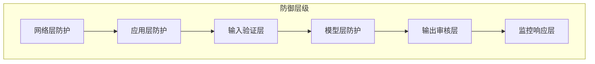
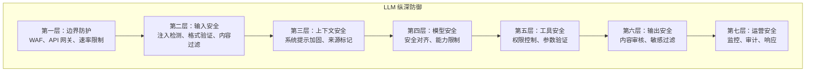
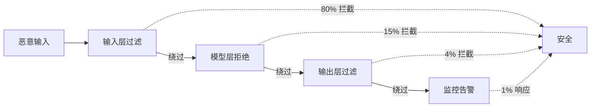
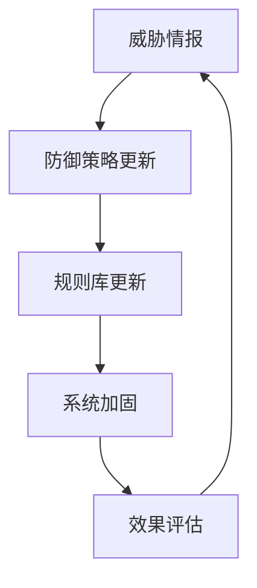

## 8.1 纵深防御原则

纵深防御（Defense in Depth）是安全领域的核心原则，在 LLM 安全中同样适用。

### 8.1.1 纵深防御概念

纵深防御通过多层独立的安全措施，确保单一防护失效时整体安全不被突破。

**层级示意**

```mermaid
flowchart TB
    subgraph "防御层级"
    A["网络层防护"] --> B["应用层防护"]
    B --> C["输入验证层"]
    C --> D["模型层防护"]
    D --> E["输出审核层"]
    E --> F["监控响应层"]
    end
```

图 8-1：纵深防御概念流程图

**核心理念**
| 原则 | 描述 |
|------|------|
| 多层防护 | 每层都提供独立的安全保障 |
| 独立失效 | 一层失效不影响其他层 |
| 互补机制 | 不同层使用不同检测技术 |
| 假设失败 | 假设任何一层可能被突破 |

### 8.1.2 LLM 安全防御层次

针对 LLM 应用的纵深防御架构：


```mermaid
flowchart TB
    subgraph "LLM 纵深防御"
    L1["第一层：边界防护<br/>WAF、API 网关、速率限制"]
    L2["第二层：输入安全<br/>注入检测、格式验证、内容过滤"]
    L3["第三层：上下文安全<br/>系统提示加固、来源标记"]
    L4["第四层：模型安全<br/>安全对齐、能力限制"]
    L5["第五层：工具安全<br/>权限控制、参数验证"]
    L6["第六层：输出安全<br/>内容审核、敏感过滤"]
    L7["第七层：运营安全<br/>监控、审计、响应"]

    L1 --> L2 --> L3 --> L4 --> L5 --> L6 --> L7
    end
```

图 8-2：LLM 安全防御层次架构图

### 8.1.3 各层防护详解

**边界防护层**
```
防护措施：
- Web 应用防火墙（WAF）
- API 网关安全策略
- DDoS 防护
- IP 白名单/黑名单
- 速率限制
```

**输入安全层**
```
防护措施：
- 提示注入检测
- 格式验证
- 长度限制
- 编码规范化
- 恶意内容过滤
```

> [!TIP]
> 开源工具参考：[LLM Guard](https://github.com/protectai/llm-guard) 提供开箱即用的输入扫描器（注入检测、有害内容、PII、越狱等）；[NeMo Guardrails](https://github.com/NVIDIA/NeMo-Guardrails) 支持通过可编程“护栏”对输入进行话题控制与安全过滤。

**上下文安全层**
```
防护措施：
- 系统提示强化
- 用户/数据来源标记
- 上下文隔离
- 会话安全管理
```

**模型安全层**
```
防护措施：
- 安全对齐的模型
- 能力限制
- 行为监控
- 模型版本控制
```

> [!TIP]
> 开源工具参考：[Llama Guard](https://github.com/meta-llama/PurpleLlama) 是 Meta 开源的安全分类模型系列。最新的 Llama Guard 3（基于 Llama 3.1-8B）支持 8 种语言和 14 个安全类别，还提供了 Llama Guard 3.2（1B 参数轻量版）和支持图像内容审核的 Vision 版本。可对输入提示和输出响应进行安全判定，适合作为模型层的独立安全检查组件。

**工具安全层**
```
防护措施：
- 最小权限
- 参数验证
- 操作确认
- 返回值检查
```

**输出安全层**
```
防护措施：
- 有害内容检测
- 敏感信息过滤
- 格式验证
- 幻觉检测
```

> [!TIP]
> 开源工具参考：[Microsoft Presidio](https://github.com/microsoft/presidio) 提供 PII 识别与脱敏能力，可部署在输出侧对模型响应进行敏感信息过滤；LLM Guard 同样提供输出扫描模块（有害内容、PII、相关性验证等）。

**运营安全层**
```
防护措施：
- 实时监控
- 日志审计
- 异常告警
- 事件响应
```

### 8.1.4 防御组合策略

不同威胁需要多层协同防护：

**提示注入防护**
| 层级 | 措施 |
|------|------|
| 输入层 | 注入模式检测 |
| 上下文层 | 来源标记区分 |
| 模型层 | 安全对齐抵抗 |
| 输出层 | 异常行为过滤 |

**数据泄露防护**
| 层级 | 措施 |
|------|------|
| 输入层 | 过滤信息提取请求 |
| 模型层 | 限制敏感信息复现 |
| 输出层 | PII 检测和脱敏 |
| 运营层 | 泄露事件监控 |

### 8.1.5 层间冗余设计

关键防护应在多层实施，避免单点失效：


```mermaid
flowchart LR
    A["恶意输入"] --> B["输入层过滤"]
    B --> |绕过| C["模型层拒绝"]
    C --> |绕过| D["输出层过滤"]
    D --> |绕过| E["监控告警"]

    B -.-> |"80% 拦截"| X["安全"]
    C -.-> |"15% 拦截"| X
    D -.-> |"4% 拦截"| X
    E -.-> |"1% 响应"| X
```

图 8-3：层间冗余设计流程图

即使每层只有部分有效，多层组合可以大幅提高整体安全性。

### 8.1.6 动态防御

纵深防御不是静态的，需要持续演进：


```mermaid
flowchart TB
    A["威胁情报"] --> B["防御策略更新"]
    B --> C["规则库更新"]
    C --> D["系统加固"]
    D --> E["效果评估"]
    E --> A
```

图 8-4：动态防御流程图

**动态调整原则**
- 根据新威胁调整防护策略
- 基于监控数据优化规则
- 定期进行安全评估
- 持续改进防御能力

### 8.1.7 攻击-防线快速对照表

下表从工程视角总结典型攻击与对应防线，便于快速定位防护措施：

| 攻击类别 | 主要目标 | 典型入口 | 关键防线（优先级由高到低） |
|----------|----------|----------|--------------------------|
| **直接提示注入/越狱** | 改写行为/绕过规则 | 用户输入 | 输入检测（分类器/规则）→ 输出验证 → 权限收敛 |
| **系统提示泄露** | 套出系统提示、策略、工具链信息 | 多轮追问/复述/总结 | 机密不入上下文 → 输出脱敏/拦截 → 日志/错误处理不回显 |
| **间接提示注入** | 借外部内容注入指令 | RAG 文档/网页/邮件 | 外部内容视为不可信数据 → 文档注入检测 → 上下文最小化 |
| **RAG 检索投毒** | 控制检索结果与回答 | 向量库/网络内容 | 来源白名单/信誉 → 检索过滤 → 异常检测 |
| **工具/智能体注入** | 诱导调用工具越权、外泄数据 | 工具调用、工作流 | 工具最小权限/参数约束 → 沙箱执行 → 审批/审计 |
| **不安全输出处理**| 触发 SQL/XSS/模板/命令注入 | 下游执行器 | 参数化/转义/静态检查/沙箱；**不要执行自由文本** |
| **训练数据投毒** | 植入后门/系统性偏差 | 预训练/微调数据 | 数据审核 → 供应链安全 → 行为监控 |
| **资源消耗/DoS** | 拉高成本/拖垮服务 | 超长输入/复杂推理 | 速率限制 → 输入长度限制 → 成本告警 |

> [!TIP]
> 此表可作为安全设计评审的检查清单。对于每种攻击类别，确保至少有一层有效防线。

### 8.1.8 防御成本与收益权衡

防御措施不可能全面覆盖，企业应根据业务风险等级与资源预算进行选择性部署。以下表格总结了常见防御措施的成本与效能，帮助团队做出理性决策：

| 防御措施 | 实施成本 | 延迟影响 | 防御效果 | 适用场景 |
|---------|---------|---------|---------|---------|
| **输入关键词过滤** | 低 | <1ms | 低（易绕过） | 所有场景的基础层，最低成本快速拦截 |
| **LLM 分类器检测** | 中 | 50-200ms | 中-高 | 高安全要求场景，如代码执行、金融建议 |
| **多模型交叉验证** | 高 | 200-500ms | 高 | 金融、医疗、法律等关键场景，对准确度要求极高 |
| **差分隐私训练** | 高 | 训练时间增加 2-5x | 中 | 涉及敏感个人数据的模型训练，长期合规需求 |
| **TEE 隔离推理** | 高 | 推理延迟增加 10-30% | 高 | 高合规要求场景（如医疗数据、财务系统）、硬件成本可控 |
| **实时监控与日志** | 中 | 10-50ms | 中 | 所有场景，用于事后分析与改进 |

**成本与收益的权衡原则**

1. **分层递进策略**
   - 从“最小可行安全集”开始部署：输入关键词过滤 + 实时监控。
   - 根据实际风险事件的发生情况，逐步增加 LLM 分类器等更强的防御手段。
   - 避免过度投资低风险场景，浪费资源。

2. **业务风险等级驱动**
   - **低风险场景**（如通用信息查询、创意写作）：仅需关键词过滤 + 基本监控。
   - **中等风险场景**（如代码生成、数据分析建议）：加入 LLM 分类器与敏感信息过滤。
   - **高风险场景**（如医疗诊断、金融交易、法律建议）：考虑多模型交叉验证、TEE 隔离、人工审核环节。

3. **延迟与用户体验权衡**
   - 关键词过滤的 <1ms 延迟对用户体验无感。
   - LLM 分类器的 50-200ms 延迟可以接受，但在实时对话场景需要异步处理或流式反馈。
   - 多模型交叉验证的 200-500ms 延迟适合非实时场景（如批量审核、定时检查）。

4. **组织能力与技术成熟度**
   - 如果团队 ML 工程化能力薄弱，直接跳到“多模型交叉验证”会导致高昂的维护成本与频繁失效。
   - 建议先在关键词过滤与 LLM 分类器阶段积累经验，再考虑更复杂的方案。

5. **定期复盘与优化**
   - 每个季度复盘实际发生的安全事件，评估现有防御的有效性。
   - 如果某类攻击频繁突破，主动升级该类防御的强度，而不是盲目增加所有防御。
   - 如果某类防御长期无事件触发，考虑适度削减成本。

**企业部署建议清单**

- [ ] 第 1 阶段（第 1-2 个月）：部署输入关键词过滤 + 结构化监控日志
- [ ] 第 2 阶段（第 2-3 个月）：加入 LLM 分类器或 Llama Guard 进行更精细的检测
- [ ] 第 3 阶段（第 3-6 个月）：根据监控数据，对高风险路径加入输出侧敏感信息过滤
- [ ] 第 4 阶段（长期）：评估多模型交叉验证、差分隐私等高投入防御的必要性

纵深防御是 LLM 安全的核心框架，但不是“大而全”的堆砌。后续各节将详细介绍各层的具体实现。

### 8.1.9 防御措施成本效益对照

不同的防御措施在实施复杂度、性能影响、计算成本和误报风险等方面存在显著差异。以下表格汇总主要防御措施的成本效益评估，帮助团队做出理性的优先级决策：

| 防御措施 | 实施复杂度 | 延迟影响 | 计算成本 | 误报风险 | 推荐优先级 |
|---------|----------|---------|---------|---------|----------|
| 输入长度限制 | 低 | <1ms | 极低 | 低 | P0（必选） |
| 关键词/正则过滤 | 低 | <5ms | 低 | 中-高 | P0（必选） |
| 编码规范化 | 低 | <2ms | 极低 | 极低 | P0（必选） |
| 输出内容过滤 | 中 | 10-50ms | 低 | 中 | P0（必选） |
| LLM 语义检测 | 高 | 100-500ms | 高 | 低-中 | P1（推荐） |
| 多模型交叉验证 | 高 | 200-1000ms | 很高 | 低 | P2（增强） |
| RAG 来源校验 | 中 | 10-30ms | 低 | 低 | P1（推荐） |
| 差分隐私（DP-SGD） | 高 | 训练时 | 很高 | N/A | P2（高敏场景） |
| TEE 隔离推理 | 很高 | 10-30% | 很高 | 极低 | P2（高敏场景） |

> **注意**：以上数据为典型范围估计，实际值取决于模型规模、硬件配置和业务场景。建议在选型时进行基准测试。
