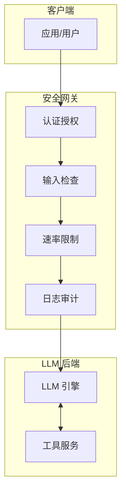
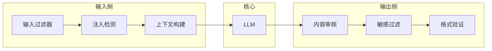
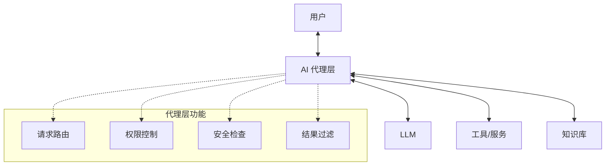
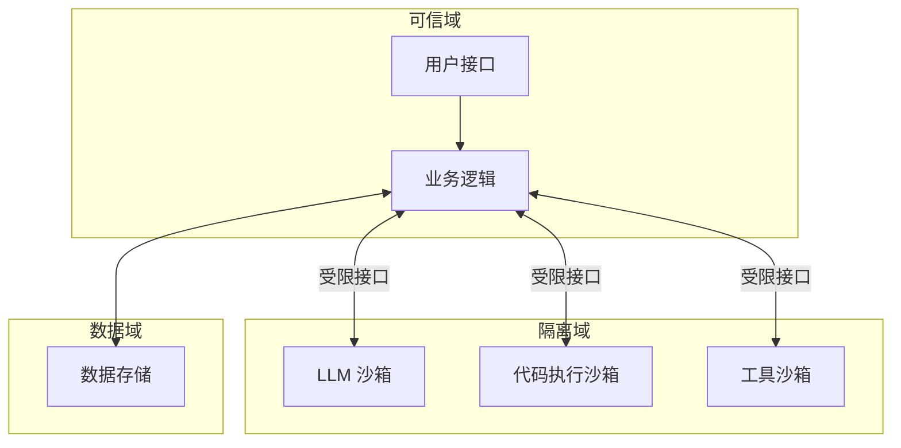
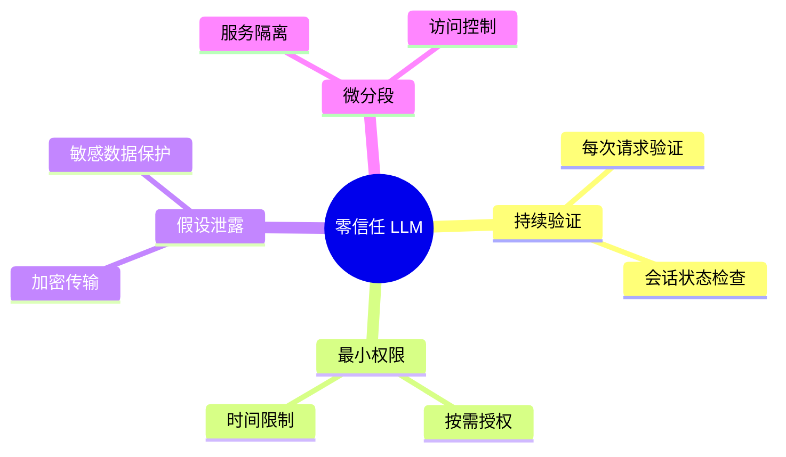
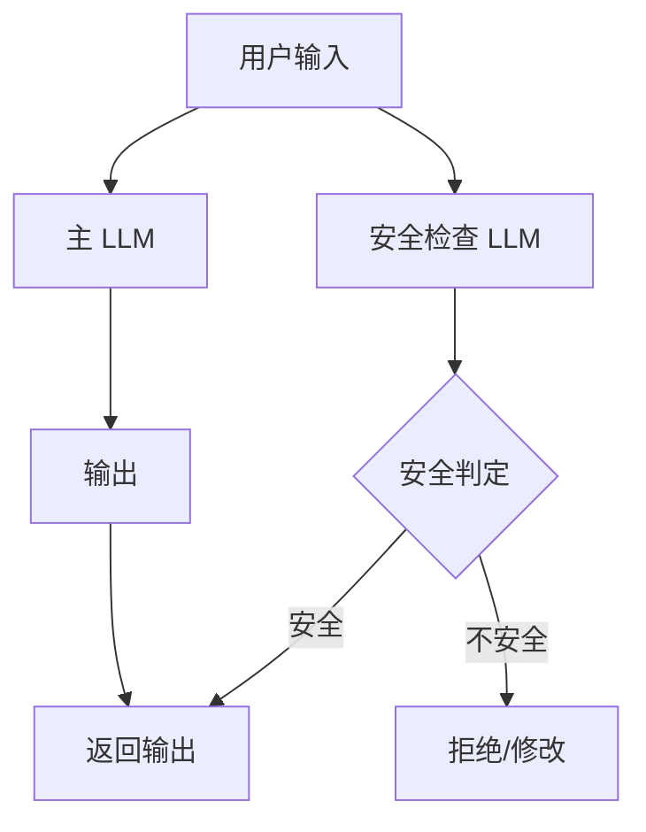

## 8.2 大语言模型安全架构模式

本节介绍经过验证的 LLM 安全架构模式，为系统设计提供参考。

### 8.2.1 网关模式

所有与 LLM 的交互都经过安全网关，实现集中的安全控制。

**架构图**：



图 8-1：网关模式架构图

**优势**：

| 优势 | 描述 |
|------|------|
| 集中控制 | 统一的安全策略管理 |
| 简化运维 | 安全组件独立部署 |
| 易于扩展 | 可添加新的安全组件 |
| 完整日志 | 所有请求都有记录 |

**适用场景**：

- API 服务形式提供 LLM 能力
- 多个应用共享 LLM 服务
- 需要统一的安全策略

### 8.2.2 三明治模式

在输入和输出两端都部署安全层，形成"三明治"结构。

**架构图**：



图 8-2：三明治模式架构图

**设计要点**：

```
输入侧：
- 验证输入格式和长度
- 检测恶意注入
- 规范化和清洗输入
- 构建安全的上下文

输出侧：
- 检查有害内容
- 过滤敏感信息
- 验证输出格式
- 添加安全标记
```

### 8.2.3 代理模式

在用户和 LLM 之间引入代理层，处理所有直接交互。

**架构图**：



图 8-3：代理模式架构图

**优势**：

- 解耦用户与 LLM 的直接交互
- 可以实现复杂的业务逻辑
- 支持多 LLM 后端
- 便于实施精细权限控制

### 8.2.4 隔离模式

将高风险操作隔离到独立的安全域中执行。

**架构图**：



图 8-4：隔离模式架构图

**隔离机制**：

| 隔离类型 | 描述 |
|----------|------|
| 进程隔离 | 独立进程运行 |
| 容器隔离 | Docker/K8s 容器 |
| 网络隔离 | 限制网络访问 |
| 资源隔离 | 限制 CPU/内存 |

### 8.2.5 零信任模式

采用零信任原则，不预设信任任何组件。

**核心原则**：



图 8-5：零信任模式思维导图

**实施要点**：

```
1. 持续验证身份
- 不依赖网络位置
- 每次调用都验证

2. 最小权限原则
- 仅授予必要权限
- 权限按需临时授予

3. 假设已被入侵
- 加密所有敏感数据
- 限制数据访问范围

4. 细粒度访问控制
- 基于属性的访问控制
- 实时策略评估
```

### 8.2.6 多模型检查模式

使用多个模型相互验证，提高安全性。

**架构图**：



图 8-6：多模型检查模式架构图

**应用示例**：

- 使用独立 LLM 检查输入是否安全
- 使用独立 LLM 验证输出是否合规
- 多个 LLM 投票决定行动

### 8.2.7 架构选型建议

根据场景选择合适的架构模式：

| 场景 | 推荐模式 |
|------|----------|
| API 服务 | 网关模式 |
| 通用应用 | 三明治模式 |
| 复杂系统 | 代理模式 |
| 高安全需求 | 隔离模式 + 零信任 |
| 内容审核严格 | 多模型检查模式 |

实际系统通常需要组合多种模式。
