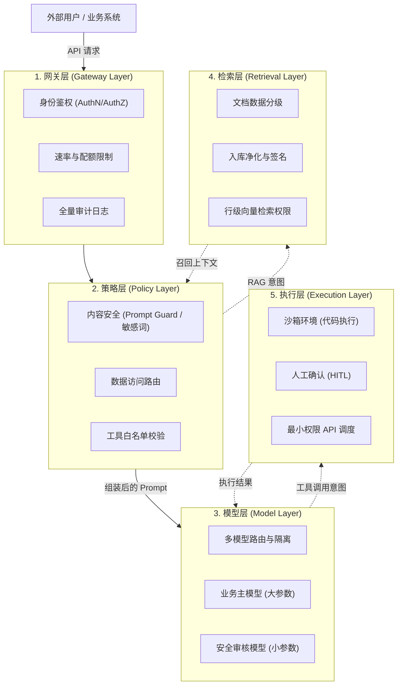
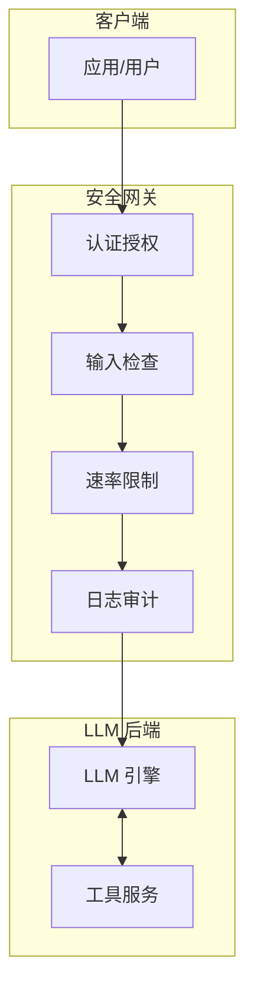
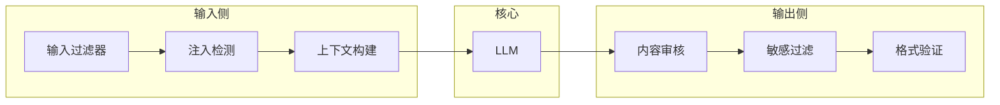
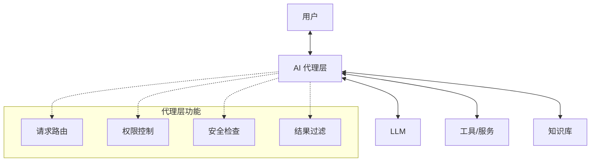
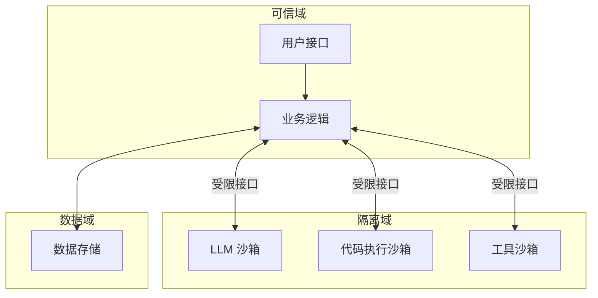
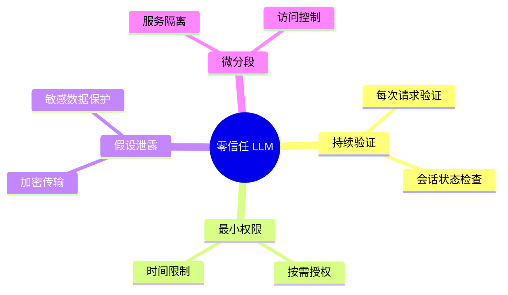
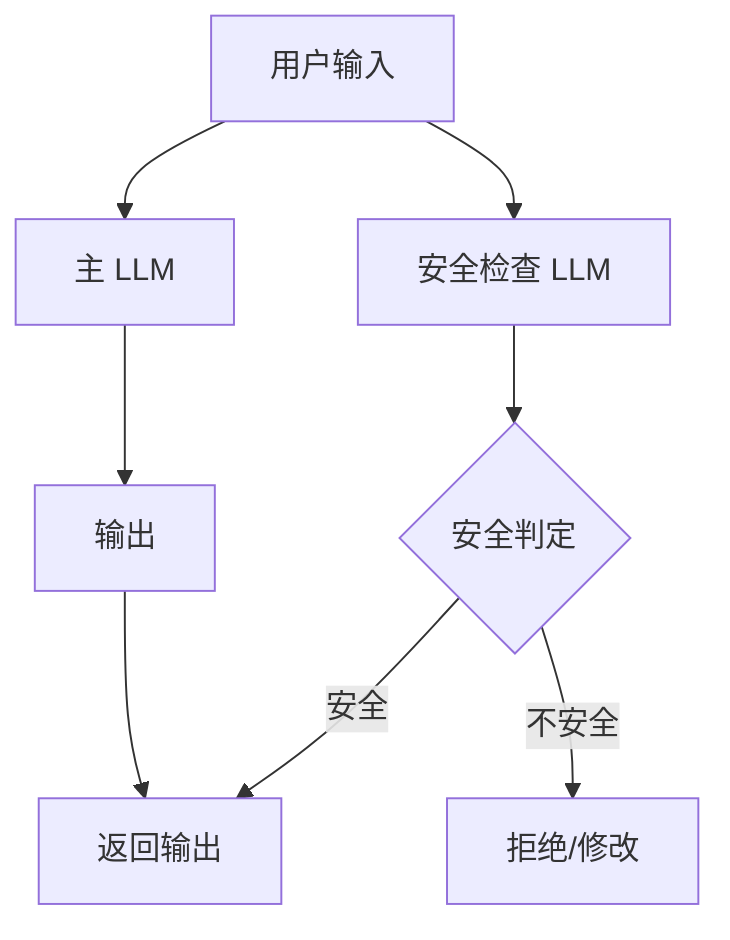

## 8.2 大语言模型安全架构模式

本节介绍经过验证的 LLM 安全架构模式，为企业级系统设计提供基础与参考。首先，我们将完整描绘一个典型的“参考架构图”与各组件的安全责任边界。

### 8.2.1 企业级 LLM 安全参考架构与责任边界

在构建复杂的大模型应用（特别是 Agent 和 RAG 系统）时，安全控制不应集中在单一部件，而必须按层解耦。以下是标准的“五层安全参考架构”及各层严格的安全责任边界：

**参考架构图**


```mermaid
flowchart TB
    User["外部用户 / 业务系统"]
    
    subgraph L1 ["1. 网关层 (Gateway Layer)"]
        G_Auth["身份鉴权 (AuthN/AuthZ)"]
        G_Rate["速率与配额限制"]
        G_Audit["全量审计日志"]
    end
    
    subgraph L2 ["2. 策略层 (Policy Layer)"]
        P_Content["内容安全 (Prompt Guard / 敏感词)"]
        P_Access["数据访问路由"]
        P_Tool["工具白名单校验"]
    end
    
    subgraph L4 ["4. 检索层 (Retrieval Layer)"]
        R_Classify["文档数据分级"]
        R_Clean["入库净化与签名"]
        R_RBAC["行级向量检索权限"]
    end
    
    subgraph L3 ["3. 模型层 (Model Layer)"]
        M_Router["多模型路由与隔离"]
        M_Main["业务主模型 (大参数)"]
        M_Sec["安全审核模型 (小参数)"]
    end
    
    subgraph L5 ["5. 执行层 (Execution Layer)"]
        E_Sandbox["沙箱环境 (代码执行)"]
        E_HITL["人工确认 (HITL)"]
        E_LeastPriv["最小权限 API 调度"]
    end
    
    User -->|API 请求| L1
    L1 --> L2
    
    L2 -.->|RAG 意图| L4
    L4 -.->|召回上下文| L2
    
    L2 -->|组装后的 Prompt| L3
    
    L3 -.->|工具调用意图| L5
    L5 -.->|执行结果| L3
```

**组件责任边界定义**

| 架构分层 | 核心安全责任边界 (What they MUST do) | 典型开源/商业组件支持 |
|----------|--------------------------------------|-----------------------|
| **网关层**|**拒绝未授权访问与资源耗尽攻击**。负责完成身份认证、令牌校验（JWT）、并发/Token 配额控制，统一打点并生成带有 `request_id` 的基础审计日志。 | Kong, API7, Cloudflare AI Gateway |
| **策略层**|**阻断恶意载荷与违规行为意图**。负责对 Prompt 进行注入检测分类、敏感信息（PII）双向脱敏与过滤，核验所请求的工具是否在允许的白名单内。 | NeMo Guardrails, LLM Guard |
| **模型层**|**保障推理过程的安全对齐隔离**。负责基于策略层指令，对高低安全需求会话进行路由隔离；不把所有鸡蛋放在一个模型篮子里，主模型专司生成，轻量安全模型专司审核。 | Llama Guard, vLLM, LiteLLM |
| **检索层**|**收敛间接注入与越权数据暴露风险**。文档入库前必须验签与净化（防隐藏指令）；多租户检索时强制附加身份 Token，实现向量数据的行级（Row-level）隔离。 | Milvus/Pinecone (配合 RBAC), LlamaIndex |
| **执行层**|**防御最终的系统级破坏**。不信任 LLM 的任何编排结果。代码必须在瞬态沙箱中运行；非只读的破坏性 API 操作必须由最小权限凭证执行，并在关键节点拉起审批流（HITL）。 | E2B Sandbox, Docker, LangChain Tools |

明确上述责任边界后，组织可以根据自身应用的复杂度，选择下文所述的各种简化或专门化的网络架构模式。

### 8.2.2 网关模式

所有与 LLM 的交互都经过安全网关，实现集中的安全控制。

**架构图**

```mermaid
flowchart TB
    subgraph "客户端"
    A["应用/用户"]
    end

    subgraph "安全网关"
    B["认证授权"]
    C["输入检查"]
    D["速率限制"]
    E["日志审计"]
    end

    subgraph "LLM 后端"
    F["LLM 引擎"]
    G["工具服务"]
    end

    A --> B --> C --> D --> E --> F
    F <--> G
```

图 8-5：网关模式架构图

**优势**
| 优势 | 描述 |
|------|------|
| 集中控制 | 统一的安全策略管理 |
| 简化运维 | 安全组件独立部署 |
| 易于扩展 | 可添加新的安全组件 |
| 完整日志 | 所有请求都有记录 |

**适用场景**
- API 服务形式提供 LLM 能力
- 多个应用共享 LLM 服务
- 需要统一的安全策略

> [!TIP]
> 开源工具参考：[NeMo Guardrails](https://github.com/NVIDIA/NeMo-Guardrails) 和 [LLM Guard](https://github.com/protectai/llm-guard) 均可作为网关安全组件集成，前者提供可编程对话护栏，后者提供即插即用的输入输出扫描器。

### 8.2.3 三明治模式

在输入和输出两端都部署安全层，形成“三明治”结构。

**架构图**

```mermaid
flowchart LR
    subgraph "输入侧"
    A["输入过滤器"]
    B["注入检测"]
    C["上下文构建"]
    end

    subgraph "核心"
    D["LLM"]
    end

    subgraph "输出侧"
    E["内容审核"]
    F["敏感过滤"]
    G["格式验证"]
    end

    A --> B --> C --> D --> E --> F --> G
```

图 8-6：三明治模式架构图

**设计要点**
```
输入侧：
- 验证输入格式和长度
- 检测恶意注入
- 规范化和清洗输入
- 构建安全的上下文

输出侧：
- 检查有害内容
- 过滤敏感信息
- 验证输出格式
- 添加安全标记
```

### 8.2.4 代理模式

在用户和 LLM 之间引入代理层，处理所有直接交互。

**架构图**

```mermaid
flowchart TB
    A["用户"] <--> B["AI 代理层"]
    B <--> C["LLM"]
    B <--> D["工具/服务"]
    B <--> E["知识库"]

    subgraph "代理层功能"
    F["请求路由"]
    G["权限控制"]
    H["安全检查"]
    I["结果过滤"]
    end

    B -.-> F
    B -.-> G
    B -.-> H
    B -.-> I
```

图 8-7：代理模式架构图

**优势**
- 解耦用户与 LLM 的直接交互
- 可以实现复杂的业务逻辑
- 支持多 LLM 后端
- 便于实施精细权限控制

### 8.2.5 隔离模式

将高风险操作隔离到独立的安全域中执行。

**架构图**

```mermaid
flowchart TB
    subgraph "可信域"
    A["用户接口"]
    B["业务逻辑"]
    end

    subgraph "隔离域"
    C["LLM 沙箱"]
    D["代码执行沙箱"]
    E["工具沙箱"]
    end

    subgraph "数据域"
    F["数据存储"]
    end

    A --> B
    B <--> |受限接口| C
    B <--> |受限接口| D
    B <--> |受限接口| E
    B <--> F
```

图 8-8：隔离模式架构图

**隔离机制**
| 隔离类型 | 描述 |
|----------|------|
| 进程隔离 | 独立进程运行 |
| 容器隔离 | Docker/K8 s 容器 |
| 网络隔离 | 限制网络访问 |
| 资源隔离 | 限制 CPU/内存 |

### 8.2.6 零信任模式

采用零信任原则，不预设信任任何组件。

**核心原则**

```mermaid
mindmap
  root((零信任 LLM))
    持续验证
      每次请求验证
      会话状态检查
    最小权限
      按需授权
      时间限制
    假设泄露
      加密传输
      敏感数据保护
    微分段
      服务隔离
      访问控制
```

图 8-9：零信任模式思维导图

**实施要点**
```
1. 持续验证身份
- 不依赖网络位置
- 每次调用都验证

2. 最小权限原则
- 仅授予必要权限
- 权限按需临时授予

3. 假设已被入侵
- 加密所有敏感数据
- 限制数据访问范围

4. 细粒度访问控制
- 基于属性的访问控制
- 实时策略评估
```

### 8.2.7 多模型检查模式

使用多个模型相互验证，提高安全性。

**架构图**

```mermaid
flowchart TB
    A["用户输入"] --> B["主 LLM"]
    A --> C["安全检查 LLM"]

    B --> D["输出"]
    C --> E{"安全判定"}

    E --> |安全| F["返回输出"]
    E --> |不安全| G["拒绝/修改"]

    D --> F
```

图 8-10：多模型检查模式架构图

**应用示例**
- 使用独立 LLM 检查输入是否安全
- 使用独立 LLM 验证输出是否合规
- 多个 LLM 投票决定行动

> [!TIP]
> 开源工具参考：[Llama Guard](https://github.com/meta-llama/PurpleLlama) 系列（最新为 Llama Guard 3，支持 8 种语言、14 个安全类别）本身就是一个安全分类模型，非常适合作为”安全检查 LLM”角色部署在多模型检查架构中。

### 8.2.8 架构选型建议

根据场景选择合适的架构模式：

| 场景 | 推荐模式 |
|------|----------|
| API 服务 | 网关模式 |
| 通用应用 | 三明治模式 |
| 复杂系统 | 代理模式 |
| 高安全需求 | 隔离模式 + 零信任 |
| 内容审核严格 | 多模型检查模式 |

实际系统通常需要组合多种模式。

### 8.2.9 最小可行安全集

对于资源有限的团队，以下是分阶段实施安全防护的建议路线图：

**第一阶段：基础防护（1-2 周内完成，适用于所有 LLM 应用）**
- [ ] 输入长度限制和格式验证
- [ ] 基础关键词过滤（已知攻击模式）
- [ ] 输出内容过滤（有害内容、PII 检测）
- [ ] 基本日志记录（请求/响应元数据、不记录原始内容）
- [ ] 速率限制（Rate Limiting）

**第二阶段：标准防护（1-2 月内完成，适用于面向用户的应用）**
- [ ] System Prompt 加固（三明治结构、指令边界标记）
- [ ] LLM 语义级注入检测
- [ ] 输出幻觉基础检测
- [ ] 结构化日志和基础告警
- [ ] 工具调用权限控制
- [ ] 定期人工安全审查

**第三阶段：增强防护（3-6 月内完成，适用于高风险/大规模应用）**
- [ ] 多模型交叉验证
- [ ] RAG 来源校验和文档级权限控制
- [ ] 自动化红队测试（CI/CD 集成）
- [ ] 完整的安全监控体系
- [ ] 事件响应流程和剧本
- [ ] 隐私增强技术（按需）

> **优先级原则**：先实施成本低、效果明确的基础措施，再逐步引入高级防护。安全投入应与业务风险等级匹配——面向内部用户的工具可以采用较轻量的防护，而面向公众的高风险应用则需要全面防护。
