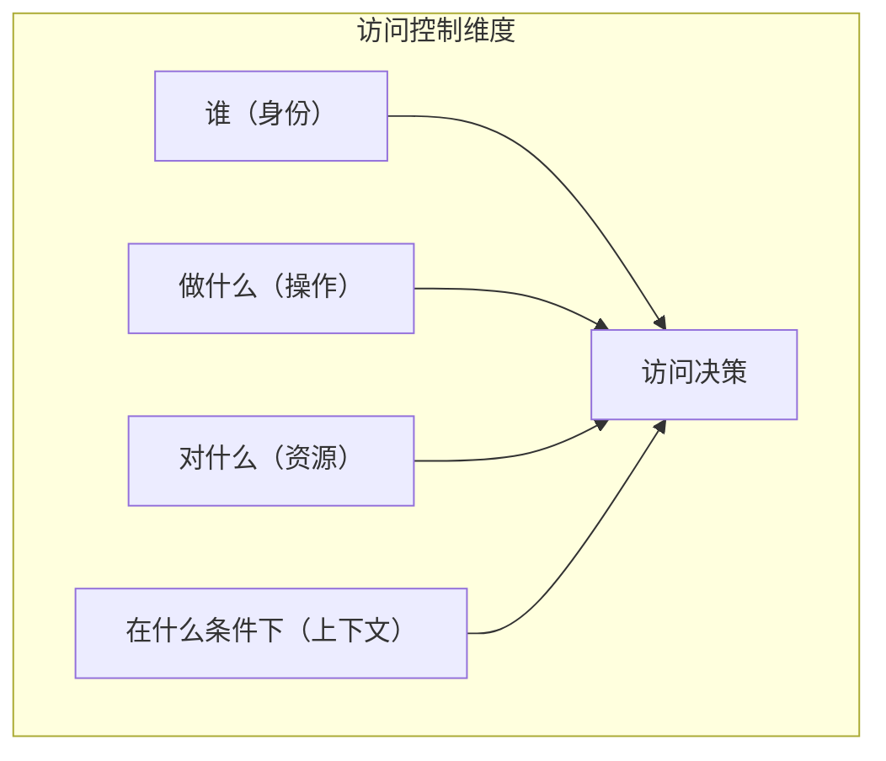
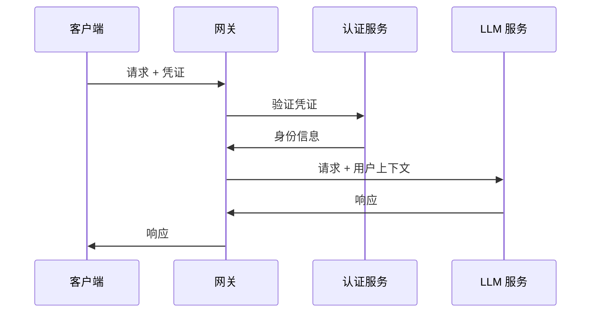
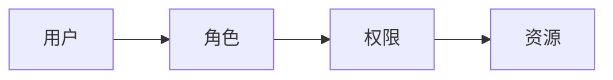
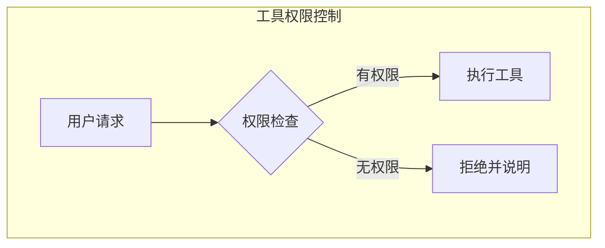
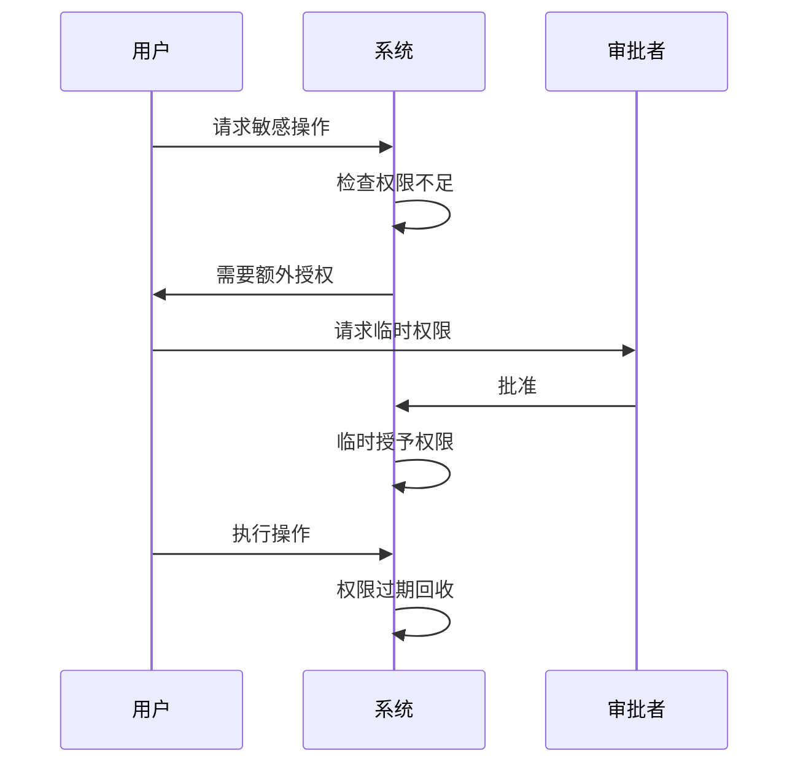
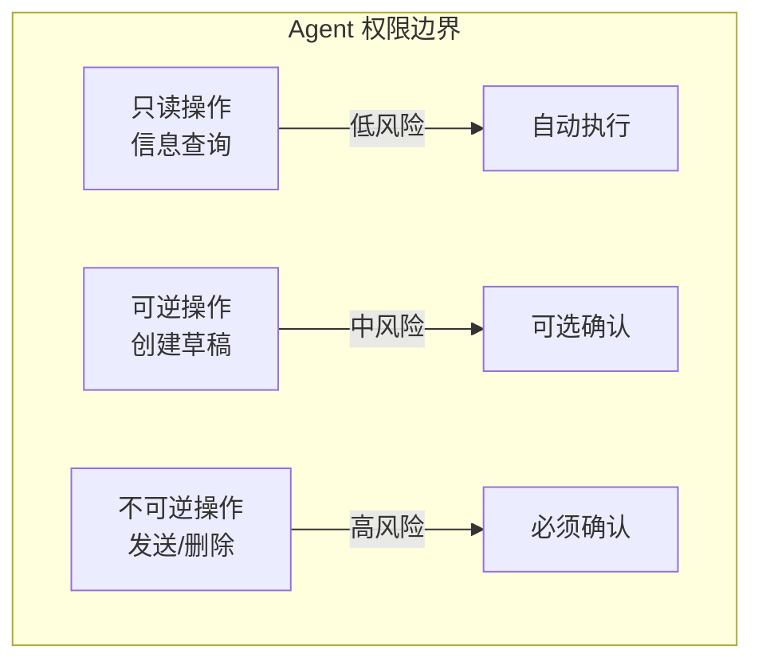
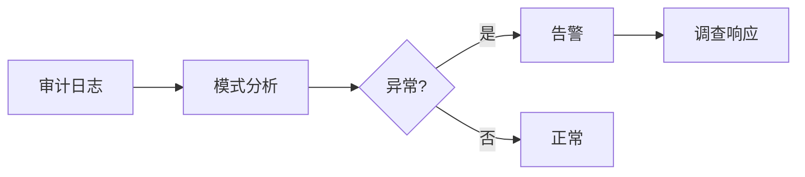

## 8.3 权限与访问控制

细粒度的权限控制是 LLM 安全的关键组成部分，尤其在 Agent 场景中更为重要。

### 8.3.1 访问控制基础

LLM 系统的访问控制需要考虑多个维度：



图 8-1：访问控制基础流程图

### 8.3.2 身份认证

确认访问者的身份是访问控制的前提。

**认证方式**：

| 方式 | 适用场景 |
|------|----------|
| API Key | 机器对机器调用 |
| OAuth 2.0 | 第三方应用授权 |
| JWT | 会话状态传递 |
| 多因素认证 | 高安全场景 |

**认证流程示例**：



图 8-2：身份认证时序图

### 8.3.3 授权模型

**基于角色的访问控制（RBAC）**：



图 8-3：授权模型架构图

角色定义示例：

| 角色 | 权限 |
|------|------|
| 普通用户 | 基础对话、有限工具 |
| 高级用户 | 全部对话、更多工具 |
| 管理员 | 系统配置、日志查看 |

**基于属性的访问控制（ABAC）**：

```
策略示例：
如果 用户部门 = "研发" 
且 资源类型 = "代码生成"
且 时间 在 工作时间内
则 允许访问
```

ABAC 提供更灵活的控制，适合复杂场景。

### 8.3.4 LLM 特有的权限控制

**能力权限**：

```
不同用户可使用的 LLM 能力不同：

普通用户：
- 文本对话 ✓
- 代码生成 ✗
- 联网搜索 ✗

开发者用户：
- 文本对话 ✓
- 代码生成 ✓
- 联网搜索 ✓
```

**工具权限**：



图 8-4：LLM 特有的权限控制流程图

**数据权限**：

```
知识库访问权限：
- 公开文档：所有用户
- 内部文档：员工
- 机密文档：指定人员
```

### 8.3.5 上下文相关的权限

权限决策可能依赖于运行时上下文：

**条件权限**：

| 条件 | 权限调整 |
|------|----------|
| 时间 | 工作时间外限制敏感操作 |
| 地点 | 特定地点允许更多权限 |
| 设备 | 托管设备有更高权限 |
| 风险评分 | 高风险行为需要确认 |

**动态权限升级**：



图 8-5：上下文相关的权限时序图

### 8.3.6 Agent 权限设计

Agent 系统的权限控制尤为关键：

**权限边界**：



图 8-6：Agent 权限设计流程图

**分级执行策略**：

```
Level 0：无需确认
- 读取公开信息
- 格式转换

Level 1：日志记录
- 读取用户数据
- 调用只读 API

Level 2：用户确认
- 发送消息
- 修改数据

Level 3：多因素确认
- 执行交易
- 删除数据
```

### 8.3.7 权限审计与监控

**审计日志**：

```
记录内容：
- 谁：用户身份
- 何时：时间戳
- 做了什么：操作类型
- 对什么：目标资源
- 结果：成功/失败
- 上下文：相关信息
```

**异常检测**：



图 8-7：权限审计与监控流程图

**监控指标**：

| 指标 | 描述 |
|------|------|
| 权限拒绝率 | 被拒绝的请求比例 |
| 权限升级频率 | 请求额外权限的频率 |
| 异常行为率 | 可疑行为的比例 |

权限与访问控制是 LLM 安全的基础设施。良好的权限设计可以显著降低安全风险。
