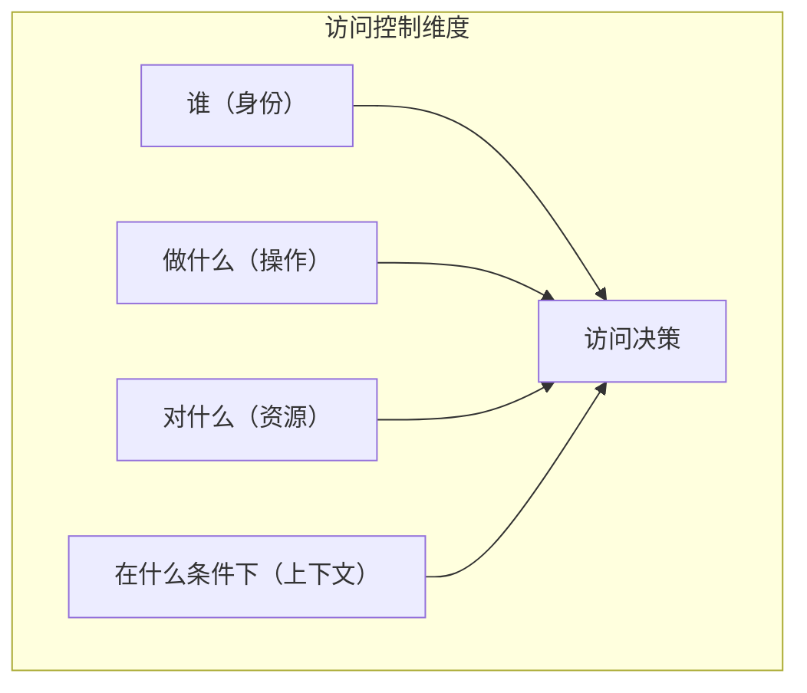
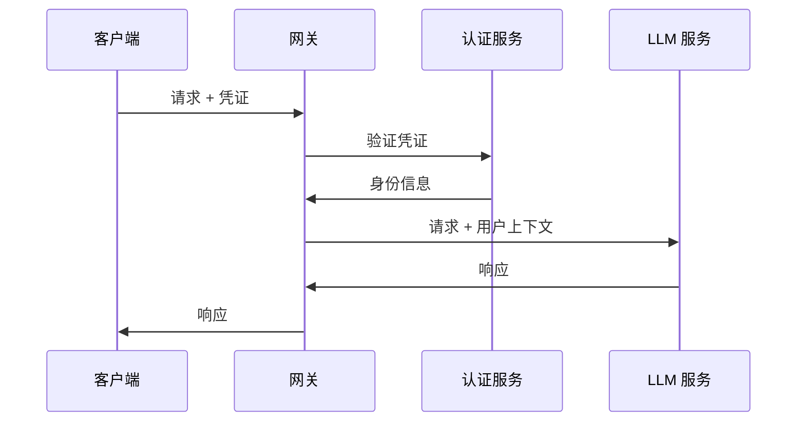
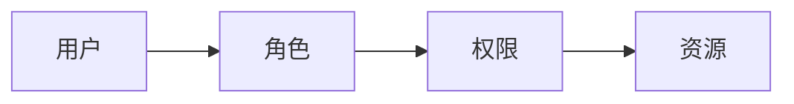
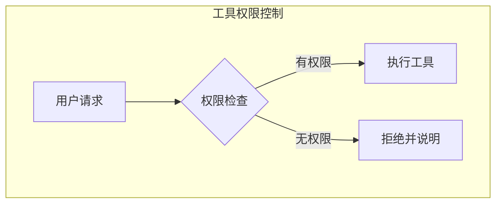
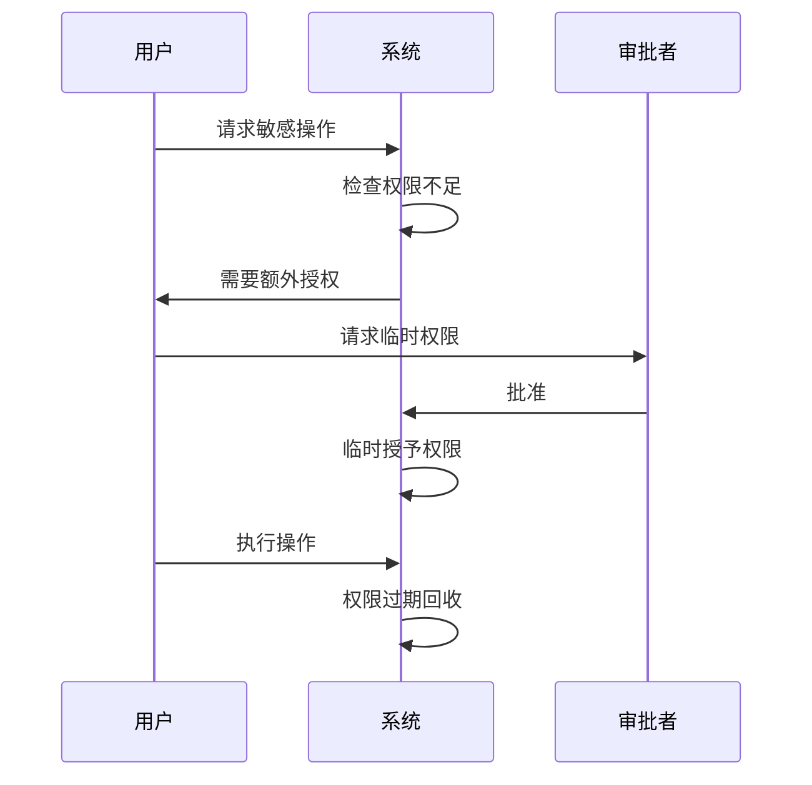
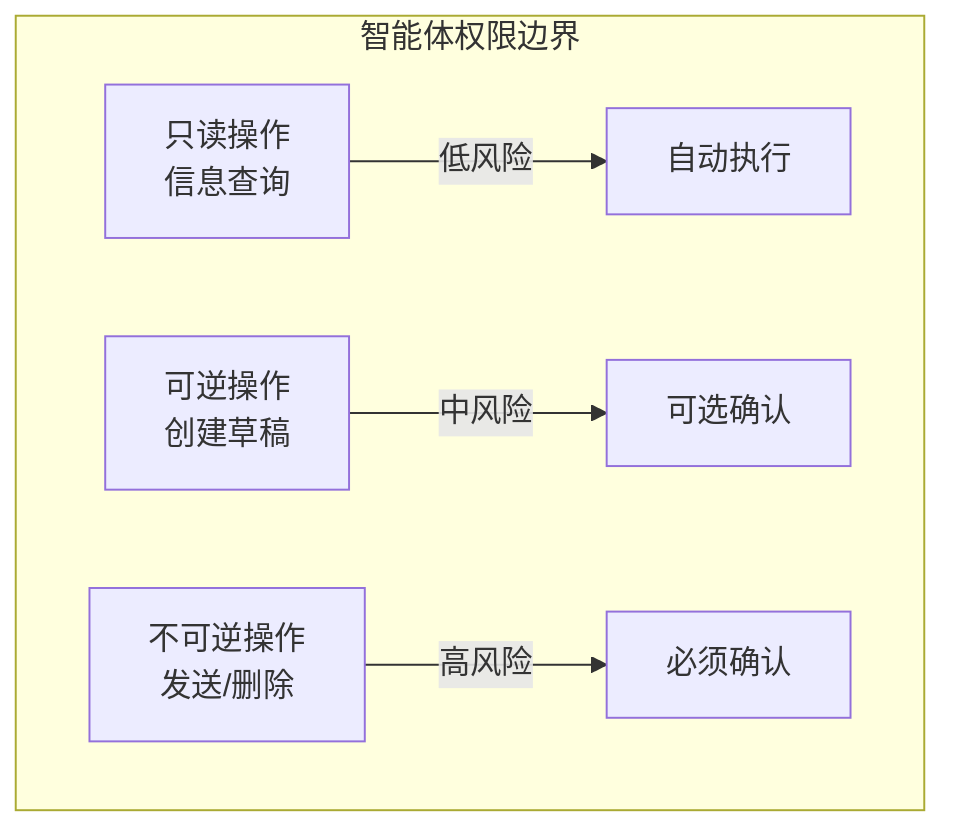
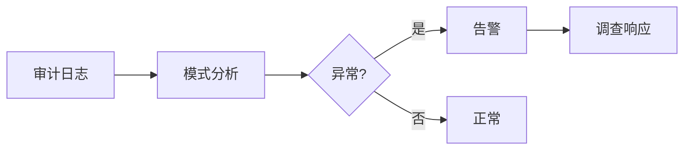

## 8.3 权限与访问控制

细粒度的权限控制是 LLM 安全的关键组成部分，尤其在智能体场景中更为重要。

### 8.3.1 访问控制基础

LLM 系统的访问控制需要考虑多个维度：


```mermaid
graph TB
    subgraph "访问控制维度"
    A["谁（身份）"] --> E["访问决策"]
    B["做什么（操作）"] --> E
    C["对什么（资源）"] --> E
    D["在什么条件下（上下文）"] --> E
    end
```

图 8-11：访问控制基础流程图

### 8.3.2 身份认证

确认访问者的身份是访问控制的前提。

**认证方式**
| 方式 | 适用场景 |
|------|----------|
| API Key | 机器对机器调用 |
| OAuth 2.0 | 第三方应用授权 |
| JWT | 会话状态传递 |
| 多因素认证 | 高安全场景 |

**认证流程示例**

```mermaid
sequenceDiagram
    participant C as 客户端
    participant G as 网关
    participant A as 认证服务
    participant L as LLM 服务
    
    C->>G: 请求 + 凭证
    G->>A: 验证凭证
    A->>G: 身份信息
    G->>L: 请求 + 用户上下文
    L->>G: 响应
    G->>C: 响应
```

图 8-12：身份认证时序图

### 8.3.3 授权模型

**基于角色的访问控制（RBAC）**

```mermaid
graph LR
    A["用户"] --> B["角色"]
    B --> C["权限"]
    C --> D["资源"]
```

图 8-13：授权模型架构图

角色定义示例：

| 角色 | 权限 |
|------|------|
| 普通用户 | 基础对话、有限工具 |
| 高级用户 | 全部对话、更多工具 |
| 管理员 | 系统配置、日志查看 |

**基于属性的访问控制（ABAC）**
```
策略示例：
如果 用户部门 = "研发" 
且 资源类型 = "代码生成"
且 时间 在 工作时间内
则 允许访问
```

ABAC 提供更灵活的控制，适合复杂场景。

> [!TIP]
> 开源工具参考：[OPA（Open Policy Agent）](https://github.com/open-policy-agent/opa)是云原生通用策略引擎，使用 Rego 语言编写策略，非常适合在 LLM 网关中实现 RBAC/ABAC 访问控制；[Casbin](https://github.com/casbin/casbin) 是支持多种编程语言的高效访问控制框架，适合在业务层管控“谁能调用哪个模型执行什么操作”。

### 8.3.4 LLM 特有的权限控制

**能力权限**
```
不同用户可使用的 LLM 能力不同：

普通用户：
- 文本对话 ✓
- 代码生成 ✗
- 联网搜索 ✗

开发者用户：
- 文本对话 ✓
- 代码生成 ✓
- 联网搜索 ✓
```

**工具权限**

```mermaid
flowchart TB
    subgraph "工具权限控制"
    A["用户请求"] --> B{"权限检查"}
    B --> |有权限| C["执行工具"]
    B --> |无权限| D["拒绝并说明"]
    end
```

图 8-14：LLM 特有的权限控制流程图

**数据权限**
```
知识库访问权限：
- 公开文档：所有用户
- 内部文档：员工
- 机密文档：指定人员
```

### 8.3.5 上下文相关的权限

权限决策可能依赖于运行时上下文：

**条件权限**
| 条件 | 权限调整 |
|------|----------|
| 时间 | 工作时间外限制敏感操作 |
| 地点 | 特定地点允许更多权限 |
| 设备 | 托管设备有更高权限 |
| 风险评分 | 高风险行为需要确认 |

**动态权限升级**

```mermaid
sequenceDiagram
    participant U as 用户
    participant S as 系统
    participant A as 审批者
    
    U->>S: 请求敏感操作
    S->>S: 检查权限不足
    S->>U: 需要额外授权
    U->>A: 请求临时权限
    A->>S: 批准
    S->>S: 临时授予权限
    U->>S: 执行操作
    S->>S: 权限过期回收
```

图 8-15：上下文相关的权限时序图

### 8.3.6 智能体权限设计

智能体系统的权限控制尤为关键：

**权限边界**

```mermaid
flowchart TB
    subgraph "智能体权限边界"
    A["只读操作<br/>信息查询"] --> |低风险| D["自动执行"]
    B["可逆操作<br/>创建草稿"] --> |中风险| E["可选确认"]
    C["不可逆操作<br/>发送/删除"] --> |高风险| F["必须确认"]
    end
```

图 8-16：智能体权限设计流程图

**分级执行策略**
```
Level 0：无需确认
- 读取公开信息
- 格式转换

Level 1：日志记录
- 读取用户数据
- 调用只读 API

Level 2：用户确认
- 发送消息
- 修改数据

Level 3：多因素确认
- 执行交易
- 删除数据
```

### 8.3.6 多租户向量数据库安全

在多租户 LLM 应用中，向量数据库（Vector DB）常被用来存储和检索知识库、用户文档等数据。多租户场景下的向量库隔离至关重要，否则会出现跨租户数据泄露或相互污染：

#### 跨租户检索中毒

攻击者可能通过共享向量库中的恶意文档影响其他租户的检索结果：
- 在向量库中注入带有隐蔽恶意指令的文档（如精心设计的 RAG 投毒）。
- 当其他租户发起查询时，检索系统返回这些恶意文档，从而在 LLM 的上下文中引入攻击载荷。

#### 防御措施

**物理隔离**
- 每个租户使用**独立的向量索引**（Collection/Namespace），而非共享一个全局索引。
- 独立索引意味着物理分离，A 租户的查询无法跨越到 B 租户的向量空间。

**逻辑隔离**
- 在检索查询中强制附加租户标识过滤条件（如 `WHERE tenant_id = current_user.tenant_id`）。
- 即使向量库在物理上可能有重叠，逻辑层的租户过滤确保返回结果属于当前租户。

**结果验证**
- 检索返回结果后，验证每个文档的所有权标签（ownership metadata）。
- 确认 `owner_tenant_id` 匹配当前请求的租户，否则拒绝该文档被纳入后续 LLM 推理。

#### 缓存污染风险

共享缓存（如 Redis、Memcached）可能导致一个租户的查询结果被另一个租户错误地获取：

**风险场景**
- 租户 A 查询“机密数据”，结果被缓存。
- 租户 B 发起相同查询（或相似的语义向量），从缓存中获取了 A 的结果，导致跨租户泄露。

**防御策略**
- **缓存键必须包含租户标识**：将 `tenant_id` 作为缓存键的一部分（如 `cache_key = f"search:{tenant_id}:{query_hash}"`）。
- **敏感场景禁用共享缓存**：对于涉及高度机密数据的查询或租户，禁用跨租户共享缓存，每次都从向量库直接检索。
- **缓存失效策略**：当租户的数据发生变更时，及时清除相关的缓存条目，避免过时的错误信息被返回。

### 8.3.7 权限审计与监控

**审计日志**
```
记录内容：
- 谁：用户身份
- 何时：时间戳
- 做了什么：操作类型
- 对什么：目标资源
- 结果：成功/失败
- 上下文：相关信息
```

**异常检测**

```mermaid
flowchart LR
    A["审计日志"] --> B["模式分析"]
    B --> C{"异常?"}
    C --> |是| D["告警"]
    C --> |否| E["正常"]
    D --> F["调查响应"]
```

图 8-17：权限审计与监控流程图

**监控指标**
| 指标 | 描述 |
|------|------|
| 权限拒绝率 | 被拒绝的请求比例 |
| 权限升级频率 | 请求额外权限的频率 |
| 异常行为率 | 可疑行为的比例 |

权限与访问控制是 LLM 安全的基础设施。良好的权限设计可以显著降低安全风险。
