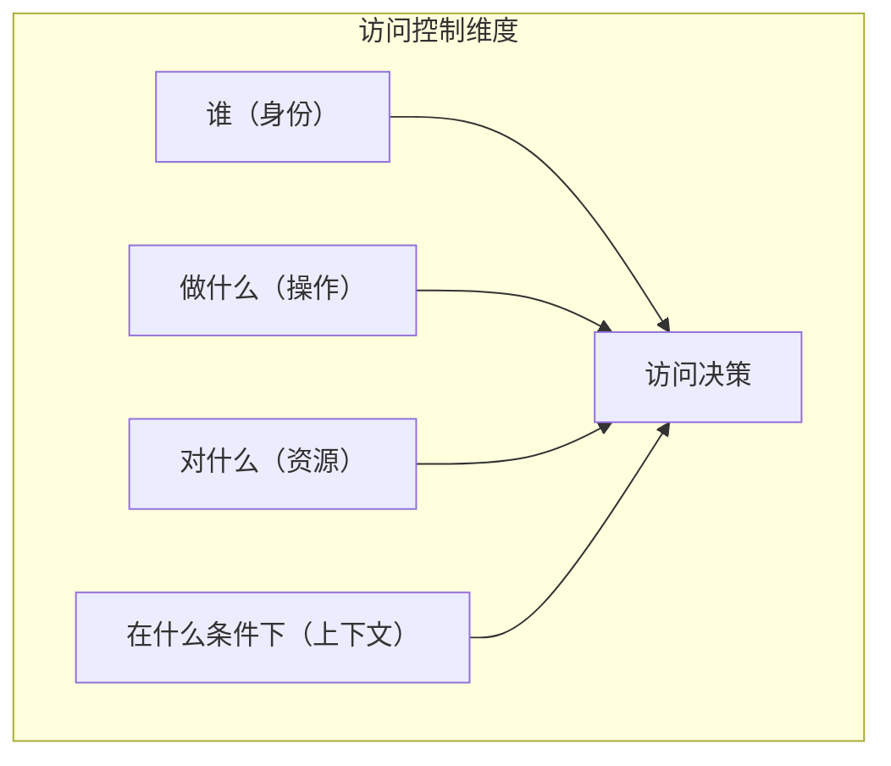
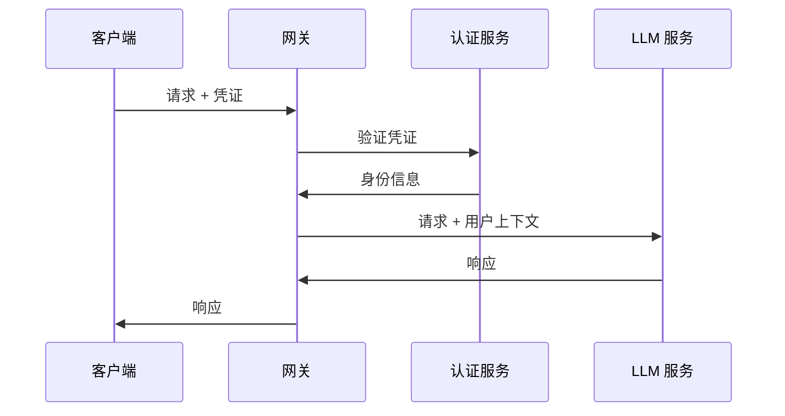
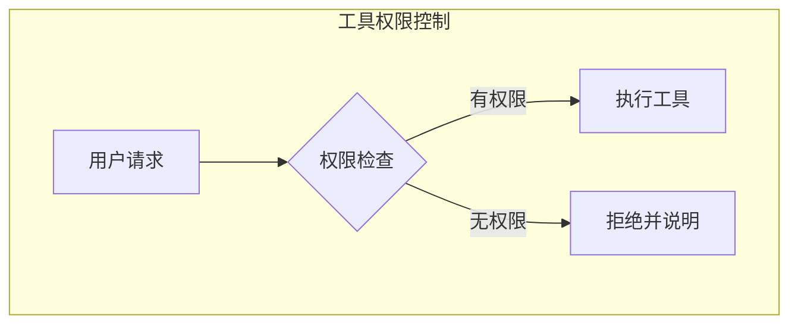
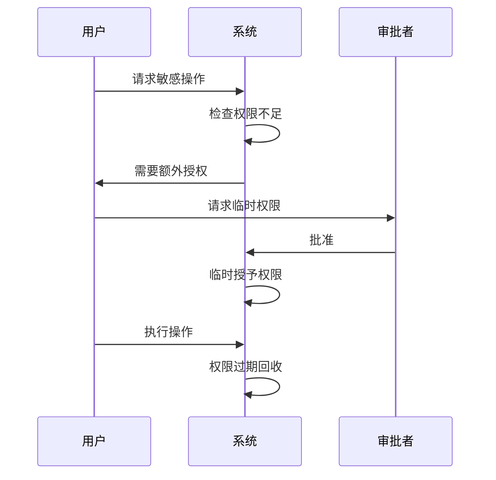
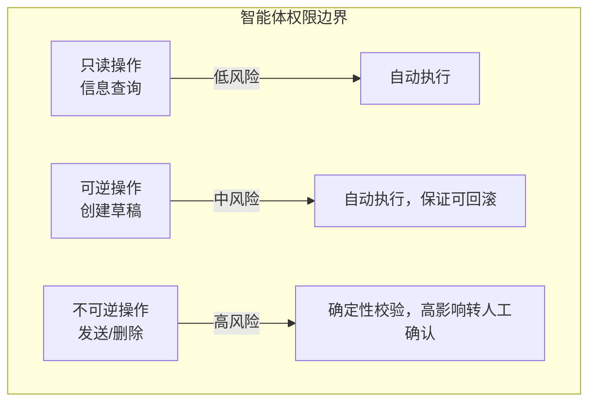
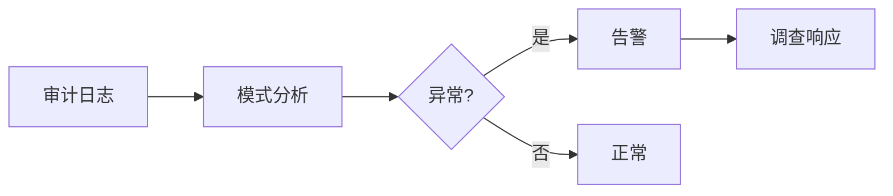

## 8.3 权限与访问控制

访问控制回答“谁在什么条件下可以对什么资源做什么操作”。细粒度的权限控制是 LLM 安全的关键组成部分，尤其在智能体场景中更为重要。本节的结论是：**LLM 系统在传统的身份认证与授权模型之上，还要控制能力、工具和数据三类特有权限；智能体的动作按可逆性与影响面分级确认。** 下面先说明访问控制的维度、身份认证和授权模型（8.3.1 至 8.3.3），再讨论 LLM 特有的权限、上下文相关的权限和智能体权限设计（8.3.4 至 8.3.6），最后讨论权限审计与监控（8.3.7）。

### 8.3.1 访问控制基础

访问控制决策取决于四个维度：身份、操作、资源和上下文（图 8-11）。


```mermaid
graph TB
    subgraph "访问控制维度"
    A["谁（身份）"] --> E["访问决策"]
    B["做什么（操作）"] --> E
    C["对什么（资源）"] --> E
    D["在什么条件下（上下文）"] --> E
    end
```

图 8-11：访问控制基础流程图

### 8.3.2 身份认证

确认访问者的身份是访问控制的前提。

常用的认证方式及其适用场景如下：

| 方式 | 适用场景 |
|------|----------|
| API Key | 机器对机器调用 |
| OAuth 2.0 | 第三方应用授权 |
| JWT | 会话状态传递 |
| 多因素认证 | 高安全场景 |

典型的认证流程是：网关先向认证服务验证客户端凭证，再把用户上下文随请求传给 LLM 服务（图 8-12）。


```mermaid
sequenceDiagram
    participant C as 客户端
    participant G as 网关
    participant A as 认证服务
    participant L as LLM 服务

    C->>G: 请求 + 凭证
    G->>A: 验证凭证
    A->>G: 身份信息
    G->>L: 请求 + 用户上下文
    L->>G: 响应
    G->>C: 响应
```

图 8-12：身份认证时序图

### 8.3.3 授权模型

授权模型决定已认证的身份能做什么，常用的有 RBAC 和 ABAC 两种。

**基于角色的访问控制（RBAC）** 通过角色把用户与权限关联起来（图 8-13）。


```mermaid
graph LR
    A["用户"] --> B["角色"]
    B --> C["权限"]
    C --> D["资源"]
```

图 8-13：授权模型架构图

角色定义示例：

| 角色 | 权限 |
|------|------|
| 普通用户 | 基础对话、有限工具 |
| 高级用户 | 全部对话、更多工具 |
| 管理员 | 系统配置、日志查看 |

**基于属性的访问控制（ABAC）** 按用户、资源和环境的属性组合成策略，例如：

```text
策略示例：
如果 用户部门 = "研发"
且 资源类型 = "代码生成"
且 时间 在 工作时间内
则 允许访问
```

ABAC 提供更灵活的控制，适合复杂场景。

> [!TIP]
> 开源工具参考：[OPA（Open Policy Agent）](https://github.com/open-policy-agent/opa)是云原生通用策略引擎，使用 Rego 语言编写策略，适合在 LLM 网关中实现 RBAC/ABAC 访问控制；[Casbin](https://github.com/apache/casbin) 是支持多种编程语言的高效访问控制框架，适合在业务层管控“谁能调用哪个模型执行什么操作”。

### 8.3.4 LLM 特有的权限控制

除传统的访问控制外，LLM 系统还需要控制三类特有权限：能力权限、工具权限和数据权限。

能力权限决定不同用户可以使用哪些 LLM 能力：

```text
不同用户可使用的 LLM 能力不同：

普通用户：
- 文本对话 ✓
- 代码生成 ✗
- 联网搜索 ✗

开发者用户：
- 文本对话 ✓
- 代码生成 ✓
- 联网搜索 ✓
```

工具权限要求在执行工具前做权限检查，无权限时拒绝并说明（图 8-14）。


```mermaid
flowchart TB
    subgraph "工具权限控制"
    A["用户请求"] --> B{"权限检查"}
    B --> |有权限| C["执行工具"]
    B --> |无权限| D["拒绝并说明"]
    end
```

图 8-14：LLM 特有的权限控制流程图

数据权限决定不同用户可以访问哪些知识库内容：

```text
知识库访问权限：
- 公开文档：所有用户
- 内部文档：员工
- 机密文档：指定人员
```

多租户向量数据库的隔离、缓存污染与结果验证见 RAG 一章的 [7.5.3 节](../07_rag_security/7.5_vector_database_security.md)；本节的权限模型适用于其中的租户过滤与所有权校验。

### 8.3.5 上下文相关的权限

权限决策还可能依赖运行时上下文，常见做法有条件权限和动态权限升级两种。

条件权限按时间、地点、设备和风险评分调整权限：

| 条件 | 权限调整 |
|------|----------|
| 时间 | 工作时间外限制敏感操作 |
| 地点 | 特定地点允许更多权限 |
| 设备 | 托管设备有更高权限 |
| 风险评分 | 高风险行为需要确认 |

动态权限升级是指权限不足时经审批临时授予权限，到期后回收（图 8-15）。


```mermaid
sequenceDiagram
    participant U as 用户
    participant S as 系统
    participant A as 审批者

    U->>S: 请求敏感操作
    S->>S: 检查权限不足
    S->>U: 需要额外授权
    U->>A: 请求临时权限
    A->>S: 批准
    S->>S: 临时授予权限
    U->>S: 执行操作
    S->>S: 权限过期回收
```

图 8-15：上下文相关的权限时序图

### 8.3.6 智能体权限设计

智能体动作的权限按风险分级：只读操作自动执行，可逆操作在保证可回滚的前提下自动执行，不可逆操作先经确定性校验，高影响的再转人工确认（图 8-16）。


```mermaid
flowchart TB
    subgraph "智能体权限边界"
    A["只读操作<br/>信息查询"] --> |低风险| D["自动执行"]
    B["可逆操作<br/>创建草稿"] --> |中风险| E["自动执行，保证可回滚"]
    C["不可逆操作<br/>发送/删除"] --> |高风险| F["确定性校验，高影响转人工确认"]
    end
```

图 8-16：智能体权限设计流程图

按所需的确认程度，也可以把动作粗略分为四级（分级执行策略）：

```text
Level 0：无需确认
- 读取公开信息
- 格式转换

Level 1：日志记录
- 读取用户数据
- 调用只读 API

Level 2：用户确认
- 发送消息
- 修改数据

Level 3：多因素确认
- 执行交易
- 删除数据
```

分级执行策略用于判断一个动作是否需要确认。上述分级只是粗略示意，更细的依据是可逆性与影响面：可回滚的修改可以自动执行，影响面有限的不可逆操作先经确定性校验，只有校验无法覆盖的高影响操作才交由人确认，见 [13.1.5 节](../13_agent_architecture/13.1_agents_rule_of_two.md)。智能体权限设计还有两个分级执行策略未覆盖的问题，在[第十三章](../13_agent_architecture/README.md)展开：

- **权限授予谁**。智能体不应共用高权限服务账号，也不应冒充用户，而应以显式委托的身份行动，权限随委托逐级衰减，见 [13.4 节](../13_agent_architecture/13.4_agent_identity.md)。
- **权限的组合**。单独看都合理的权限，组合起来可能构成完整的攻击链。应按“处理不可信输入、访问敏感数据、改变状态或对外通信”三项性质做整体核算，见 [13.1 节](../13_agent_architecture/13.1_agents_rule_of_two.md)。

### 8.3.7 权限审计与监控

权限审计记录每一次访问决策，并通过异常检测和监控指标发现权限滥用。审计日志应记录以下内容：

```text
记录内容：
- 谁：用户身份
- 何时：时间戳
- 做了什么：操作类型
- 对什么：目标资源
- 结果：成功/失败
- 上下文：相关信息
```

异常检测对审计日志做模式分析，发现异常时告警并调查响应（图 8-17）。


```mermaid
flowchart LR
    A["审计日志"] --> B["模式分析"]
    B --> C{"异常?"}
    C --> |是| D["告警"]
    C --> |否| E["正常"]
    D --> F["调查响应"]
```

图 8-17：权限审计与监控流程图

常用的监控指标如下：

| 指标 | 描述 |
|------|------|
| 权限拒绝率 | 被拒绝的请求比例 |
| 权限升级频率 | 请求额外权限的频率 |
| 异常行为率 | 可疑行为的比例 |
