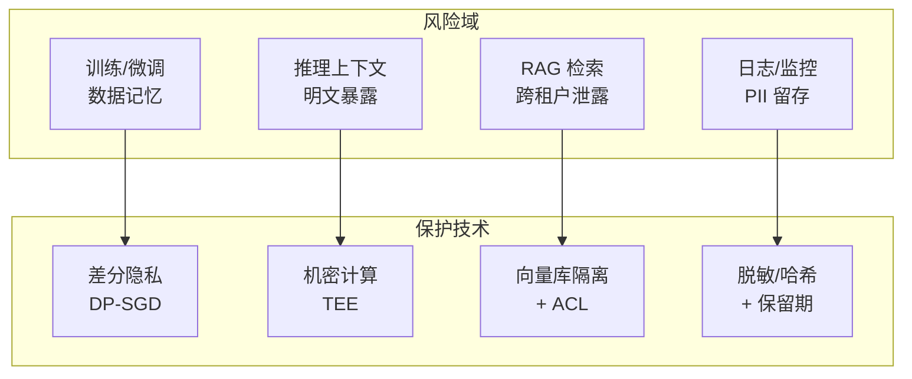
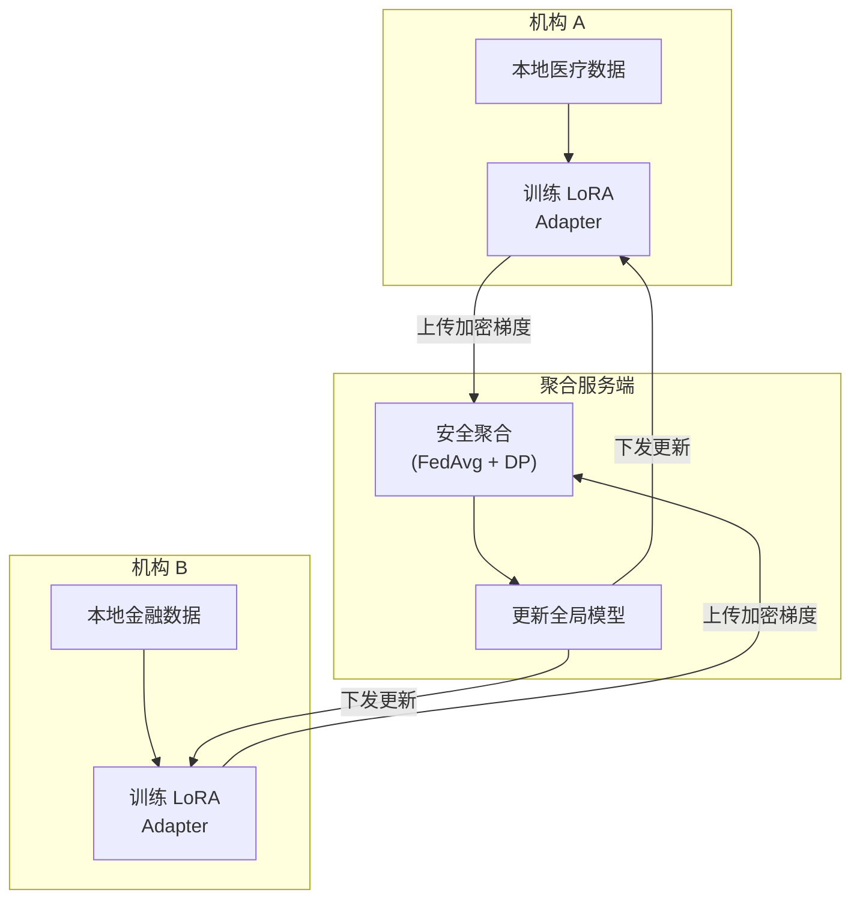
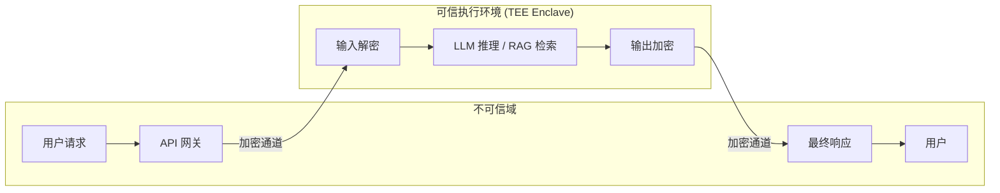
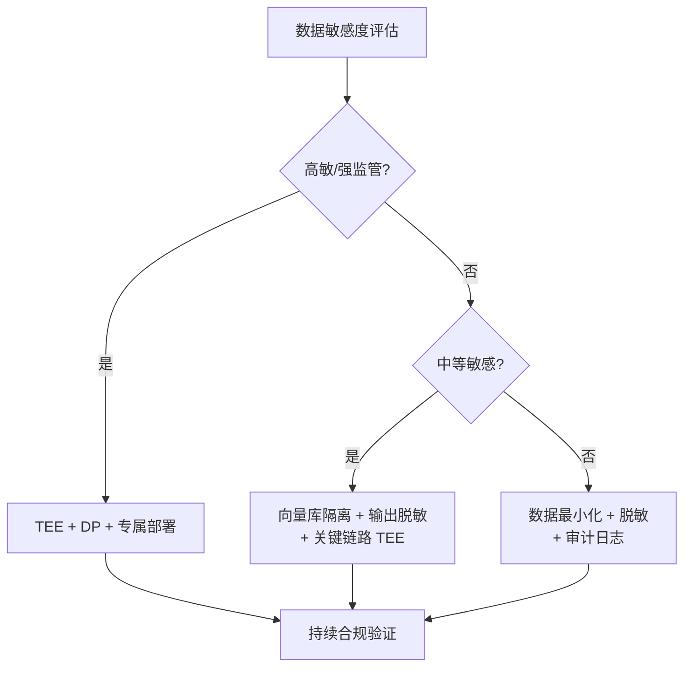

## 8.5 隐私增强技术与数据保护

隐私增强技术（Privacy-Enhancing Technologies, PETs）旨在在 **数据可用** 与 **数据最小暴露** 之间取得平衡（相关的基础概念与攻击原理，可参见 [2.2 节](../02_fundamentals/2.2_training_security.md) 与 [6.4 节](../06_data_model_attacks/6.4_privacy_attacks.md)）。对 LLM 系统而言，PETs 不仅用于“合规”，更直接影响用户信任与企业数据边界的可控性。

本节从工程落地角度介绍常见 PETs 及其在 LLM 场景（训练、推理、RAG、日志与评估）中的使用方式与取舍。

### 8.5.1 LLM 场景的隐私风险与目标

**典型风险**
- **上下文泄露**：Prompt/RAG 文档包含 PII、商业机密或系统配置。
- **跨租户/跨会话泄露**：缓存、向量库、工具调用结果或记忆机制导致越权访问。
- **日志与观测泄露**：为调试保留原始输入输出、工具参数、检索片段。
- **训练/微调泄露**：数据集中包含敏感信息，或被成员推理等攻击利用。

**保护目标**（建议在需求阶段写入安全需求与验收标准）：
- 数据最小化：只收集/只保留“完成任务所需”的最小信息。
- 可证明的访问边界：不同租户、不同角色、不同用途的数据隔离可审计。
- 可控的泄露半径：即使单点失效，也要把影响范围限制在最小域。

**隐私风险与保护技术映射**



图 8-23：隐私风险与保护技术映射

### 8.5.2 差分隐私：训练与统计发布

差分隐私适合用于 **训练/微调** 或 **统计指标发布**，降低个体样本对最终模型/结果的影响。

**核心思想**

差分隐私的数学定义保证：对于任意两个仅相差一条记录的数据集 $D$ 和 $D'$，训练得到的模型在任意输出上的概率分布差异有界：

$$
\Pr[\mathcal{M}(D) \in S] \leq e^{\varepsilon} \cdot \Pr[\mathcal{M}(D') \in S] + \delta
$$

其中 $\varepsilon$（隐私预算）越小，保护越强；$\delta$ 为松弛参数。

**DP-SGD 训练流程伪代码**

```python
def dp_sgd_step(model, batch, clip_norm, noise_scale, lr):
    """差分隐私随机梯度下降的单步更新"""

    per_sample_grads = []
    for sample in batch:
        # 1. 计算每个样本的梯度
        grad = compute_gradient(model, sample)

        # 2. 裁剪梯度（限制单样本影响上界）
        grad_norm = compute_norm(grad)
        clip_factor = min(1.0, clip_norm / grad_norm)
        clipped_grad = grad * clip_factor
        per_sample_grads.append(clipped_grad)

    # 3. 聚合并添加校准噪声
    avg_grad = mean(per_sample_grads)
    noise = gaussian_noise(
        shape=avg_grad.shape,
        std=noise_scale * clip_norm / len(batch)
    )
    noisy_grad = avg_grad + noise

    # 4. 更新模型参数
    model.params -= lr * noisy_grad
```

**常见落地方式**
- **DP-SGD / DP 微调**：对梯度裁剪并加噪，降低记忆与成员推理风险（需权衡效果与成本）。
- **隐私预算管理**：把不同训练任务的隐私预算纳入治理（例如按数据域/项目分配预算）。
- **指标发布 DP 化**：当输出“聚合指标”面向外部或跨团队共享时，优先用 DP 发布而非原始明细。

> [!TIP]
> 开源工具参考：[Opacus](https://github.com/pytorch/opacus) 是 PyTorch 生态的 DP 训练库，可直接将现有训练流程升级为 DP-SGD；[Google DP Library](https://github.com/google/differential-privacy) 提供多语言的差分隐私基础算法实现，适合统计发布与指标脱敏场景。

**工程要点**
- 明确 DP 的适用边界：DP 不等同于“模型永不泄露”，但能显著降低个体可识别性。
- 与数据分级联动：高敏数据优先 DP/脱敏后再进入训练流程。
- DP 对模型性能的影响：$\varepsilon$ 越小保护越强，但模型性能下降越明显。实践中需为不同场景选择合适的 $\varepsilon$ 值。

| 场景 | 推荐 $\varepsilon$ 范围 | 性能影响 |
|------|----------------------|----------|
| 极高敏（医疗诊断/金融核心 PII） | 1-2 | 较大，需额外数据或更大模型补偿（参考：Google VaultGemma 使用 ε≤2.0） |
| 高敏（一般医疗/金融数据） | 2-4 | 中等偏大，建议在精度与隐私间做具体场景评估 |
| 中敏（企业内部数据） | 4-8 | 中等，通常可接受 |
| 低敏（公开数据增强） | 8-20 | 较小 |

### 8.5.3 联邦学习：数据不出域

联邦学习适用于数据分散在多组织/多终端、难以集中归集的场景（医疗、金融、端侧）。核心思想是“**数据留在本地**，只上传模型更新”。

**LLM 场景常见组合**
- 端侧或机构侧训练 LoRA/Adapter，服务端聚合更新。
- 对嵌入模型/检索模型做 FL 训练，提升垂直域效果并降低集中化风险。

**联邦学习 LLM 微调架构**



图 8-24：联邦学习 LLM 微调架构

**主要风险与防护**
- **梯度泄露**：上传的更新可能被反推数据特征；可结合安全聚合、DP、加密传输。
- **客户端投毒**：恶意参与方上传有毒更新；需引入鲁棒聚合、参与方准入与异常检测。

> [!TIP]
> 开源工具参考：[Flower](https://github.com/adap/flower) 是目前最活跃的联邦学习框架，支持多种 ML 框架和自定义聚合策略；[PySyft](https://github.com/OpenMined/PySyft) 专注于隐私增强的深度学习，支持联邦学习、安全多方计算与差分隐私的组合使用。

### 8.5.4 机密计算与隔离推理

对“推理过程中的明文上下文”担忧较高时，机密计算可作为重要选项：在可信执行环境（TEE）内完成推理/检索/重排等关键环节，降低内存窥探与侧信道风险。

**TEE 隔离推理架构**



图 8-25：TEE 隔离推理架构

**适用点**
- 处理高敏上下文（合同、源代码、客户数据）时，将关键推理/检索链路放入 TEE。
- 对外部模型服务不放心时，优先选择可提供隔离证明或专属部署形态的方案。

**落地建议**
- 与“最小化上下文”并用：TEE 不是把一切都丢进 enclave，而是把最敏感、最关键的片段和计算收敛进去。
- 配套可观测：在不记录明文的前提下，保留必要的审计事件（哈希、长度、策略命中、操作类型）。
- 性能考量：TEE 内的计算通常有 10-30% 性能开销，需在架构设计时预留余量。

**主流 TEE 技术对比**
| 技术 | 厂商 | 特点 | LLM 适用性 |
|------|------|------|------------|
| Intel SGX / TDX | Intel | 成熟生态，TDX 支持 VM 级隔离 | 适合中小模型推理 |
| AMD SEV-SNP | AMD | 内存加密，VM 隔离 | 适合大规模 GPU 推理 |
| ARM CCA | ARM | 端侧机密计算 | 适合端侧小模型 |
| NVIDIA H100 CC | NVIDIA | GPU TEE，硬件级隔离 | 适合大模型 GPU 推理 |

### 8.5.5 加密计算：同态加密与安全多方计算

在需要“数据始终加密”的极端场景，同态加密（HE）与安全多方计算（SMPC）可以提供更强的隐私保证，但通常带来较高的性能与工程复杂度。

**现实可行的使用方式**
- 先将范围限定在 **检索/匹配/统计** 等结构化任务，再逐步扩展到更复杂的推理链路。
- 把 HE/SMPC 用于 **关键字段** 或 **关键评分计算**，而非全链路加密计算。

**加密计算场景示例**

```python

# 同态加密在 RAG 隐私检索中的概念示例
# （伪代码，示意工程集成方式）

from he_library import encrypt, decrypt, cosine_sim_encrypted

def private_rag_search(query_embedding, encrypted_doc_embeddings, top_k=5):
    """在文档嵌入始终加密的情况下进行相似度检索"""

    # 1. 用户在本地加密查询向量
    encrypted_query = encrypt(query_embedding, public_key)

    # 2. 服务端在加密域计算相似度（数据始终不解密）
    encrypted_scores = [
        cosine_sim_encrypted(encrypted_query, doc_emb)
        for doc_emb in encrypted_doc_embeddings
    ]

    # 3. 返回加密的 Top-K 索引给用户
    # 4. 用户用私钥解密结果
    scores = [decrypt(s, private_key) for s in encrypted_scores]
    top_indices = sorted(range(len(scores)),
                         key=lambda i: scores[i], reverse=True)[:top_k]
    return top_indices
```

> 注意：全同态加密（FHE）目前的性能开销仍然较大（通常慢 1000-10000 倍），上述场景在工程中更多使用部分同态加密（PHE）或结合 TEE 的混合方案。

### 8.5.6 数据保护的“默认工程化”清单

不依赖特定 PET，也能显著提升整体隐私水平的工程控制：

1. **机密不入上下文**：系统提示与工具描述中避免包含密钥、内部 URL、数据库结构等机密（见[第九章](../09_io_protection/README.md)）。
2. **按用途分离数据面**：训练数据、评估数据、线上检索语料、日志样本分别治理与审计。
3. **向量库隔离与 ACL**：按租户/业务域分库分索引；检索时强制带上授权过滤条件。
4. **最小化日志**：默认不记录原始提示/文档片段；必要时使用哈希、脱敏与抽样，并设置保留期。
5. **数据出域控制**：工具调用（发邮件、写文件、调用外部 API）必须经过显式授权与策略门禁。

> [!TIP]
> 开源工具参考：[Microsoft Presidio](https://github.com/microsoft/presidio) 提供可扩展的 PII 识别与脱敏引擎，支持自定义实体类型，非常适合集成到上述日志脱敏与输出过滤流程中。

**日志脱敏工程示例**

```python
import hashlib
import re

def sanitize_log_entry(log: dict) -> dict:
    """对日志条目进行脱敏处理"""
    sanitized = log.copy()

    # 保留结构化元数据，脱敏内容字段
    if "user_input" in sanitized:
        raw = sanitized["user_input"]
        sanitized["user_input_hash"] = hashlib.sha256(
            raw.encode()
        ).hexdigest()[:16]
        sanitized["user_input_length"] = len(raw)
        # 检测并标记是否包含 PII 模式
        sanitized["contains_email"] = bool(
            re.search(r'[\w.+-]+@[\w-]+\.[\w.]+', raw)
        )
        del sanitized["user_input"]  # 不保留原文

    if "model_output" in sanitized:
        raw = sanitized["model_output"]
        sanitized["output_hash"] = hashlib.sha256(
            raw.encode()
        ).hexdigest()[:16]
        sanitized["output_length"] = len(raw)
        del sanitized["model_output"]

    return sanitized
```

### 8.5.7 选型建议：PETs 不是“单选题”

| 需求强度 | 推荐组合 | 说明 |
|----------|----------|------|
| 基础隐私 | 数据最小化 + 脱敏 + 审计 | 成本最低，适合大多数业务 |
| 中等敏感 | 向量库隔离 + 输出脱敏 + 关键链路隔离 | 重点控制 RAG 与工具调用 |
| 高敏/强监管 | TEE/专属部署 + DP/安全聚合 + 严格留痕 | 强化“可证明边界”与证据链 |

**选型决策流程**



图 8-26：PET 选型决策流程

隐私增强技术的关键不在“是否用了某个术语”，而在于：把数据流与权限边界做成 **可执行、可验证、可持续** 的工程体系。
