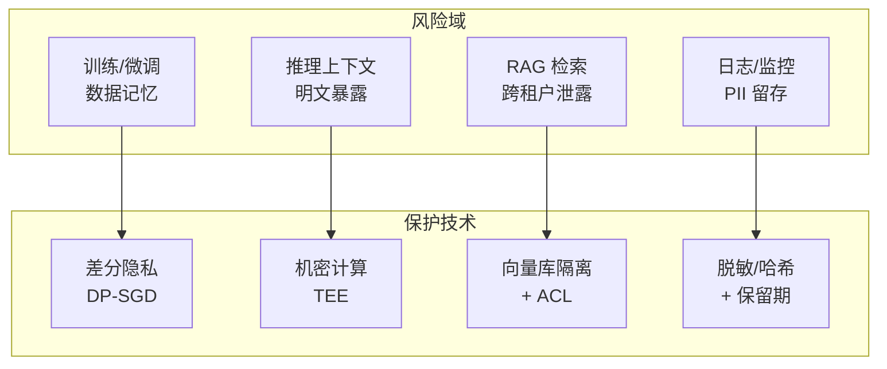
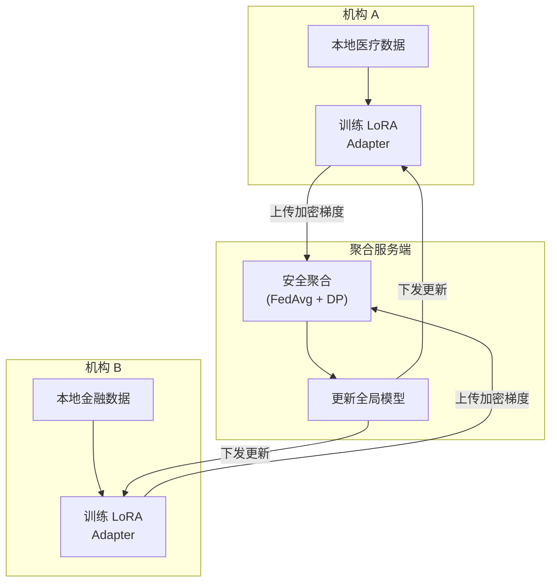
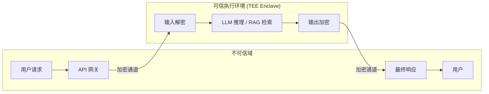
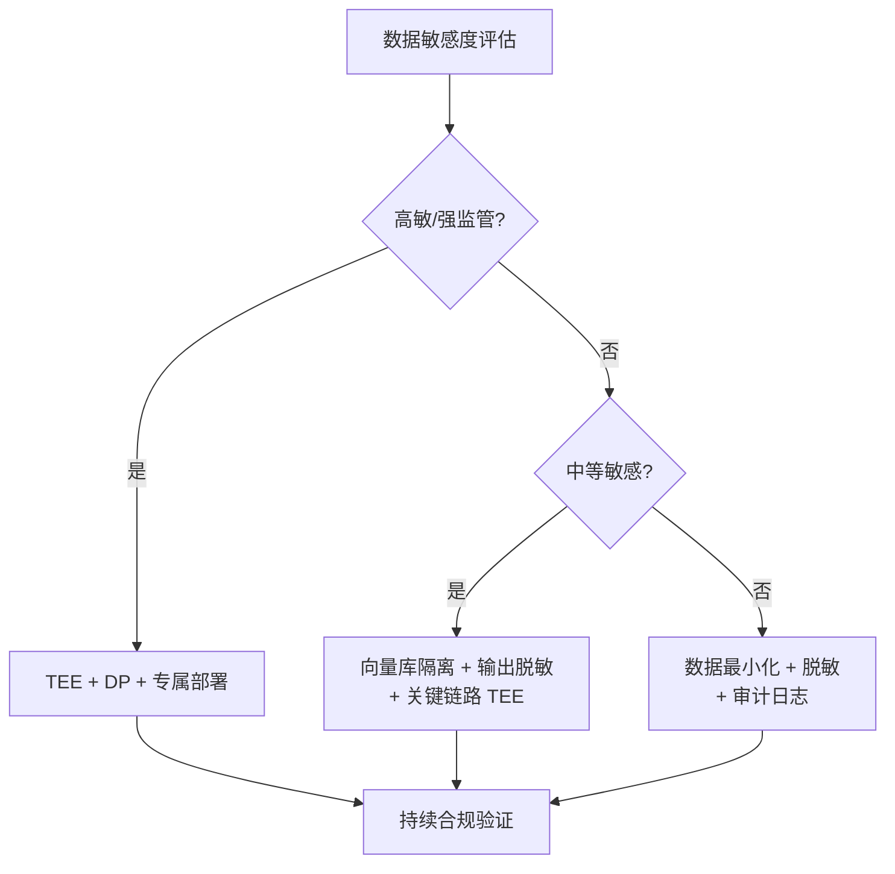

## 8.5 隐私增强技术与数据保护

隐私增强技术（Privacy-Enhancing Technologies, PETs）在数据可用与最小暴露之间取得平衡。差分隐私、联邦学习、机密计算和加密计算保护的环节不同，应按训练、推理、检索和日志中的数据边界组合使用；访问控制、数据最小化与保留期限仍是基础。隐私风险的基础概念与攻击原理见 [2.2 节](../02_fundamentals/2.2_training_security.md) 与 [6.4 节](../06_data_model_attacks/6.4_privacy_attacks.md)。

### 8.5.1 LLM 场景的隐私风险与目标

LLM 场景的隐私风险分为四类，每类风险都有对应的保护技术。典型风险如下：

- **上下文泄露**：Prompt/RAG 文档包含 PII、商业机密或系统配置。
- **跨租户/跨会话泄露**：缓存、向量库、工具调用结果或记忆机制导致越权访问。
- **日志与观测泄露**：为调试保留原始输入输出、工具参数、检索片段。
- **训练/微调泄露**：数据集中包含敏感信息，或被成员推理等攻击利用。

保护目标有三条，建议在需求阶段写入安全需求与验收标准：

- 数据最小化：只收集/只保留“完成任务所需”的最小信息。
- 可证明的访问边界：不同租户、不同角色、不同用途的数据隔离可审计。
- 可控的泄露半径：即使单点失效，也要把影响范围限制在最小域。

各类风险与保护技术的对应关系如图 8-23 所示。


```mermaid
flowchart TB
    subgraph "风险域"
    R1["训练/微调<br/>数据记忆"]
    R2["推理上下文<br/>明文暴露"]
    R3["RAG 检索<br/>跨租户泄露"]
    R4["日志/监控<br/>PII 留存"]
    end

    subgraph "保护技术"
    P1["差分隐私<br/>DP-SGD"]
    P2["机密计算<br/>TEE"]
    P3["向量库隔离<br/>+ ACL"]
    P4["脱敏/哈希<br/>+ 保留期"]
    end

    R1 --> P1
    R2 --> P2
    R3 --> P3
    R4 --> P4
```

图 8-23：隐私风险与保护技术映射

### 8.5.2 差分隐私：训练与统计发布

差分隐私适用于训练/微调或统计指标发布，用于降低个体样本对最终模型/结果的影响。

差分隐私的数学定义保证：对于任意两个仅相差一条记录的数据集 $D$ 和 $D'$，训练得到的模型在任意输出上的概率分布差异有界：

$$
\Pr[\mathcal{M}(D) \in S] \leq e^{\varepsilon} \cdot \Pr[\mathcal{M}(D') \in S] + \delta
$$

其中 $\varepsilon$（隐私预算）越小，保护越强；$\delta$ 为松弛参数。

DP-SGD 通过裁剪每个样本的梯度并添加校准噪声来实现差分隐私，单步更新的伪代码如下：

```python
def dp_sgd_step(model, batch, clip_norm, noise_scale, lr):
    """差分隐私随机梯度下降的单步更新"""

    per_sample_grads = []
    for sample in batch:
        # 1. 计算每个样本的梯度
        grad = compute_gradient(model, sample)

        # 2. 裁剪梯度（限制单样本影响上界）
        grad_norm = compute_norm(grad)
        clip_factor = min(1.0, clip_norm / grad_norm)
        clipped_grad = grad * clip_factor
        per_sample_grads.append(clipped_grad)

    # 3. 聚合并添加校准噪声
    avg_grad = mean(per_sample_grads)
    noise = gaussian_noise(
        shape=avg_grad.shape,
        std=noise_scale * clip_norm / len(batch)
    )
    noisy_grad = avg_grad + noise

    # 4. 更新模型参数
    model.params -= lr * noisy_grad
```

常见的落地方式有三种：

- **DP-SGD / DP 微调**：对梯度裁剪并加噪，降低记忆与成员推理风险（需权衡效果与成本）。
- **隐私预算管理**：把不同训练任务的隐私预算纳入治理（例如按数据域/项目分配预算）。
- **指标发布 DP 化**：当输出“聚合指标”面向外部或跨团队共享时，优先用 DP 发布而非原始明细。

> [!TIP]
> 开源工具参考：[Opacus](https://github.com/meta-pytorch/opacus) 是 PyTorch 生态的 DP 训练库，可直接将现有训练流程升级为 DP-SGD；[Google DP Library](https://github.com/google/differential-privacy) 提供多语言的差分隐私基础算法实现，适合统计发布与指标脱敏场景。

工程上需注意以下几点：

- 明确 DP 的适用边界：DP 不等同于“模型永不泄露”，但能显著降低个体可识别性。
- 与数据分级联动：高敏数据优先 DP/脱敏后再进入训练流程。
- DP 对模型性能的影响：$\varepsilon$ 越小保护越强，但模型性能下降越明显。实践中需为不同场景选择合适的 $\varepsilon$ 值。

| 场景 | 推荐 $\varepsilon$ 范围 | 性能影响 |
|------|----------------------|----------|
| 极高敏（医疗诊断/金融核心 PII） | 1-2 | 较大，需额外数据或更大模型补偿（参考：Google VaultGemma 使用 ε≤2.0） |
| 高敏（一般医疗/金融数据） | 2-4 | 中等偏大，建议在精度与隐私间做具体场景评估 |
| 中敏（企业内部数据） | 4-8 | 中等，通常可接受 |
| 低敏（公开数据增强） | 8-20 | 较小 |

### 8.5.3 联邦学习：数据不出域

联邦学习适用于数据分散在多组织/多终端、难以集中归集的场景（医疗、金融、端侧）。核心思想是“数据留在本地，只上传模型更新”。

在 LLM 场景中，常见组合有两种：

- 端侧或机构侧训练 LoRA/Adapter，服务端聚合更新。
- 对嵌入模型/检索模型做 FL 训练，提升垂直域效果并降低集中化风险。

多家机构联邦微调 LoRA Adapter 的架构如图 8-24 所示：各机构在本地训练，聚合服务端做安全聚合后下发更新。


```mermaid
flowchart TB
    subgraph "机构 A"
    A1["本地医疗数据"] --> A2["训练 LoRA<br/>Adapter"]
    end

    subgraph "机构 B"
    B1["本地金融数据"] --> B2["训练 LoRA<br/>Adapter"]
    end

    subgraph "聚合服务端"
    C["安全聚合<br/>(FedAvg + DP)"]
    D["更新全局模型"]
    end

    A2 --> |上传加密梯度| C
    B2 --> |上传加密梯度| C
    C --> D
    D --> |下发更新| A2
    D --> |下发更新| B2
```

图 8-24：联邦学习 LLM 微调架构

联邦学习的主要风险与防护如下：

- **梯度泄露**：上传的更新可能被反推数据特征；可结合安全聚合、DP、加密传输。
- **客户端投毒**：恶意参与方上传有毒更新；需引入鲁棒聚合、参与方准入与异常检测。

> [!TIP]
> 开源工具参考：[Flower](https://github.com/flwrlabs/flower) 是目前最活跃的联邦学习框架，支持多种 ML 框架和自定义聚合策略；[PySyft](https://github.com/OpenMined/PySyft) 专注于隐私增强的深度学习，支持联邦学习、安全多方计算与差分隐私的组合使用。

### 8.5.4 机密计算与隔离推理

机密计算是指在基于硬件的可信执行环境（TEE）中处理数据，保护“使用中的数据”的机密性与完整性，而不只是存储和传输中的数据。对推理过程中明文上下文的暴露顾虑较大时，它可作为重要选项：在 TEE 内完成推理/检索/重排等关键环节，使宿主机操作系统和虚拟机监控器读不到其中的内存。它不能消除侧信道风险，见下文的边界。

TEE 隔离推理的架构如图 8-25 所示：输入在 enclave 内解密，完成推理或检索后加密输出。


```mermaid
flowchart LR
    subgraph "不可信域"
    A["用户请求"] --> B["API 网关"]
    F["最终响应"] --> G["用户"]
    end

    subgraph "可信执行环境 (TEE Enclave)"
    C["输入解密"]
    D["LLM 推理 / RAG 检索"]
    E["输出加密"]
    C --> D --> E
    end

    B --> |加密通道| C
    E --> |加密通道| F
```

图 8-25：TEE 隔离推理架构

机密计算适用于以下情形：

- 处理高敏上下文（合同、源代码、客户数据）时，将关键推理/检索链路放入 TEE。
- 对外部模型服务信任不足时，优先选择可提供隔离证明或专属部署形态的方案。

**TEE 的两种形态。** 一种是进程级 enclave，以 Intel SGX 为代表：应用划出一块私有内存区域，只有进入 enclave 的线程能访问，数据离开 CPU 末级缓存前即被加密（[Linux 内核 SGX 文档](https://docs.kernel.org/arch/x86/sgx.html)）。另一种是机密虚拟机，Intel TDX、AMD SEV-SNP 与 Arm CCA 的 Realm 都属于此类：整台虚拟机的内存与 vCPU 寄存器对宿主机和虚拟机监控器保密、受完整性保护（[Linux 内核 CoCo 威胁模型](https://docs.kernel.org/security/snp-tdx-threat-model.html)、[Arm CCA](https://docs.kernel.org/arch/arm64/arm-cca.html)）。大模型推理离不开 GPU，NVIDIA Hopper 与 Blackwell GPU 的机密计算模式要与 CPU 侧的机密虚拟机配合使用，其部署指南列出的 CPU 要求是支持 Intel TDX 或 AMD SEV-SNP（[NVIDIA 机密计算部署指南](https://docs.nvidia.com/cc-deployment-guide-tdx-snp.pdf)）。

**远程证明是信任的来源。** 用户看不见服务端实际运行的是什么，TEE 有没有用，取决于远程证明（remote attestation）。远程证明是指硬件度量 TEE 内加载的固件、内核与应用，用硬件密钥把度量值签成一份证据，交给远端判断它是否处于预期状态。RFC 9334 把参与方分为三个角色（[RFC 9334](https://www.rfc-editor.org/rfc/rfc9334)）：证明方（Attester）产生证据（Evidence），在这里是运行推理服务的机密虚拟机与 GPU；验证方（Verifier）对照参考值（厂商发布的已知良好度量值）与背书（厂商对硬件签名能力的担保）评估证据，出具证明结果；依赖方（Relying Party）依据证明结果决定是否交出数据，在这里是用户的客户端，或保管模型与数据密钥的密钥服务。一次机密推理按以下步骤进行：

1. 依赖方生成一个不可预测的随机数（nonce），发给推理服务。
2. 推理服务从 CPU 侧 TEE 与 GPU 取得证据。证据带有度量值和这个随机数，并由硬件签名；随机数证明证据是在收到请求之后生成的，不是重放的旧证据。
3. 验证方沿证书链校验证据签名，把度量值与参考值比对，并检查证书是否被吊销。以 NVIDIA GPU 为例，证据可以交给 NVIDIA 远程证明服务（NRAS）或本地验证器评估；参考值以签名的参考完整性清单（RIM）形式由 RIM 服务提供；设备身份证书与 RIM 签名证书的吊销状态经 OCSP 服务查询（[NVIDIA Attestation 架构](https://docs.nvidia.com/attestation/quick-start-guide/latest/architecture.html)）。
4. 证明结果通过后，依赖方才向这个 TEE 发送数据，或由密钥服务向它释放解密密钥。

因此，图 8-25 中的“加密通道”必须终止在这个经过证明的 TEE 内部，客户端还要能确认通道的对端就是出具证据的那个 TEE；如果 TLS 终止在 TEE 之外的 API 网关上，网关看到的就是明文。

**TEE 不管什么。** Linux 内核的机密计算威胁模型写明了几条边界：侧信道（包括瞬态执行侧信道）属于未被硬件保护覆盖的攻击面；宿主机仍完全掌控 CPU 时间、内存和网络等资源，拒绝服务不在保护范围内；宿主机负责加载虚拟机的固件、引导程序和内核，这些内容在经证明确认完整性之前都应视为不可信。此外，远程证明只能确认运行的是度量过的那一份代码，不能证明这份代码本身可信：推理服务若把提示词写进日志或发往外部，TEE 照样执行，因此参考值所对应的镜像需要经过审计，日志策略也要遵循下面的建议。

落地建议如下：

- 与“最小化上下文”并用：只把最敏感、最关键的片段和计算收敛到 enclave 中。
- 配套可观测：在不记录明文的前提下，保留必要的审计事件（哈希、长度、策略命中、操作类型）。
- 性能考量：TEE 内的计算通常有 10-30% 性能开销，需在架构设计时预留余量。

主流 TEE 技术对比如下：

| 技术 | 厂商 | 特点 | LLM 适用性 |
|------|------|------|------------|
| Intel SGX / TDX | Intel | SGX 为进程级 enclave；TDX 为机密虚拟机（VM 级隔离） | TDX 机密虚拟机可与 NVIDIA GPU 机密计算组合，用于 GPU 推理 |
| AMD SEV-SNP | AMD | 内存加密与完整性保护，机密虚拟机 | 可与 NVIDIA GPU 机密计算组合，用于 GPU 推理 |
| ARM CCA | ARM | Realm 机密虚拟机，对虚拟机监控器隔离 | 不在 NVIDIA GPU 机密计算部署指南列出的 CPU 平台之内 |
| NVIDIA Hopper / Blackwell CC | NVIDIA | GPU TEE，需与 CPU 侧机密虚拟机配合 | 大模型 GPU 推理 |

### 8.5.5 加密计算：同态加密与安全多方计算

在需要“数据始终加密”的极端场景，同态加密（HE）与安全多方计算（SMPC）可以提供更强的隐私保证，但通常带来较高的性能开销与工程复杂度。

同态加密是指允许服务端直接在密文上计算的加密方案：计算结果仍是密文，只有持有私钥的数据所有者能够解密。常用方案分两类：BFV 与 BGV 在加密整数上做模运算，结果精确；CKKS 在加密的实数或复数上做加法和乘法，结果是近似值，适合求和、在加密数据上评估机器学习模型、计算距离这类任务，向量相似度即属此类。它的限制同样明确：只支持部分运算，加密状态下的比较、排序等在多数情况下不可行，也不能按密文分支；性能开销大，密文比明文大许多倍；方案通常只有一把私钥，由数据所有者持有，多个数据所有者联合计算的场景一般不适合用同态加密。Microsoft SEAL 是实现上述三种方案的开源库，其文档还提醒，多数同态加密方案的安全保证弱于传统加密方案，用于生产前应阅读其安全说明（[Microsoft SEAL](https://github.com/microsoft/SEAL)）。下面示例中的排序放在用户本地完成，原因就是服务端无法在密文上比较大小。

现实可行的做法是缩小加密计算的范围：

- 先将范围限定在检索/匹配/统计等结构化任务，再逐步扩展到更复杂的推理链路。
- 把 HE/SMPC 用于关键字段或关键评分计算，而非全链路加密计算。

下面是同态加密用于 RAG 隐私检索的概念示例：

```python

# 同态加密在 RAG 隐私检索中的概念示例
# （伪代码，示意工程集成方式）

from he_library import encrypt, decrypt, cosine_sim_encrypted

def private_rag_search(query_embedding, encrypted_doc_embeddings, top_k=5):
    """在文档嵌入始终加密的情况下进行相似度检索"""

    # 1. 用户在本地加密查询向量
    encrypted_query = encrypt(query_embedding, public_key)

    # 2. 服务端在加密域计算相似度（数据始终不解密）
    encrypted_scores = [
        cosine_sim_encrypted(encrypted_query, doc_emb)
        for doc_emb in encrypted_doc_embeddings
    ]

    # 3. 服务端把全部加密分数返回给用户（服务端看不到明文分数，无法直接排序）
    # 4. 用户用私钥解密后，在本地排序取 Top-K
    scores = [decrypt(s, private_key) for s in encrypted_scores]
    top_indices = sorted(range(len(scores)),
                         key=lambda i: scores[i], reverse=True)[:top_k]
    return top_indices
```

> 全同态加密（FHE）目前的性能开销仍然较大（通常比明文计算慢几个数量级）。上例中查询与文档嵌入都已加密，计算相似度需要密文与密文相乘，只支持加法和明文标量乘法的部分同态加密（PHE，如 Paillier）无法直接完成；工程上常改为只加密一侧（如只加密查询向量，与明文文档嵌入计算内积），或采用结合 TEE 的混合方案。

### 8.5.6 数据保护的“默认工程化”清单

以下工程控制不依赖特定 PET，也能显著提升整体隐私水平：

1. **机密不入上下文**：系统提示与工具描述中避免包含密钥、内部 URL、数据库结构等机密（见[第九章](../09_io_protection/README.md)）。
2. **按用途分离数据面**：训练数据、评估数据、线上检索语料、日志样本分别治理与审计。
3. **向量库隔离与 ACL**：按租户/业务域分库分索引；检索时强制带上授权过滤条件。
4. **最小化日志**：默认不记录原始提示/文档片段；必要时使用哈希、脱敏与抽样，并设置保留期。
5. **数据出域控制**：工具调用（发邮件、写文件、调用外部 API）必须经过显式授权与策略门禁。

> [!TIP]
> 开源工具参考：[Presidio](https://github.com/data-privacy-stack/presidio) 提供可扩展的 PII 识别与脱敏引擎，支持自定义实体类型，适合集成到上述日志脱敏与输出过滤流程中。

下面是第 4 条“最小化日志”的日志脱敏工程示例：

```python
import hashlib
import re

def sanitize_log_entry(log: dict) -> dict:
    """对日志条目进行脱敏处理"""
    sanitized = log.copy()

    # 保留结构化元数据，脱敏内容字段
    if "user_input" in sanitized:
        raw = sanitized["user_input"]
        sanitized["user_input_hash"] = hashlib.sha256(
            raw.encode()
        ).hexdigest()[:16]
        sanitized["user_input_length"] = len(raw)
        # 检测并标记是否包含 PII 模式
        sanitized["contains_email"] = bool(
            re.search(r'[\w.+-]+@[\w-]+\.[\w.]+', raw)
        )
        del sanitized["user_input"]  # 不保留原文

    if "model_output" in sanitized:
        raw = sanitized["model_output"]
        sanitized["output_hash"] = hashlib.sha256(
            raw.encode()
        ).hexdigest()[:16]
        sanitized["output_length"] = len(raw)
        del sanitized["model_output"]

    return sanitized
```

### 8.5.7 选型建议：PETs 不是“单选题”

PETs 应按需求强度组合使用：

| 需求强度 | 推荐组合 | 说明 |
|----------|----------|------|
| 基础隐私 | 数据最小化 + 脱敏 + 审计 | 成本最低，适合大多数业务 |
| 中等敏感 | 向量库隔离 + 输出脱敏 + 关键链路隔离 | 重点控制 RAG 与工具调用 |
| 高敏/强监管 | TEE/专属部署 + DP/安全聚合 + 严格留痕 | 强化“可证明边界”与证据链 |

选型可按图 8-26 的流程决策：


```mermaid
flowchart TB
    A["数据敏感度评估"] --> B{高敏/强监管?}
    B --> |是| C["TEE + DP + 专属部署"]
    B --> |否| D{中等敏感?}
    D --> |是| E["向量库隔离 + 输出脱敏<br/>+ 关键链路 TEE"]
    D --> |否| F["数据最小化 + 脱敏<br/>+ 审计日志"]
    C --> G["持续合规验证"]
    E --> G
    F --> G
```

图 8-26：PET 选型决策流程

隐私增强技术的关键是把数据流与权限边界做成可执行、可验证、可持续的工程体系。
