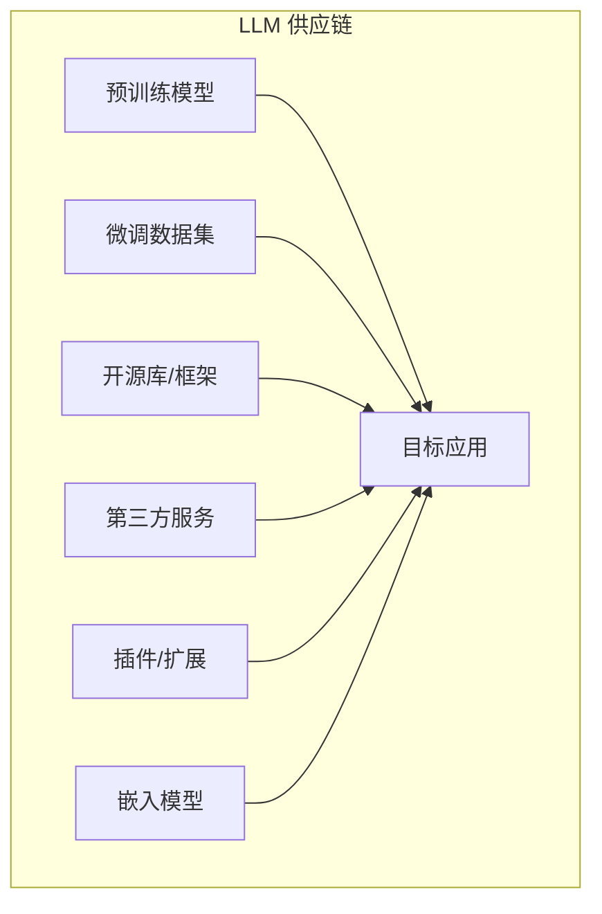
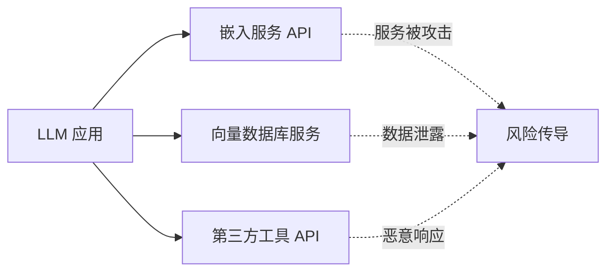
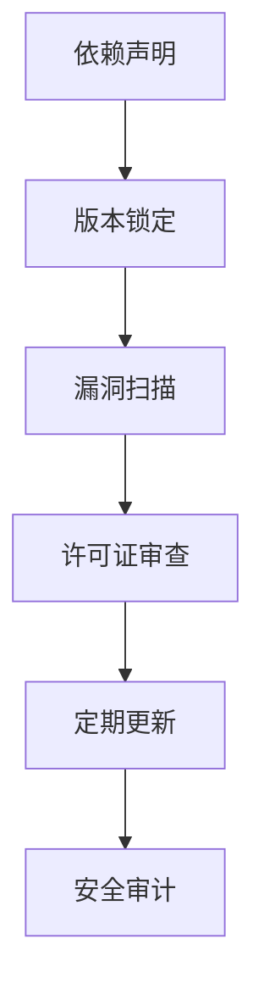
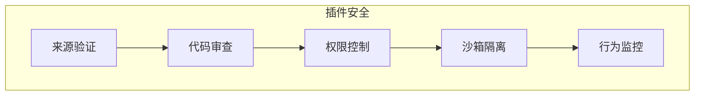

## 8.6 供应链与基础设施环境安全

LLM 应用依赖复杂的供应链，包括模型、数据、库和服务。供应链中的任何环节被攻击都可能影响整体安全。

### 8.6.1 LLM 供应链概述

LLM 应用的供应链比传统软件更加复杂：



图 8-27：LLM 供应链组成流程图

### 8.6.2 供应链风险类型

**被污染的预训练模型**
```text
风险场景：
- 从非官方渠道下载模型
- 模型已被植入后门
- 使用时表面正常
- 特定触发条件下执行恶意行为
```

**恶意数据集**
```text
风险场景：
- 使用公开的微调数据集
- 数据集中包含投毒样本
- 微调后模型行为被改变
```

**依赖库漏洞**
| 风险类型 | 描述 |
|----------|------|
| 已知漏洞 | 使用有已知漏洞的库版本 |
| 依赖混淆 | 下载了恶意的同名包 |
| 恶意更新 | 正常库被恶意更新 |
| 废弃依赖 | 使用不再维护的库 |

**第三方服务风险**


图 8-28：第三方服务风险传导流程图

### 8.6.3 模型供应链安全

**可信来源的重要性**
```text
安全来源：
✓ 官方模型仓库（平台认证账号）
✓ 知名机构发布的模型
✓ 有完整审计记录的模型

风险来源：
✗ 来源不明的模型文件
✗ 非官方的“优化版”模型
✗ 未经验证的社区上传
```

**模型验证措施**
| 措施 | 描述 |
|------|------|
| 哈希校验 | 验证模型文件完整性 |
| 签名验证 | 确认发布者身份 |
| 后门扫描 | 检测潜在的后门行为 |
| 行为测试 | 验证模型行为正常 |

> [!TIP]
> 开源工具参考：[ModelScan](https://github.com/protectai/modelscan) 可扫描 `.pkl`、`.h5`、`.pb` 等模型文件中的序列化代码执行漏洞与恶意后门；[Safetensors](https://github.com/huggingface/safetensors) 是 Hugging Face 推出的安全序列化格式，从根本上避免了 Pickle 反序列化带来的任意代码执行风险，建议优先使用。

### 8.6.4 依赖管理安全

**Python 生态风险**
```bash

# 风险示例：不安全的依赖安装
# 可能安装恶意包
pip install some-package  # 包名可能被抢注

# 安全做法
pip install package==1.2.3 \
    --hash=sha256:abcd1234...  # 指定版本和哈希
```

**依赖安全最佳实践**


图 8-29：依赖安全管理流程图

#### 工具推荐

| 工具 | 功能 |
|------|------|
| pip-audit | Python 依赖漏洞扫描 |
| Snyk | 多语言依赖安全 |
| Trivy/Grype | 容器、文件系统与开源组件漏洞扫描 |
| Syft | 软件物料清单 (SBOM) 生成 |
| Dependabot | 自动依赖更新 |
| Gitleaks | 扫描代码与配置中的凭证/密钥泄露 |

### 8.6.5 插件与扩展安全

LLM 应用常通过插件扩展功能，这也引入风险。

#### 插件风险

```text
风险类型：
1. 恶意插件：专门设计的攻击性插件
2. 漏洞插件：正常插件中存在漏洞
3. 权限过度：插件请求超出需要的权限
4. 数据泄露：插件将数据发送到外部
```

#### 插件安全框架



图 8-30：插件安全框架图

#### Agent 插件的供应链完整性保证：SLSA + Sigstore

对于 Agent 生态中的插件、连接器和工具分发，传统的 SBOM 清单还不够——需要从根本上保证 **构建过程本身的完整性** 和 **工件发布者身份的真实性**。这正是 **SLSA（Supply-chain Levels for Software Artifacts）** 框架 + **Sigstore 无密钥签名** 的核心价值。

**SLSA 框架在 Agent 插件中的应用**

SLSA 定义了 4 个安全等级（L0~L3），每一级都对应更严格的构建环保和源代码追踪要求：

| SLSA 等级 | 构建要求 | Agent 插件适用性 |
|----------|---------|-----------------|
| **L1** | 版本控制 + 构建日志 | 最低要求：所有插件源码应托管在版本控制系统（GitHub/GitLab） |
| **L2** | 版本控制 + 托管构建环境 | 中等要求：使用 CI/CD（GitHub Actions/GitLab CI）自动构建，禁止本地发布 |
| **L3** | 版本控制 + 托管构建 + 源代码审查 | 生产级要求：所有构建必须通过代码审查（Pull Request），审查流程必须是强制性的 |
| **L4** | 版本控制 + 托管构建 + 审查 + 隔离构建环境 | 企业级要求：构建环境与互联网隔离，防止侧通道攻击 |

**具体实施路径**
```text
Agent 插件发行流水线示例（SLSA L2）：

1. 开发者提交代码到主分支
2. GitHub Actions 自动触发构建
3. 构建系统生成工件（.zip / .tar.gz）并计算哈希
4. 构建日志记录在 GitHub 中（不可篡改）
5. 发布前：自动运行单元测试 + 安全扫描（SAST）
6. 若测试通过：自动生成带哈希的 SLSA provenance 文件
7. 将工件和 provenance 发布到 registry（PyPI/npm/artifact registry）
```

**Sigstore 无密钥签名的关键优势**

传统数字签名需要管理长期密钥，容易因密钥泄露导致下游应用被污染。Sigstore 通过 **keyless signing** 解决了这一难题：

```text
传统方式：
开发者 ──(拥有私钥)→ 签署工件 ──→ 用户验证签名

Sigstore 方式：
开发者 ──(通过 OIDC 连接)→ Fulcio 短期证书
              ↓
         用 Cosign 签署工件（证书+签名）
              ↓
         工件 + 签名发布到 Rekor 透明日志
              ↓
用户 ──(离线验证)→ 检查 Rekor 日志 + 验证签名一致性
```

**Sigstore 核心组件**
1. **Fulcio**：无状态 CA，基于 OIDC（如 GitHub、Google 账号）颁发短期证书（有效期 ~15 分钟）
2. **Cosign**：签署和验证工件的命令行工具，支持 OCI 镜像和任意文件
3. **Rekor**：不可篡改的公开透明日志，记录所有签名事件（可用于审计和回滚）

**Plugin Registry 的最小实施要求**
```bash
# 发布插件时的强制检查清单
✓ 工件哈希（SHA-256）必须与 SLSA provenance 中的哈希一致
✓ 签名必须通过 Sigstore 验证（Cosign verify）
✓ 构建 provenance 必须来自 GitHub Actions（可信构建环境）
✓ 代码审查日志必须在 provenance 中标注
```

**防御效果**
- 即使攻击者截获了发布凭证，由于短期证书限制，也无法伪造过去的签名
- 用户可通过 Rekor 审计日志追踪所有发布历史，检测异常发行
- 离线验证意味着用户无需依赖 PKI 基础设施，降低了对中心化信任的依赖

### 8.6.6 软件物料清单

SBOM 帮助组织了解其软件的组成成分。

**SBOM 内容**
```text
LLM 应用 SBOM 示例：

核心模型：
- 模型名称：某开源模型
- 来源：官方或认证发布者
- 版本：发布版本号
- 许可证：对应开源许可证

依赖库：
- 依赖名称与版本锁定
- 哈希/签名（如支持）
...

第三方服务：
- 嵌入服务：某嵌入 API
- 向量数据库：某向量数据库服务
...
```

**SBOM 价值**
- 快速识别受影响组件
- 满足合规要求
- 支持漏洞响应
- 供应链透明度

### 8.6.7 供应链安全策略

**预防措施**
```text
1. 建立可信供应商清单
2. 实施依赖版本锁定
3. 定期漏洞扫描
4. 模型和数据来源验证
5. 第三方服务安全评估
```

**检测措施**
```text
1. 持续监控依赖安全公告
2. 定期安全审计
3. 异常行为检测
4. 完整性校验
```

**响应措施**
```text
1. 建立应急响应流程
2. 维护可替换组件清单
3. 快速补丁能力
4. 回滚机制
```

### 8.6.8 AI 驱动的供应链攻击：新兴威胁

随着 AI 工具深度集成到 CI/CD 流水线中，一种全新的供应链攻击模式正在浮现：**通过提示注入劫持 AI 自动化组件，进而投毒软件包或部署产物**。

2026 年 2 月的 Clinejection 事件是这一威胁的标志性案例：攻击者仅通过在 GitHub Issue 标题中嵌入提示注入指令，就劫持了 Cline（一款 AI 编程助手）仓库的 AI 分类机器人，利用其 CI/CD 环境中的 npm 发布凭证，将恶意版本推送到 npm Registry，最终影响约 4000 名开发者。完整案例分析参见 [4.4.8 节](../04_prompt_injection/4.4_case_studies.md)。

**AI 驱动供应链攻击的防御要点**

- **凭证隔离**：AI 自动化工作流（Issue 分类、代码审查 Bot 等）不应与发布凭证、部署密钥共享同一执行环境
- **发布门控**：任何包发布、镜像推送操作应引入独立的人工审批或多因素验证步骤
- **AI 输入消毒**：对 AI 组件处理的所有外部输入（Issue、PR 评论、Commit Message 等）实施提示注入检测
- **发布异常监控**：监控非预期的版本发布、异常的包大小变化或发布时间

供应链安全是 LLM 安全的基础。在快速迭代的 AI 领域，保持供应链的可见性和可控性至关重要。
