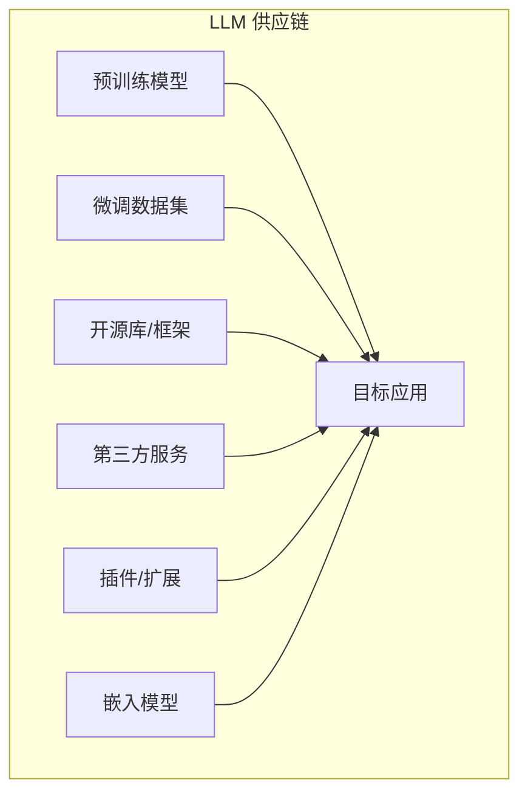
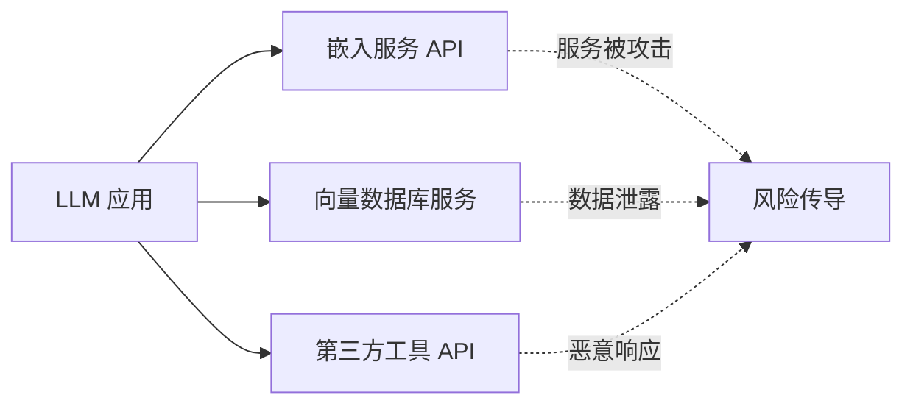
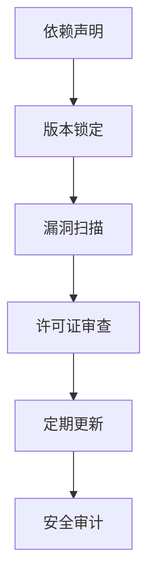
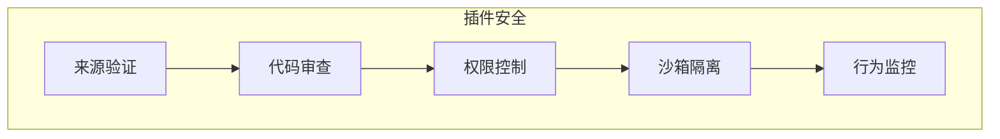

## 8.6 供应链与基础设施安全

LLM 应用依赖复杂的供应链，包括模型、数据、库和服务，供应链中的任何环节被攻击都可能影响整体安全。本节回答 LLM 供应链有哪些风险、应如何管控。结论是：**需要建立可信供应商清单、实施版本锁定、漏洞扫描和 SBOM 管理，并用构建来源证明与签名保证工件的完整性和发布者身份。** 下面先给出供应链的组成与风险类型（8.6.1、8.6.2），再分别讨论模型、依赖和插件三类组件的管控（8.6.3 至 8.6.5），然后介绍 SBOM（8.6.6）和预防、检测、响应三类策略（8.6.7），最后分析 AI 驱动的供应链攻击（8.6.8）。

### 8.6.1 LLM 供应链概述

LLM 应用的供应链比传统软件更加复杂：除开源库/框架和第三方服务外，还包括预训练模型、微调数据集、插件/扩展和嵌入模型（图 8-27）。


```mermaid
flowchart TB
    subgraph "LLM 供应链"
    A["预训练模型"] --> E["目标应用"]
    B["微调数据集"] --> E
    C["开源库/框架"] --> E
    D["第三方服务"] --> E
    F["插件/扩展"] --> E
    G["嵌入模型"] --> E
    end
```

图 8-27：LLM 供应链组成流程图

### 8.6.2 供应链风险类型

供应链风险按来源分为四类：被污染的预训练模型、恶意数据集、依赖库漏洞和第三方服务风险。

第一类是被污染的预训练模型：

```text
风险场景：
- 从非官方渠道下载模型
- 模型已被植入后门
- 使用时表面正常
- 特定触发条件下执行恶意行为
```

第二类是恶意数据集：

```text
风险场景：
- 使用公开的微调数据集
- 数据集中包含投毒样本
- 微调后模型行为被改变
```

第三类是依赖库漏洞，常见风险类型如下：

| 风险类型 | 描述 |
|----------|------|
| 已知漏洞 | 使用有已知漏洞的库版本 |
| 依赖混淆 | 下载了恶意的同名包 |
| 恶意更新 | 正常库被恶意更新 |
| 废弃依赖 | 使用不再维护的库 |

第四类是第三方服务风险：服务被攻击、数据泄露或恶意响应都会传导到 LLM 应用（图 8-28）。


```mermaid
flowchart LR
    A["LLM 应用"] --> B["嵌入服务 API"]
    A --> C["向量数据库服务"]
    A --> D["第三方工具 API"]

    B -.-> |服务被攻击| E["风险传导"]
    C -.-> |数据泄露| E
    D -.-> |恶意响应| E
```

图 8-28：第三方服务风险传导流程图

### 8.6.3 模型供应链安全

模型供应链安全的要点是只从可信来源获取模型，并在使用前验证。安全来源与风险来源的对比如下：

```text
安全来源：
✓ 官方模型仓库（平台认证账号）
✓ 知名机构发布的模型
✓ 有完整审计记录的模型

风险来源：
✗ 来源不明的模型文件
✗ 非官方的“优化版”模型
✗ 未经验证的社区上传
```

常用的模型验证措施如下：

| 措施 | 描述 |
|------|------|
| 哈希校验 | 验证模型文件完整性 |
| 签名验证 | 确认发布者身份 |
| 后门扫描 | 检测潜在的后门行为 |
| 行为测试 | 验证模型行为正常 |

签名验证可以用 [model-signing](https://github.com/sigstore/model-transparency)（附录 C-297）实现。它为模型目录中的每个文件计算摘要，把文件路径与摘要的清单写成 in-toto 声明，再用 Sigstore 无密钥签名（签名与验证的原理见 8.6.5）；验证时先校验签名，再重新计算文件摘要比对，并且要给出签名者的身份与身份提供方，二者与签名时一致才通过。以 PyPI 上的 1.1.1 版为例：

```bash
model_signing sign chat-7b --signature model.sig      # 发布方：走 OIDC 流程取得短期证书并签名
model_signing verify chat-7b --signature model.sig \
  --identity "$identity" --identity_provider "$oidc_provider"   # 使用方：身份与签发方都要给出
```

1.1.1 版的参数用下划线（`--identity_provider`），仓库 main 分支已改为连字符（`--identity-provider`），使用时以所装版本的 `--help` 为准。

> [!TIP]
> 开源工具参考：[ModelScan](https://github.com/protectai/modelscan) 可扫描 `.pkl`、`.h5`、`.pb` 等模型文件中的 `unsafe code` 与模型序列化攻击风险；[Safetensors](https://github.com/safetensors/safetensors) 是 Hugging Face 推出的安全序列化格式，从根本上避免了 Pickle 反序列化带来的任意代码执行风险，建议优先使用。

### 8.6.4 依赖管理安全

依赖管理的要点是锁定版本与哈希，并持续扫描漏洞。以 Python 生态为例，不安全与安全的安装方式对比如下：

```bash

# 风险示例：不安全的依赖安装
# 可能安装恶意包
pip install some-package  # 包名可能被抢注

# 安全做法：requirements.txt 中锁版本和哈希
package==1.2.3 --hash=sha256:<真实哈希>

# 安装时启用 hash-checking mode
pip install --require-hashes -r requirements.txt
```

依赖安全的管理流程如图 8-29 所示。


```mermaid
flowchart TB
    A["依赖声明"] --> B["版本锁定"]
    B --> C["漏洞扫描"]
    C --> D["许可证审查"]
    D --> E["定期更新"]
    E --> F["安全审计"]
```

图 8-29：依赖安全管理流程图

可用的工具如下：

| 工具 | 功能 |
|------|------|
| pip-audit | Python 依赖漏洞扫描 |
| Snyk | 多语言依赖安全 |
| Trivy/Grype | 容器、文件系统与开源组件漏洞扫描 |
| Syft | 软件物料清单 (SBOM) 生成 |
| Dependabot | 自动依赖更新 |
| Gitleaks | 扫描代码与配置中的凭证/密钥泄露 |

### 8.6.5 插件与扩展安全

LLM 应用常通过插件扩展功能，插件也随之引入风险。下面先列出插件风险与插件安全框架，再说明如何用 SLSA 与 Sigstore 保证插件的构建完整性与发布者身份。

#### 插件风险

插件风险分为四类：

```text
风险类型：
1. 恶意插件：专门设计的攻击性插件
2. 漏洞插件：正常插件中存在漏洞
3. 权限过度：插件请求超出需要的权限
4. 数据泄露：插件将数据发送到外部
```

#### 插件安全框架

插件安全框架依次包括来源验证、代码审查、权限控制、沙箱隔离和行为监控（图 8-30）。


```mermaid
flowchart TB
    subgraph "插件安全"
    A["来源验证"] --> B["代码审查"]
    B --> C["权限控制"]
    C --> D["沙箱隔离"]
    D --> E["行为监控"]
    end
```

图 8-30：插件安全框架图

#### Agent 插件的供应链完整性保证：SLSA + Sigstore

对于 Agent 生态中插件、连接器和工具的分发，仅有传统的 SBOM 清单还不够，还需要保证构建过程本身的完整性和工件发布者身份的真实性。这两项保证由 **SLSA（Supply-chain Levels for Software Artifacts）** 框架与 **Sigstore 无密钥签名** 提供。

SLSA 新旧版本的等级表述不同：早期 `v0.1` 使用单一序列 SLSA `1-4`（SLSA 0 表示未达到任何等级）；`v1.0` 起按轨道划分，Build 轨道为 Build `L0-L3`（L0 表示无保证），`v1.2` 又新增 Source 轨道。下表对应 Build 轨道，引用时应区分版本。

| SLSA 等级 | 构建要求 | 防住什么 |
|----------|---------|---------|
| Build L1 | 构建平台自动生成来源证明，写明由谁构建、按什么流程、以什么为顶层输入；来源证明可以不完整、不签名 | 发布过程中的失误，例如从上游仓库中不存在的提交构建；伪造来源证明很容易 |
| Build L2 | 在托管构建平台上构建，由平台自己生成并签名来源证明；使用方须校验来源证明的真实性 | 构建完成之后对工件或来源证明的篡改 |
| Build L3 | 加固的构建平台：同一项目的不同构建互不影响，签名来源证明所用的密钥不能被用户定义的构建步骤访问 | 构建过程中的篡改，包括内部人员、被盗凭据和其他租户；构建平台本身被攻陷不在覆盖范围内 |

**来源证明（provenance）** 是指构建平台出具的一份 in-toto 声明，说明某个工件是怎样构建出来的。它的 `subject` 列出工件的名称与摘要，`predicateType` 固定为 `https://slsa.dev/provenance/v1`，正文分两部分：`buildDefinition` 描述构建的输入，其中 `buildType` 标识构建模板，`externalParameters` 是外部传入的参数（例如源码仓库与分支或标签），`resolvedDependencies` 记录构建时实际取用的依赖（例如分支解析到的具体提交）；`runDetails` 描述这次执行，其中 `builder.id` 标识构建平台。规范规定 `externalParameters` 中的值不可信，必须由下游校验（[SLSA Build Provenance](https://slsa.dev/spec/v1.2/build-provenance)）。

来源证明本身不起作用，要有人校验。SLSA 规范给出的校验步骤如下（[Verifying artifacts](https://slsa.dev/spec/v1.2/verifying-artifacts)）：

1. 事先配置信任根：承认哪些构建平台（签名身份加 `builder.id`），以及各自最高可信到哪一级。
2. 用信任根校验来源证明信封上的签名，再确认 `subject` 中的摘要与手中工件的摘要一致，`predicateType` 正确。
3. 按签名身份与 `builder.id` 在信任根中查出等级，查不到时按 L1 处理。
4. 把 `builder.id`、源码仓库、`buildType` 和 `externalParameters` 与预期值逐项比对，防止有人用正确的代码在非预期的平台上构建，或从非官方的分叉构建。`externalParameters` 中出现不认识的字段时，应判定校验失败。
5. 可选：递归检查 `resolvedDependencies` 中的依赖。

规范同时指出，L3 保证的是“假定构建平台可信时，来源证明准确”，选择把哪些构建平台放进信任根，是使用方自己的决定。

达到 SLSA L2 的插件发行流水线示例如下：

```text
Agent 插件发行流水线示例（SLSA L2）：

1. 开发者提交代码到主分支
2. GitHub Actions 自动触发构建
3. 构建系统生成工件（.zip / .tar.gz）并计算哈希
4. 构建日志记录在 GitHub 中（不可篡改）
5. 发布前：自动运行单元测试 + 安全扫描（SAST）
6. 若测试通过：自动生成带哈希的 SLSA provenance 文件
7. 将工件和 provenance 发布到 registry（PyPI/npm/artifact registry）
```

这条流水线能否算作 L2，关键在第 6 步：来源证明必须由托管构建平台自己生成并签名，而不是由开发者可以改写的脚本生成。第 5 步的测试与扫描是良好实践，但不属于 Build 轨道的要求。以 GitHub 为例，它的制品证明（artifact attestation）功能由平台生成并签名来源证明，官方文档说明单独使用即达到 SLSA v1.0 Build L2，把构建放进组织共用的可复用工作流、与调用方隔离后可达到 Build L3（[Artifact attestations](https://docs.github.com/en/actions/concepts/security/artifact-attestations)）。接入只需在构建工作流中授予 `id-token: write` 与 `attestations: write` 权限，并在构建步骤之后加一步；使用方用 GitHub CLI 校验（[Using artifact attestations](https://docs.github.com/en/actions/how-tos/secure-your-work/use-artifact-attestations/use-artifact-attestations)）：

```yaml
# 构建 job 中的片段
permissions:
  id-token: write
  contents: read
  attestations: write
steps:
  # ……构建步骤，产出 dist/plugin.tar.gz……
  - name: Generate artifact attestation
    uses: actions/attest@v4
    with:
      subject-path: 'dist/plugin.tar.gz'
```

```bash
gh attestation verify dist/plugin.tar.gz -R example-org/example-plugin \
  --signer-workflow example-org/example-plugin/.github/workflows/release.yml
```

只给 `-R` 时，校验的只是证明与哪个仓库关联，并不限定由哪个工作流签名，同一仓库中其他工作流生成的证明也能通过；该命令的帮助说明也建议同时用 `--signer-workflow` 核对签名工作流的路径。`--signer-workflow` 把签名者限定为发布工作流，与下文 Cosign 必须核对签名身份是同一个道理。证明若由可复用工作流生成（即上面的 L3 路径），签名者是那个可复用工作流，`gh attestation verify --help` 写明此时必须使用 `--signer-workflow` 或 `--signer-repo`（[gh attestation verify](https://cli.github.com/manual/gh_attestation_verify)）。

传统数字签名需要管理长期密钥，容易因密钥泄露导致下游应用被污染。Sigstore 通过 **keyless signing** 解决了这一问题：

```text
传统方式：
开发者 ──(拥有私钥)→ 签署工件 ──→ 用户验证签名

Sigstore 方式：
开发者 ──(通过 OIDC 连接)→ Fulcio 短期证书
              ↓
         用 Cosign 签署工件（证书+签名）
              ↓
         工件 + 签名发布到 Rekor 透明日志
              ↓
用户 ──(离线验证)→ 检查 Rekor 日志 + 验证签名一致性
```

Sigstore 由三个核心组件构成：

1. **Fulcio**：代码签名证书颁发机构，按 OIDC 身份签发有效期 10 分钟的 X.509 证书。
2. **Cosign**：签署和验证工件的命令行工具，支持 OCI 镜像和任意文件。
3. **Rekor**：只追加的公开透明日志，记录每次签名的工件摘要、签名和证书，任何人都可以审计。

无密钥签名的“无密钥”是指签名者不持有长期私钥，不是不用密钥。一次签名的过程如下（[Sigstore 概述](https://docs.sigstore.dev/about/overview/)）：

1. 签名客户端（如 Cosign）在本地临时生成一对密钥，向身份提供方取得 OIDC 身份令牌。令牌里是用户的邮箱或服务账号；在 CI 中签名时，是工作流的信息。
2. 客户端把公钥和令牌发给 Fulcio。Fulcio 校验令牌，签发一张把该身份与该公钥绑定在一起的短期证书。Sigstore 的服务始终拿不到私钥。
3. 客户端用私钥签名工件，随即丢弃私钥。
4. 工件摘要、签名和证书写入 Rekor。Rekor 返回带签名的条目时间戳（Rekor v2 改由独立的时间戳服务签发时间），证明签名发生在证书的 10 分钟有效期之内。证书过期后仍能验证，靠的就是这个时间（[Timestamps](https://docs.sigstore.dev/cosign/verifying/timestamps/)）。

验证方要做四件事：用证书中的公钥校验工件签名；确认证书中的身份等于预期的身份；用 Sigstore 的信任根校验证书由 Fulcio 签发；确认签名已被 Rekor 收录。其中第二项最容易被省略，而省略之后，任何人用自己的账号签出的签名都能通过。因此 Cosign 的无密钥验证必须同时给出身份与签发方。在 GitHub Actions 中签名时，身份是工作流文件的地址加分支或标签，签发方是 `https://token.actions.githubusercontent.com`（[Verifying Signatures](https://docs.sigstore.dev/cosign/verifying/verify/)、[CI Quickstart](https://docs.sigstore.dev/quickstart/quickstart-ci/)）：

```bash
# CI 中签名：生成包含证书、签名与日志条目的 bundle 文件
cosign sign-blob dist/plugin.tar.gz --bundle plugin.sigstore.json --yes

# 使用方验证：身份与签发方都必须与预期一致
cosign verify-blob dist/plugin.tar.gz --bundle plugin.sigstore.json \
  --certificate-identity=https://github.com/example-org/example-plugin/.github/workflows/release.yml@refs/heads/main \
  --certificate-oidc-issuer=https://token.actions.githubusercontent.com
```

bundle 文件包含验证所需的全部材料：证书、签名，以及透明日志条目或时间戳（[Bundle Format](https://docs.sigstore.dev/about/bundle/)）。验证方事先取得 Sigstore 的信任根（Fulcio 的根证书与 Rekor 的公钥，经 TUF 分发），再拿到 bundle，就可以不联网完成验证。

插件注册中心（Plugin Registry）发布插件时至少应做以下检查：

```text
# 发布插件时的强制检查清单
✓ 工件哈希（SHA-256）必须与 SLSA provenance 中的哈希一致
✓ 签名必须通过 Sigstore 验证（Cosign verify）
✓ 构建 provenance 必须来自 GitHub Actions（可信构建环境）
✓ 代码审查日志必须在 provenance 中标注
```

清单的最后一项需要说明：Build 轨道的来源证明不记录代码审查，代码审查由 SLSA v1.2 新增的 Source 轨道规定，其 Source L4 要求两人审查（[Source Track](https://slsa.dev/spec/v1.2/source-requirements)）。第三项“必须来自 GitHub Actions”落到校验上，就是 SLSA 校验步骤中的 `builder.id` 比对与 Cosign 的身份比对。

这套机制的防御效果与边界如下：

- 不存在可被长期窃取的签名私钥：私钥只用一次即丢弃，证书 10 分钟后过期。但攻击者如果控制了发布工作流或其 OIDC 身份，仍能在当下签出完全有效的签名。Sigstore 能证明的只是“签名来自某个身份”，不证明这个身份值得信任；哪些身份可以签哪个工件，要由使用方的策略决定（[Sigstore 威胁模型](https://docs.sigstore.dev/about/threat-model/)）。
- 每次签名都公开记录在 Rekor 中，身份所有者可以监控日志，发现不是自己发起的签名。
- 验证并非不依赖 PKI：它依赖 Sigstore 的信任根，只是把信任从“保管好每个发布者的长期密钥”转移到“信任 Fulcio 与 OIDC 身份提供方”。Fulcio 一旦被攻陷，可以为任意身份签发证书，恢复要靠 TUF 信任根撤销。

同一套机制也用于模型文件，见 8.6.3 的 model-signing。

### 8.6.6 软件物料清单

软件物料清单（SBOM）是指记录软件组成成分的清单。LLM 应用 SBOM 的内容示例如下：

```text
LLM 应用 SBOM 示例：

核心模型：
- 模型名称：某开源模型
- 来源：官方或认证发布者
- 版本：发布版本号
- 许可证：对应开源许可证

依赖库：
- 依赖名称与版本锁定
- 哈希/签名（如支持）
...

第三方服务：
- 嵌入服务：某嵌入 API
- 向量数据库：某向量数据库服务
...
```

SBOM 的价值在于：

- 快速识别受影响组件
- 满足合规要求
- 支持漏洞响应
- 供应链透明度

上面的示例只说明应记录的内容，实际交付应使用机读格式。CycloneDX 自 1.5 版（2023 年 6 月）起支持 ML-BOM，把模型、数据集与训练配置作为一等组件记录，可与软件 SBOM 放在同一份清单里；OWASP CycloneDX 另有专门的《Authoritative Guide to AI/ML-BOM》给出字段与实施指引（[附录 C-295](../16_appendix/C_references.md)、C-296）。[3.1](../03_frameworks/3.1_owasp_top10.md) 节提到的 AI BOM / ML-BOM 即指这类扩展。模型工件写入 ML-BOM 后，[6.7](../06_data_model_attacks/6.7_malicious_model_artifacts.md) 节的来源签名校验与 8.6.5 的 Sigstore 验证才有可逐项对照的清单。

在 CycloneDX 中，模型是 `type` 为 `machine-learning-model` 的组件，数据集是 `type` 为 `data` 的组件，与普通的 `library` 组件并列。模型组件除名称、版本、哈希与许可证外，还可以带一个 `modelCard` 对象：`modelParameters` 记录任务、架构与训练和评估所用的数据集（可以用 `ref` 引用清单中的数据组件），`quantitativeAnalysis` 记录评估指标，`considerations` 记录用途、局限与伦理考量。下面是按 CycloneDX 1.6 模式写的最小片段（[CycloneDX 1.6 JSON Schema](https://github.com/CycloneDX/specification/blob/master/schema/bom-1.6.schema.json)）：

```json
{
  "bomFormat": "CycloneDX",
  "specVersion": "1.6",
  "components": [
    {
      "type": "machine-learning-model",
      "bom-ref": "model-chat-7b",
      "name": "example-org/chat-7b",
      "version": "1.2.0",
      "hashes": [{ "alg": "SHA-256", "content": "<model.safetensors 的 SHA-256>" }],
      "licenses": [{ "license": { "id": "Apache-2.0" } }],
      "modelCard": {
        "modelParameters": {
          "task": "text-generation",
          "datasets": [{ "ref": "data-sft-2026q2" }]
        }
      }
    },
    {
      "type": "data",
      "bom-ref": "data-sft-2026q2",
      "name": "internal-sft-2026q2",
      "data": [{ "type": "dataset", "name": "internal-sft-2026q2" }]
    },
    {
      "type": "library",
      "name": "transformers",
      "version": "4.46.0",
      "purl": "pkg:pypi/transformers@4.46.0"
    }
  ]
}
```

清单本身也是要校验的工件：GitHub 的 `actions/attest` 可以把 SPDX 或 CycloneDX 格式的 SBOM 作为一份证明签名，使用方用 `gh attestation verify` 加 `--predicate-type` 参数校验，与 8.6.5 的来源证明走同一套机制（[Using artifact attestations](https://docs.github.com/en/actions/how-tos/secure-your-work/use-artifact-attestations/use-artifact-attestations)）。

### 8.6.7 供应链安全策略

供应链安全策略分为预防、检测和响应三类措施。预防措施如下：

```text
1. 建立可信供应商清单
2. 实施依赖版本锁定
3. 定期漏洞扫描
4. 模型和数据来源验证
5. 第三方服务安全评估
```

检测措施如下：

```text
1. 持续监控依赖安全公告
2. 定期安全审计
3. 异常行为检测
4. 完整性校验
```

响应措施如下：

```text
1. 建立应急响应流程
2. 维护可替换组件清单
3. 快速补丁能力
4. 回滚机制
```

### 8.6.8 AI 驱动的供应链攻击：新兴威胁

随着 AI 工具深度集成到 CI/CD 流水线中，出现了一种新的供应链攻击模式：通过提示注入劫持 AI 自动化组件，进而投毒软件包或部署产物。

2026 年 2 月的 Clinejection 事件是这一威胁的标志性案例：攻击者先通过 GitHub Issue 标题中的提示注入劫持 AI 分类机器人，再借助 GitHub Actions cache poisoning 横向影响带发布凭证的 nightly workflow。官方复盘确认曾发布异常版本 `cline@2.3.0`，但也明确说明未实际向用户投递恶意代码。完整案例分析参见 [4.4.8 节](../04_prompt_injection/4.4_case_studies.md)。

AI 驱动供应链攻击的防御要点如下：

- **凭证隔离**：AI 自动化工作流（Issue 分类、代码审查 Bot 等）不应与发布凭证、部署密钥共享同一执行环境
- **发布门控**：任何包发布、镜像推送操作应引入独立的人工审批或多因素验证步骤
- **AI 输入消毒**：对 AI 组件处理的所有外部输入（Issue、PR 评论、Commit Message 等）实施提示注入检测
- **发布异常监控**：监控非预期的版本发布、异常的包大小变化或发布时间
