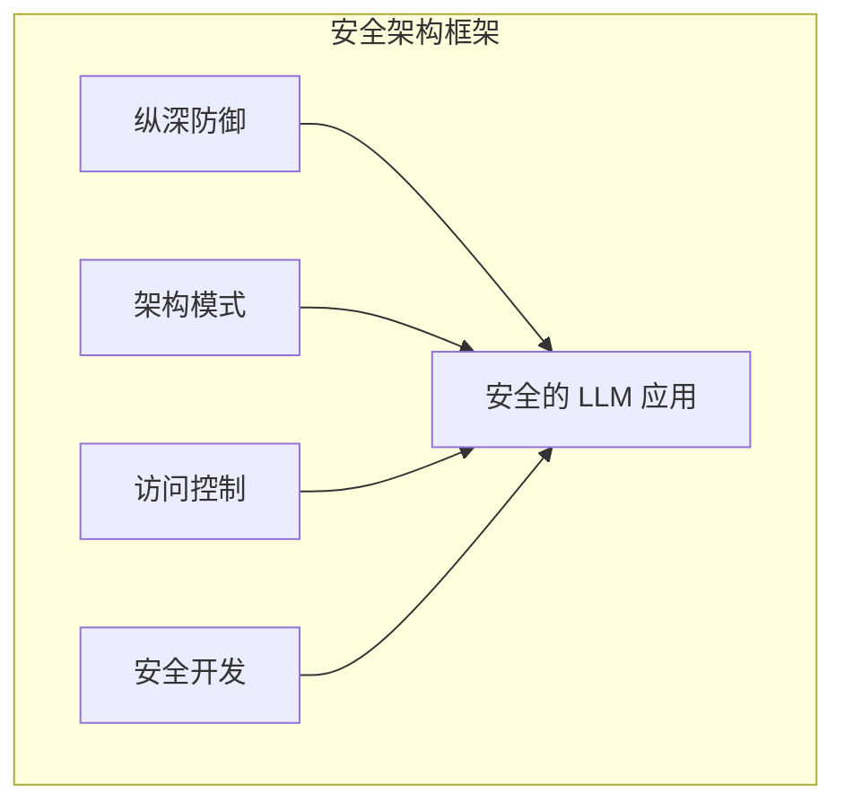

# 第八章：安全架构设计

安全架构是 LLM 应用安全的基石。良好的架构设计可以从根本上降低安全风险，而架构缺陷则可能导致无论如何加固都存在漏洞。

本章聚焦于 LLM 安全架构设计，主要内容包括：

- **8.1 纵深防御原则**：构建多层次的安全防护体系
- **8.2 大语言模型安全架构模式**：介绍经过验证的架构模式
- **8.3 权限与访问控制**：设计细粒度的权限管理机制
- **8.4 安全开发生命周期**：将安全融入开发全过程

通过本章的学习，读者将掌握设计安全 LLM 系统的核心原则和方法。

